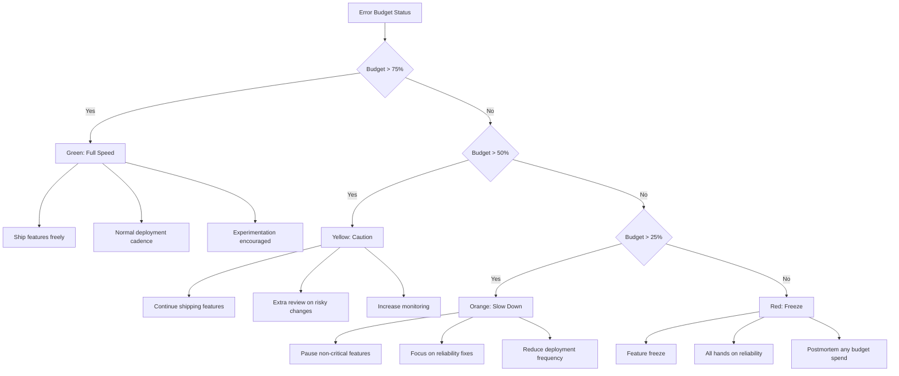

# How to Create Error Budget Policies and Track Consumption

Author: [nawazdhandala](https://www.github.com/nawazdhandala)

Tags: GCP, Error Budget, SLO, SRE, Cloud Monitoring, Google Cloud

Description: Learn how to create error budget policies and track budget consumption on Google Cloud Monitoring to balance reliability with feature velocity.

---

Error budgets are the mechanism that makes SLOs actionable. Without an error budget policy, an SLO is just a number on a dashboard. With a policy, it becomes a decision framework - when the budget is healthy, teams ship features aggressively. When the budget is low, they slow down and focus on reliability. On Google Cloud Monitoring, you can track error budget consumption in real time and automate responses based on budget status. Let me walk through how to set this up.

## What Is an Error Budget?

If your SLO is 99.9% availability over 30 days, your error budget is the 0.1% of requests that are allowed to fail. For a service handling 1 million requests per day, that is roughly 30,000 failed requests per month, or about 1,000 per day. The error budget policy defines what happens as this budget gets consumed.

## Error Budget Math

Here is a quick reference for common SLO targets and their error budgets over a 30-day period.

| SLO Target | Error Budget (%) | Downtime Equivalent | Failed Requests (1M/day) |
|------------|-----------------|---------------------|--------------------------|
| 99.0% | 1.0% | 7.2 hours | 300,000/month |
| 99.5% | 0.5% | 3.6 hours | 150,000/month |
| 99.9% | 0.1% | 43.2 minutes | 30,000/month |
| 99.95% | 0.05% | 21.6 minutes | 15,000/month |
| 99.99% | 0.01% | 4.3 minutes | 3,000/month |

## Step 1: Create the SLO with Budget Tracking

First, set up an SLO that serves as the basis for error budget tracking.

```bash
# Create an availability SLO with 30-day rolling window

cat > availability-slo.json << 'EOF'
{
  "displayName": "API Availability - 99.9%",
  "goal": 0.999,
  "rollingPeriod": "2592000s",
  "serviceLevelIndicator": {
    "requestBased": {
      "goodTotalRatio": {
        "goodServiceFilter": "metric.type=\"loadbalancing.googleapis.com/https/request_count\" resource.type=\"https_lb_rule\" metric.label.\"response_code_class\"=\"200\"",
        "totalServiceFilter": "metric.type=\"loadbalancing.googleapis.com/https/request_count\" resource.type=\"https_lb_rule\""
      }
    }
  }
}
EOF

curl --http1.1 \
  --header "Authorization: Bearer $(gcloud auth print-access-token)" \
  --header "Content-Type: application/json" \
  --request POST \
  --data @availability-slo.json \
  "https://monitoring.googleapis.com/v3/projects/my-gcp-project/services/my-api-service/serviceLevelObjectives?serviceLevelObjectiveId=main-availability-slo"
```

## Step 2: Track Error Budget Remaining

Google Cloud Monitoring provides time-series selectors to query SLO data, including remaining error budget.

```text
# Time-series filter to show error budget remaining as a fraction
select_slo_budget_fraction("projects/my-gcp-project/services/my-api-service/serviceLevelObjectives/main-availability-slo")
```

You can also query the budget consumption rate.

```text
# Time-series filter to show how fast the error budget is being consumed over the last hour
select_slo_burn_rate("projects/my-gcp-project/services/my-api-service/serviceLevelObjectives/main-availability-slo", "60m")
```

## Step 3: Define Error Budget Policy Tiers

An error budget policy typically defines actions at different budget consumption levels. Here is a practical policy structure.


```mermaid
graph TD
    A[Error Budget Status] --> B{Budget > 75%}
    B -->|Yes| C[Green: Full Speed]
    C --> C1[Ship features freely]
    C --> C2[Normal deployment cadence]
    C --> C3[Experimentation encouraged]

    B -->|No| D{Budget > 50%}
    D -->|Yes| E[Yellow: Caution]
    E --> E1[Continue shipping features]
    E --> E2[Extra review on risky changes]
    E --> E3[Increase monitoring]

    D -->|No| F{Budget > 25%}
    F -->|Yes| G[Orange: Slow Down]
    G --> G1[Pause non-critical features]
    G --> G2[Focus on reliability fixes]
    G --> G3[Reduce deployment frequency]

    F -->|No| H[Red: Freeze]
    H --> H1[Feature freeze]
    H --> H2[All hands on reliability]
    H --> H3[Postmortem any budget spend]
```

## Step 4: Create Burn-Rate Alerts

Google Cloud Monitoring does not support using the budget-fraction selector directly in alerting policies. Use burn-rate alerts to trigger the right response automatically when the budget is being consumed too quickly.

```bash
# Fast-burn alert when error budget is being consumed very quickly
cat > fast-burn-alert.json << 'EOF'
{
  "displayName": "Error Budget Fast Burn - Slow Down",
  "conditions": [{
    "displayName": "SLO burn rate > 10x over 1 hour",
    "conditionThreshold": {
      "filter": "select_slo_burn_rate(\"projects/my-gcp-project/services/my-api-service/serviceLevelObjectives/main-availability-slo\", \"60m\")",
      "comparison": "COMPARISON_GT",
      "thresholdValue": 10,
      "duration": "0s",
      "trigger": { "count": 1 }
    }
  }],
  "combiner": "OR",
  "notificationChannels": [
    "projects/my-gcp-project/notificationChannels/TEAM_CHANNEL"
  ],
  "documentation": {
    "content": "## Fast Error Budget Burn\n\nThe service is consuming error budget much faster than the sustainable rate. Per our error budget policy:\n- Pause risky deployments\n- Investigate the top sources of budget consumption\n- Focus engineering effort on reliability improvements",
    "mimeType": "text/markdown"
  }
}
EOF

gcloud monitoring policies create --policy-from-file=fast-burn-alert.json

# Slow-burn alert when error budget is being consumed above the sustainable rate
cat > slow-burn-alert.json << 'EOF'
{
  "displayName": "Error Budget Slow Burn - Caution",
  "conditions": [{
    "displayName": "SLO burn rate > 2x over 24 hours",
    "conditionThreshold": {
      "filter": "select_slo_burn_rate(\"projects/my-gcp-project/services/my-api-service/serviceLevelObjectives/main-availability-slo\", \"24h\")",
      "comparison": "COMPARISON_GT",
      "thresholdValue": 2,
      "duration": "0s",
      "trigger": { "count": 1 }
    }
  }],
  "combiner": "OR",
  "notificationChannels": [
    "projects/my-gcp-project/notificationChannels/ENGINEERING_LEADS"
  ],
  "documentation": {
    "content": "## Slow Error Budget Burn\n\nThe service is consuming error budget faster than the sustainable rate. Per our error budget policy:\n- Continue shipping features with extra caution\n- Add additional review for risky deployments\n- Review budget consumption trends",
    "mimeType": "text/markdown"
  }
}
EOF

gcloud monitoring policies create --policy-from-file=slow-burn-alert.json
```

## Step 5: Build an Error Budget Dashboard

Create a dashboard that gives leadership and engineering a clear view of budget status.

```bash
# Create an error budget tracking dashboard
cat > budget-dashboard.json << 'EOF'
{
  "displayName": "Error Budget Tracking",
  "mosaicLayout": {
    "columns": 12,
    "tiles": [
      {
        "width": 4,
        "height": 4,
        "widget": {
          "title": "Error Budget Remaining (fraction)",
          "scorecard": {
            "timeSeriesQuery": {
              "timeSeriesFilter": {
                "filter": "select_slo_budget_fraction(\"projects/my-gcp-project/services/my-api-service/serviceLevelObjectives/main-availability-slo\")"
              }
            },
            "thresholds": [
              { "value": 0.50, "color": "YELLOW", "direction": "BELOW" },
              { "value": 0.25, "color": "RED", "direction": "BELOW" }
            ]
          }
        }
      },
      {
        "xPos": 4,
        "width": 8,
        "height": 4,
        "widget": {
          "title": "Error Budget Consumption Over Time",
          "xyChart": {
            "dataSets": [{
              "timeSeriesQuery": {
                "timeSeriesFilter": {
                  "filter": "select_slo_budget_fraction(\"projects/my-gcp-project/services/my-api-service/serviceLevelObjectives/main-availability-slo\")"
                }
              },
              "plotType": "LINE"
            }]
          }
        }
      },
      {
        "yPos": 4,
        "width": 12,
        "height": 4,
        "widget": {
          "title": "Burn Rate Over Time",
          "xyChart": {
            "dataSets": [{
              "timeSeriesQuery": {
                "timeSeriesFilter": {
                  "filter": "select_slo_burn_rate(\"projects/my-gcp-project/services/my-api-service/serviceLevelObjectives/main-availability-slo\", \"60m\")"
                }
              },
              "plotType": "LINE"
            }]
          }
        }
      }
    ]
  }
}
EOF

gcloud monitoring dashboards create --config-from-file=budget-dashboard.json
```

## Automating Policy Enforcement

Beyond manual responses, you can automate parts of the error budget policy using Cloud Functions triggered by alert notifications.

```python
# cloud_function/main.py
# Automatically restrict deployments when error budget is low

import functions_framework
import base64
import json

@functions_framework.cloud_event
def handle_budget_alert(cloud_event):
    """Triggered by an error budget alert notification."""
    message_data = cloud_event.data["message"]["data"]
    payload = json.loads(base64.b64decode(message_data).decode("utf-8"))

    policy_name = payload.get("incident", {}).get("policy_name", "")
    state = payload.get("incident", {}).get("state", "")

    if "Fast Burn" in policy_name and state == "open":
        # When the budget is burning too quickly, add a deployment gate
        print("Error budget fast burn - adding deployment restrictions")
        # Notify the CI/CD system to require manual approval
        add_deployment_gate()

    elif "Fast Burn" in policy_name and state == "closed":
        # When the burn-rate incident closes, remove the gate
        print("Error budget burn rate recovered - removing deployment restrictions")
        remove_deployment_gate()

def add_deployment_gate():
    # Implementation depends on your CI/CD system
    # For example, update a Cloud Deploy pipeline to require approval
    pass

def remove_deployment_gate():
    pass
```

## Running Effective Budget Reviews

The dashboard and alerts are the operational layer. The strategic layer is regular budget reviews. Hold a weekly review where the team looks at budget consumption, identifies the top sources of budget spend, and decides on actions. This review should answer three questions: How much budget is left? What consumed the most budget this week? Is the trend improving or worsening?

## Wrapping Up

Error budget policies turn SLOs from passive measurements into active governance tools. By defining clear actions at different budget levels - from green (ship freely) to red (feature freeze) - you create a self-regulating system where reliability and velocity are balanced automatically. Google Cloud Monitoring gives you the building blocks: SLO definitions for tracking, budget fraction queries for dashboards, and alert policies for automated notifications. The technical setup takes an afternoon; the cultural adoption of error budgets as a decision framework takes longer but pays off enormously in reduced arguments about reliability priorities.
