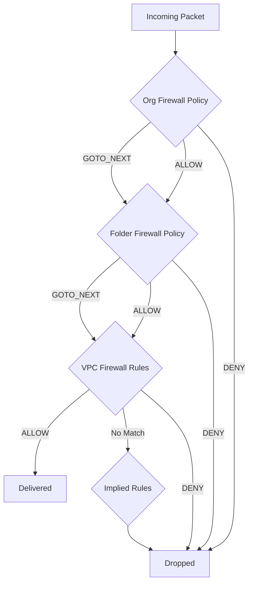

# How to Create Hierarchical Firewall Policies at the Organization Level on Google Cloud

Author: [nawazdhandala](https://www.github.com/nawazdhandala)

Tags: GCP, Firewall Policy, Organization Security, Hierarchical Firewall, Network Security

Description: Learn how to create and manage hierarchical firewall policies at the organization and folder level on Google Cloud for centralized network security governance.

---

In a large organization with dozens of projects and teams, managing firewall rules project by project becomes unmanageable. Every project team creates their own rules, and there is no easy way to enforce organization-wide security policies like "block traffic from known malicious IP ranges" or "always allow SSH from the corporate VPN." Hierarchical firewall policies solve this by letting you define firewall rules at the organization or folder level that apply across all projects underneath.

This post covers how to create, manage, and structure hierarchical firewall policies on Google Cloud.

## How Hierarchical Firewall Policies Work

Hierarchical firewall policies are evaluated before VPC-level firewall rules. The evaluation order is:

1. Organization-level firewall policy
2. Folder-level firewall policy
3. VPC firewall rules (standard rules you create per-project)
4. Implied rules (default allow egress, default deny ingress)



The key concept is the `GOTO_NEXT` action. When a hierarchical rule matches but uses `GOTO_NEXT`, evaluation continues to the next level (folder, then VPC). This lets you create policies that say "defer to the project-level rules for this traffic" while still enforcing organization-wide blocks.

## Prerequisites

You need organization-level permissions to create hierarchical policies.

```bash
# Required roles
# - roles/compute.orgSecurityPolicyAdmin (at org level)
# - roles/compute.orgSecurityResourceAdmin (at org or folder level)

# Verify your organization ID
gcloud organizations list

# Verify your folder structure
gcloud resource-manager folders list --organization=123456789
```

## Step 1 - Create an Organization-Level Firewall Policy

Start by creating a policy at the organization level.

```bash
# Create a hierarchical firewall policy
gcloud compute firewall-policies create \
    --organization=123456789 \
    --short-name=org-security-policy \
    --description="Organization-wide security policy"
```

This creates an empty policy. Now you need to add rules and associate it with the organization.

## Step 2 - Add Organization-Wide Rules

Add rules that should apply across the entire organization.

```bash
# Block known malicious IP ranges
gcloud compute firewall-policies rules create 100 \
    --firewall-policy=org-security-policy \
    --organization=123456789 \
    --direction=INGRESS \
    --action=deny \
    --src-ip-ranges=198.51.100.0/24,203.0.113.0/24 \
    --layer4-configs=all \
    --description="Block known malicious IP ranges"

# Allow SSH from corporate VPN range to all projects
gcloud compute firewall-policies rules create 200 \
    --firewall-policy=org-security-policy \
    --organization=123456789 \
    --direction=INGRESS \
    --action=allow \
    --src-ip-ranges=10.100.0.0/16 \
    --layer4-configs=tcp:22 \
    --description="Allow SSH from corporate VPN"

# Allow IAP (Identity-Aware Proxy) SSH tunneling
gcloud compute firewall-policies rules create 300 \
    --firewall-policy=org-security-policy \
    --organization=123456789 \
    --direction=INGRESS \
    --action=allow \
    --src-ip-ranges=35.235.240.0/20 \
    --layer4-configs=tcp:22 \
    --description="Allow IAP SSH tunneling"

# Allow Google health check ranges for load balancers
gcloud compute firewall-policies rules create 400 \
    --firewall-policy=org-security-policy \
    --organization=123456789 \
    --direction=INGRESS \
    --action=allow \
    --src-ip-ranges=35.191.0.0/16,130.211.0.0/22 \
    --layer4-configs=tcp \
    --description="Allow Google health checks"

# Delegate all other traffic decisions to project-level rules
gcloud compute firewall-policies rules create 65534 \
    --firewall-policy=org-security-policy \
    --organization=123456789 \
    --direction=INGRESS \
    --action=goto_next \
    --src-ip-ranges=0.0.0.0/0 \
    --layer4-configs=all \
    --description="Delegate remaining decisions to project-level rules"

# Same for egress - delegate to projects by default
gcloud compute firewall-policies rules create 65534 \
    --firewall-policy=org-security-policy \
    --organization=123456789 \
    --direction=EGRESS \
    --action=goto_next \
    --dest-ip-ranges=0.0.0.0/0 \
    --layer4-configs=all \
    --description="Delegate egress decisions to project-level rules"
```

## Step 3 - Associate the Policy

After creating rules, associate the policy with the organization so it takes effect.

```bash
# Associate the policy with the organization
gcloud compute firewall-policies associations create \
    --firewall-policy=org-security-policy \
    --organization=123456789 \
    --name=org-association
```

Once associated, the rules immediately apply to all VPC networks in all projects under the organization.

## Step 4 - Create Folder-Level Policies

Folders let you organize projects by team, environment, or business unit. You can create firewall policies at the folder level for more specific rules.

```bash
# Create a policy for the production folder
gcloud compute firewall-policies create \
    --folder=987654321 \
    --short-name=prod-security-policy \
    --description="Production environment security policy"

# Block all egress to known data exfiltration destinations
gcloud compute firewall-policies rules create 100 \
    --firewall-policy=prod-security-policy \
    --folder=987654321 \
    --direction=EGRESS \
    --action=deny \
    --dest-ip-ranges=198.51.100.0/24 \
    --layer4-configs=all \
    --description="Block egress to suspicious destinations"

# Restrict SSH access in production - only from bastion hosts
gcloud compute firewall-policies rules create 200 \
    --firewall-policy=prod-security-policy \
    --folder=987654321 \
    --direction=INGRESS \
    --action=allow \
    --src-ip-ranges=10.0.100.0/28 \
    --layer4-configs=tcp:22 \
    --target-service-accounts=bastion-sa@my-project.iam.gserviceaccount.com \
    --description="Allow SSH only from bastion subnet"

# Block SSH from all other sources in production
gcloud compute firewall-policies rules create 201 \
    --firewall-policy=prod-security-policy \
    --folder=987654321 \
    --direction=INGRESS \
    --action=deny \
    --src-ip-ranges=0.0.0.0/0 \
    --layer4-configs=tcp:22 \
    --description="Block SSH from all non-bastion sources"

# Delegate remaining decisions to VPC firewall rules
gcloud compute firewall-policies rules create 65534 \
    --firewall-policy=prod-security-policy \
    --folder=987654321 \
    --direction=INGRESS \
    --action=goto_next \
    --src-ip-ranges=0.0.0.0/0 \
    --layer4-configs=all \
    --description="Delegate to VPC rules"

# Associate with the folder
gcloud compute firewall-policies associations create \
    --firewall-policy=prod-security-policy \
    --folder=987654321 \
    --name=prod-association
```

## Step 5 - Create a More Permissive Dev/Test Policy

Development environments often need different rules than production.

```bash
# Create a policy for the dev folder
gcloud compute firewall-policies create \
    --folder=111222333 \
    --short-name=dev-security-policy \
    --description="Development environment security policy"

# Allow broader SSH access for developers
gcloud compute firewall-policies rules create 200 \
    --firewall-policy=dev-security-policy \
    --folder=111222333 \
    --direction=INGRESS \
    --action=allow \
    --src-ip-ranges=10.0.0.0/8 \
    --layer4-configs=tcp:22 \
    --description="Allow SSH from corporate network"

# Allow dev tools traffic (debug ports, etc.)
gcloud compute firewall-policies rules create 300 \
    --firewall-policy=dev-security-policy \
    --folder=111222333 \
    --direction=INGRESS \
    --action=goto_next \
    --src-ip-ranges=10.0.0.0/8 \
    --layer4-configs=tcp:8000-9000 \
    --description="Allow dev port range from internal network"

# Delegate everything else
gcloud compute firewall-policies rules create 65534 \
    --firewall-policy=dev-security-policy \
    --folder=111222333 \
    --direction=INGRESS \
    --action=goto_next \
    --src-ip-ranges=0.0.0.0/0 \
    --layer4-configs=all

gcloud compute firewall-policies associations create \
    --firewall-policy=dev-security-policy \
    --folder=111222333 \
    --name=dev-association
```

## Managing Policies

List and inspect your policies:

```bash
# List all policies in the organization
gcloud compute firewall-policies list \
    --organization=123456789

# List rules in a specific policy
gcloud compute firewall-policies rules list \
    --firewall-policy=org-security-policy \
    --organization=123456789

# Describe a specific rule
gcloud compute firewall-policies rules describe 100 \
    --firewall-policy=org-security-policy \
    --organization=123456789

# List associations
gcloud compute firewall-policies associations list \
    --firewall-policy=org-security-policy \
    --organization=123456789
```

Update existing rules:

```bash
# Update a rule - add more blocked IP ranges
gcloud compute firewall-policies rules update 100 \
    --firewall-policy=org-security-policy \
    --organization=123456789 \
    --src-ip-ranges=198.51.100.0/24,203.0.113.0/24,192.0.2.0/24

# Delete a rule
gcloud compute firewall-policies rules delete 300 \
    --firewall-policy=org-security-policy \
    --organization=123456789
```

## Logging and Auditing

Enable logging on hierarchical firewall rules to track what they match.

```bash
# Enable logging on a specific rule
gcloud compute firewall-policies rules update 100 \
    --firewall-policy=org-security-policy \
    --organization=123456789 \
    --enable-logging
```

Query the logs for audit purposes:

```bash
# Find traffic matched by hierarchical firewall rules
gcloud logging read \
    'resource.type="gce_subnetwork" AND jsonPayload.rule_details.reference:"/firewallPolicies/"' \
    --format="table(timestamp, jsonPayload.connection.src_ip, jsonPayload.connection.dest_ip, jsonPayload.disposition)" \
    --limit=50
```

## Best Practices

Here are guidelines from implementing hierarchical policies in large organizations:

- **Use GOTO_NEXT liberally at the org level**. The organization policy should enforce absolute requirements (block known bad IPs, allow health checks) and delegate everything else. Over-restrictive org policies create friction for every team.

- **Number your rules with gaps**. Use priority numbers like 100, 200, 300 so you can insert new rules between existing ones without renumbering.

- **Document every rule**. Use the description field. In six months, no one will remember why rule 247 exists unless it has a clear description.

- **Test before associating**. Create the policy and add rules, but verify them before associating with the organization. Once associated, they take effect immediately.

- **Use IaC for management**. Manage hierarchical policies through Terraform or Deployment Manager. Manual changes through gcloud are error-prone at scale.

## Wrapping Up

Hierarchical firewall policies give you centralized security governance across your GCP organization. Organization-level policies enforce the non-negotiable rules - blocking malicious traffic, allowing health checks, mandating SSH through IAP. Folder-level policies handle environment-specific requirements - stricter access in production, more permissive in development. And project-level VPC rules handle the workload-specific details. This layered approach lets security teams set guardrails without micromanaging individual project teams, and it ensures that critical security policies cannot be overridden at the project level.
