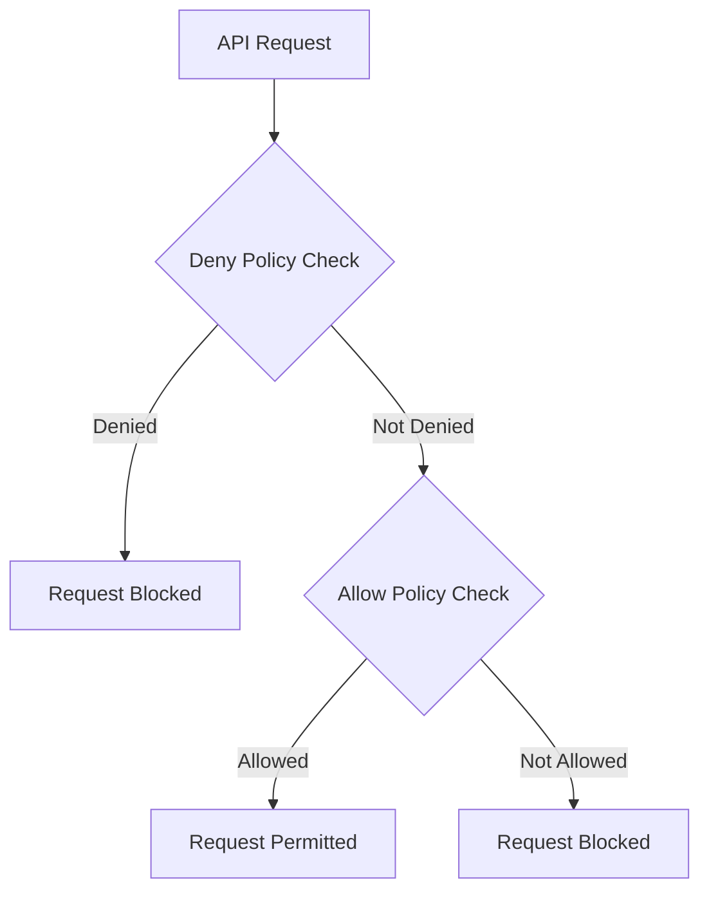

# How to Create IAM Deny Policies to Enforce Security Guardrails in Google Cloud

Author: [nawazdhandala](https://www.github.com/nawazdhandala)

Tags: GCP, Google Cloud, IAM, Deny Policies, Security, Access Control, Guardrails

Description: Learn how to create IAM deny policies in Google Cloud to enforce security guardrails that prevent dangerous actions regardless of allow policies.

---

IAM allow policies in Google Cloud tell you what someone can do. But when you have a complex organization with hundreds of projects and thousands of role bindings, it becomes really hard to guarantee that nobody has a specific dangerous permission. That is where IAM deny policies come in. Deny policies let you explicitly block specific actions, and they take precedence over allow policies. Even if someone has the Owner role, a deny policy can prevent them from performing specific actions.

This is powerful for enforcing security guardrails - hard limits that nobody should be able to cross regardless of their role assignments.

## How Deny Policies Work

In Google Cloud's IAM evaluation order, deny policies are checked before allow policies:



If a deny policy explicitly blocks an action, the request is denied regardless of any allow policies. This means you can grant broad roles for productivity while using deny policies to prevent specific dangerous actions.

## Prerequisites

- A Google Cloud organization or project
- The `roles/iam.denyAdmin` role on the resource where you want to create the deny policy
- Understanding of which actions you want to block

## Step 1: Understand Deny Policy Structure

A deny policy has three main components:

- **Denied permissions**: The specific IAM permissions to block
- **Denied principals**: Who the deny applies to (can be everyone or specific users/groups)
- **Exception principals**: Who is exempt from the deny (emergency break-glass accounts)

## Step 2: Create a Deny Policy to Prevent Public Bucket Creation

One of the most common security guardrails is preventing Cloud Storage buckets from being made publicly accessible:

```bash
# Create a deny policy that prevents making GCS buckets public
# This blocks setting allUsers or allAuthenticatedUsers on any bucket
gcloud iam policies create prevent-public-buckets \
    --attachment-point="cloudresourcemanager.googleapis.com/organizations/ORG_ID" \
    --kind=denypolicies \
    --policy-file=deny-public-buckets.json
```

The policy file:

```json
{
  "displayName": "Prevent Public GCS Buckets",
  "rules": [
    {
      "denyRule": {
        "deniedPrincipals": [
          "principalSet://goog/public:all"
        ],
        "deniedPermissions": [
          "storage.objects.get",
          "storage.objects.list"
        ],
        "denialCondition": {
          "title": "Block public access to storage",
          "expression": "true"
        }
      }
    }
  ]
}
```

Actually, let me show the correct approach - you want to deny the ability to grant public access, not deny public access itself. Here is the right way:

```json
{
  "displayName": "Prevent Granting Public Access to GCS",
  "rules": [
    {
      "denyRule": {
        "deniedPrincipals": [
          "principalSet://goog/public:all"
        ],
        "deniedPermissions": [
          "storage.googleapis.com/buckets.setIamPolicy"
        ],
        "exceptionPrincipals": [
          "principalSet://goog/group/security-admins@example.com"
        ]
      }
    }
  ]
}
```

## Step 3: Prevent Service Account Key Creation

Service account keys are a major security risk. Deny their creation organization-wide:

```json
{
  "displayName": "Block Service Account Key Creation",
  "rules": [
    {
      "denyRule": {
        "deniedPrincipals": [
          "principalSet://goog/public:all"
        ],
        "deniedPermissions": [
          "iam.googleapis.com/serviceAccountKeys.create"
        ],
        "exceptionPrincipals": [
          "principal://goog/sa/breakglass-sa@my-project.iam.gserviceaccount.com"
        ]
      }
    }
  ]
}
```

Save this as `deny-sa-keys.json` and apply it:

```bash
# Apply the deny policy at the organization level
gcloud iam policies create block-sa-key-creation \
    --attachment-point="cloudresourcemanager.googleapis.com/organizations/ORG_ID" \
    --kind=denypolicies \
    --policy-file=deny-sa-keys.json
```

## Step 4: Prevent Deletion of Critical Resources

Protect production resources from accidental or malicious deletion:

```json
{
  "displayName": "Prevent Production Resource Deletion",
  "rules": [
    {
      "denyRule": {
        "deniedPrincipals": [
          "principalSet://goog/public:all"
        ],
        "deniedPermissions": [
          "compute.googleapis.com/instances.delete",
          "compute.googleapis.com/disks.delete",
          "sqladmin.googleapis.com/instances.delete",
          "container.googleapis.com/clusters.delete"
        ],
        "exceptionPrincipals": [
          "principalSet://goog/group/platform-team@example.com"
        ],
        "denialCondition": {
          "title": "Only deny in production projects",
          "expression": "resource.matchTag('env', 'production')"
        }
      }
    }
  ]
}
```

This deny policy uses a condition to only apply in projects tagged as production. Developers can still delete resources in development and staging projects.

```bash
# Apply the deny policy
gcloud iam policies create protect-prod-resources \
    --attachment-point="cloudresourcemanager.googleapis.com/organizations/ORG_ID" \
    --kind=denypolicies \
    --policy-file=deny-prod-deletion.json
```

## Step 5: Prevent IAM Policy Modification on Critical Projects

Lock down who can modify IAM policies on your most sensitive projects:

```json
{
  "displayName": "Restrict IAM Policy Changes on Security Project",
  "rules": [
    {
      "denyRule": {
        "deniedPrincipals": [
          "principalSet://goog/public:all"
        ],
        "deniedPermissions": [
          "resourcemanager.googleapis.com/projects.setIamPolicy"
        ],
        "exceptionPrincipals": [
          "principalSet://goog/group/security-admins@example.com",
          "principal://goog/sa/terraform-security@security-project.iam.gserviceaccount.com"
        ]
      }
    }
  ]
}
```

```bash
# Apply at the project level to scope it to a specific project
gcloud iam policies create lock-security-iam \
    --attachment-point="cloudresourcemanager.googleapis.com/projects/security-project" \
    --kind=denypolicies \
    --policy-file=deny-iam-changes.json
```

## Step 6: Block External Sharing

Prevent resources from being shared with external identities:

```json
{
  "displayName": "Block External Identity Access",
  "rules": [
    {
      "denyRule": {
        "deniedPrincipals": [
          "principalSet://goog/public:all"
        ],
        "deniedPermissions": [
          "resourcemanager.googleapis.com/projects.setIamPolicy",
          "storage.googleapis.com/buckets.setIamPolicy",
          "bigquery.googleapis.com/datasets.update"
        ],
        "denialCondition": {
          "title": "Block granting access to external domains",
          "expression": "api.getAttribute('iam.googleapis.com/modifiedGrantsByRole', []).exists(role, role.contains('user:') && !role.endsWith('@example.com'))"
        }
      }
    }
  ]
}
```

## Step 7: List and Manage Deny Policies

Keep track of your deny policies:

```bash
# List all deny policies attached to your organization
gcloud iam policies list \
    --attachment-point="cloudresourcemanager.googleapis.com/organizations/ORG_ID" \
    --kind=denypolicies \
    --format="table(name,displayName)"

# Get details of a specific deny policy
gcloud iam policies get prevent-public-buckets \
    --attachment-point="cloudresourcemanager.googleapis.com/organizations/ORG_ID" \
    --kind=denypolicies

# Update a deny policy
gcloud iam policies update prevent-public-buckets \
    --attachment-point="cloudresourcemanager.googleapis.com/organizations/ORG_ID" \
    --kind=denypolicies \
    --policy-file=updated-deny-public-buckets.json

# Delete a deny policy (be careful)
gcloud iam policies delete prevent-public-buckets \
    --attachment-point="cloudresourcemanager.googleapis.com/organizations/ORG_ID" \
    --kind=denypolicies
```

## Step 8: Test Your Deny Policies

Always test deny policies before rolling them out broadly:

```bash
# Test by attempting a denied action with a test account
# This should fail with a PERMISSION_DENIED error mentioning the deny policy
gcloud iam service-accounts keys create /tmp/test-key.json \
    --iam-account=test-sa@my-project.iam.gserviceaccount.com \
    --project=my-project

# Expected error:
# ERROR: (gcloud.iam.service-accounts.keys.create) PERMISSION_DENIED:
# Permission 'iam.serviceAccountKeys.create' denied on resource
# by IAM deny policy 'block-sa-key-creation'
```

## Best Practices

**Always include exception principals**: Every deny policy should have at least one break-glass exception. If you lock yourself out, you need a way to recover.

**Start at the project level, then move to organization**: Test deny policies on a single project before applying them organization-wide. A misconfigured deny policy at the org level can break everything.

**Document the business reason**: Each deny policy should have a clear displayName and be documented in your security runbook. Future administrators need to understand why each deny exists.

**Use conditions to limit scope**: Rather than blanket denials, use conditions to target specific environments (production only) or resource types.

**Monitor denied requests**: Set up log-based alerts for deny policy violations. Frequent denials might indicate a misconfiguration or a legitimate workflow that needs an exception.

## Summary

IAM deny policies give you an enforcement layer that sits above all allow policies. They are the security guardrails that cannot be bypassed by granting additional roles. Use them for your most critical security requirements - preventing public access, blocking service account key creation, protecting production resources from deletion, and restricting IAM policy modifications. Combined with exception principals for break-glass scenarios and conditions for targeted scope, deny policies are one of the most powerful security tools available in Google Cloud.
