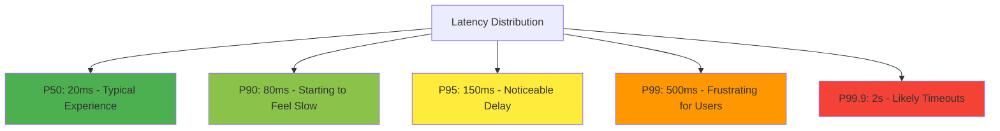

# How to Create MQL Queries for Percentile-Based Latency Monitoring on GCP

Author: [nawazdhandala](https://www.github.com/nawazdhandala)

Tags: GCP, MQL, Latency Monitoring, Cloud Monitoring, Percentiles, Google Cloud

Description: Learn how to write MQL queries for percentile-based latency monitoring on Google Cloud Platform to catch tail latency issues before they affect users.

---

Average latency is a terrible metric for understanding user experience. An average of 100ms could mean every request takes 100ms, or it could mean 99% take 10ms and 1% take 9 seconds. Percentile-based monitoring tells you the real story. On Google Cloud, Monitoring Query Language (MQL) gives you the tools to calculate and alert on percentiles like P50, P95, and P99 latency. In this post, I will show you exactly how to write these queries and build alerts around them.

## Why Percentiles Matter

Let me illustrate with a quick example. Say your service handles 1 million requests per day. A P99 latency of 2 seconds means roughly 10,000 users per day experience a 2-second wait. The average might still look fine at 50ms. Without percentile monitoring, you would never catch this problem.

The standard percentiles to track are P50 (median, what the typical user sees), P95 (what the unlucky-but-not-extreme user sees), and P99 (the tail, often revealing issues with specific code paths, regions, or data patterns).

## MQL Percentile Basics

MQL provides the `percentile()` function for distribution-valued metrics. Most Google Cloud load balancer and App Engine metrics store latency as distribution values, which means they are already set up for percentile calculations.

Here is the simplest possible percentile query.

```
# P95 latency for HTTP load balancer requests
fetch https_lb_rule::loadbalancing.googleapis.com/https/total_latencies
| percentile(val(), 95)
| every 1m
```

This fetches the total latency distribution from your HTTPS load balancer, calculates the 95th percentile, and aligns the data to 1-minute intervals.

## Querying Multiple Percentiles Together

To see P50, P95, and P99 on the same chart, use the `union` operation.

```
# Multiple percentile lines on a single chart
{
  # P50 - median latency
  fetch https_lb_rule::loadbalancing.googleapis.com/https/total_latencies
  | group_by [resource.url_map_name], percentile(val(), 50)
  | every 1m
  ;
  # P95 - 95th percentile latency
  fetch https_lb_rule::loadbalancing.googleapis.com/https/total_latencies
  | group_by [resource.url_map_name], percentile(val(), 95)
  | every 1m
  ;
  # P99 - 99th percentile latency
  fetch https_lb_rule::loadbalancing.googleapis.com/https/total_latencies
  | group_by [resource.url_map_name], percentile(val(), 99)
  | every 1m
}
| union
```

## Filtering by Backend Service

In real deployments, you usually want to see latency broken down by service.

```
# P95 latency broken down by backend service
fetch https_lb_rule::loadbalancing.googleapis.com/https/backend_latencies
| filter resource.url_map_name = "my-url-map"
| group_by [resource.backend_target_name], percentile(val(), 95)
| every 1m
```

You can also filter by response code to separate successful request latency from error latency.

```
# P95 latency for successful requests only
fetch https_lb_rule::loadbalancing.googleapis.com/https/total_latencies
| filter metric.response_code_class = 200
| group_by [resource.url_map_name], percentile(val(), 95)
| every 5m
```

## GKE and Custom Metrics Percentiles

If you are running on GKE and exporting custom metrics via OpenTelemetry or Prometheus, you can query percentiles on those too.

```
# P99 latency from a custom histogram metric
fetch k8s_container::workload.googleapis.com/http_request_duration_ms
| group_by [resource.namespace_name, resource.pod_name],
    percentile(val(), 99)
| every 1m
```

For Prometheus-style histograms exported via Google Managed Prometheus, use the prometheus target type.

```
# P95 from Prometheus histogram buckets exported to GCP
fetch prometheus_target::prometheus.googleapis.com/http_request_duration_seconds/histogram
| group_by [metric.job], percentile(val(), 95)
| every 1m
```

## Building a Latency Dashboard

Here is a complete dashboard definition with multiple percentile panels.

```bash
# Create a latency-focused dashboard
cat > latency-dashboard.json << 'EOF'
{
  "displayName": "Service Latency Dashboard",
  "mosaicLayout": {
    "columns": 12,
    "tiles": [
      {
        "width": 12,
        "height": 4,
        "widget": {
          "title": "Overall Latency Percentiles (P50, P95, P99)",
          "xyChart": {
            "dataSets": [
              {
                "timeSeriesQuery": {
                  "timeSeriesQueryLanguage": "fetch https_lb_rule::loadbalancing.googleapis.com/https/total_latencies | group_by [], percentile(val(), 50) | every 1m"
                },
                "plotType": "LINE",
                "legendTemplate": "P50"
              },
              {
                "timeSeriesQuery": {
                  "timeSeriesQueryLanguage": "fetch https_lb_rule::loadbalancing.googleapis.com/https/total_latencies | group_by [], percentile(val(), 95) | every 1m"
                },
                "plotType": "LINE",
                "legendTemplate": "P95"
              },
              {
                "timeSeriesQuery": {
                  "timeSeriesQueryLanguage": "fetch https_lb_rule::loadbalancing.googleapis.com/https/total_latencies | group_by [], percentile(val(), 99) | every 1m"
                },
                "plotType": "LINE",
                "legendTemplate": "P99"
              }
            ]
          }
        }
      },
      {
        "yPos": 4,
        "width": 6,
        "height": 4,
        "widget": {
          "title": "P95 Latency by Backend",
          "xyChart": {
            "dataSets": [{
              "timeSeriesQuery": {
                "timeSeriesQueryLanguage": "fetch https_lb_rule::loadbalancing.googleapis.com/https/backend_latencies | group_by [resource.backend_target_name], percentile(val(), 95) | every 1m"
              },
              "plotType": "LINE"
            }]
          }
        }
      },
      {
        "xPos": 6,
        "yPos": 4,
        "width": 6,
        "height": 4,
        "widget": {
          "title": "P99 Latency Week-over-Week Comparison",
          "xyChart": {
            "dataSets": [
              {
                "timeSeriesQuery": {
                  "timeSeriesQueryLanguage": "fetch https_lb_rule::loadbalancing.googleapis.com/https/total_latencies | group_by [], percentile(val(), 99) | every 5m"
                },
                "plotType": "LINE",
                "legendTemplate": "Current"
              },
              {
                "timeSeriesQuery": {
                  "timeSeriesQueryLanguage": "fetch https_lb_rule::loadbalancing.googleapis.com/https/total_latencies | group_by [], percentile(val(), 99) | every 5m | time_shift 7d"
                },
                "plotType": "LINE",
                "legendTemplate": "Last Week"
              }
            ]
          }
        }
      }
    ]
  }
}
EOF

gcloud monitoring dashboards create --config-from-file=latency-dashboard.json
```

## Creating Percentile-Based Alerts

Dashboards are great for visualization, but you need alerts for when things go wrong. Here is how to create an alert policy that fires when P95 latency exceeds a threshold.

```bash
# Create an alert for P95 latency exceeding 500ms
gcloud monitoring policies create --policy-from-file=- << 'EOF'
{
  "displayName": "P95 Latency Above 500ms",
  "conditions": [{
    "displayName": "P95 latency threshold",
    "conditionMonitoringQueryLanguage": {
      "query": "fetch https_lb_rule::loadbalancing.googleapis.com/https/total_latencies | group_by [], percentile(val(), 95) | every 1m | condition val() > 500 'ms'",
      "duration": "300s",
      "trigger": {
        "count": 1
      }
    }
  }],
  "combiner": "OR",
  "notificationChannels": [],
  "alertStrategy": {
    "autoClose": "1800s"
  }
}
EOF
```

## Comparing Backend and Total Latency

A useful debugging technique is comparing total latency (what the client sees) with backend latency (just the time your server spent processing). The difference is infrastructure overhead like load balancer processing, TLS termination, and network transit.

```
# Compare total vs backend latency at P95
{
  # Total latency - what the client experiences
  fetch https_lb_rule::loadbalancing.googleapis.com/https/total_latencies
  | group_by [resource.url_map_name], percentile(val(), 95)
  | every 5m
  ;
  # Backend latency - just the server processing time
  fetch https_lb_rule::loadbalancing.googleapis.com/https/backend_latencies
  | group_by [resource.url_map_name], percentile(val(), 95)
  | every 5m
}
| union
```

## Latency Heatmap Visualization



## Practical Patterns

**Track latency by geographic region** to identify location-specific issues.

```
# P95 latency broken down by client country
fetch https_lb_rule::loadbalancing.googleapis.com/https/total_latencies
| filter metric.client_country != ""
| group_by [metric.client_country], percentile(val(), 95)
| every 5m
| top 10
```

**Detect latency regressions** by comparing current values to a rolling baseline.

```
# Current P95 vs 7-day average P95
{
  fetch https_lb_rule::loadbalancing.googleapis.com/https/total_latencies
  | group_by [], percentile(val(), 95)
  | every 5m
  ;
  fetch https_lb_rule::loadbalancing.googleapis.com/https/total_latencies
  | group_by [], percentile(val(), 95)
  | every 5m
  | time_shift 7d
}
| outer_join 0
| div
```

## Wrapping Up

Percentile-based latency monitoring with MQL on Google Cloud gives you an accurate picture of what your users actually experience. Averages hide the suffering of your worst-served users, but percentiles expose it clearly. Start by tracking P50, P95, and P99 on your most critical endpoints. Set alerts on P95 and P99 thresholds that matter to your users. And use week-over-week comparisons to catch gradual degradation before it becomes a crisis. MQL makes all of this possible with clear, composable queries that you can manage alongside your infrastructure code.
