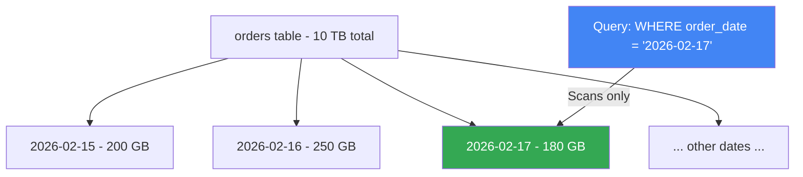

# How to Create Time-Partitioned Tables in BigQuery for Cost Optimization

Author: [nawazdhandala](https://www.github.com/nawazdhandala)

Tags: GCP, BigQuery, Partitioned Tables, Cost Optimization, Performance, SQL

Description: A practical guide to creating and using time-partitioned tables in BigQuery to reduce query costs and improve performance by scanning only the data you need.

---

BigQuery charges by the amount of data your queries scan. A query against a 10 TB table that only needs yesterday's data still scans the entire 10 TB unless the table is partitioned. Time partitioning changes this by splitting your table into date-based segments. When your query includes a partition filter, BigQuery only scans the relevant partitions, dramatically reducing both cost and query time.

I have seen teams cut their BigQuery bills by 80% or more just by switching to partitioned tables and adding partition filters to their queries. It is one of the highest-impact optimizations you can make.

## How Partitioning Works

A partitioned table looks like a single table from the outside, but internally BigQuery stores data in separate partitions based on a date or timestamp column.



Instead of scanning 10 TB, the query scans only the 180 GB partition for February 17th.

## Creating a Table Partitioned by a Column

The most common approach is partitioning by a DATE or TIMESTAMP column in your data.

```sql
-- Create a table partitioned by the order_date column
CREATE TABLE `my-project-id.sales.orders` (
    order_id STRING,
    customer_id STRING,
    order_date DATE,
    product_id STRING,
    quantity INT64,
    amount NUMERIC,
    status STRING,
    created_at TIMESTAMP
)
PARTITION BY order_date
OPTIONS (
    description = "Sales orders partitioned by order date",
    require_partition_filter = true
);
```

The `require_partition_filter = true` option forces all queries to include a filter on the partition column. This prevents accidental full table scans.

## Partitioning by TIMESTAMP

For timestamp columns, BigQuery partitions by the date portion of the timestamp.

```sql
-- Partition by a TIMESTAMP column (daily granularity by default)
CREATE TABLE `my-project-id.analytics.events` (
    event_id STRING,
    event_type STRING,
    user_id STRING,
    event_timestamp TIMESTAMP,
    properties JSON
)
PARTITION BY DATE(event_timestamp);
```

You can also partition by hour, month, or year:

```sql
-- Hourly partitioning for high-volume data
CREATE TABLE `my-project-id.analytics.clickstream` (
    click_id STRING,
    user_id STRING,
    url STRING,
    click_timestamp TIMESTAMP
)
PARTITION BY TIMESTAMP_TRUNC(click_timestamp, HOUR);

-- Monthly partitioning for slowly growing data
CREATE TABLE `my-project-id.reports.monthly_summaries` (
    report_month DATE,
    region STRING,
    revenue NUMERIC,
    customer_count INT64
)
PARTITION BY DATE_TRUNC(report_month, MONTH);

-- Yearly partitioning for historical data
CREATE TABLE `my-project-id.archive.historical_records` (
    record_date DATE,
    category STRING,
    value NUMERIC
)
PARTITION BY DATE_TRUNC(record_date, YEAR);
```

## Ingestion-Time Partitioning

If your data does not have a date column, you can partition by when the data was loaded into BigQuery.

```sql
-- Partition by ingestion time
CREATE TABLE `my-project-id.logs.application_logs` (
    log_level STRING,
    service STRING,
    message STRING,
    trace_id STRING
)
PARTITION BY _PARTITIONDATE;
```

The `_PARTITIONDATE` and `_PARTITIONTIME` pseudo-columns are automatically populated when data is loaded.

```sql
-- Query ingestion-time partitioned tables
SELECT *
FROM `my-project-id.logs.application_logs`
WHERE _PARTITIONDATE = CURRENT_DATE();
```

## Adding Clustering for Further Optimization

Clustering sorts data within each partition by one or more columns. This helps BigQuery skip blocks of data that do not match your filter.

```sql
-- Partitioned by date, clustered by event_type and user_id
CREATE TABLE `my-project-id.analytics.events` (
    event_id STRING,
    event_type STRING,
    user_id STRING,
    event_timestamp TIMESTAMP,
    properties JSON
)
PARTITION BY DATE(event_timestamp)
CLUSTER BY event_type, user_id;
```

When you query with `WHERE event_type = 'purchase'`, BigQuery can skip data blocks that do not contain purchase events, even within a single partition.

## Partition Expiration

Automatically delete old partitions to manage storage costs.

```sql
-- Create a table with 90-day partition expiration
CREATE TABLE `my-project-id.logs.access_logs` (
    request_timestamp TIMESTAMP,
    client_ip STRING,
    request_path STRING,
    status_code INT64,
    response_time_ms INT64
)
PARTITION BY DATE(request_timestamp)
OPTIONS (
    partition_expiration_days = 90
);
```

Partitions older than 90 days are automatically deleted. You can update this later:

```sql
-- Update partition expiration on an existing table
ALTER TABLE `my-project-id.logs.access_logs`
SET OPTIONS (
    partition_expiration_days = 180
);
```

## Migrating an Existing Table to Partitioned

If you have a non-partitioned table and want to convert it, create a new partitioned table and copy the data.

```sql
-- Create a partitioned version of an existing table
CREATE TABLE `my-project-id.sales.orders_partitioned`
PARTITION BY order_date
CLUSTER BY customer_id
AS
SELECT * FROM `my-project-id.sales.orders_old`;
```

Then swap the tables:

```sql
-- Drop the old table and rename the new one
-- First, verify the new table has the correct data
SELECT COUNT(*) AS old_count FROM `my-project-id.sales.orders_old`;
SELECT COUNT(*) AS new_count FROM `my-project-id.sales.orders_partitioned`;

-- If counts match, proceed
DROP TABLE `my-project-id.sales.orders_old`;

-- Note: BigQuery does not have RENAME TABLE. You would need to
-- copy the partitioned table to the original name
CREATE TABLE `my-project-id.sales.orders`
PARTITION BY order_date
CLUSTER BY customer_id
AS
SELECT * FROM `my-project-id.sales.orders_partitioned`;

DROP TABLE `my-project-id.sales.orders_partitioned`;
```

## Writing Efficient Queries

The partition filter must reference the partition column directly to enable partition pruning.

```sql
-- GOOD: Direct filter on partition column enables pruning
SELECT * FROM `my-project-id.sales.orders`
WHERE order_date = '2026-02-17';

-- GOOD: Range filter also enables pruning
SELECT * FROM `my-project-id.sales.orders`
WHERE order_date BETWEEN '2026-02-01' AND '2026-02-28';

-- BAD: Function on partition column may prevent pruning
SELECT * FROM `my-project-id.sales.orders`
WHERE EXTRACT(YEAR FROM order_date) = 2026;

-- BAD: Casting or transforming the column prevents pruning
SELECT * FROM `my-project-id.sales.orders`
WHERE CAST(order_date AS STRING) = '2026-02-17';
```

## Checking Partition Usage

Use the INFORMATION_SCHEMA to see how your partitions are performing.

```sql
-- View partition metadata
SELECT
    table_name,
    partition_id,
    total_rows,
    ROUND(total_logical_bytes / POW(1024, 3), 2) AS size_gb
FROM
    `my-project-id.sales.INFORMATION_SCHEMA.PARTITIONS`
WHERE
    table_name = 'orders'
ORDER BY
    partition_id DESC
LIMIT 30;
```

Check how much data your queries actually scan:

```sql
-- View recent query statistics to check partition pruning effectiveness
SELECT
    creation_time,
    query,
    total_bytes_processed,
    total_bytes_billed,
    total_slot_ms
FROM
    `region-us.INFORMATION_SCHEMA.JOBS_BY_PROJECT`
WHERE
    project_id = 'my-project-id'
    AND creation_time > TIMESTAMP_SUB(CURRENT_TIMESTAMP(), INTERVAL 1 DAY)
    AND statement_type = 'SELECT'
ORDER BY
    total_bytes_processed DESC
LIMIT 10;
```

## Terraform Configuration

```hcl
# Partitioned and clustered table
resource "google_bigquery_table" "orders" {
  dataset_id = google_bigquery_dataset.sales.dataset_id
  table_id   = "orders"

  time_partitioning {
    type  = "DAY"
    field = "order_date"
    # Auto-delete partitions after 365 days
    expiration_ms = 31536000000
    # Require partition filter in queries
    require_partition_filter = true
  }

  clustering = ["customer_id", "product_category"]

  schema = jsonencode([
    { name = "order_id", type = "STRING", mode = "REQUIRED" },
    { name = "customer_id", type = "STRING", mode = "REQUIRED" },
    { name = "order_date", type = "DATE", mode = "REQUIRED" },
    { name = "product_id", type = "STRING" },
    { name = "product_category", type = "STRING" },
    { name = "quantity", type = "INT64" },
    { name = "amount", type = "NUMERIC" },
    { name = "status", type = "STRING" },
  ])
}
```

## Cost Comparison Example

Here is a real-world cost comparison for a 5 TB table queried 50 times per day with a date filter.

| Table Type | Data Scanned per Query | Daily Cost (50 queries) | Monthly Cost |
|-----------|----------------------|------------------------|-------------|
| Non-partitioned | 5 TB | $1,250 | $37,500 |
| Daily partitioned | ~165 GB (one day) | $41 | $1,237 |
| Daily partitioned + clustered | ~30 GB (filtered) | $7.50 | $225 |

That is a 99.4% cost reduction from the non-partitioned baseline. Even the partitioned-only approach saves 96.7%.

## Integer Range Partitioning

For tables without a date column but with a numeric ID, you can use integer range partitioning.

```sql
-- Partition by customer_id ranges
CREATE TABLE `my-project-id.crm.customer_events` (
    event_id STRING,
    customer_id INT64,
    event_type STRING,
    event_data JSON,
    created_at TIMESTAMP
)
PARTITION BY RANGE_BUCKET(customer_id, GENERATE_ARRAY(0, 1000000, 10000));
```

This creates partitions for customer IDs 0-9999, 10000-19999, and so on.

## Best Practices

1. **Always require partition filters**: Set `require_partition_filter = true` to prevent accidental full scans.

2. **Choose the right granularity**: Daily partitioning works for most cases. Use hourly for very high-volume data, monthly for slow-growing data.

3. **Combine with clustering**: Partitioning handles the time dimension, clustering handles other common filter columns.

4. **Set partition expiration**: Automatically clean up old data you no longer need.

5. **Monitor partition sizes**: Extremely skewed partitions (one huge, others tiny) indicate a poor choice of partition column.

6. **Use partition-compatible filters**: Apply filters directly on the partition column without transformations.

## Summary

Time partitioning is the single most impactful cost optimization in BigQuery. By splitting tables into date-based partitions and requiring partition filters, you ensure queries only scan the data they need. Combine partitioning with clustering for further savings, set partition expiration for automatic cleanup, and always check that your queries are actually pruning partitions effectively. For most analytical workloads, daily partitioning with 2-3 clustering columns provides the best balance of cost savings and query performance.
