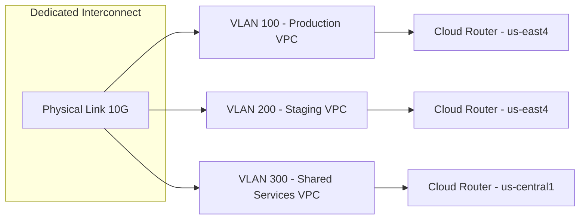

# How to Create VLAN Attachments for Dedicated Interconnect in GCP

Author: [nawazdhandala](https://www.github.com/nawazdhandala)

Tags: GCP, Dedicated Interconnect, VLAN, Cloud Interconnect, Networking

Description: Step-by-step guide to creating and configuring VLAN attachments for Dedicated Interconnect in Google Cloud Platform for routing traffic to your VPC.

---

Once your Dedicated Interconnect physical connection is active in GCP, the next step is creating VLAN attachments. A VLAN attachment (also called an InterconnectAttachment) is the logical connection that links your Dedicated Interconnect to a specific VPC network through Cloud Router. Without it, the physical link exists but no traffic can flow.

Think of it this way: the Dedicated Interconnect is the highway, and VLAN attachments are the on-ramps and off-ramps that connect your VPC networks to that highway.

## How VLAN Attachments Work

Each VLAN attachment:

- Associates with a specific Dedicated Interconnect
- Uses a specific VLAN ID (802.1Q tag) to isolate traffic
- Connects to a Cloud Router in a specific region
- Has a configured bandwidth capacity
- Establishes a BGP session between Cloud Router and your on-premises router

You can create multiple VLAN attachments on a single Dedicated Interconnect, each connecting to different VPC networks, regions, or projects.



## Prerequisites

Before creating VLAN attachments, you need:

- An active Dedicated Interconnect (state: ACTIVE)
- A VPC network
- The Compute Network Admin IAM role
- Knowledge of which VLAN IDs to use (coordinate with your network team)

## Step 1: Create a Cloud Router

Each VLAN attachment requires a Cloud Router. The Cloud Router must be in the same region as the Dedicated Interconnect's location.

```bash
# Create a Cloud Router for the VLAN attachment
gcloud compute routers create ic-router-prod \
    --network=production-vpc \
    --region=us-east4 \
    --asn=16550
```

Choose an ASN that does not conflict with your on-premises network's ASN. Google recommends using 16550 if you do not have a specific ASN requirement, as it is the default Cloud Router ASN.

## Step 2: Create the VLAN Attachment

Now create the VLAN attachment linking your Interconnect to the Cloud Router:

```bash
# Create a VLAN attachment on the Dedicated Interconnect
gcloud compute interconnects attachments dedicated create prod-attachment \
    --interconnect=my-interconnect-1 \
    --router=ic-router-prod \
    --region=us-east4 \
    --bandwidth=BPS_1G \
    --vlan=100 \
    --description="Production VPC attachment"
```

Let me break down the important parameters:

- `--interconnect`: The name of your Dedicated Interconnect resource
- `--router`: The Cloud Router to associate with
- `--bandwidth`: The maximum bandwidth allocated to this attachment. Options are BPS_50M, BPS_100M, BPS_200M, BPS_300M, BPS_400M, BPS_500M, BPS_1G, BPS_2G, BPS_5G, BPS_10G, BPS_20G, BPS_50G
- `--vlan`: The VLAN ID (802.1Q tag) for this attachment. Must be unique per Interconnect

## Step 3: Note the BGP Peering Details

After creation, the VLAN attachment will have BGP peering details that you need for configuring your on-premises router:

```bash
# Get the VLAN attachment details including BGP info
gcloud compute interconnects attachments describe prod-attachment \
    --region=us-east4 \
    --format="yaml(name, vlanTag8021q, cloudRouterIpAddress, customerRouterIpAddress, pairingKey, state, bandwidth)"
```

The output will include:

- `cloudRouterIpAddress`: The IP address assigned to Cloud Router's side of the BGP session (e.g., 169.254.61.1/29)
- `customerRouterIpAddress`: The IP address you should configure on your on-premises router (e.g., 169.254.61.2/29)
- `vlanTag8021q`: The VLAN ID
- `pairingKey`: Used only for Partner Interconnect

## Step 4: Configure BGP on Cloud Router

Add a BGP interface and peer on the Cloud Router:

```bash
# Add the interface to Cloud Router
gcloud compute routers add-interface ic-router-prod \
    --interface-name=if-prod-attachment \
    --interconnect-attachment=prod-attachment \
    --region=us-east4

# Add the BGP peer
gcloud compute routers add-bgp-peer ic-router-prod \
    --peer-name=onprem-router-peer \
    --interface=if-prod-attachment \
    --peer-ip-address=169.254.61.2 \
    --peer-asn=65001 \
    --region=us-east4
```

Replace the peer IP address and ASN with your actual on-premises router values.

## Step 5: Configure Your On-Premises Router

On your on-premises router, configure a sub-interface with the matching VLAN ID and BGP settings.

Example for Cisco IOS XE:

```text
! Configure the sub-interface with the VLAN tag
interface TenGigabitEthernet0/0.100
  encapsulation dot1Q 100
  ip address 169.254.61.2 255.255.255.248
  no shutdown

! Configure BGP peering with Cloud Router
router bgp 65001
  neighbor 169.254.61.1 remote-as 16550
  neighbor 169.254.61.1 description GCP-Cloud-Router
  address-family ipv4 unicast
    neighbor 169.254.61.1 activate
    network 10.0.0.0 mask 255.255.0.0
```

Example for Juniper:

```text
# Configure the VLAN interface
set interfaces xe-0/0/0 unit 100 vlan-id 100
set interfaces xe-0/0/0 unit 100 family inet address 169.254.61.2/29

# Configure BGP
set protocols bgp group gcp-peer type external
set protocols bgp group gcp-peer peer-as 16550
set protocols bgp group gcp-peer neighbor 169.254.61.1
set protocols bgp group gcp-peer export advertise-local
```

## Step 6: Verify the BGP Session

Once both sides are configured, the BGP session should establish within seconds:

```bash
# Check BGP session status from GCP side
gcloud compute routers get-status ic-router-prod \
    --region=us-east4 \
    --format="table(result.bgpPeerStatus[].name, result.bgpPeerStatus[].status, result.bgpPeerStatus[].numLearnedRoutes, result.bgpPeerStatus[].numAdvertisedRoutes)"
```

You should see the peer status as `UP` with learned routes from your on-premises network and advertised routes from your VPC.

## Creating Multiple VLAN Attachments

You can create multiple attachments on the same Interconnect for different purposes. Here is an example for a staging environment:

```bash
# Create a Cloud Router for staging
gcloud compute routers create ic-router-staging \
    --network=staging-vpc \
    --region=us-east4 \
    --asn=16550

# Create a VLAN attachment for staging with lower bandwidth
gcloud compute interconnects attachments dedicated create staging-attachment \
    --interconnect=my-interconnect-1 \
    --router=ic-router-staging \
    --region=us-east4 \
    --bandwidth=BPS_200M \
    --vlan=200 \
    --description="Staging VPC attachment"
```

## Bandwidth Allocation

When you create multiple VLAN attachments on a single Interconnect, the bandwidth allocations are soft limits. They affect how Cloud Router distributes traffic but do not create hard rate limits. The total of all attachment bandwidths should not exceed the Interconnect link capacity.

For a 10 Gbps Interconnect, a typical allocation might be:

| Attachment | VLAN | Bandwidth | Purpose |
|-----------|------|-----------|---------|
| prod-attachment | 100 | 5 Gbps | Production traffic |
| staging-attachment | 200 | 1 Gbps | Staging/QA |
| mgmt-attachment | 300 | 500 Mbps | Management |
| backup-attachment | 400 | 2 Gbps | Data replication |

## Modifying VLAN Attachments

You can update certain properties of existing attachments without recreating them:

```bash
# Update the bandwidth allocation
gcloud compute interconnects attachments dedicated update prod-attachment \
    --region=us-east4 \
    --bandwidth=BPS_5G

# Disable an attachment (stops traffic but preserves config)
gcloud compute interconnects attachments dedicated update staging-attachment \
    --region=us-east4 \
    --no-admin-enabled
```

Note that you cannot change the VLAN ID or the Interconnect it is attached to. For those changes, you need to delete and recreate the attachment.

## Redundant VLAN Attachments

For production workloads, always create VLAN attachments on at least two Interconnects in different Edge Availability Domains:

```bash
# Attachment on first Interconnect (Edge Domain 1)
gcloud compute interconnects attachments dedicated create prod-attachment-1 \
    --interconnect=my-interconnect-1 \
    --router=ic-router-prod \
    --region=us-east4 \
    --bandwidth=BPS_5G \
    --vlan=100

# Attachment on second Interconnect (Edge Domain 2)
gcloud compute interconnects attachments dedicated create prod-attachment-2 \
    --interconnect=my-interconnect-2 \
    --router=ic-router-prod \
    --region=us-east4 \
    --bandwidth=BPS_5G \
    --vlan=100
```

Both attachments connect to the same Cloud Router, which handles failover automatically through BGP.

## Troubleshooting

**Attachment state shows UNPROVISIONED**:
- The Interconnect itself may not be active yet. Check `gcloud compute interconnects describe my-interconnect-1`

**BGP session will not establish**:
- Verify the VLAN ID matches on both sides
- Check the IP addresses are configured correctly (Cloud Router IP vs Customer Router IP)
- Make sure your router is advertising the correct ASN
- Look for interface errors on your on-premises router

**No routes being learned**:
- Verify your on-premises router is advertising routes to the BGP peer
- Check if there are any route filters or prefix lists blocking advertisements
- Ensure the VPC subnet routes are being advertised by Cloud Router (check custom route advertisements)

## Wrapping Up

VLAN attachments are the bridge between your physical Dedicated Interconnect and your GCP VPC networks. The setup is straightforward once you understand the components: create a Cloud Router, create the VLAN attachment with the right bandwidth and VLAN ID, configure BGP on both sides, and verify the session is up. For production, always use redundant attachments across different Edge Availability Domains and monitor the BGP session health continuously.
