# How to Create Your First API Proxy in Apigee on Google Cloud Platform

Author: [nawazdhandala](https://www.github.com/nawazdhandala)

Tags: Apigee, GCP, API Management, API Proxy, API Gateway

Description: A beginner-friendly walkthrough for creating and deploying your first API proxy in Apigee on Google Cloud Platform with step-by-step instructions.

---

Apigee is Google Cloud's API management platform. If you have backend services and you want to expose them as managed APIs with rate limiting, authentication, analytics, and monitoring, Apigee sits in front of your services and handles all of that. The fundamental building block in Apigee is the API proxy - it accepts incoming requests, applies policies, and forwards them to your backend service.

This guide walks through creating your first API proxy from scratch, deploying it, and testing it.

## What is an API Proxy

An API proxy is a facade that sits between the client and your backend service. Clients call the proxy URL, and the proxy forwards the request to your actual backend. Along the way, the proxy can:

- Validate API keys or OAuth tokens
- Apply rate limiting
- Transform requests and responses
- Log analytics data
- Cache responses
- Handle errors consistently

Think of it as a programmable reverse proxy with a policy engine built in.

## Prerequisites

Before creating a proxy, you need:

1. A GCP project with Apigee provisioned
2. An Apigee organization linked to your GCP project
3. A backend service to proxy (we will use a public API for this tutorial)

If you have not provisioned Apigee yet:

```bash
# Enable the Apigee API
gcloud services enable apigee.googleapis.com --project YOUR_PROJECT_ID

# Provision an Apigee organization (this takes 30-60 minutes)
gcloud alpha apigee organizations provision \
  --project YOUR_PROJECT_ID \
  --analytics-region us-central1 \
  --runtime-location us-central1-a \
  --authorized-network default
```

## Creating the API Proxy

You can create a proxy through the Apigee Console UI or using the Apigee API. We will cover both approaches.

### Using the Apigee Console

1. Navigate to the Apigee Console in GCP
2. Go to Develop > API Proxies
3. Click "Create New"
4. Select "Reverse Proxy" as the type
5. Fill in the details:
   - Name: `weather-api`
   - Base Path: `/weather`
   - Target (Backend) URL: `https://api.openweathermap.org/data/2.5`
6. Click Create and Deploy

### Using the Apigee API

For automation, use the management API to create proxies programmatically.

First, create the proxy bundle structure:

```bash
# Create the directory structure for an Apigee proxy bundle
mkdir -p weather-api/apiproxy/proxies
mkdir -p weather-api/apiproxy/targets
mkdir -p weather-api/apiproxy/policies
```

Create the proxy endpoint configuration. This defines how the proxy accepts incoming requests:

```xml
<!-- weather-api/apiproxy/proxies/default.xml -->
<?xml version="1.0" encoding="UTF-8" standalone="yes"?>
<ProxyEndpoint name="default">
    <Description>Default Proxy Endpoint</Description>

    <PreFlow name="PreFlow">
        <Request/>
        <Response/>
    </PreFlow>

    <PostFlow name="PostFlow">
        <Request/>
        <Response/>
    </PostFlow>

    <Flows/>

    <HTTPProxyConnection>
        <!-- The base path clients use to access this proxy -->
        <BasePath>/weather</BasePath>
        <VirtualHost>default</VirtualHost>
    </HTTPProxyConnection>

    <RouteRule name="default">
        <TargetEndpoint>default</TargetEndpoint>
    </RouteRule>
</ProxyEndpoint>
```

Create the target endpoint configuration. This defines the backend service:

```xml
<!-- weather-api/apiproxy/targets/default.xml -->
<?xml version="1.0" encoding="UTF-8" standalone="yes"?>
<TargetEndpoint name="default">
    <Description>Default Target Endpoint</Description>

    <PreFlow name="PreFlow">
        <Request/>
        <Response/>
    </PreFlow>

    <PostFlow name="PostFlow">
        <Request/>
        <Response/>
    </PostFlow>

    <Flows/>

    <HTTPTargetConnection>
        <!-- Your backend service URL -->
        <URL>https://api.openweathermap.org/data/2.5</URL>
        <Properties>
            <Property name="connect.timeout.millis">30000</Property>
            <Property name="io.timeout.millis">30000</Property>
        </Properties>
    </HTTPTargetConnection>
</TargetEndpoint>
```

Create the main proxy descriptor:

```xml
<!-- weather-api/apiproxy/weather-api.xml -->
<?xml version="1.0" encoding="UTF-8" standalone="yes"?>
<APIProxy revision="1" name="weather-api">
    <ConfigurationVersion majorVersion="4" minorVersion="0"/>
    <Description>Weather API Proxy</Description>
    <DisplayName>Weather API</DisplayName>
    <ProxyEndpoints>
        <ProxyEndpoint>default</ProxyEndpoint>
    </ProxyEndpoints>
    <TargetEndpoints>
        <TargetEndpoint>default</TargetEndpoint>
    </TargetEndpoints>
</APIProxy>
```

## Deploying the Proxy

Bundle and deploy using the Apigee API:

```bash
# Create a zip of the proxy bundle
cd weather-api
zip -r ../weather-api.zip apiproxy/
cd ..

# Import the proxy bundle
curl -X POST \
  "https://apigee.googleapis.com/v1/organizations/YOUR_ORG/apis?name=weather-api&action=import" \
  -H "Authorization: Bearer $(gcloud auth print-access-token)" \
  -H "Content-Type: application/octet-stream" \
  --data-binary @weather-api.zip

# Deploy to the test environment
curl -X POST \
  "https://apigee.googleapis.com/v1/organizations/YOUR_ORG/environments/eval/apis/weather-api/revisions/1/deployments" \
  -H "Authorization: Bearer $(gcloud auth print-access-token)" \
  -H "Content-Type: application/json"
```

## Testing the Proxy

Once deployed, test the proxy by sending requests to the Apigee endpoint:

```bash
# Get your Apigee environment group hostname
HOSTNAME=$(gcloud alpha apigee environments describe eval \
  --organization YOUR_ORG \
  --format="value(properties.host)")

# Test the proxy
curl "https://$HOSTNAME/weather/weather?q=London&appid=YOUR_OPENWEATHER_KEY"
```

If everything is configured correctly, you should see the weather data from the OpenWeatherMap API, proxied through Apigee.

## Adding a Simple Policy

Policies are the building blocks of Apigee proxy logic. Let us add a simple policy that adds a custom response header to every response.

Create the policy file:

```xml
<!-- weather-api/apiproxy/policies/AddResponseHeaders.xml -->
<?xml version="1.0" encoding="UTF-8" standalone="yes"?>
<AssignMessage name="AddResponseHeaders">
    <DisplayName>Add Response Headers</DisplayName>
    <AssignTo createNew="false" transport="http" type="response"/>
    <Set>
        <Headers>
            <!-- Add a header showing which proxy handled the request -->
            <Header name="X-Proxy-Name">weather-api</Header>
            <!-- Add a timestamp header -->
            <Header name="X-Proxy-Timestamp">{system.timestamp}</Header>
        </Headers>
    </Set>
    <IgnoreUnresolvedVariables>true</IgnoreUnresolvedVariables>
</AssignMessage>
```

Attach the policy to the proxy endpoint's PostFlow:

```xml
<!-- Update weather-api/apiproxy/proxies/default.xml -->
<?xml version="1.0" encoding="UTF-8" standalone="yes"?>
<ProxyEndpoint name="default">
    <Description>Default Proxy Endpoint</Description>

    <PreFlow name="PreFlow">
        <Request/>
        <Response/>
    </PreFlow>

    <PostFlow name="PostFlow">
        <Request/>
        <Response>
            <!-- Apply the header policy to all responses -->
            <Step>
                <Name>AddResponseHeaders</Name>
            </Step>
        </Response>
    </PostFlow>

    <Flows/>

    <HTTPProxyConnection>
        <BasePath>/weather</BasePath>
        <VirtualHost>default</VirtualHost>
    </HTTPProxyConnection>

    <RouteRule name="default">
        <TargetEndpoint>default</TargetEndpoint>
    </RouteRule>
</ProxyEndpoint>
```

Redeploy the updated proxy and test again:

```bash
# The response should now include X-Proxy-Name and X-Proxy-Timestamp headers
curl -I "https://$HOSTNAME/weather/weather?q=London&appid=YOUR_KEY"
```

## Understanding the Proxy Flow

Every request through an Apigee proxy follows a specific flow:

```mermaid
graph LR
    A[Client Request] --> B[ProxyEndpoint PreFlow]
    B --> C[ProxyEndpoint Flows]
    C --> D[ProxyEndpoint PostFlow]
    D --> E[Route Rule]
    E --> F[TargetEndpoint PreFlow]
    F --> G[TargetEndpoint PostFlow]
    G --> H[Backend Service]
    H --> I[TargetEndpoint Response]
    I --> J[ProxyEndpoint Response]
    J --> K[Client Response]
```



- **PreFlow** runs before everything else, on every request
- **Conditional Flows** run based on URL patterns or conditions
- **PostFlow** runs after flows, on every request
- Policies can be attached at any of these points, on the request or response side

## Monitoring Your Proxy

After deployment, check the Apigee analytics dashboard:

```bash
# View proxy deployment status
curl "https://apigee.googleapis.com/v1/organizations/YOUR_ORG/environments/eval/apis/weather-api/deployments" \
  -H "Authorization: Bearer $(gcloud auth print-access-token)"

# View recent API traffic stats
curl "https://apigee.googleapis.com/v1/organizations/YOUR_ORG/environments/eval/stats/apiproxy?select=sum(message_count)&timeRange=01/01/2026+00:00~02/17/2026+23:59" \
  -H "Authorization: Bearer $(gcloud auth print-access-token)"
```

## Next Steps

With your first proxy running, you can start adding more sophisticated policies:

- **VerifyAPIKey** to require API keys for access
- **Quota** to limit the number of requests per time period
- **SpikeArrest** to smooth out traffic spikes
- **OAuthV2** for OAuth-based authentication
- **ResponseCache** to cache backend responses

Each policy is an XML file in the policies directory, attached to the appropriate flow step.

## Summary

Creating an API proxy in Apigee involves defining a proxy endpoint (what clients call), a target endpoint (your backend), and policies (the logic in between). Start with a simple pass-through proxy, verify it works, then layer on policies for security, rate limiting, and transformation. The XML-based configuration might feel verbose compared to code, but it gives you a declarative way to manage API behavior that is versioned and deployable independently of your backend services.
