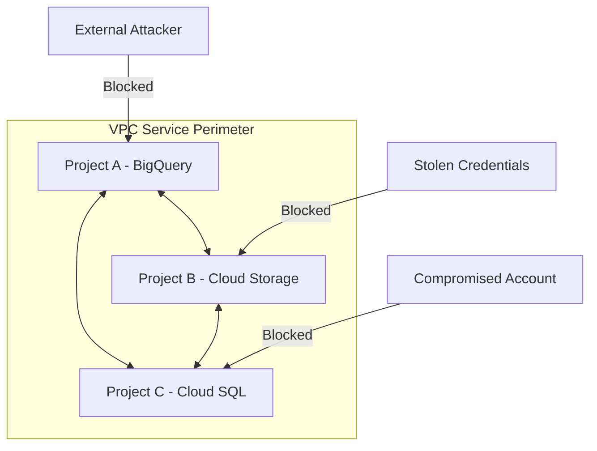

# How to Create Your First VPC Service Perimeter in Google Cloud

Author: [nawazdhandala](https://www.github.com/nawazdhandala)

Tags: GCP, VPC Service Controls, Security Perimeter, Data Protection, Cloud Security

Description: A beginner-friendly guide to creating your first VPC Service Controls perimeter in Google Cloud to prevent data exfiltration and unauthorized API access.

---

VPC Service Controls is one of the most powerful - and most misunderstood - security features in Google Cloud. At its core, it creates a security boundary around GCP services that prevents data from leaving the perimeter without explicit authorization. Think of it as a firewall, but for API calls instead of network traffic.

Without VPC Service Controls, a compromised service account or insider threat could copy your BigQuery data to a project they control, exfiltrate Cloud Storage objects, or access sensitive APIs from outside your network. VPC Service Controls blocks all of that.

In this guide, I will walk you through creating your very first perimeter from scratch.

## What VPC Service Controls Protects Against

Here is what changes when a service is inside a perimeter:

- API calls from outside the perimeter are blocked (even with valid credentials)
- Data cannot be copied to projects outside the perimeter
- Service accounts in the perimeter cannot access resources outside it
- API calls from outside your corporate network can be blocked



## Prerequisites

- An organization-level GCP setup (VPC Service Controls requires an organization)
- The `roles/accesscontextmanager.policyAdmin` role
- At least one GCP project to put inside the perimeter

## Step 1: Create an Access Policy

VPC Service Controls operates within an access policy. Most organizations have one policy.

```bash
# Check if an access policy already exists
gcloud access-context-manager policies list \
  --organization=ORGANIZATION_ID

# If none exists, create one
gcloud access-context-manager policies create \
  --organization=ORGANIZATION_ID \
  --title="Organization Access Policy"
```

Note the policy ID from the output - you will need it for subsequent commands.

```bash
# Store the policy ID for later use
ACCESS_POLICY_ID=$(gcloud access-context-manager policies list \
  --organization=ORGANIZATION_ID \
  --format="value(name)")
```

## Step 2: Decide What Goes in the Perimeter

Before creating the perimeter, decide:

1. Which projects to include
2. Which GCP services to restrict
3. Which access levels to allow (IP ranges, device policies, etc.)

For your first perimeter, start small. Pick one or two projects with sensitive data and a few key services.

## Step 3: Create the Perimeter in Dry-Run Mode

Always start in dry-run mode. This logs what would be blocked without actually blocking anything.

```bash
# Create a perimeter in dry-run mode
gcloud access-context-manager perimeters dry-run create my-first-perimeter \
  --perimeter-type=regular \
  --resources="projects/PROJECT_NUMBER_1,projects/PROJECT_NUMBER_2" \
  --restricted-services="bigquery.googleapis.com,storage.googleapis.com" \
  --title="My First Perimeter" \
  --policy=$ACCESS_POLICY_ID
```

Notice we use project numbers, not project IDs. You can get the project number with:

```bash
# Get a project number from a project ID
gcloud projects describe my-project-id --format="value(projectNumber)"
```

## Step 4: Monitor Dry-Run Violations

With dry-run mode active, check the audit logs to see what would be blocked.

```bash
# View dry-run violations in the audit logs
gcloud logging read \
  'protoPayload.metadata.@type="type.googleapis.com/google.cloud.audit.VpcServiceControlAuditMetadata" AND protoPayload.metadata.dryRun=true' \
  --limit=20 \
  --format="table(timestamp, protoPayload.methodName, protoPayload.metadata.violationReason)" \
  --project=my-project-id
```

Review these violations carefully. Each one represents an API call that will be blocked when you enforce the perimeter.

## Step 5: Create Access Levels (If Needed)

If you need to allow access from your corporate network, create an access level.

```bash
# Create an access level for your corporate IP range
gcloud access-context-manager levels create corporate-network \
  --title="Corporate Network" \
  --basic-level-spec=level-spec.yaml \
  --policy=$ACCESS_POLICY_ID
```

Where `level-spec.yaml` contains:

```yaml
# level-spec.yaml
conditions:
  - ipSubnetworks:
      - 203.0.113.0/24    # Your office IP range
      - 198.51.100.0/24   # Your VPN IP range
```

## Step 6: Enforce the Perimeter

Once you have reviewed the dry-run logs and are confident the perimeter will not break anything critical, enforce it.

```bash
# Create the enforced perimeter
gcloud access-context-manager perimeters create my-first-perimeter \
  --perimeter-type=regular \
  --resources="projects/PROJECT_NUMBER_1,projects/PROJECT_NUMBER_2" \
  --restricted-services="bigquery.googleapis.com,storage.googleapis.com" \
  --access-levels="accessPolicies/$ACCESS_POLICY_ID/accessLevels/corporate-network" \
  --title="My First Perimeter" \
  --policy=$ACCESS_POLICY_ID
```

Or if you already created a dry-run perimeter and want to enforce it:

```bash
# Enforce the dry-run perimeter
gcloud access-context-manager perimeters dry-run enforce my-first-perimeter \
  --policy=$ACCESS_POLICY_ID
```

## Step 7: Verify the Perimeter

Test that the perimeter is working by trying to access a restricted service from outside the perimeter.

```bash
# Try to list BigQuery datasets from outside the perimeter
# This should fail with a VPC Service Controls error
bq ls --project_id=my-protected-project
```

You should see an error like: `VPC Service Controls: Request is prohibited by organization's policy.`

From inside the perimeter (e.g., from a VM in one of the included projects), the same command should succeed.

## Step 8: Add More Services

You can update the perimeter to restrict additional services.

```bash
# Add more restricted services to the perimeter
gcloud access-context-manager perimeters update my-first-perimeter \
  --add-restricted-services="cloudsql.googleapis.com,spanner.googleapis.com,pubsub.googleapis.com" \
  --policy=$ACCESS_POLICY_ID
```

Here are the services you should consider restricting:

- `bigquery.googleapis.com` - Prevent data exfiltration via BigQuery
- `storage.googleapis.com` - Protect Cloud Storage objects
- `cloudsql.googleapis.com` - Protect database instances
- `spanner.googleapis.com` - Protect Spanner databases
- `pubsub.googleapis.com` - Prevent message interception
- `logging.googleapis.com` - Protect audit logs
- `container.googleapis.com` - Protect GKE clusters

## Step 9: Handle Common Scenarios

**Allow Cloud Console access**: Users need to access the Console from outside the perimeter. Add their corporate IP ranges as an access level.

**Allow CI/CD pipelines**: If your CI/CD runs outside the perimeter, create an access level for the CI/CD service's IP ranges or use ingress rules.

**Cross-project communication**: If projects inside the perimeter need to communicate with projects outside, use ingress and egress rules (covered in other posts).

## Common Mistakes

1. **Using project IDs instead of project numbers**: The `--resources` flag requires project numbers in the format `projects/123456789`.

2. **Not starting with dry-run mode**: Enforcing a perimeter immediately will almost certainly break something. Always dry-run first.

3. **Forgetting dependent services**: If you restrict BigQuery but your data pipeline uses Cloud Storage as intermediate storage, you need to restrict both.

4. **Not creating access levels before enforcing**: If you enforce without access levels, you might lock yourself out of the Console.

## Cleaning Up

If you need to remove the perimeter:

```bash
# Delete the perimeter
gcloud access-context-manager perimeters delete my-first-perimeter \
  --policy=$ACCESS_POLICY_ID
```

## Conclusion

Creating your first VPC Service Perimeter is a significant step toward securing your GCP environment against data exfiltration. The key is to start small, use dry-run mode extensively, and gradually expand the perimeter's scope as you gain confidence. VPC Service Controls adds a layer of protection that IAM alone cannot provide - even if credentials are stolen, the perimeter prevents data from leaving your organization's boundary.
