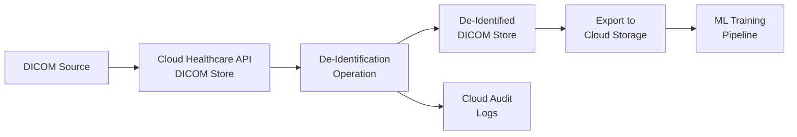

# How to De-Identify DICOM Medical Images While Preserving Clinical Utility on Google Cloud

Author: [nawazdhandala](https://www.github.com/nawazdhandala)

Tags: GCP, Healthcare API, DICOM, De-Identification, Medical Imaging, HIPAA, Google Cloud

Description: Learn how to de-identify DICOM medical images on Google Cloud Healthcare API while preserving clinical utility for research and machine learning use cases.

---

Medical images carry a surprising amount of personally identifiable information. Beyond the obvious patient name and ID baked into DICOM metadata, some modalities burn text directly onto pixel data - things like patient names on ultrasound images or demographic information on X-ray overlays. If you are building an ML pipeline for medical imaging or sharing datasets for research, you need to strip all of that out without destroying the clinical value of the images.

Google Cloud Healthcare API provides DICOM de-identification that handles both metadata tags and burned-in text detection. In this post, I will walk through the entire process of setting it up and running it.

## What Gets De-Identified in DICOM

DICOM files are essentially two parts: structured metadata (tags) and pixel data (the actual image). PHI can live in both:

- **Metadata tags**: Patient name, date of birth, medical record number, referring physician, institution name, study dates, and dozens of other fields
- **Pixel data**: Burned-in annotations that display patient info directly on the image
- **Private tags**: Vendor-specific tags that might contain PHI in non-standard ways

The Healthcare API can handle all three categories, though burned-in text detection requires additional configuration.

## Prerequisites

You will need:

- A Google Cloud project with the Healthcare API enabled
- A DICOM store with test data loaded
- Cloud DLP API enabled (for burned-in text redaction)
- Appropriate IAM roles: `healthcare.dicomStores.deidentify` and `dlp.user`

## Step 1: Set Up Source and Destination Stores

Like FHIR de-identification, DICOM de-identification creates a copy. You need a destination store for the scrubbed images.

This creates a new DICOM store to hold the de-identified output:

```bash
# Create a destination DICOM store for de-identified images
gcloud healthcare dicom-stores create deidentified-dicom-store \
  --dataset=my-dataset \
  --location=us-central1
```

## Step 2: Configure Tag-Level De-Identification

The tag-level configuration controls what happens to each DICOM metadata tag. The Healthcare API supports several tag filtering profiles.

Save this configuration as `dicom-deid-config.json`. It uses the standard DICOM de-identification profile with some customizations:

```json
{
  "dicom": {
    "filterProfile": "DEIDENTIFY_TAG_CONTENTS"
  },
  "tag_filter_profile": "DEIDENTIFY_TAG_CONTENTS",
  "image": {
    "textRedactionMode": "REDACT_ALL_TEXT"
  }
}
```

The `filterProfile` options are:

- `TAG_FILTER_PROFILE_UNSPECIFIED` - default behavior
- `MINIMAL_KEEP_LIST_PROFILE` - keeps only the minimum tags needed for valid DICOM
- `ATTRIBUTE_CONFIDENTIALITY_BASIC_PROFILE` - follows the DICOM standard Basic Confidentiality Profile
- `KEEP_ALL_PROFILE` - keeps all tags (useful when you only want pixel-level de-identification)
- `DEIDENTIFY_TAG_CONTENTS` - transforms tag contents while keeping the tags themselves

## Step 3: Handle Burned-In Text

Burned-in text is the trickiest part. Some modalities like ultrasound routinely burn patient demographics right into the pixel data. The Healthcare API uses Cloud DLP under the hood to detect and redact this text.

This expanded configuration enables both tag de-identification and burned-in text redaction:

```json
{
  "dicom": {
    "filterProfile": "DEIDENTIFY_TAG_CONTENTS",
    "keepList": {
      "tags": [
        "StudyDescription",
        "SeriesDescription",
        "Modality",
        "BodyPartExamined"
      ]
    }
  },
  "image": {
    "textRedactionMode": "REDACT_ALL_TEXT"
  },
  "text": {
    "transformations": [
      {
        "infoTypes": [
          "PERSON_NAME",
          "DATE",
          "PHONE_NUMBER",
          "LOCATION"
        ],
        "redactConfig": {}
      }
    ]
  }
}
```

Setting `textRedactionMode` to `REDACT_ALL_TEXT` tells the API to find and black out all text detected in the pixel data. This is aggressive but safe. If you want to keep some burned-in text (like laterality markers or measurement annotations), you will need to use `REDACT_SENSITIVE_TEXT` instead, which only redacts text that looks like PHI.

## Step 4: Run the De-Identification

Now kick off the operation. This Python script handles the entire process including waiting for completion:

```python
from google.cloud import healthcare_v1
import json

def deidentify_dicom_store(
    project_id, location, dataset_id, source_store, dest_store
):
    # Initialize the Healthcare API client
    client = healthcare_v1.HealthcareServiceClient()

    # Build the source DICOM store path
    source_name = (
        f"projects/{project_id}/locations/{location}"
        f"/datasets/{dataset_id}/dicomStores/{source_store}"
    )

    # Build the destination DICOM store path
    dest_name = (
        f"projects/{project_id}/locations/{location}"
        f"/datasets/{dataset_id}/dicomStores/{dest_store}"
    )

    # Define the de-identification configuration
    config = {
        "dicom": {
            "filterProfile": "DEIDENTIFY_TAG_CONTENTS"
        },
        "image": {
            "textRedactionMode": "REDACT_ALL_TEXT"
        }
    }

    # Build and execute the request
    request = healthcare_v1.DeidentifyDicomStoreRequest(
        source_store=source_name,
        destination_store=dest_name,
        config=config,
    )

    operation = client.deidentify_dicom_store(request=request)

    # Wait for the operation to complete (can take a while for large stores)
    print("De-identification in progress...")
    result = operation.result(timeout=3600)

    print(f"De-identification complete: {result}")
    return result

# Run it
deidentify_dicom_store(
    "my-project",
    "us-central1",
    "my-dataset",
    "my-dicom-store",
    "deidentified-dicom-store"
)
```

## Step 5: Verify the Results

Verification is critical. You should check both metadata and pixel data.

This script retrieves a study from both the original and de-identified stores for comparison:

```bash
# Fetch metadata from the original store
curl -X GET \
  -H "Authorization: Bearer $(gcloud auth print-access-token)" \
  "https://healthcare.googleapis.com/v1/projects/MY_PROJECT/locations/us-central1/datasets/my-dataset/dicomStores/my-dicom-store/dicomWeb/studies?limit=1&includefield=PatientName&includefield=PatientID"

# Fetch the same study from the de-identified store
curl -X GET \
  -H "Authorization: Bearer $(gcloud auth print-access-token)" \
  "https://healthcare.googleapis.com/v1/projects/MY_PROJECT/locations/us-central1/datasets/my-dataset/dicomStores/deidentified-dicom-store/dicomWeb/studies?limit=1&includefield=PatientName&includefield=PatientID"
```

For pixel data verification, retrieve the actual images and visually inspect them, especially for modalities known to have burned-in text.

## De-Identification Pipeline Architecture

For production use, you will want to automate this as part of a pipeline:



## Preserving Clinical Utility

The whole point of careful de-identification configuration is keeping the data useful. Here are the key clinical attributes you typically want to preserve:

- **Modality and body part** - needed for any classification model
- **Study and series descriptions** - contain clinical context
- **Image dimensions and spacing** - critical for measurements
- **Window center and width** - needed for proper display
- **Relative dates** - shifted but preserving intervals between studies

Use the `keepList` in your configuration to explicitly preserve these tags while scrubbing everything else.

## Cost Considerations

DICOM de-identification pricing includes the Healthcare API operation cost plus Cloud DLP costs if you enable burned-in text detection. For large imaging datasets, the DLP component can add up quickly. If your modalities do not typically have burned-in text (like MRI or CT without overlay), you can skip the pixel-level de-identification to save costs and just focus on metadata.

## Summary

De-identifying DICOM images on Google Cloud requires attention to both metadata tags and pixel data. The Healthcare API handles the heavy lifting, but you need to pick the right configuration for your modalities and use case. Always verify the output visually for burned-in text scenarios, and build the de-identification step into your data pipeline so it runs automatically before any data reaches your research or ML environments.
