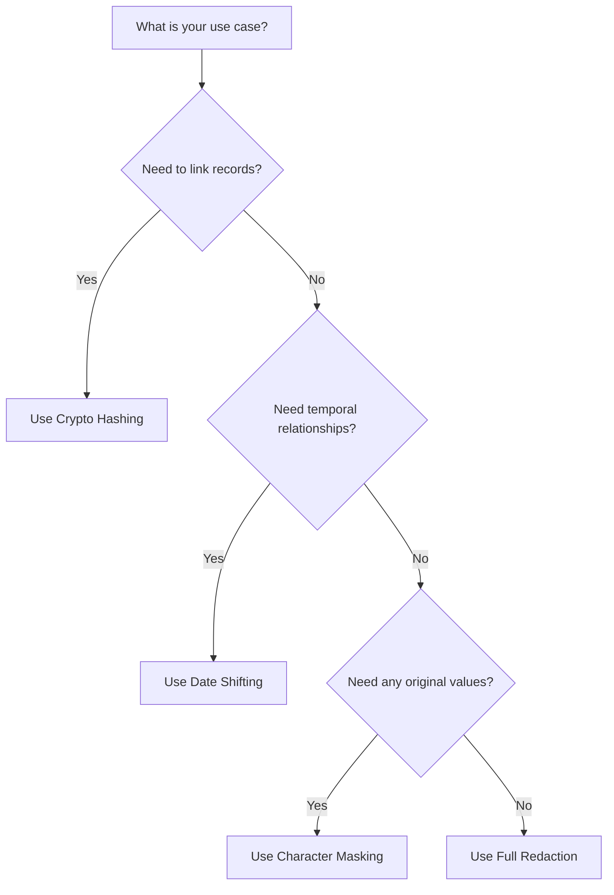

# How to De-Identify Protected Health Information in FHIR Resources Using Healthcare API

Author: [nawazdhandala](https://www.github.com/nawazdhandala)

Tags: GCP, Healthcare API, FHIR, De-Identification, HIPAA, PHI, Google Cloud

Description: Learn how to de-identify protected health information in FHIR resources using Google Cloud Healthcare API to maintain HIPAA compliance while enabling data analysis.

---

Working with healthcare data means constantly balancing two competing needs: you want rich, detailed patient data for analytics and research, but you also need to protect patient privacy under regulations like HIPAA. Google Cloud Healthcare API offers built-in de-identification capabilities for FHIR resources that let you strip or transform PHI while keeping the data useful for downstream analysis.

In this guide, I will walk through the process of setting up and running FHIR de-identification on Google Cloud, including configuring the de-identification rules, running the operation, and verifying the results.

## Prerequisites

Before you start, make sure you have the following ready:

- A Google Cloud project with billing enabled
- The Cloud Healthcare API enabled on your project
- A FHIR store with some sample data loaded
- The `gcloud` CLI installed and authenticated
- IAM permissions for `healthcare.fhirStores.deidentify`

## Understanding FHIR De-Identification

FHIR de-identification in Google Cloud Healthcare API works by creating a copy of your FHIR store with PHI removed or transformed. The original data stays untouched. You control exactly what happens through a de-identification configuration that specifies how different types of data should be handled.

There are several strategies available:

- **Date shifting** - shifts dates by a random amount while preserving relative time differences between events for the same patient
- **Crypto hashing** - replaces identifiers with cryptographic hashes, allowing consistent linking across resources without exposing real IDs
- **Redaction** - completely removes sensitive fields
- **Character masking** - replaces characters with a fixed masking character

## Step 1: Create a Destination FHIR Store

First, you need a destination store where the de-identified data will land. This keeps your original data separate from the scrubbed copy.

The following command creates a new FHIR store in the same dataset to hold the de-identified output:

```bash
# Create a destination FHIR store for de-identified data
gcloud healthcare fhir-stores create deidentified-fhir-store \
  --dataset=my-dataset \
  --location=us-central1 \
  --version=R4
```

## Step 2: Define the De-Identification Configuration

The configuration is where you specify exactly how PHI should be handled. Here is a JSON configuration that combines several strategies for thorough de-identification.

This configuration file tells the API to shift dates, hash identifiers, and redact text fields that might contain PHI:

```json
{
  "fhir": {
    "defaultKeepExtensions": true
  },
  "text": {
    "transformations": [
      {
        "infoTypes": [],
        "redactConfig": {}
      }
    ]
  },
  "useRegionalDataProcessing": true
}
```

For more granular control, you can create a detailed configuration that specifies behavior per FHIR resource type. Save this as `deidentify-config.json`:

```json
{
  "fhir": {
    "defaultKeepExtensions": true,
    "fieldMetadataList": [
      {
        "paths": [
          "Patient.name",
          "Patient.address",
          "Patient.telecom",
          "Patient.birthDate"
        ],
        "action": "TRANSFORM"
      },
      {
        "paths": [
          "Patient.identifier"
        ],
        "action": "INSPECT_AND_TRANSFORM"
      }
    ]
  },
  "dateShiftConfig": {
    "cryptoHashConfig": {
      "cryptoKey": "YOUR_BASE64_ENCODED_KEY"
    }
  }
}
```

## Step 3: Generate a Crypto Key for Consistent Hashing

If you want date shifting to be consistent for the same patient across runs, you need to provide a crypto key. This ensures the same patient always gets the same date shift amount.

This command generates a base64-encoded key suitable for the crypto hash config:

```bash
# Generate a random 256-bit key and base64 encode it
openssl rand -base64 32
```

Take the output and plug it into the `cryptoKey` field in your configuration.

## Step 4: Run the De-Identification Operation

Now you can kick off the de-identification. This is a long-running operation, so the API returns an operation ID you can poll for status.

The following curl command triggers the de-identification, pointing to your source store and destination store:

```bash
# Run the de-identification operation via the REST API
curl -X POST \
  -H "Authorization: Bearer $(gcloud auth print-access-token)" \
  -H "Content-Type: application/json" \
  -d @deidentify-config.json \
  "https://healthcare.googleapis.com/v1/projects/MY_PROJECT/locations/us-central1/datasets/my-dataset/fhirStores/my-fhir-store:deidentify" \
  --data '{
    "destinationStore": "projects/MY_PROJECT/locations/us-central1/datasets/my-dataset/fhirStores/deidentified-fhir-store",
    "config": '"$(cat deidentify-config.json)"'
  }'
```

Alternatively, you can use the Python client library for a cleaner approach.

This Python script runs the de-identification and waits for the operation to finish:

```python
from google.cloud import healthcare_v1

def deidentify_fhir_store(
    project_id, location, dataset_id, source_store, dest_store, config_file
):
    # Initialize the Healthcare API client
    client = healthcare_v1.HealthcareServiceClient()

    # Build the source FHIR store path
    source_name = (
        f"projects/{project_id}/locations/{location}"
        f"/datasets/{dataset_id}/fhirStores/{source_store}"
    )

    # Build the destination FHIR store path
    dest_name = (
        f"projects/{project_id}/locations/{location}"
        f"/datasets/{dataset_id}/fhirStores/{dest_store}"
    )

    # Create the de-identification request
    request = healthcare_v1.DeidentifyFhirStoreRequest(
        source_store=source_name,
        destination_store=dest_name,
    )

    # Execute and wait for the operation to complete
    operation = client.deidentify_fhir_store(request=request)
    result = operation.result(timeout=600)

    print(f"De-identification complete. Resources processed: {result}")
    return result

# Run the de-identification
deidentify_fhir_store(
    "my-project",
    "us-central1",
    "my-dataset",
    "my-fhir-store",
    "deidentified-fhir-store",
    "deidentify-config.json"
)
```

## Step 5: Verify the De-Identified Data

After the operation completes, you should spot-check the results to make sure PHI was properly removed.

This command fetches a patient resource from the de-identified store so you can inspect it:

```bash
# Retrieve a patient resource from the de-identified store to verify
curl -X GET \
  -H "Authorization: Bearer $(gcloud auth print-access-token)" \
  "https://healthcare.googleapis.com/v1/projects/MY_PROJECT/locations/us-central1/datasets/my-dataset/fhirStores/deidentified-fhir-store/fhir/Patient?_count=1"
```

Check that names are removed or hashed, dates are shifted, and addresses are scrubbed. Compare against the same patient in the original store to confirm the transformation worked.

## Common De-Identification Patterns

Here is a quick overview of which strategy to pick depending on your use case:



## Handling Edge Cases

A few things to watch out for:

- **Unstructured text fields**: FHIR resources can contain free-text clinical notes in fields like `Observation.note`. The text transformation configuration handles these, but you should verify that NLP-based de-identification catches all PHI in narrative text.
- **Extensions**: Custom FHIR extensions might contain PHI that the default rules do not cover. Set `defaultKeepExtensions` to `false` if you are unsure what your extensions contain.
- **Cross-references**: De-identified resources maintain internal references, but make sure references to external systems are also handled.

## Monitoring and Audit

For compliance purposes, you should log every de-identification operation. Cloud Audit Logs captures Healthcare API operations automatically, but you can also set up a Cloud Monitoring alert for de-identification failures.

This gcloud command checks the status of a de-identification operation:

```bash
# Check the operation status
gcloud healthcare operations describe OPERATION_ID \
  --dataset=my-dataset \
  --location=us-central1
```

## Wrapping Up

De-identifying FHIR resources on Google Cloud is straightforward once you understand the configuration options. The key decisions are choosing between redaction, hashing, date shifting, and masking based on your analytics requirements. Always verify the output, especially for unstructured text fields where PHI can hide in unexpected places. And remember, de-identification is just one layer of your compliance strategy - pair it with proper access controls, encryption, and audit logging for a complete HIPAA-compliant setup.
