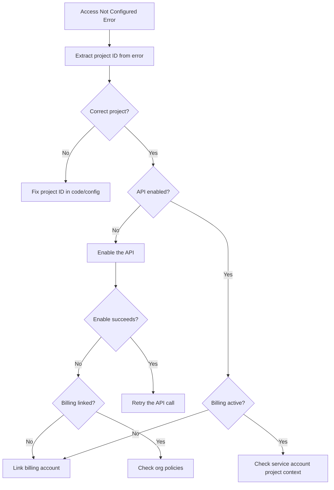

# How to Debug Access Not Configured Errors for Google Cloud APIs

Author: [nawazdhandala](https://www.github.com/nawazdhandala)

Tags: GCP, Cloud APIs, Access Configuration, Troubleshooting, Project Setup

Description: Diagnose and fix Access Not Configured errors for Google Cloud APIs, including enabling APIs, configuring billing, setting up credentials, and resolving project-level issues.

---

You call a Google Cloud API and get back an "Access Not Configured" error. Despite having what seems like the right permissions and a properly authenticated service account, the API refuses your request. This error is distinct from permission denied errors - it means the API itself is not set up for use in your project.

Let me walk through all the reasons this happens and how to fix each one.

## The Error

The error comes in several forms:

```
{
  "error": {
    "code": 403,
    "message": "Access Not Configured. Compute Engine API has not been used in project 123456789 before or it is disabled. Enable it by visiting https://console.developers.google.com/apis/api/compute.googleapis.com/overview?project=123456789 then retry.",
    "status": "PERMISSION_DENIED"
  }
}
```

Or from gcloud:

```
ERROR: (gcloud.compute.instances.list) HttpError accessing
https://compute.googleapis.com/...:
Access Not Configured. Cloud Resource Manager API has not been used in project
my-project before or it is disabled.
```

The key phrase is "has not been used in project before or it is disabled." This is different from an IAM permission error.

## Cause 1: API Not Enabled

The most common cause. GCP requires you to explicitly enable each API before use.

```bash
# Check if the specific API is enabled
gcloud services list --enabled \
    --filter="name:compute.googleapis.com" \
    --project=my-project

# If empty, the API is not enabled
# Enable it
gcloud services enable compute.googleapis.com --project=my-project
```

Common APIs and their service names:

```bash
# Enable multiple commonly needed APIs at once
gcloud services enable \
    compute.googleapis.com \
    container.googleapis.com \
    run.googleapis.com \
    cloudfunctions.googleapis.com \
    sqladmin.googleapis.com \
    storage.googleapis.com \
    bigquery.googleapis.com \
    pubsub.googleapis.com \
    secretmanager.googleapis.com \
    cloudresourcemanager.googleapis.com \
    iam.googleapis.com \
    monitoring.googleapis.com \
    logging.googleapis.com \
    cloudbuild.googleapis.com \
    artifactregistry.googleapis.com \
    --project=my-project
```

## Cause 2: Wrong Project

Your API call might be going to a different project than you think. This happens surprisingly often when you have multiple projects.

```bash
# Check which project gcloud is configured to use
gcloud config get-value project

# Check the active configuration
gcloud config configurations list

# Set the correct project
gcloud config set project my-correct-project
```

In application code, check the project ID:

```python
# Python - verify the project being used
from google.cloud import compute_v1

# Explicitly specify the project
client = compute_v1.InstancesClient()
instances = client.list(project="my-correct-project", zone="us-central1-a")

# Or check what project the client defaults to
import google.auth
credentials, project = google.auth.default()
print(f"Default project: {project}")
```

## Cause 3: Billing Not Enabled

Many APIs require an active billing account. Even if the API is enabled, it will not work without billing:

```bash
# Check if billing is linked to the project
gcloud billing projects describe my-project

# If billingEnabled is false, link a billing account
gcloud billing accounts list
gcloud billing projects link my-project \
    --billing-account=0X0X0X-0X0X0X-0X0X0X
```

## Cause 4: Service Account Using Wrong Project

If your service account is in one project but you are trying to access APIs in another project, the API must be enabled in the target project:

```bash
# Service account is in project-a
# You are calling APIs in project-b
# The API must be enabled in project-b

gcloud services enable compute.googleapis.com --project=project-b

# And the service account needs IAM permissions in project-b
gcloud projects add-iam-binding project-b \
    --member="serviceAccount:my-sa@project-a.iam.gserviceaccount.com" \
    --role="roles/compute.viewer"
```

## Cause 5: API Was Disabled

Someone might have intentionally or accidentally disabled the API:

```bash
# List recently disabled APIs (check audit logs)
gcloud logging read \
    'protoPayload.methodName="google.api.serviceusage.v1.ServiceUsage.DisableService"' \
    --project=my-project \
    --limit=10 \
    --format="table(timestamp, protoPayload.request.name)"
```

Re-enable it:

```bash
gcloud services enable compute.googleapis.com --project=my-project
```

## Cause 6: Organization Policy Restrictions

Your organization might restrict which APIs can be enabled:

```bash
# Check for service restriction policies
gcloud resource-manager org-policies describe \
    constraints/serviceuser.services \
    --project=my-project 2>/dev/null

# Check for API restrictions
gcloud resource-manager org-policies describe \
    constraints/gcp.restrictServiceUsage \
    --project=my-project 2>/dev/null
```

If an org policy blocks the API, you need to work with your organization admin.

## Cause 7: API Key Restrictions

If you are using an API key (for public APIs like Maps), the key might have API restrictions:

```bash
# List API keys and their restrictions
gcloud services api-keys list --project=my-project
gcloud services api-keys get-key-string KEY_ID --project=my-project
```

Update API key restrictions in the Console under APIs and Services, then Credentials.

## Debugging Workflow

Here is the systematic approach:



## Terraform Prevention

Prevent this error in infrastructure-as-code by always enabling required APIs:

```hcl
# Define all required APIs as a variable
variable "required_apis" {
  default = [
    "compute.googleapis.com",
    "container.googleapis.com",
    "run.googleapis.com",
    "sqladmin.googleapis.com",
    "storage.googleapis.com",
    "monitoring.googleapis.com",
    "logging.googleapis.com",
    "iam.googleapis.com",
    "cloudresourcemanager.googleapis.com",
  ]
}

# Enable all required APIs
resource "google_project_service" "apis" {
  for_each = toset(var.required_apis)
  project  = var.project_id
  service  = each.value

  # Keep APIs enabled even if Terraform is destroyed
  disable_on_destroy = false

  # Wait for API to be fully enabled before other resources use it
  timeouts {
    create = "5m"
  }
}

# Make other resources depend on API enablement
resource "google_compute_instance" "my_vm" {
  # This ensures the Compute API is enabled first
  depends_on = [google_project_service.apis]

  name         = "my-vm"
  machine_type = "e2-medium"
  zone         = "us-central1-a"

  boot_disk {
    initialize_params {
      image = "debian-cloud/debian-11"
    }
  }
  network_interface {
    network = "default"
  }
}
```

## Quick Diagnostic Script

```bash
#!/bin/bash
# Diagnose "Access Not Configured" errors
# Usage: ./diagnose-access.sh <project-id> <api-name>

PROJECT=$1
API=$2

echo "Project: $PROJECT"
echo "API: $API"
echo ""

echo "=== API Status ==="
gcloud services list --enabled \
    --filter="name:$API" \
    --project=$PROJECT --format="value(name)" 2>&1
STATUS=$?
if [ $STATUS -ne 0 ] || [ -z "$(gcloud services list --enabled --filter="name:$API" --project=$PROJECT --format="value(name)" 2>/dev/null)" ]; then
    echo "NOT ENABLED - Run: gcloud services enable $API --project=$PROJECT"
else
    echo "ENABLED"
fi

echo ""
echo "=== Billing Status ==="
gcloud billing projects describe $PROJECT \
    --format="value(billingEnabled)" 2>&1

echo ""
echo "=== Active Project in gcloud ==="
gcloud config get-value project 2>&1

echo ""
echo "=== Org Policy Check ==="
gcloud resource-manager org-policies describe \
    constraints/gcp.restrictServiceUsage \
    --project=$PROJECT 2>&1 || echo "No org policy restriction found"
```

The "Access Not Configured" error is almost always just an API that needs to be enabled. Check the project ID in the error message, enable the API, and retry. If the enable fails, it is usually a billing or org policy issue. Build API enablement into your project setup automation and you will rarely see this error in production.
