# How to Debug Apigee Proxy Runtime Errors Using the Trace Tool

Author: [nawazdhandala](https://www.github.com/nawazdhandala)

Tags: Apigee, GCP, Debugging, Trace Tool, API Troubleshooting

Description: Learn how to use the Apigee Trace tool to diagnose and fix runtime errors in your API proxies by inspecting request and response flows step by step.

---

When an Apigee proxy returns unexpected errors, the Trace tool is your best friend. It captures every step of the request-response cycle - every policy execution, every variable assignment, every conditional evaluation - and lets you replay it in a visual timeline. Instead of guessing why a 500 error happened, you can see exactly which policy failed, what variables were set, and what the backend returned.

## Accessing the Trace Tool

You can access the Trace tool through the Apigee Console or the Apigee API.

### Through the Console

1. Navigate to Apigee in the GCP Console
2. Go to Develop > API Proxies
3. Select your proxy
4. Click the "Debug" tab (previously called "Trace")
5. Select the environment and revision
6. Click "Start Debug Session"

### Through the API

Start a debug session programmatically:

```bash
# Start a debug session
curl -X POST \
  "https://apigee.googleapis.com/v1/organizations/YOUR_ORG/environments/prod/apis/your-proxy/revisions/1/debugsessions" \
  -H "Authorization: Bearer $(gcloud auth print-access-token)" \
  -H "Content-Type: application/json" \
  -d '{
    "timeout": 300,
    "count": 10
  }'
```

The `timeout` is in seconds (how long the session stays active) and `count` is the maximum number of transactions to capture.

## Understanding the Trace Output

When a trace session is active, every request that hits your proxy is captured. The trace shows:

```mermaid
graph LR
    A[Request Received] --> B[ProxyEndpoint PreFlow]
    B --> C[Conditional Flows]
    C --> D[ProxyEndpoint PostFlow]
    D --> E[Route Rule Evaluation]
    E --> F[TargetEndpoint PreFlow]
    F --> G[Target Request Sent]
    G --> H[Target Response Received]
    H --> I[TargetEndpoint PostFlow]
    I --> J[ProxyEndpoint Response]
    J --> K[Response Sent]
```



At each step, you can inspect:
- **Headers** - all request and response headers
- **Variables** - flow variables and their values
- **Policy execution** - whether each policy succeeded or failed
- **Timing** - how long each step took
- **Payload** - request and response bodies

## Common Error Scenarios and How to Trace Them

### Scenario 1: 500 Internal Server Error

A 500 error usually means something went wrong in the proxy itself (not the backend). Here is how to trace it.

Start a debug session and send the failing request:

```bash
# Send the request that produces the error
curl -v "https://YOUR_APIGEE_HOST/api/failing-endpoint" \
  -H "x-api-key: YOUR_KEY"
```

In the trace output, look for:

1. **Red nodes** in the flow diagram - these indicate where the error occurred
2. **Error variables** - check `error.message`, `error.status.code`, and `fault.name`
3. **Policy failures** - any policy with an error icon

Common causes of 500 errors:
- JavaScript policy with a runtime exception
- ServiceCallout policy that failed to reach the target
- ExtractVariables policy that could not find the expected data

### Scenario 2: Wrong Response from Backend

Sometimes the proxy works fine but the backend returns unexpected data. The trace shows you exactly what the backend sent.

In the trace, click on the "Target Response" node and examine:
- Response status code from the backend
- Response headers
- Response body

Compare this with what you expected. You might find:
- The backend returned a different content type
- The response body structure changed
- An error from the backend that the proxy is not handling

### Scenario 3: Policy Not Executing

If a policy seems to be skipped, check the conditions.

In the trace, look at each flow step:
- **Green checkmark** means the policy executed successfully
- **Gray dash** means the policy was skipped (condition evaluated to false)
- **Red X** means the policy failed

Click on a skipped policy to see its condition and why it evaluated to false. The trace shows the actual values of all variables used in the condition.

## Inspecting Variables in the Trace

Flow variables are the glue of Apigee proxies. They carry data between policies. The trace lets you see every variable at every step.

Click on any node in the trace to see variables:

```
# Common variables to check:
request.header.x-api-key = "abc123"
client_id = "app123"
proxy.pathsuffix = "/users/42"
request.verb = "GET"
target.url = "https://backend.example.com/users/42"
response.status.code = "200"
response.header.content-type = "application/json"
```

If a variable has an unexpected value, trace backward through the flow to see where it was set.

## Filtering Trace Data

When your proxy handles many requests, you can filter the trace to capture only specific ones.

### Filter by Header

Only trace requests with a specific header:

```bash
# Start a filtered debug session
curl -X POST \
  "https://apigee.googleapis.com/v1/organizations/YOUR_ORG/environments/prod/apis/your-proxy/revisions/1/debugsessions" \
  -H "Authorization: Bearer $(gcloud auth print-access-token)" \
  -H "Content-Type: application/json" \
  -d '{
    "timeout": 300,
    "count": 10,
    "filter": "request.header.x-debug = \"true\""
  }'
```

Then include the header in your test request:

```bash
curl "https://YOUR_APIGEE_HOST/api/endpoint" \
  -H "x-api-key: YOUR_KEY" \
  -H "x-debug: true"
```

### Filter by Query Parameter

```bash
# Only trace requests to a specific path
curl -X POST \
  "https://apigee.googleapis.com/v1/organizations/YOUR_ORG/environments/prod/apis/your-proxy/revisions/1/debugsessions" \
  -H "Authorization: Bearer $(gcloud auth print-access-token)" \
  -H "Content-Type: application/json" \
  -d '{
    "timeout": 300,
    "filter": "proxy.pathsuffix = \"/users/42\""
  }'
```

## Debugging JavaScript Policy Errors

JavaScript policies are a common source of runtime errors. The trace shows the error message but not the stack trace. Here is how to debug them effectively.

Add logging to your JavaScript policy:

```javascript
// apiproxy/resources/jsc/transform-response.js
try {
  var responseBody = context.getVariable("response.content");
  print("Response body: " + responseBody); // Shows in trace

  var data = JSON.parse(responseBody);
  print("Parsed successfully, keys: " + Object.keys(data).join(", "));

  // Transform the response
  var transformed = {
    results: data.items || [],
    count: (data.items || []).length,
    timestamp: new Date().toISOString()
  };

  context.setVariable("response.content", JSON.stringify(transformed));
  print("Transformation complete");
} catch (e) {
  // Log the error details
  print("ERROR: " + e.message);
  print("Stack: " + e.stack);

  // Set error variables that you can check in the trace
  context.setVariable("js.error", e.message);
  context.setVariable("js.error.line", e.lineNumber || "unknown");
}
```

The `print()` statements appear in the trace under the JavaScript policy node, making it easy to see where things went wrong.

## Debugging ServiceCallout Failures

ServiceCallout policies make HTTP requests to external services. When they fail, the trace shows the callout request and response.

Check these in the trace:
- `servicecallout.POLICY_NAME.target.url` - the URL that was called
- `servicecallout.POLICY_NAME.response.status.code` - the response code
- `servicecallout.POLICY_NAME.response.content` - the response body

If the callout timed out:
- `servicecallout.POLICY_NAME.failed` will be `true`
- Check the timeout settings in the policy

## Downloading Trace Data

You can download trace data for offline analysis or sharing with teammates:

```bash
# List debug sessions
curl "https://apigee.googleapis.com/v1/organizations/YOUR_ORG/environments/prod/apis/your-proxy/revisions/1/debugsessions" \
  -H "Authorization: Bearer $(gcloud auth print-access-token)"

# Get trace data for a specific session
curl "https://apigee.googleapis.com/v1/organizations/YOUR_ORG/environments/prod/apis/your-proxy/revisions/1/debugsessions/SESSION_ID/data" \
  -H "Authorization: Bearer $(gcloud auth print-access-token)" \
  -o trace-data.json
```

## Best Practices for Debugging

1. **Always start with the trace** before modifying policies. Understand the current behavior first.

2. **Check the timing** at each step. If the backend is slow, you will see a long gap at the target request node. If a policy is slow, its execution time will be highlighted.

3. **Use custom flow variables as breadcrumbs.** Add AssignMessage policies that set debug variables at key points in your flow.

4. **Do not leave debug sessions running in production.** They add overhead. Use short timeouts and capture only what you need.

5. **Compare working and broken requests side by side.** If the same proxy works for some requests and fails for others, compare the traces to find what is different.

6. **Check the error flow, not just the main flow.** When an error occurs, execution jumps to the FaultRules. The trace shows this path separately.

## Summary

The Apigee Trace tool is the most powerful debugging tool in your API management toolkit. It captures every policy execution, variable assignment, and timing detail for each request. Start a debug session, send your failing request, and follow the trace through the flow to find exactly where and why the error occurs. Use filters to narrow down the captured traffic, print statements in JavaScript policies for additional context, and always check both the main flow and fault flow. With the trace tool, most proxy issues go from "mysterious 500 error" to "fixed in 15 minutes."
