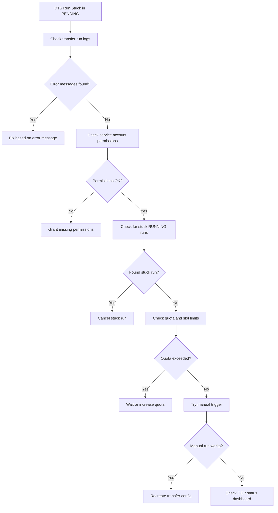

# How to Debug BigQuery Data Transfer Service Runs Stuck in Pending State

Author: [nawazdhandala](https://www.github.com/nawazdhandala)

Tags: GCP, BigQuery, Data Transfer Service, ETL, Data Pipelines, Troubleshooting

Description: Step-by-step guide to diagnosing and resolving BigQuery Data Transfer Service runs that get stuck in pending state and never complete.

---

You set up a BigQuery Data Transfer Service (DTS) run, and it just sits there in "PENDING" state. Minutes pass, then hours. The data never arrives. This is one of those issues where the UI gives you almost no information about what went wrong, and you have to dig around to figure it out. I have dealt with this enough times to know the usual suspects.

## What Pending State Means

When a DTS run shows PENDING, it means the transfer has been queued but has not started executing. This is different from RUNNING (actively transferring data) or FAILED (attempted and errored out). Pending typically means something is blocking the run from even starting.

## Common Causes

Here are the most frequent reasons a DTS run gets stuck in pending:

1. Service account permissions were revoked or changed
2. The source system is unreachable or has changed credentials
3. Quota limits on concurrent transfers have been reached
4. The BigQuery reservation or slot capacity is exhausted
5. A previous run for the same config is still in progress
6. Regional service outages affecting the DTS backend

## Step 1: Check the Transfer Run Status and Logs

Start by getting the detailed status of your transfer configuration and its recent runs.

```bash
# List recent runs for a specific transfer config
bq ls --transfer_run \
    --run_attempt=LATEST \
    --max_results=10 \
    projects/my-project/locations/us/transferConfigs/abc123def456
```

This shows you the state of each run. Look for any runs with the state stuck on PENDING.

```bash
# Get detailed information about a specific run
bq show --format=prettyjson \
    projects/my-project/locations/us/transferConfigs/abc123def456/runs/6789xyz
```

The output includes error messages and status details that the UI sometimes hides.

## Step 2: Check Transfer Run Messages in the Logs

The transfer log messages often contain the actual reason the run cannot start.

```bash
# Fetch transfer run log messages
bq ls --transfer_log \
    --message_type=messageTypes:ERROR,WARNING \
    projects/my-project/locations/us/transferConfigs/abc123def456/runs/6789xyz
```

Also check Cloud Logging for more verbose information:

```bash
# Query Cloud Logging for DTS-related errors
gcloud logging read \
    'resource.type="bigquery_dts_config" AND severity>=WARNING' \
    --project=my-project \
    --limit=25 \
    --format="table(timestamp, severity, textPayload)"
```

## Step 3: Verify Service Account Permissions

DTS uses a service account to execute transfers. If the permissions were modified, transfers will queue up but never run.

```bash
# Check the transfer config to see which service account it uses
bq show --format=prettyjson \
    projects/my-project/locations/us/transferConfigs/abc123def456 | \
    grep -E "serviceAccount|email"
```

Make sure the service account has these roles at minimum:

- `roles/bigquery.admin` on the destination project
- Source-specific permissions (varies by data source)

```bash
# Verify the service account's IAM bindings
gcloud projects get-iam-policy my-project \
    --flatten="bindings[].members" \
    --filter="bindings.members:serviceAccount:my-transfer-sa@my-project.iam.gserviceaccount.com" \
    --format="table(bindings.role)"
```

## Step 4: Check for Stuck Previous Runs

A common cause is a previous run that is still marked as RUNNING, which blocks subsequent runs for the same configuration. DTS typically only allows one active run per config.

```bash
# List all runs and look for any in RUNNING state
bq ls --transfer_run \
    --run_attempt=LATEST \
    --max_results=50 \
    projects/my-project/locations/us/transferConfigs/abc123def456 | grep RUNNING
```

If you find a stuck RUNNING transfer, you can cancel it:

```bash
# Cancel a stuck run using the REST API through gcloud
curl -X POST \
    -H "Authorization: Bearer $(gcloud auth print-access-token)" \
    "https://bigquerydatatransfer.googleapis.com/v1/projects/my-project/locations/us/transferConfigs/abc123def456/runs/stuck-run-id:cancel"
```

## Step 5: Check Quota and Concurrent Transfer Limits

BigQuery DTS has limits on concurrent transfers. If you have too many running at once, new ones will queue.

```bash
# Check your current DTS quota usage
gcloud services list --enabled --filter="bigquerydatatransfer" --project=my-project

# View quota metrics in Cloud Monitoring
gcloud monitoring metrics list --filter="metric.type=bigquerydatatransfer.googleapis.com"
```

You can also check this in the Google Cloud Console under IAM and Admin, then Quotas. Filter for "BigQuery Data Transfer" to see your limits and current usage.

## Step 6: Verify Slot Availability

Some transfer types, especially cross-region copies, require BigQuery slots to execute. If all your slots are consumed by queries, transfers will wait.

```bash
# Check your reservation and slot usage
bq ls --reservation --location=us --project=my-project
bq ls --reservation_assignment --location=us --project=my-project

# Check current slot utilization from INFORMATION_SCHEMA
bq query --use_legacy_sql=false '
SELECT
  period_start,
  period_slot_ms,
  project_id,
  job_type
FROM
  `region-us`.INFORMATION_SCHEMA.JOBS_TIMELINE
WHERE
  period_start > TIMESTAMP_SUB(CURRENT_TIMESTAMP(), INTERVAL 1 HOUR)
ORDER BY period_start DESC
LIMIT 20'
```

## Step 7: Try Manually Triggering a Run

Sometimes the scheduler gets stuck but a manual trigger works. This helps narrow down whether the issue is with scheduling or with the actual transfer.

```bash
# Trigger a manual run for a specific date
bq mk --transfer_run \
    --run_time="2026-02-17T00:00:00Z" \
    projects/my-project/locations/us/transferConfigs/abc123def456
```

If the manual run starts and completes, the issue is likely with the scheduler, and you may need to update the transfer configuration.

## Step 8: Recreate the Transfer Configuration

If nothing else works, the transfer configuration itself might be in a bad state. Create a new one and disable the old one.

```bash
# Disable the problematic transfer config
bq update --transfer_config \
    --disabled=true \
    projects/my-project/locations/us/transferConfigs/abc123def456

# Create a new transfer config with the same parameters
bq mk --transfer_config \
    --project_id=my-project \
    --data_source=google_cloud_storage \
    --target_dataset=my_dataset \
    --display_name="GCS to BQ Transfer (recreated)" \
    --schedule="every 24 hours" \
    --params='{
        "data_path_template":"gs://my-bucket/data/*.csv",
        "destination_table_name_template":"my_table",
        "file_format":"CSV"
    }'
```

## Diagnostic Flowchart

Here is a visual summary of the debugging approach:



## Setting Up Monitoring

To catch these issues early, set up an alert for when transfers stay in PENDING too long.

```bash
# Create an alert policy for long-pending transfers
gcloud alpha monitoring policies create \
    --display-name="DTS Run Stuck in Pending" \
    --condition-display-name="Transfer pending > 30 min" \
    --condition-filter='resource.type="bigquery_dts_config" AND metric.type="bigquerydatatransfer.googleapis.com/transfer_run_count" AND metric.labels.state="PENDING"' \
    --duration="1800s" \
    --notification-channels=projects/my-project/notificationChannels/12345
```

Most stuck PENDING runs come down to permissions or a stuck previous run. Start with those two checks, and you will resolve the issue quickly in the majority of cases.
