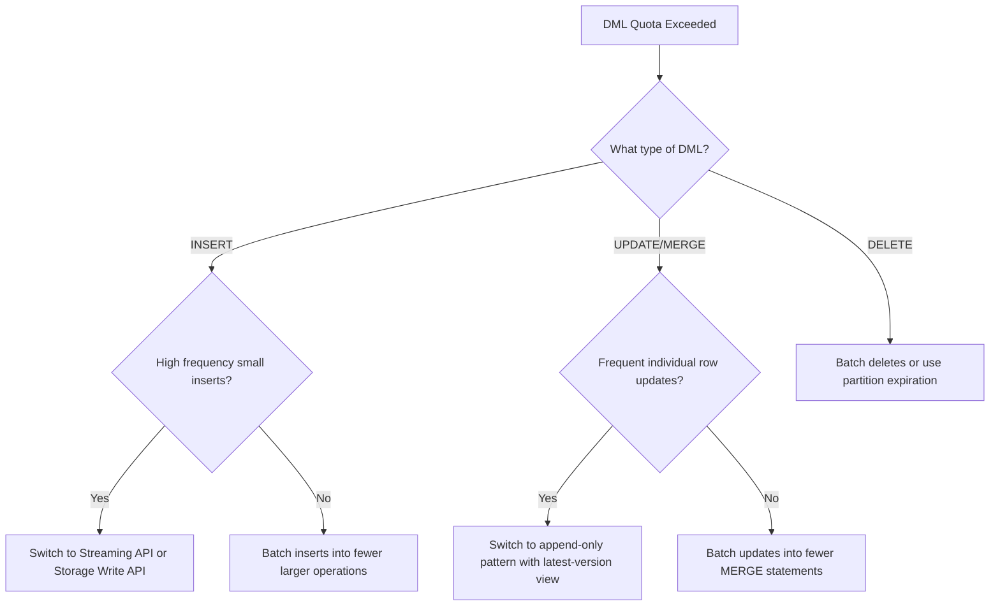

# How to Debug BigQuery DML Quota Exceeded Errors for High-Frequency Table Updates

Author: [nawazdhandala](https://www.github.com/nawazdhandala)

Tags: GCP, BigQuery, DML, Quotas, Table Updates, Data Engineering

Description: Diagnose and fix BigQuery DML quota exceeded errors when running high-frequency INSERT, UPDATE, DELETE, or MERGE operations on tables.

---

You have a pipeline that updates a BigQuery table frequently - maybe every few minutes or even every few seconds - and suddenly you start getting "Exceeded rate limits: too many table dml insert operations for this table" errors. BigQuery has strict quotas on DML (Data Manipulation Language) operations, and hitting them is a common problem when you try to use BigQuery like a transactional database.

Let me explain the quotas, why they exist, and how to architect your data pipelines to work within them.

## Understanding BigQuery DML Quotas

BigQuery imposes limits on how many DML operations you can run against a single table in a given time period. As of the current limits:

- **INSERT DML statements**: 1,500 per table per day
- **UPDATE/DELETE/MERGE DML statements**: 20 per table per day for on-demand pricing, higher for flat-rate
- **Combined DML statements**: Various limits depending on the operation type

These limits exist because BigQuery is a columnar analytics engine, not an OLTP database. Each DML operation rewrites entire column files, which is expensive.

Check your current DML usage.

```sql
-- Count DML operations per table in the last 24 hours
SELECT
  destination_table.table_id,
  statement_type,
  COUNT(*) as operation_count
FROM `region-us`.INFORMATION_SCHEMA.JOBS_BY_PROJECT
WHERE creation_time > TIMESTAMP_SUB(CURRENT_TIMESTAMP(), INTERVAL 24 HOUR)
  AND job_type = 'QUERY'
  AND statement_type IN ('INSERT', 'UPDATE', 'DELETE', 'MERGE')
  AND state = 'DONE'
GROUP BY destination_table.table_id, statement_type
ORDER BY operation_count DESC;
```

## Common Scenarios That Hit DML Quotas

### Scenario 1 - Micro-Batch Inserts

You have a process that inserts small batches of rows every minute.

```python
# Bad: inserting a small batch every minute = 1440 DML inserts per day
# This will exceed the 1500 daily limit very quickly

from google.cloud import bigquery
client = bigquery.Client()

def insert_batch(rows):
    # Each call is a separate DML operation
    query = f"""
    INSERT INTO `my_dataset.my_table` (id, value, timestamp)
    VALUES {','.join([f"('{r['id']}', {r['value']}, '{r['timestamp']}')" for r in rows])}
    """
    client.query(query).result()
```

### Scenario 2 - Frequent MERGE/Upsert Operations

You run a MERGE statement every few minutes to keep a table in sync with a source system.

### Scenario 3 - Per-Record Updates

You update individual rows as events occur, resulting in hundreds of UPDATE statements per day.

## Fix 1 - Use the Streaming Insert API Instead of DML INSERT

For high-frequency inserts, the BigQuery streaming API (also called the Storage Write API) is designed for exactly this use case. It does not count against DML quotas.

```python
from google.cloud import bigquery

client = bigquery.Client()
table_ref = client.dataset('my_dataset').table('my_table')

def stream_rows(rows):
    """Use streaming insert instead of DML INSERT for high-frequency data."""
    # Each row is a dictionary matching the table schema
    errors = client.insert_rows_json(table_ref, rows)

    if errors:
        print(f"Streaming insert errors: {errors}")
    else:
        print(f"Successfully streamed {len(rows)} rows")

# This can be called thousands of times per day without hitting DML limits
stream_rows([
    {"id": "abc123", "value": 42, "timestamp": "2024-06-15T10:30:00"},
    {"id": "def456", "value": 17, "timestamp": "2024-06-15T10:30:01"},
])
```

For even better performance, use the Storage Write API.

```python
from google.cloud.bigquery_storage_v1 import BigQueryWriteClient
from google.cloud.bigquery_storage_v1 import types
from google.protobuf import descriptor_pb2

def write_with_storage_api(project_id, dataset_id, table_id, rows):
    """Use the Storage Write API for high-throughput streaming."""
    client = BigQueryWriteClient()
    parent = f"projects/{project_id}/datasets/{dataset_id}/tables/{table_id}"

    # Create a write stream
    write_stream = types.WriteStream()
    write_stream.type_ = types.WriteStream.Type.PENDING
    write_stream = client.create_write_stream(
        parent=parent, write_stream=write_stream
    )

    # Append rows to the stream
    # (simplified - actual implementation requires protobuf serialization)
    print(f"Write stream created: {write_stream.name}")
```

## Fix 2 - Batch DML Operations Together

Instead of running many small DML operations, batch them into fewer, larger operations.

```python
from google.cloud import bigquery
import time

client = bigquery.Client()

# Accumulate changes and apply them in batches
class BatchedUpdater:
    def __init__(self, batch_size=1000, flush_interval=300):
        self.pending_updates = []
        self.batch_size = batch_size
        self.flush_interval = flush_interval  # seconds
        self.last_flush = time.time()

    def add_update(self, record_id, new_value):
        """Queue an update for batching."""
        self.pending_updates.append((record_id, new_value))

        # Flush if batch is large enough or enough time has passed
        if (len(self.pending_updates) >= self.batch_size or
            time.time() - self.last_flush >= self.flush_interval):
            self.flush()

    def flush(self):
        """Apply all pending updates in a single DML operation."""
        if not self.pending_updates:
            return

        # Build a single MERGE statement for all updates
        values = ", ".join([
            f"('{rid}', {val})" for rid, val in self.pending_updates
        ])

        query = f"""
        MERGE `my_dataset.my_table` T
        USING (SELECT * FROM UNNEST([
            STRUCT<id STRING, value INT64>
            {values}
        ])) S
        ON T.id = S.id
        WHEN MATCHED THEN UPDATE SET value = S.value
        WHEN NOT MATCHED THEN INSERT (id, value) VALUES (S.id, S.value)
        """

        client.query(query).result()
        print(f"Flushed {len(self.pending_updates)} updates in one DML operation")
        self.pending_updates = []
        self.last_flush = time.time()
```

## Fix 3 - Use Partitioned Tables for Append Patterns

If you are appending data, use date-partitioned tables with partition-based loading instead of DML inserts.

```bash
# Load data into a specific partition using bq load (not DML)
bq load \
    --source_format=NEWLINE_DELIMITED_JSON \
    --time_partitioning_field=event_date \
    'my_dataset.events$20240615' \
    data.json
```

Load jobs have much higher limits than DML operations (100,000 per table per day).

## Fix 4 - Redesign for Immutable Append Patterns

Instead of updating rows in place, use an append-only pattern and read the latest version.

```sql
-- Instead of updating a row, append a new version
-- Original row: {id: 'abc', status: 'pending', updated_at: '2024-06-15 10:00'}
-- Update:       {id: 'abc', status: 'shipped', updated_at: '2024-06-15 14:00'}

-- Create a view that always returns the latest version of each record
CREATE VIEW `my_dataset.current_orders` AS
SELECT * EXCEPT(row_num)
FROM (
  SELECT *,
    ROW_NUMBER() OVER (PARTITION BY order_id ORDER BY updated_at DESC) as row_num
  FROM `my_dataset.orders_log`
)
WHERE row_num = 1;
```

This way, you only need INSERT operations (which have higher limits) and never need UPDATE.

## Fix 5 - Use Cloud Dataflow for Complex ETL

For complex update patterns, move the logic to Cloud Dataflow which has native BigQuery integration with batching built in.

```python
import apache_beam as beam
from apache_beam.io.gcp.bigquery import WriteToBigQuery

def run_pipeline():
    """Dataflow pipeline that efficiently writes to BigQuery."""
    with beam.Pipeline() as pipeline:
        (pipeline
         | 'ReadFromSource' >> beam.io.ReadFromPubSub(topic='my-topic')
         | 'ParseJSON' >> beam.Map(parse_message)
         | 'WriteToBQ' >> WriteToBigQuery(
             table='my_project:my_dataset.my_table',
             # FILE_LOADS uses load jobs instead of DML
             method=WriteToBigQuery.Method.FILE_LOADS,
             triggering_frequency=300,  # Batch writes every 5 minutes
             write_disposition=beam.io.BigQueryDisposition.WRITE_APPEND,
         ))
```

## Monitoring DML Usage

Set up monitoring to catch quota issues before they cause pipeline failures.

```sql
-- Daily DML operation count per table
SELECT
  DATE(creation_time) as day,
  destination_table.table_id,
  statement_type,
  COUNT(*) as dml_count,
  CASE
    WHEN statement_type = 'INSERT' THEN 1500
    WHEN statement_type IN ('UPDATE', 'DELETE', 'MERGE') THEN 20
  END as daily_limit,
  ROUND(COUNT(*) * 100.0 / CASE
    WHEN statement_type = 'INSERT' THEN 1500
    WHEN statement_type IN ('UPDATE', 'DELETE', 'MERGE') THEN 20
  END, 1) as percentage_used
FROM `region-us`.INFORMATION_SCHEMA.JOBS_BY_PROJECT
WHERE creation_time > TIMESTAMP_SUB(CURRENT_TIMESTAMP(), INTERVAL 7 DAY)
  AND statement_type IN ('INSERT', 'UPDATE', 'DELETE', 'MERGE')
  AND state = 'DONE'
GROUP BY day, destination_table.table_id, statement_type
ORDER BY day DESC, percentage_used DESC;
```

## Decision Tree



## Summary

BigQuery DML quotas exist because BigQuery is not designed for transactional workloads. The fix is to change your data pipeline to work with BigQuery's strengths: use the streaming API for high-frequency inserts, batch DML operations into fewer larger operations, adopt append-only patterns instead of in-place updates, and use load jobs instead of DML INSERT when possible. Monitor your DML usage with INFORMATION_SCHEMA to catch quota issues before they cause failures.
