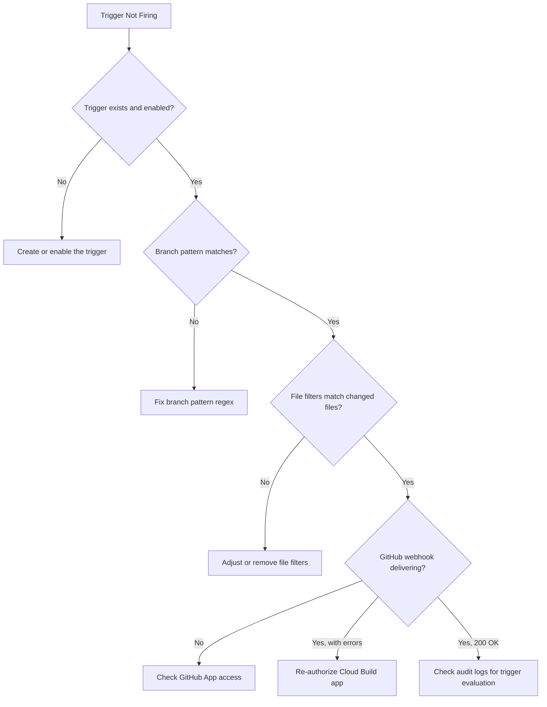

# How to Debug Cloud Build Trigger Not Firing on GitHub Push or Pull Request Events

Author: [nawazdhandala](https://www.github.com/nawazdhandala)

Tags: GCP, Cloud Build, GitHub, CI/CD, Automation

Description: Troubleshoot and fix Google Cloud Build triggers that are not firing when push or pull request events occur on connected GitHub repositories.

---

You set up a Cloud Build trigger connected to your GitHub repository. You push code, open a pull request, and nothing happens. No build starts. The trigger exists, the repository is connected, but the events are being ignored. This is a common issue with several possible causes, from webhook configuration problems to branch filter mismatches. Let us walk through the debugging process systematically.

## How Cloud Build GitHub Triggers Work

Cloud Build connects to GitHub through the Cloud Build GitHub App. When you connect a repository, the GitHub App is installed on your repo (or organization) and creates a webhook. When GitHub events occur (push, pull request), the webhook sends a notification to Cloud Build, which evaluates it against your trigger configuration. If it matches, a build starts.

The chain is: GitHub Event -> Webhook -> Cloud Build GitHub App -> Trigger Evaluation -> Build Execution.

A failure at any point in this chain means no build.

## Step 1: Check the Trigger Configuration

First, verify the trigger exists and its configuration is correct:

```bash
# List all build triggers
gcloud builds triggers list \
    --format="table(name, triggerTemplate.branchName, github.push.branch, github.pullRequest.branch, disabled)"
```

Check these fields:
- Is the trigger disabled? (`disabled: true`)
- Does the branch pattern match your branch name?
- Is the event type correct (push vs pull request)?

Get details on a specific trigger:

```bash
# Describe a specific trigger
gcloud builds triggers describe TRIGGER_NAME \
    --format="json(github, triggerTemplate, filename, includedFiles, ignoredFiles, disabled)"
```

## Step 2: Verify Branch Filters

The most common cause of triggers not firing is a branch filter mismatch. If your trigger is configured for `^main$` but you pushed to `master`, it will not fire.

```bash
# Check the branch pattern
gcloud builds triggers describe TRIGGER_NAME \
    --format="value(github.push.branch)"
```

Branch patterns use regular expressions. Common patterns and what they match:

| Pattern | Matches |
|---|---|
| `^main$` | Only the `main` branch |
| `^master$` | Only the `master` branch |
| `.*` | Any branch |
| `^release-.*` | Branches starting with `release-` |
| `^feature/.*` | Branches under `feature/` |

Update the trigger if the pattern is wrong:

```bash
# Update the trigger's branch pattern
gcloud builds triggers update TRIGGER_NAME \
    --branch-pattern="^main$"
```

## Step 3: Check Included and Ignored Files Filters

Triggers can be configured to only fire when specific files change. If your push only modified files outside the included filter, the trigger will not fire:

```bash
# Check file filters
gcloud builds triggers describe TRIGGER_NAME \
    --format="json(includedFiles, ignoredFiles)"
```

For example, if `includedFiles` is set to `["src/**"]` and you only modified a file in `docs/`, the trigger skips the build.

Remove the filter or adjust it:

```bash
# Remove file filters
gcloud builds triggers update TRIGGER_NAME \
    --clear-included-files \
    --clear-ignored-files
```

## Step 4: Check the GitHub App Connection

The Cloud Build GitHub App needs to be installed and authorized on the repository:

```bash
# List connected repositories
gcloud builds repositories list \
    --connection=YOUR_CONNECTION \
    --region=us-central1 \
    --format="table(name, remoteUri)"
```

If the connection is using the newer (2nd gen) GitHub connection, check:

```bash
# List GitHub connections (2nd gen)
gcloud builds connections list \
    --region=us-central1 \
    --format="table(name, installationState, githubConfig)"
```

If the installation state is not `COMPLETE`, the connection needs to be re-authorized. Go to the Cloud Build settings in the Console and follow the authorization flow.

For the older (1st gen) connection, go to the GitHub App settings in your GitHub organization settings to verify the Cloud Build app is installed and has access to the repository.

## Step 5: Check GitHub Webhooks

Go to your GitHub repository settings -> Webhooks and look for the Cloud Build webhook. It should point to something like `https://cloudbuild.googleapis.com/...`.

Check the webhook's "Recent Deliveries" tab. Each delivery shows:
- The event type (push, pull_request)
- The HTTP response code
- The response body

If deliveries show 403 or 401 errors, the webhook authentication is broken. If deliveries show 200 but builds still do not start, the trigger configuration is the issue.

If there are no recent deliveries for your push event, the webhook is not receiving events. This usually means the GitHub App does not have access to the repository.

## Step 6: Check for Organization-Level Restrictions

GitHub organizations can restrict which apps have access to repositories. If the Cloud Build app was installed but the organization limits access to specific repos, your new repo might not be included.

In GitHub:
1. Go to Organization Settings -> Installed GitHub Apps
2. Find Google Cloud Build
3. Check "Repository access" - make sure your repo is included

If the access is set to "Only select repositories," add your repository to the list.

## Step 7: Verify the Build Configuration File

If the trigger is configured to use a build configuration file (`cloudbuild.yaml`), that file must exist in the repository at the path specified in the trigger:

```bash
# Check what config file the trigger expects
gcloud builds triggers describe TRIGGER_NAME \
    --format="value(filename)"
```

If the file does not exist in the branch being pushed, the trigger might fire but the build fails immediately. Check that the file is committed:

```bash
# Verify the file exists in the repo
git ls-files cloudbuild.yaml
```

If the trigger uses an inline build configuration instead of a file, this is not the issue.

## Step 8: Check for Duplicate or Conflicting Triggers

Multiple triggers on the same event can cause confusion. One might fire while the one you are watching does not:

```bash
# List all triggers and their event types
gcloud builds triggers list \
    --format="table(name, github.push.branch, github.pullRequest.branch, disabled, createTime)"
```

If you have multiple triggers for the same repo and branch, check that the correct one is active and the others are either disabled or have different file filters.

## Step 9: Test the Trigger Manually

You can manually run a trigger to verify it works independently of the webhook:

```bash
# Run a trigger manually for a specific branch
gcloud builds triggers run TRIGGER_NAME \
    --branch=main
```

If the manual run succeeds, the trigger configuration is correct and the issue is with the webhook delivery from GitHub.

## Step 10: Check Audit Logs

Cloud Build logs trigger evaluations. Check the audit logs to see if the trigger was evaluated and why it decided not to fire:

```bash
# Check Cloud Build audit logs for trigger activity
gcloud logging read 'resource.type="build_trigger" AND protoPayload.serviceName="cloudbuild.googleapis.com"' \
    --project=your-project \
    --limit=20 \
    --format="table(timestamp, protoPayload.methodName, protoPayload.status)"
```

Look for `CreateBuild` method calls. If they show up with an error status, the trigger fired but the build creation failed.

## Debugging Summary



## Monitoring CI/CD Health

Use [OneUptime](https://oneuptime.com) to monitor your Cloud Build trigger health and build success rates. Getting notified when triggers stop firing saves you from discovering the issue hours later when a deployment does not go out as expected.

The most frequent causes are branch pattern mismatches and GitHub App authorization issues. Start with those, and you will solve most trigger problems quickly.
