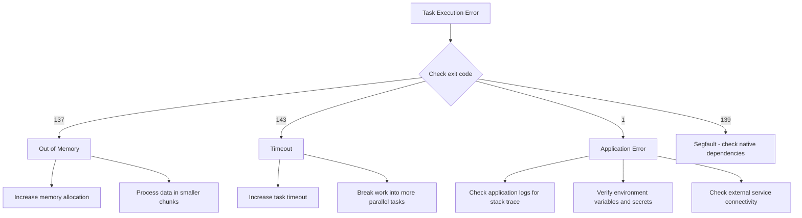

# How to Debug Cloud Run Jobs Failing with Retryable Task Execution Errors

Author: [nawazdhandala](https://www.github.com/nawazdhandala)

Tags: GCP, Cloud Run Jobs, Task Execution, Retry Logic, Troubleshooting

Description: A practical guide to debugging Cloud Run Jobs that fail with retryable task execution errors, including exit codes, retry configuration, and logging strategies.

---

Cloud Run Jobs are designed for batch workloads - data processing, migrations, report generation, and similar tasks that run to completion and exit. Unlike Cloud Run services that handle HTTP requests, jobs run a container until it exits. When a task fails, Cloud Run can retry it automatically. But when those retries keep failing, you end up staring at a wall of "retryable task execution error" messages with no clear indication of what went wrong.

I have debugged many of these failures, and the issue usually comes down to one of a few patterns. Let me walk through how to diagnose and fix them.

## Understanding Cloud Run Jobs Execution Model

A Cloud Run Job consists of one or more tasks that run in parallel. Each task runs your container to completion. If a task fails (exits with a non-zero code), Cloud Run retries it based on your retry configuration.

```bash
# Check the current configuration of your job
gcloud run jobs describe my-job \
    --region=us-central1 \
    --format="yaml(spec.template)"
```

Key configuration values to look at:
- `maxRetries` - how many times to retry a failed task (default: 3)
- `taskCount` - how many parallel tasks to run
- `timeout` - maximum duration for each task attempt

## Step 1 - Find the Actual Error

The "retryable task execution error" message is generic. You need to dig into the logs to find what actually happened.

```bash
# Get logs for a specific job execution
gcloud logging read \
    'resource.type="cloud_run_job" AND resource.labels.job_name="my-job"' \
    --project=my-project \
    --limit=100 \
    --format="table(timestamp, severity, textPayload)" \
    --order=asc
```

Look for log entries right before the task exits. Application logs, stack traces, and error messages will be here.

You can also check the execution details.

```bash
# List recent executions of your job
gcloud run jobs executions list --job=my-job --region=us-central1

# Describe a specific execution to see task-level status
gcloud run jobs executions describe my-job-xxxxx \
    --region=us-central1
```

## Step 2 - Check the Exit Code

The exit code tells you a lot about why the task failed.

| Exit Code | Meaning |
|-----------|---------|
| 0 | Success |
| 1 | General application error |
| 137 | SIGKILL (out of memory) |
| 143 | SIGTERM (timeout or shutdown) |
| 139 | Segmentation fault |

```bash
# Look for exit codes in the logs
gcloud logging read \
    'resource.type="cloud_run_job" AND resource.labels.job_name="my-job" AND textPayload:"exit"' \
    --project=my-project \
    --limit=20
```

### Exit Code 137 - Out of Memory

If you see exit code 137, your task is exceeding its memory limit. Increase the memory allocation.

```bash
# Update the job with more memory
gcloud run jobs update my-job \
    --memory=2Gi \
    --region=us-central1
```

### Exit Code 143 - Timeout

Exit code 143 means the task exceeded its timeout and was sent SIGTERM. Increase the timeout.

```bash
# Increase the task timeout to 30 minutes
gcloud run jobs update my-job \
    --task-timeout=1800 \
    --region=us-central1
```

## Step 3 - Improve Your Application Logging

One of the biggest issues with debugging Cloud Run Jobs is insufficient logging. Add structured logging so you can trace exactly what happened.

```python
import json
import logging
import sys
import traceback

# Configure structured logging for Cloud Logging
logging.basicConfig(
    format='%(message)s',
    level=logging.INFO,
    stream=sys.stdout
)

def log_structured(severity, message, **kwargs):
    """Write a structured log entry compatible with Cloud Logging."""
    entry = {
        "severity": severity,
        "message": message,
        **kwargs
    }
    print(json.dumps(entry))

def main():
    task_index = int(os.environ.get("CLOUD_RUN_TASK_INDEX", 0))
    task_count = int(os.environ.get("CLOUD_RUN_TASK_COUNT", 1))
    attempt = int(os.environ.get("CLOUD_RUN_TASK_ATTEMPT", 0))

    log_structured("INFO", "Task starting",
        task_index=task_index,
        task_count=task_count,
        attempt_number=attempt
    )

    try:
        # Your actual job logic here
        process_batch(task_index, task_count)
        log_structured("INFO", "Task completed successfully",
            task_index=task_index
        )
    except Exception as e:
        log_structured("ERROR", f"Task failed: {str(e)}",
            task_index=task_index,
            attempt_number=attempt,
            error_type=type(e).__name__,
            traceback=traceback.format_exc()
        )
        # Exit with non-zero code to trigger retry
        sys.exit(1)

if __name__ == "__main__":
    main()
```

## Step 4 - Handle Retries Properly

Cloud Run Jobs provides environment variables that tell your code which task and attempt is running. Use these to implement idempotent retry logic.

```python
import os

def main():
    task_index = int(os.environ.get("CLOUD_RUN_TASK_INDEX", 0))
    task_count = int(os.environ.get("CLOUD_RUN_TASK_COUNT", 1))
    attempt = int(os.environ.get("CLOUD_RUN_TASK_ATTEMPT", 0))

    if attempt > 0:
        print(f"This is retry attempt {attempt} for task {task_index}")
        # On retries, you might want to:
        # - Skip already-processed items
        # - Use a different strategy
        # - Clean up partial results from the previous attempt

    # Calculate which portion of work this task handles
    items = get_all_items()
    chunk_size = len(items) // task_count
    start = task_index * chunk_size
    end = start + chunk_size if task_index < task_count - 1 else len(items)

    my_items = items[start:end]
    print(f"Task {task_index}: processing items {start} to {end}")

    for item in my_items:
        if is_already_processed(item):
            # Skip items processed by a previous attempt
            print(f"Skipping already-processed item {item.id}")
            continue
        process_item(item)
        mark_as_processed(item)
```

## Step 5 - Configure Retry Settings

Tune your retry settings based on the nature of your failures.

```bash
# Set max retries and timeout
gcloud run jobs update my-job \
    --max-retries=5 \
    --task-timeout=3600 \
    --region=us-central1
```

For transient failures (network timeouts, API rate limits), more retries help. For deterministic failures (bad data, missing configuration), retries just waste resources.

```python
import time

def process_with_backoff(item, max_retries=3):
    """Process an item with exponential backoff for transient errors."""
    for attempt in range(max_retries):
        try:
            return call_external_api(item)
        except TransientError as e:
            wait_time = 2 ** attempt  # 1s, 2s, 4s
            print(f"Transient error: {e}. Retrying in {wait_time}s...")
            time.sleep(wait_time)
        except PermanentError as e:
            # No point retrying - log and skip this item
            print(f"Permanent error processing {item.id}: {e}")
            record_failure(item, e)
            return None

    print(f"Max retries exceeded for {item.id}")
    raise MaxRetriesExceeded(f"Failed after {max_retries} attempts")
```

## Step 6 - Debug Locally

Run your container locally with the same environment variables that Cloud Run provides.

```bash
# Simulate a Cloud Run Job task locally
docker run --rm \
    -e CLOUD_RUN_TASK_INDEX=0 \
    -e CLOUD_RUN_TASK_COUNT=1 \
    -e CLOUD_RUN_TASK_ATTEMPT=0 \
    -e CLOUD_RUN_JOB=my-job \
    --memory=512m \
    gcr.io/my-project/my-job:latest
```

This lets you reproduce issues in a controlled environment where you can attach debuggers, inspect file systems, and test different configurations.

## Common Failure Patterns

Here is a decision tree for the most common patterns.



## Monitoring Job Health

Set up monitoring to track job execution patterns over time.

```bash
# Query Cloud Monitoring for job execution metrics
gcloud logging read \
    'resource.type="cloud_run_job" AND resource.labels.job_name="my-job" AND severity>=WARNING' \
    --project=my-project \
    --freshness=24h \
    --format="table(timestamp, severity, textPayload)"
```

You can also set up alerting for failed executions.

```bash
# Create an alert for job failures
gcloud alpha monitoring policies create \
    --display-name="Cloud Run Job Failures" \
    --condition-display-name="Job task failures" \
    --condition-filter='resource.type="cloud_run_job" AND metric.type="run.googleapis.com/job/completed_task_attempt_count" AND metric.labels.result="failed"' \
    --notification-channels=<channel-id>
```

## Summary

Cloud Run Jobs task execution errors are usually caused by memory limits, timeouts, or application bugs. The key to debugging them is good logging - add structured logging with task index and attempt number, log the error details before exiting, and use the Cloud Run environment variables to make your retries idempotent. Check exit codes to narrow down the category of failure, and test locally with the same constraints before deploying.
