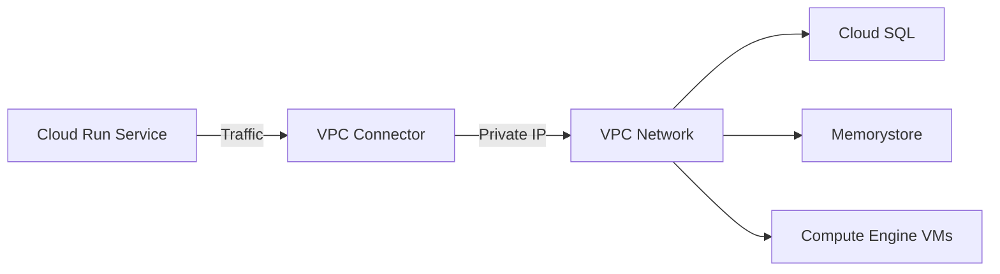
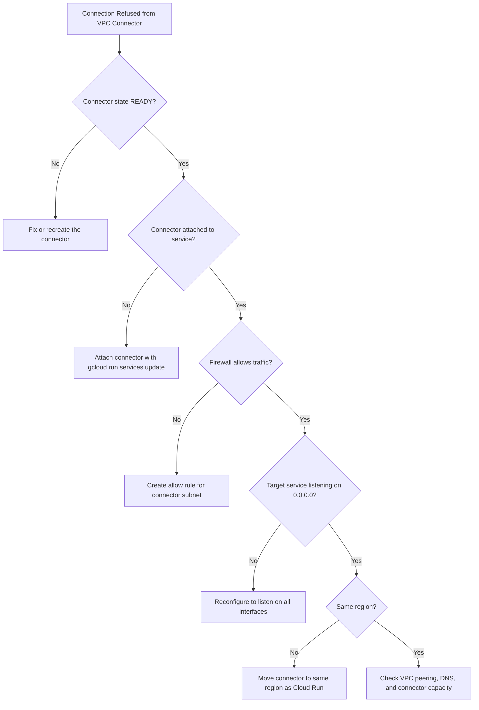

# How to Debug Cloud Run VPC Connector Connection Refused Errors

Author: [nawazdhandala](https://www.github.com/nawazdhandala)

Tags: GCP, Cloud Run, VPC, Networking, Serverless VPC Access, Troubleshooting

Description: A step-by-step guide to diagnosing and fixing Cloud Run VPC connector connection refused errors, covering network configuration, firewall rules, and connector health.

---

Cloud Run services live outside your VPC by default. When you need to reach internal resources like Cloud SQL instances on private IPs, Memorystore Redis, or services running on Compute Engine, you use a Serverless VPC Access connector. In theory, you configure the connector, attach it to your Cloud Run service, and everything just works. In practice, "connection refused" is one of the most common errors you will encounter.

I have debugged this issue across many projects, and the root cause is usually one of a handful of misconfigurations. Let me walk through them systematically.

## Understanding the Architecture

Before debugging, it helps to understand how VPC connectors work. A VPC connector is a managed resource that sits between Cloud Run and your VPC. When your Cloud Run service makes a request to a private IP, the traffic flows through the connector into your VPC. The connector runs on a set of VM instances (e2-micro by default) in a dedicated /28 subnet.



When you see "connection refused," it means the TCP connection is being rejected at some point in this chain. The question is where.

## Step 1 - Verify the Connector Exists and Is Healthy

First, check that your VPC connector is in the READY state.

```bash
# List all VPC connectors in the project
gcloud compute networks vpc-access connectors list --region=us-central1

# Get detailed info about a specific connector
gcloud compute networks vpc-access connectors describe my-connector \
    --region=us-central1
```

The output should show `state: READY`. If it shows `ERROR` or is missing entirely, that is your problem. Common reasons for connector failures include subnet conflicts and quota issues.

```bash
# Check if the connector subnet is in use by something else
gcloud compute networks subnets list --filter="network:my-vpc" --regions=us-central1
```

## Step 2 - Verify the Connector Is Attached to Your Service

A surprising number of "connection refused" issues happen because the connector is not actually attached to the Cloud Run service, or the egress setting is wrong.

```bash
# Check if the connector is attached to your Cloud Run service
gcloud run services describe my-service \
    --region=us-central1 \
    --format="value(spec.template.metadata.annotations)"
```

Look for the `run.googleapis.com/vpc-access-connector` annotation. If it is missing, attach it.

```bash
# Attach the VPC connector to your Cloud Run service
gcloud run services update my-service \
    --vpc-connector=my-connector \
    --vpc-egress=private-ranges-only \
    --region=us-central1
```

The `--vpc-egress` flag is important:
- `private-ranges-only` routes only RFC 1918 traffic through the connector (default)
- `all-traffic` routes all egress traffic through the connector

If your target resource uses a private IP that falls within RFC 1918 ranges (10.x.x.x, 172.16.x.x-172.31.x.x, 192.168.x.x), then `private-ranges-only` works fine. But if you are trying to reach something with a non-standard private IP or need DNS resolution through your VPC, use `all-traffic`.

## Step 3 - Check Firewall Rules

This is the most common cause of connection refused errors. VPC firewall rules control traffic flow, and you need rules that allow traffic from the connector subnet to your target resource.

```bash
# Find the connector's IP range
gcloud compute networks vpc-access connectors describe my-connector \
    --region=us-central1 \
    --format="value(ipCidrRange)"

# List firewall rules that might block traffic
gcloud compute firewall-rules list \
    --filter="network:my-vpc" \
    --format="table(name, direction, priority, sourceRanges, allowed)"
```

Create a firewall rule to allow traffic from the connector.

```bash
# Allow traffic from the VPC connector to your internal resources
gcloud compute firewall-rules create allow-vpc-connector \
    --network=my-vpc \
    --direction=INGRESS \
    --action=ALLOW \
    --source-ranges=10.8.0.0/28 \
    --rules=tcp:5432,tcp:6379,tcp:8080 \
    --priority=1000
```

Replace the source range with your connector's actual subnet, and adjust the ports to match your target services (5432 for PostgreSQL, 6379 for Redis, etc.).

## Step 4 - Verify the Target Service Is Listening

Sometimes the "connection refused" comes from the target service itself, not from any network configuration issue.

```bash
# If the target is a Compute Engine VM, SSH in and check
gcloud compute ssh my-vm --zone=us-central1-a

# Check if the service is listening on the expected port
sudo netstat -tlnp | grep :5432

# Check if the service is bound to the correct interface
# (0.0.0.0 = all interfaces, 127.0.0.1 = localhost only)
sudo ss -tlnp | grep :5432
```

A common mistake is that the target service is bound to 127.0.0.1 (localhost only) instead of 0.0.0.0 (all interfaces). Traffic from the VPC connector arrives on the VM's internal network interface, not the loopback interface, so the service must be listening on 0.0.0.0 or the specific internal IP.

## Step 5 - Check Cloud SQL Private IP Configuration

If you are connecting to Cloud SQL with a private IP, there are additional things to verify.

```bash
# Verify Cloud SQL has a private IP
gcloud sql instances describe my-instance \
    --format="value(ipAddresses)"

# Check the VPC peering for Cloud SQL
gcloud services vpc-peerings list --network=my-vpc
```

Cloud SQL private IP works through VPC peering, not through the VPC connector directly. Your Cloud Run service sends traffic through the VPC connector into your VPC, and then VPC peering routes it to the Cloud SQL instance. Make sure both are configured.

```bash
# Verify the private services connection exists
gcloud compute addresses list --filter="purpose=VPC_PEERING"
```

## Step 6 - Check the Region

The VPC connector must be in the same region as your Cloud Run service. If they are in different regions, the connector will not work.

```bash
# Check Cloud Run service region
gcloud run services describe my-service --format="value(metadata.labels['cloud.googleapis.com/location'])"

# Check VPC connector region
gcloud compute networks vpc-access connectors describe my-connector \
    --region=us-central1 \
    --format="value(region)"
```

## Step 7 - Check Connector Throughput

If connections work sometimes but fail under load, the connector might be overwhelmed. The default e2-micro instances have limited throughput.

```bash
# Check connector metrics in Cloud Monitoring
gcloud monitoring metrics list \
    --filter='metric.type = starts_with("vpcaccess.googleapis.com")'
```

If the connector is saturated, scale it up.

```bash
# Create a connector with more capacity
gcloud compute networks vpc-access connectors create my-connector-v2 \
    --region=us-central1 \
    --network=my-vpc \
    --range=10.9.0.0/28 \
    --min-instances=2 \
    --max-instances=10 \
    --machine-type=e2-standard-4
```

## Debugging with VPC Flow Logs

If you are still stuck, enable VPC Flow Logs to see exactly what traffic is flowing and where it is being dropped.

```bash
# Enable flow logs on the connector subnet
gcloud compute networks subnets update my-connector-subnet \
    --region=us-central1 \
    --enable-flow-logs \
    --logging-flow-sampling=1.0
```

Then query the flow logs in Cloud Logging.

```bash
# Query VPC flow logs for the connector subnet
gcloud logging read \
    'resource.type="gce_subnetwork" AND logName:"vpc_flows" AND jsonPayload.connection.src_ip:"10.8.0"' \
    --project=my-project \
    --limit=20
```

Look for entries where the `reporter` is "DEST" and the `disposition` is "DENIED" - these indicate traffic that was dropped by a firewall rule.

## Common Patterns

Here is a summary of the most frequent causes and their fixes.



## Summary

VPC connector connection refused errors on Cloud Run are almost always caused by one of these issues: the connector is not attached to the service, firewall rules block the traffic, the target service is only listening on localhost, or there is a region mismatch. Work through the diagnostic steps in order, starting with the simplest checks first. Enable VPC Flow Logs if you need deeper visibility into where traffic is being dropped.
