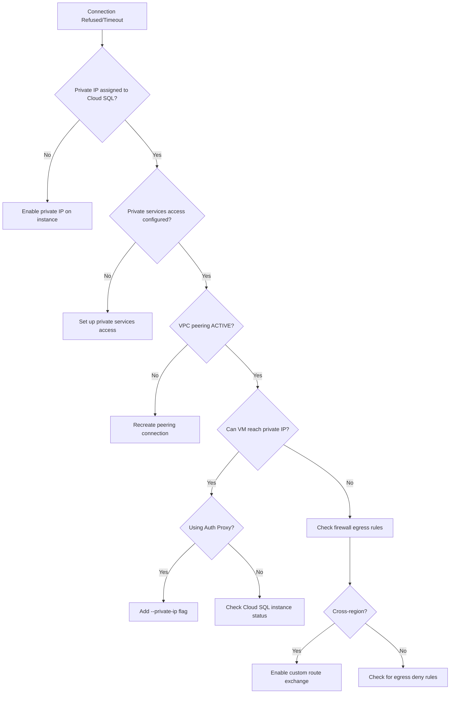

# How to Debug Cloud SQL Connection Refused Errors for Private IP Configurations

Author: [nawazdhandala](https://www.github.com/nawazdhandala)

Tags: GCP, Cloud SQL, Private IP, VPC, Networking

Description: Debug and fix connection refused errors when connecting to Cloud SQL instances configured with private IP addresses, covering VPC peering, network routes, and firewall rules.

---

You configured your Cloud SQL instance with a private IP to keep database traffic off the public internet. Good security practice. But now your application cannot connect, and you are getting "connection refused" or "connection timed out" errors. Private IP configurations for Cloud SQL have several moving parts, and any one of them being wrong can break connectivity.

Let me walk through the common causes and how to fix each one.

## How Cloud SQL Private IP Works

When you enable private IP on a Cloud SQL instance, Google creates the instance in a Google-managed VPC and sets up VPC Network Peering between your VPC and Google's. Traffic flows through this peering connection over private IP addresses.


For this to work, several things must be in place:
- Private services access must be configured on your VPC
- VPC peering must be active
- The VM and Cloud SQL must be in the same region (or peering must export/import routes)
- Firewall rules must allow egress on port 3306/5432

## Step 1: Verify Private IP Is Configured

First, confirm your Cloud SQL instance actually has a private IP:

```bash
# Check the instance's IP configuration
gcloud sql instances describe my-db \
    --format="table(ipAddresses.type, ipAddresses.ipAddress, settings.ipConfiguration.privateNetwork)"
```

You should see an entry with type `PRIVATE`. If you only see `PRIMARY` (public IP), private IP is not enabled.

To enable private IP:

```bash
# Enable private IP on an existing instance
# You need to specify the VPC network
gcloud sql instances patch my-db \
    --network=projects/my-project/global/networks/my-vpc \
    --no-assign-ip  # Optionally disable public IP
```

## Step 2: Check Private Services Access

Private services access creates the VPC peering between your network and Google's. This is a one-time setup per VPC.

```bash
# Check if private services access is configured
gcloud compute addresses list \
    --global \
    --filter="purpose=VPC_PEERING AND network=my-vpc"

# Check the VPC peering connections
gcloud compute networks peerings list \
    --network=my-vpc
```

If private services access is not set up:

```bash
# Allocate an IP range for private services
gcloud compute addresses create google-managed-services \
    --global \
    --purpose=VPC_PEERING \
    --prefix-length=16 \
    --network=my-vpc

# Create the private services connection
gcloud services vpc-peerings connect \
    --service=servicenetworking.googleapis.com \
    --ranges=google-managed-services \
    --network=my-vpc
```

## Step 3: Verify VPC Peering Status

The peering connection between your VPC and Google's must be active:

```bash
# Check peering status
gcloud compute networks peerings list \
    --network=my-vpc \
    --format="table(name, network, state, exchangeSubnetRoutes, exportCustomRoutes, importCustomRoutes)"
```

The state should be `ACTIVE`. If you see `INACTIVE`, the peering might need to be re-created.

Check that routes are being exchanged:

```bash
# List routes to see if private services routes are present
gcloud compute routes list \
    --filter="network:my-vpc AND destRange~10.0" \
    --format="table(name, destRange, nextHopPeering)"
```

You should see routes with `nextHopPeering` pointing to the Google services peering.

## Step 4: Verify Network Connectivity

Check that your VM can reach the Cloud SQL private IP:

```bash
# Get the Cloud SQL private IP
gcloud sql instances describe my-db \
    --format="value(ipAddresses[0].ipAddress)"

# From the VM, test connectivity
# For PostgreSQL (port 5432)
nc -zv PRIVATE_IP 5432

# For MySQL (port 3306)
nc -zv PRIVATE_IP 3306
```

If `nc` times out, the issue is network-level (routing or firewall). If it returns "connection refused," the port is reachable but nothing is listening - which usually means a Cloud SQL configuration issue.

## Step 5: Check Firewall Rules

Your VPC firewall rules must allow egress to the Cloud SQL private IP on the database port:

```bash
# Check for egress deny rules that might block traffic
gcloud compute firewall-rules list \
    --filter="network:my-vpc AND direction=EGRESS" \
    --format="table(name, denied, destinationRanges, priority)"
```

By default, GCP allows all egress traffic. But if you have custom egress deny rules, they might block database traffic:

```bash
# Create an explicit egress allow rule for Cloud SQL traffic
gcloud compute firewall-rules create allow-cloudsql-egress \
    --network=my-vpc \
    --direction=EGRESS \
    --action=ALLOW \
    --rules=tcp:5432,tcp:3306 \
    --destination-ranges=10.0.0.0/8 \
    --priority=100
```

## Step 6: Check Cloud SQL Auth Proxy Configuration

If you are using the Cloud SQL Auth Proxy with private IP, you need to tell it to use the private path:

```bash
# Run the proxy with private IP flag
./cloud-sql-proxy \
    --private-ip \
    my-project:us-central1:my-db
```

Without the `--private-ip` flag, the proxy tries to connect via the public path, which will fail if you disabled public IP on the instance.

## Step 7: Cross-Region Connectivity

If your VM and Cloud SQL instance are in different regions, the peering routes might not be exported:

```bash
# Enable custom route export/import on the peering
gcloud compute networks peerings update servicenetworking-googleapis-com \
    --network=my-vpc \
    --export-custom-routes \
    --import-custom-routes
```

Also update the peering from Google's side:

```bash
# Update the Google services peering to exchange routes
gcloud services vpc-peerings update \
    --service=servicenetworking.googleapis.com \
    --ranges=google-managed-services \
    --network=my-vpc \
    --force
```

## Step 8: Shared VPC Considerations

If you are using a Shared VPC, the private services access must be configured on the host project's VPC, not the service project:

```bash
# Private services access must be on the host project VPC
gcloud compute addresses create google-managed-services \
    --global \
    --purpose=VPC_PEERING \
    --prefix-length=16 \
    --network=projects/host-project/global/networks/shared-vpc \
    --project=host-project

gcloud services vpc-peerings connect \
    --service=servicenetworking.googleapis.com \
    --ranges=google-managed-services \
    --network=shared-vpc \
    --project=host-project
```

## GKE Connectivity

For GKE pods connecting to Cloud SQL via private IP, make sure:

1. The GKE cluster is in the same VPC (or a peered VPC) as the Cloud SQL instance
2. The pod can resolve the Cloud SQL private IP
3. If using Workload Identity, the service account has `cloudsql.client` role

```yaml
# GKE deployment connecting to Cloud SQL via private IP
# No Cloud SQL Auth Proxy needed for basic private IP connectivity
apiVersion: apps/v1
kind: Deployment
metadata:
  name: my-app
spec:
  template:
    spec:
      containers:
      - name: my-app
        image: my-app:latest
        env:
        - name: DB_HOST
          value: "10.x.x.x"  # Cloud SQL private IP
        - name: DB_PORT
          value: "5432"
        - name: DB_NAME
          value: "mydb"
```

## Debugging Flowchart



Private IP connectivity for Cloud SQL is more secure but harder to debug than public IP. The most common issues are missing private services access setup and forgotten `--private-ip` flags on the Auth Proxy. Work through the steps in order and you will find the problem.
