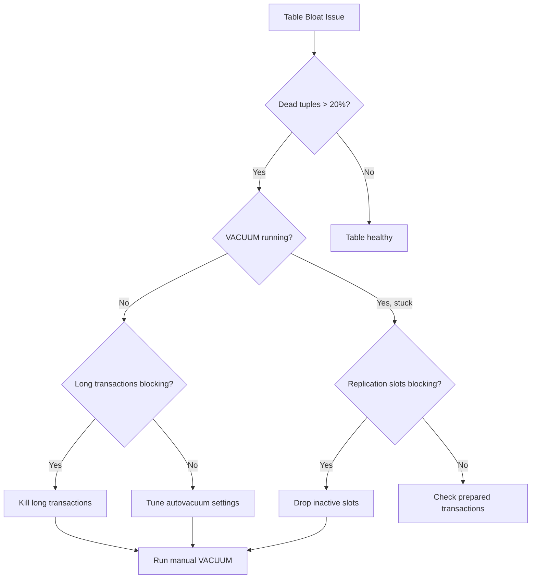

# How to Debug Cloud SQL PostgreSQL Vacuum Process Stuck and Table Bloat Issues

Author: [nawazdhandala](https://www.github.com/nawazdhandala)

Tags: GCP, Cloud SQL, PostgreSQL, Vacuum, Table Bloat, Database Maintenance

Description: A detailed guide to diagnosing stuck vacuum processes and fixing table bloat issues on Cloud SQL PostgreSQL instances, including autovacuum tuning.

---

Table bloat in PostgreSQL is like a slow leak - you do not notice it until your disk is full and your queries are crawling. PostgreSQL's VACUUM process is supposed to handle this automatically, but on Cloud SQL instances, it often falls behind or gets stuck entirely. Let me show you how to diagnose the problem and get VACUUM working properly.

## Understanding the Problem

PostgreSQL uses MVCC (Multi-Version Concurrency Control), which means updates and deletes do not remove old row versions immediately. Instead, they mark them as "dead tuples." VACUUM's job is to reclaim the space used by dead tuples. When VACUUM falls behind, tables accumulate dead tuples, which:

- Wastes disk space (table bloat)
- Makes sequential scans slower (scanning dead rows)
- Eventually triggers transaction ID wraparound, which is a database emergency

## Step 1: Check Table Bloat

First, measure how much bloat you actually have.

```sql
-- Check dead tuple counts across all tables
SELECT
  schemaname,
  relname AS table_name,
  n_live_tup AS live_tuples,
  n_dead_tup AS dead_tuples,
  ROUND(n_dead_tup::numeric / GREATEST(n_live_tup, 1) * 100, 2) AS dead_pct,
  last_vacuum,
  last_autovacuum,
  last_analyze,
  last_autoanalyze
FROM pg_stat_user_tables
WHERE n_dead_tup > 10000
ORDER BY n_dead_tup DESC;
```

A healthy table should have a dead tuple percentage well under 10%. If you see tables with 50% or more dead tuples, VACUUM is seriously behind.

For a more accurate bloat estimate:

```sql
-- Estimate actual table bloat using page-level statistics
SELECT
  current_database() AS db,
  schemaname,
  tablename,
  pg_size_pretty(pg_relation_size(schemaname || '.' || tablename)) AS table_size,
  ROUND(
    (1 - (pg_relation_size(schemaname || '.' || tablename)::float /
           GREATEST(pg_total_relation_size(schemaname || '.' || tablename), 1))) * 100,
    2
  ) AS index_overhead_pct
FROM pg_tables
WHERE schemaname NOT IN ('pg_catalog', 'information_schema')
ORDER BY pg_relation_size(schemaname || '.' || tablename) DESC
LIMIT 20;
```

## Step 2: Check If VACUUM Is Running or Stuck

```sql
-- Check for currently running VACUUM processes
SELECT
  pid,
  now() - query_start AS duration,
  query,
  state,
  wait_event_type,
  wait_event
FROM pg_stat_activity
WHERE query LIKE '%VACUUM%' OR query LIKE '%vacuum%'
ORDER BY duration DESC;
```

If you see a VACUUM process that has been running for hours or days, it might be stuck.

```sql
-- Check autovacuum progress (PostgreSQL 9.6+)
SELECT
  p.pid,
  a.relname AS table_name,
  p.phase,
  p.heap_blks_total,
  p.heap_blks_scanned,
  p.heap_blks_vacuumed,
  ROUND(p.heap_blks_vacuumed::numeric / GREATEST(p.heap_blks_total, 1) * 100, 2) AS pct_complete,
  now() - s.query_start AS duration
FROM pg_stat_progress_vacuum p
JOIN pg_stat_activity s ON p.pid = s.pid
JOIN pg_class a ON p.relid = a.oid;
```

## Step 3: Find What Is Blocking VACUUM

VACUUM cannot clean up dead tuples that are still visible to any active transaction. Long-running transactions and unused replication slots are the two most common blockers.

### Check for Long-Running Transactions

```sql
-- Find transactions that might be blocking VACUUM
SELECT
  pid,
  now() - xact_start AS transaction_duration,
  now() - query_start AS query_duration,
  state,
  LEFT(query, 100) AS query_preview,
  backend_xmin
FROM pg_stat_activity
WHERE xact_start IS NOT NULL
  AND state != 'idle'
ORDER BY xact_start ASC
LIMIT 10;
```

Any transaction that started before the oldest dead tuple was created will prevent VACUUM from cleaning up those tuples. Kill the offending transaction if it is safe to do so:

```sql
-- Cancel the blocking query (graceful)
SELECT pg_cancel_backend(12345);

-- Or terminate the connection if cancel does not work
SELECT pg_terminate_backend(12345);
```

### Check for Abandoned Replication Slots

```sql
-- Check for inactive replication slots holding back VACUUM
SELECT
  slot_name,
  slot_type,
  active,
  xmin,
  catalog_xmin,
  restart_lsn,
  confirmed_flush_lsn
FROM pg_replication_slots
WHERE NOT active;
```

Inactive replication slots prevent VACUUM from removing tuples that were created after the slot's `xmin`. Drop unused slots:

```sql
-- Drop an inactive replication slot
SELECT pg_drop_replication_slot('unused_slot');
```

### Check for Prepared Transactions

```sql
-- Check for orphaned prepared transactions (from two-phase commit)
SELECT * FROM pg_prepared_xacts;
```

If you find old prepared transactions, either commit or rollback them:

```sql
-- Rollback an orphaned prepared transaction
ROLLBACK PREPARED 'transaction_id_here';
```

## Step 4: Tune Autovacuum Settings

Cloud SQL's default autovacuum settings are often too conservative for high-write workloads.

```bash
# Check current autovacuum settings
gcloud sql instances describe my-instance \
    --format="json(settings.databaseFlags)" \
    --project=my-project
```

Here are the key settings to tune:

```bash
# Make autovacuum more aggressive
gcloud sql instances patch my-instance \
    --database-flags=\
autovacuum_vacuum_scale_factor=0.05,\
autovacuum_analyze_scale_factor=0.02,\
autovacuum_vacuum_cost_delay=2,\
autovacuum_vacuum_cost_limit=1000,\
autovacuum_max_workers=4,\
autovacuum_naptime=15 \
    --project=my-project
```

What each setting does:

- `autovacuum_vacuum_scale_factor=0.05` - trigger VACUUM when 5% of rows are dead (default is 20%)
- `autovacuum_analyze_scale_factor=0.02` - update statistics when 2% of rows change
- `autovacuum_vacuum_cost_delay=2` - shorter pauses between vacuum I/O operations (default 2ms in newer PG)
- `autovacuum_vacuum_cost_limit=1000` - allow more I/O before pausing (default 200)
- `autovacuum_max_workers=4` - run up to 4 autovacuum processes in parallel
- `autovacuum_naptime=15` - check for tables needing vacuum every 15 seconds

For very large, high-write tables, set per-table autovacuum settings:

```sql
-- Make autovacuum more aggressive for a specific high-write table
ALTER TABLE events SET (
  autovacuum_vacuum_scale_factor = 0.01,
  autovacuum_vacuum_threshold = 1000,
  autovacuum_analyze_scale_factor = 0.005
);
```

## Step 5: Run Manual VACUUM When Needed

If autovacuum has fallen too far behind, run a manual VACUUM to catch up.

```sql
-- Regular VACUUM - reclaims dead tuple space, does not lock the table
VACUUM VERBOSE events;

-- VACUUM ANALYZE - also updates statistics
VACUUM ANALYZE events;

-- VACUUM FULL - rewrites the entire table, reclaims maximum space
-- WARNING: This locks the table for the entire duration
VACUUM FULL VERBOSE events;
```

For large tables, `VACUUM FULL` can take hours and blocks all reads and writes. Prefer regular `VACUUM` and only use `VACUUM FULL` during maintenance windows.

## Step 6: Monitor Transaction ID Wraparound Risk

The ultimate consequence of VACUUM not running is transaction ID wraparound, where PostgreSQL shuts down to prevent data corruption.

```sql
-- Check how close each database is to transaction ID wraparound
SELECT
  datname,
  age(datfrozenxid) AS xid_age,
  ROUND(age(datfrozenxid)::numeric / 2147483647 * 100, 2) AS pct_to_wraparound,
  current_setting('autovacuum_freeze_max_age') AS freeze_max_age
FROM pg_database
ORDER BY age(datfrozenxid) DESC;
```

If `pct_to_wraparound` exceeds 50%, you need to run VACUUM FREEZE urgently:

```sql
-- Force VACUUM to freeze old tuples
VACUUM FREEZE events;
```

## Monitoring Dashboard



Table bloat management is an ongoing responsibility with PostgreSQL. Get your autovacuum tuning right, monitor dead tuple counts, and watch for long-running transactions that block cleanup. Catching problems early is much easier than dealing with a table that has grown to 10x its actual data size.
