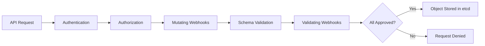

# How to Debug GKE Admission Webhook Denied Errors

Author: [nawazdhandala](https://www.github.com/nawazdhandala)

Tags: GKE, Kubernetes, Admission Webhooks, Troubleshooting, Security, GCP

Description: Learn how to diagnose and fix admission webhook denied errors in GKE clusters, including identifying which webhook is blocking requests and resolving configuration issues.

---

You try to create or update a resource in your GKE cluster and get back an error like "admission webhook denied the request." The error message might be cryptic, pointing at a webhook you did not even know existed. Admission webhooks are powerful gatekeepers, but when they misbehave, they can block legitimate operations and leave you scrambling.

Let's figure out which webhook is causing the problem and how to fix it.

## How Admission Webhooks Work

When you send any request to the Kubernetes API server (create, update, delete), it passes through a chain of admission controllers. Webhooks are external admission controllers that get called via HTTP:



There are two types:
- **Mutating webhooks** can modify the resource before it is stored
- **Validating webhooks** can accept or reject the resource but cannot modify it

Both can deny your request.

## Step 1 - Identify Which Webhook Denied the Request

The error message usually contains the webhook name. Look for it in the full error output:

```bash
# Try to create the resource and capture the full error
kubectl apply -f your-resource.yaml 2>&1
```

A typical error looks like:

```
Error from server: error when creating "your-resource.yaml": admission webhook
"validate.kyverno.svc" denied the request: resource Deployment/default/my-app
was blocked due to the following policies: require-labels: autogen-require-labels:
validation error: label 'app.kubernetes.io/name' is required
```

From this you can identify:
- **Webhook name**: `validate.kyverno.svc`
- **Policy**: `require-labels`
- **Reason**: Missing a required label

## Step 2 - List All Admission Webhooks

See all webhooks registered in your cluster:

```bash
# List all validating webhook configurations
kubectl get validatingwebhookconfigurations

# List all mutating webhook configurations
kubectl get mutatingwebhookconfigurations
```

For detailed info on a specific webhook:

```bash
# Get full details of a webhook configuration
kubectl get validatingwebhookconfiguration WEBHOOK_NAME -o yaml
```

Pay attention to these fields:
- `webhooks[].rules` - which resources and operations trigger the webhook
- `webhooks[].namespaceSelector` - which namespaces are affected
- `webhooks[].failurePolicy` - Fail or Ignore (what happens if the webhook is unreachable)

## Step 3 - Understand the Denial Reason

Once you know which webhook denied the request, figure out why. Common sources of admission webhooks in GKE:

**Policy engines (Kyverno, OPA Gatekeeper, Polaris)**: These enforce cluster policies. The fix is to make your resource comply with the policy or update the policy.

```bash
# For Kyverno, check the policy that blocked you
kubectl get clusterpolicy -o wide
kubectl describe clusterpolicy require-labels
```

```bash
# For OPA Gatekeeper, check constraints
kubectl get constraints
kubectl describe K8sRequiredLabels require-labels
```

**Service meshes (Istio, Linkerd)**: These inject sidecars and validate configurations.

```bash
# Check Istio webhook configuration
kubectl get validatingwebhookconfiguration istio-validator-istio-system -o yaml
```

**GKE built-in controllers**: GKE has its own admission webhooks for features like Workload Identity, Binary Authorization, and Policy Controller.

## Step 4 - Fix the Resource to Comply

The most straightforward fix is to update your resource to satisfy the webhook's requirements. If the webhook requires specific labels:

```yaml
# Add the required labels that the admission webhook expects
apiVersion: apps/v1
kind: Deployment
metadata:
  name: my-app
  labels:
    app.kubernetes.io/name: my-app        # required by policy
    app.kubernetes.io/version: "1.0"      # required by policy
    app.kubernetes.io/managed-by: kubectl  # required by policy
spec:
  selector:
    matchLabels:
      app: my-app
  template:
    metadata:
      labels:
        app: my-app
        app.kubernetes.io/name: my-app
    spec:
      containers:
      - name: app
        image: your-app:latest
```

## Step 5 - Check If the Webhook Service Is Down

If the webhook service is unreachable and its `failurePolicy` is set to `Fail`, all matching requests will be denied. This can happen when the webhook pods crash or the service is deleted.

```bash
# Check the service the webhook points to
kubectl get validatingwebhookconfiguration WEBHOOK_NAME \
  -o jsonpath='{.webhooks[0].clientConfig.service.name}'

# Check if the webhook service and pods are running
kubectl get svc -n WEBHOOK_NAMESPACE
kubectl get pods -n WEBHOOK_NAMESPACE
```

If the webhook pods are down and you need to unblock operations immediately, you have two options:

Option 1 - Change failure policy to Ignore temporarily:

```bash
# Temporarily change failure policy to not block on webhook errors
kubectl patch validatingwebhookconfiguration WEBHOOK_NAME \
  --type='json' -p='[{"op":"replace","path":"/webhooks/0/failurePolicy","value":"Ignore"}]'
```

Option 2 - Delete the webhook configuration (more drastic):

```bash
# Remove the webhook entirely (be careful - this removes all validation)
kubectl delete validatingwebhookconfiguration WEBHOOK_NAME
```

Only do this as an emergency measure. Re-apply the webhook configuration after fixing the underlying service.

## Step 6 - Exclude Specific Namespaces

Many webhooks support namespace selectors. If the webhook should not apply to certain namespaces (like kube-system or a development namespace), configure the selector:

```yaml
# Webhook configuration with namespace exclusion
apiVersion: admissionregistration.k8s.io/v1
kind: ValidatingWebhookConfiguration
metadata:
  name: your-webhook
webhooks:
- name: validate.your-webhook.svc
  namespaceSelector:
    matchExpressions:
    - key: webhook-enabled
      operator: In
      values: ["true"]
  # Only runs in namespaces labeled webhook-enabled=true
  rules:
  - apiGroups: ["apps"]
    apiVersions: ["v1"]
    operations: ["CREATE", "UPDATE"]
    resources: ["deployments"]
  clientConfig:
    service:
      name: webhook-service
      namespace: webhook-system
      path: /validate
  failurePolicy: Fail
  sideEffects: None
  admissionReviewVersions: ["v1"]
```

Then label namespaces that should be checked:

```bash
# Only enable the webhook for production namespaces
kubectl label namespace production webhook-enabled=true
kubectl label namespace staging webhook-enabled=true
```

## Step 7 - Debug Webhook Timeout Issues

Webhooks have a timeout (default 10 seconds in GKE). If the webhook service is slow, requests get denied due to timeout:

```bash
# Check the timeout setting
kubectl get validatingwebhookconfiguration WEBHOOK_NAME \
  -o jsonpath='{.webhooks[0].timeoutSeconds}'
```

If you see timeout-related denials, increase the timeout:

```bash
# Increase webhook timeout to 30 seconds
kubectl patch validatingwebhookconfiguration WEBHOOK_NAME \
  --type='json' -p='[{"op":"replace","path":"/webhooks/0/timeoutSeconds","value":30}]'
```

But also investigate why the webhook is slow. Check the webhook pod logs and resource usage:

```bash
# Check webhook pod logs for errors or slow processing
kubectl logs -n webhook-namespace -l app=webhook-server --tail=100

# Check resource utilization
kubectl top pods -n webhook-namespace
```

## Step 8 - Handle GKE-Specific Webhooks

GKE adds its own admission webhooks for managed features. If you see denials from these, the fix depends on the feature:

**Binary Authorization**: Denied because the container image is not attested.

```bash
# Check Binary Authorization policy
gcloud container binauthz policy export
```

**Policy Controller**: GKE's managed OPA Gatekeeper.

```bash
# List Policy Controller constraints
kubectl get constraints
```

**Workload Identity**: May deny pods that do not have proper service account annotations.

For GKE-managed webhooks, do not delete the webhook configuration directly. Instead, configure the feature through the GKE API or Cloud Console.

## Recovery Playbook

If admission webhooks are blocking critical operations and you need to recover quickly:

1. Identify the blocking webhook from the error message
2. Check if the webhook service is running
3. If the service is down, patch failurePolicy to Ignore
4. Fix the underlying webhook service
5. Restore the failurePolicy to Fail
6. Update your resources to comply with policies going forward

Webhooks are a critical security mechanism. The goal is not to bypass them permanently but to resolve the root cause while maintaining your ability to operate the cluster.
