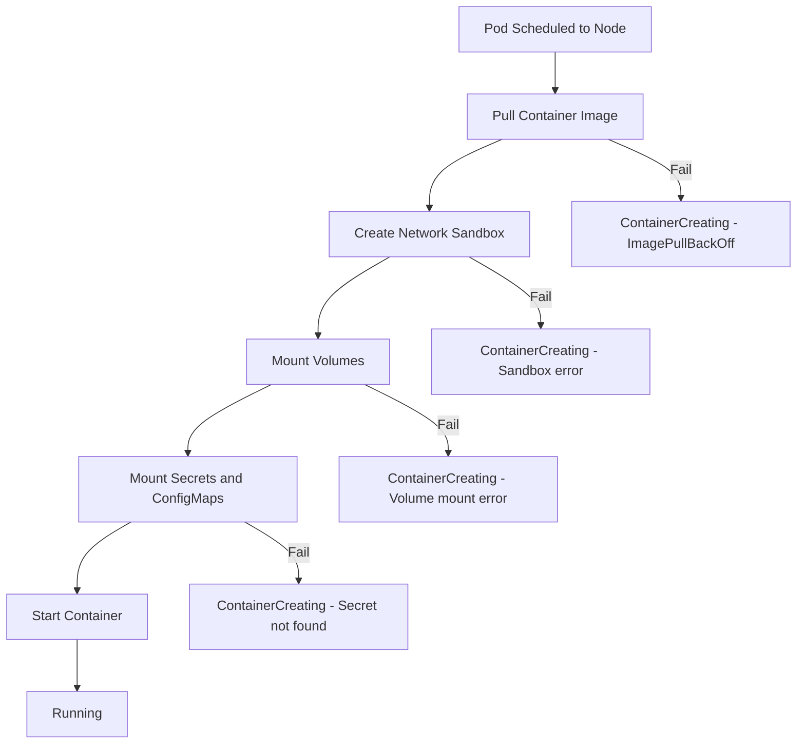

# How to Debug GKE Container Stuck in ContainerCreating State

Author: [nawazdhandala](https://www.github.com/nawazdhandala)

Tags: GKE, Kubernetes, ContainerCreating, Troubleshooting, Container Runtime, GCP

Description: Step-by-step guide to diagnosing and fixing GKE containers stuck in ContainerCreating state, including image pull failures, volume mount issues, and sandbox creation problems.

---

Your pod got scheduled to a node, but it never starts running. Instead of the familiar Running status, it sits in ContainerCreating indefinitely. This status means the kubelet picked up the pod but hit a problem while setting up the container - pulling the image, mounting volumes, creating the network sandbox, or injecting secrets.

Let's figure out which step is failing and how to fix it.

## What Happens During Container Creation

When a pod gets scheduled to a node, the kubelet goes through several steps:



If any of these steps fails, the container stays in ContainerCreating.

## Step 1 - Check Pod Events

The events on the pod are the first place to look:

```bash
# Get detailed pod information including events
kubectl describe pod your-pod-name -n your-namespace
```

The Events section will tell you exactly what is stuck. Common messages:

- `Pulling image "..."` - image pull in progress or stuck
- `Failed to pull image "..."` - image pull failed
- `MountVolume.SetUp failed` - volume mount issue
- `failed to create sandbox` - network sandbox creation failed
- `secret "..." not found` - referenced secret does not exist

## Step 2 - Fix Image Pull Issues

Image pull problems are the most common cause of ContainerCreating. There are several variants.

**Image does not exist or wrong tag:**

```bash
# Verify the image exists in the registry
gcloud container images list-tags gcr.io/your-project/your-image

# Check if a specific tag exists
gcloud container images describe gcr.io/your-project/your-image:your-tag
```

If the image does not exist, fix the image reference in your deployment:

```yaml
# Make sure the image reference is correct
spec:
  containers:
  - name: app
    image: gcr.io/your-project/your-image:v1.2.3  # exact tag, not latest
```

**Authentication failure:**

If the pod cannot authenticate to the registry, you will see "unauthorized" in the error. For GCR and Artifact Registry in the same project, GKE nodes should have access by default. For cross-project or external registries, you need an image pull secret:

```bash
# Create an image pull secret for a private registry
kubectl create secret docker-registry regcred \
  --docker-server=us-docker.pkg.dev \
  --docker-username=_json_key \
  --docker-password="$(cat key.json)" \
  --docker-email=sa@your-project.iam.gserviceaccount.com \
  -n your-namespace
```

Reference it in your pod:

```yaml
# Pod with image pull secret for private registry access
spec:
  imagePullSecrets:
  - name: regcred
  containers:
  - name: app
    image: us-docker.pkg.dev/other-project/repo/image:tag
```

**Large image taking too long:**

Very large images (multiple GB) can take a long time to pull, especially on nodes with slow disk I/O. The kubelet has a default image pull timeout. Consider using smaller images or enabling image streaming:

```bash
# Enable image streaming on the node pool
gcloud container node-pools update your-pool \
  --cluster your-cluster \
  --enable-image-streaming \
  --zone us-central1-a
```

## Step 3 - Fix Volume Mount Issues

If the event mentions volume mount failures, check the specific volume:

```bash
# Check which volumes the pod is trying to mount
kubectl get pod your-pod-name -n your-namespace -o jsonpath='{.spec.volumes[*].name}'
```

**PVC not bound:**

```bash
# Check PVC status
kubectl get pvc -n your-namespace
```

If the PVC is Pending, see the PVC troubleshooting guide. The pod cannot start until the PVC is bound.

**Secret or ConfigMap not found:**

```bash
# Check if referenced secrets exist
kubectl get secrets -n your-namespace
kubectl get configmaps -n your-namespace
```

If a volume references a secret or configmap that does not exist:

```yaml
# Pod will be stuck in ContainerCreating if this secret is missing
spec:
  volumes:
  - name: config
    secret:
      secretName: app-config  # this secret must exist in the same namespace
```

Create the missing secret:

```bash
# Create the missing secret
kubectl create secret generic app-config \
  --from-literal=DB_HOST=postgres.default.svc.cluster.local \
  --from-literal=DB_PORT=5432 \
  -n your-namespace
```

Or if the secret is optional, mark it as such:

```yaml
# Mark the secret volume as optional so the pod starts even if it is missing
spec:
  volumes:
  - name: config
    secret:
      secretName: app-config
      optional: true  # pod will start without the secret
```

## Step 4 - Fix Network Sandbox Failures

Sandbox creation failures are less common but more difficult to debug. They usually indicate a problem with the container runtime or the CNI plugin on the node.

Check the kubelet logs on the affected node:

```bash
# SSH into the node and check kubelet logs
gcloud compute ssh NODE_NAME --zone us-central1-a

# Once on the node, check recent kubelet logs
journalctl -u kubelet --since "10 minutes ago" | grep -i "sandbox\|cni\|network"
```

Common sandbox errors:

**CNI plugin failure**: The network plugin (Calico, GKE Dataplane V2) failed to set up the pod network.

```bash
# Check CNI plugin pods
kubectl get pods -n kube-system -l k8s-app=calico-node
# Or for Dataplane V2
kubectl get pods -n kube-system -l k8s-app=cilium
```

If CNI pods are not running on the affected node, the issue is with the CNI plugin. Try restarting the DaemonSet:

```bash
# Restart the CNI DaemonSet
kubectl rollout restart daemonset calico-node -n kube-system
```

**IP address exhaustion**: If the node runs out of pod IP addresses, new sandboxes cannot be created.

```bash
# Check how many pods are on the node vs the limit
kubectl get pods --field-selector spec.nodeName=NODE_NAME --all-namespaces | wc -l

# Check the node's pod capacity
kubectl get node NODE_NAME -o jsonpath='{.status.capacity.pods}'
```

GKE nodes have a default pod limit based on the machine type and IP range configuration. If you are hitting this limit, consider using larger machines or expanding your pod IP range.

## Step 5 - Fix Service Account Token Issues

Pods mount a service account token by default. If the service account does not exist or token generation fails:

```bash
# Check if the service account exists
kubectl get serviceaccount -n your-namespace

# Check if the pod references a non-existent service account
kubectl get pod your-pod -n your-namespace -o jsonpath='{.spec.serviceAccountName}'
```

If the service account is missing, create it:

```bash
# Create the missing service account
kubectl create serviceaccount your-sa -n your-namespace
```

Or if the pod does not need to interact with the Kubernetes API, disable the token mount:

```yaml
# Disable automatic service account token mounting
spec:
  automountServiceAccountToken: false
  containers:
  - name: app
    image: your-app:latest
```

## Step 6 - Check for Resource Pressure on the Node

If the node is under resource pressure (CPU, memory, or disk), the kubelet might throttle container creation:

```bash
# Check node conditions
kubectl describe node NODE_NAME | grep -A 5 "Conditions"

# Check resource usage
kubectl top node NODE_NAME
```

If the node is under pressure, the kubelet prioritizes existing containers over creating new ones. Resolve the resource pressure first.

## Step 7 - Check Init Containers

If the pod has init containers, they must complete before the main containers start. A stuck init container will keep the main container in ContainerCreating:

```bash
# Check init container status
kubectl get pod your-pod -n your-namespace -o jsonpath='{.status.initContainerStatuses[*].state}'
```

If an init container is stuck, debug it separately:

```bash
# Get logs from the stuck init container
kubectl logs your-pod -n your-namespace -c init-container-name
```

## Diagnostic Summary

When a container is stuck in ContainerCreating:

1. `kubectl describe pod` - read the events carefully
2. Image pull issues - verify image exists, check auth, check size
3. Volume issues - verify PVCs are bound, secrets/configmaps exist
4. Sandbox failures - check CNI plugin health, IP exhaustion, kubelet logs
5. Service account - verify it exists in the namespace
6. Node pressure - check for resource constraints
7. Init containers - make sure they are completing

The events almost always point you in the right direction. Start there and you will save yourself a lot of time.
