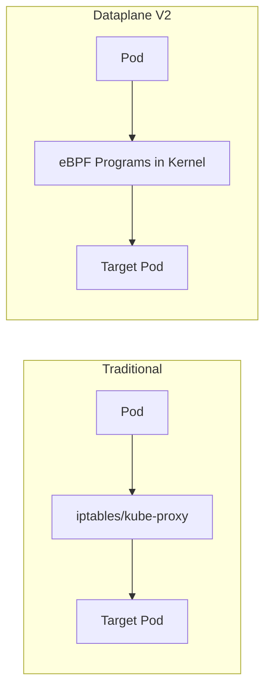

# How to Debug GKE Dataplane V2 eBPF Network Connectivity Issues

Author: [nawazdhandala](https://www.github.com/nawazdhandala)

Tags: GKE, Kubernetes, Dataplane V2, eBPF, Cilium, Networking, Troubleshooting, GCP

Description: Diagnose and resolve network connectivity issues specific to GKE Dataplane V2 (Cilium-based eBPF networking), covering pod connectivity, service routing, and network policy enforcement.

---

GKE Dataplane V2 replaces the traditional iptables-based networking with eBPF programs running in the kernel via Cilium. It is faster and more scalable, but when something goes wrong, the debugging process is different from what you might be used to with kube-proxy and iptables. The usual tools and techniques for traditional Kubernetes networking do not always apply.

Let's cover how to debug connectivity issues specific to Dataplane V2.

## What Makes Dataplane V2 Different

In traditional GKE networking, kube-proxy uses iptables rules to implement service routing and network policies. Dataplane V2 replaces all of that with eBPF programs that run directly in the Linux kernel:



Key differences:
- No iptables rules for service routing
- Network policies enforced by eBPF, not Calico
- Built-in network policy logging
- Cilium agent runs on each node

## Step 1 - Verify Dataplane V2 Is Active

Confirm your cluster is actually using Dataplane V2:

```bash
# Check if Dataplane V2 is enabled
gcloud container clusters describe your-cluster \
  --zone us-central1-a \
  --format="value(networkConfig.datapathProvider)"
```

This should return `ADVANCED_DATAPATH`. Also verify Cilium is running:

```bash
# Check Cilium agent pods
kubectl get pods -n kube-system -l k8s-app=cilium

# Check Cilium agent status on each node
kubectl exec -n kube-system $(kubectl get pods -n kube-system -l k8s-app=cilium -o jsonpath='{.items[0].metadata.name}') -- cilium status
```

The Cilium status should show all components as `OK`.

## Step 2 - Check Cilium Agent Health

If connectivity is broken, start by checking the Cilium agent logs on the affected node:

```bash
# Find the Cilium pod on the affected node
NODE_NAME="gke-your-cluster-default-pool-abc123"
CILIUM_POD=$(kubectl get pods -n kube-system -l k8s-app=cilium \
  --field-selector spec.nodeName=$NODE_NAME \
  -o jsonpath='{.items[0].metadata.name}')

# Check Cilium agent logs
kubectl logs -n kube-system $CILIUM_POD --tail=100
```

Common error patterns:
- "BPF program compilation failed" - kernel or BPF issue
- "endpoint not ready" - pod networking setup failed
- "Unable to find a healthy backend" - service has no healthy endpoints

## Step 3 - Debug Pod-to-Pod Connectivity

Test basic pod-to-pod connectivity:

```bash
# Deploy two test pods
kubectl run sender --image=busybox:1.36 --rm -it --restart=Never -- sh

# From the sender pod, try to reach another pod by IP
ping -c 3 TARGET_POD_IP
wget -T 5 -O- http://TARGET_POD_IP:8080/healthz
```

If pod-to-pod fails, check the Cilium endpoint status for both pods:

```bash
# Check endpoint status for all pods on a node
kubectl exec -n kube-system $CILIUM_POD -- cilium endpoint list

# Check a specific endpoint by pod name
kubectl exec -n kube-system $CILIUM_POD -- cilium endpoint list | grep your-pod-name
```

Endpoints should be in `ready` state. If an endpoint shows `not-ready` or `disconnecting`, the BPF programs for that pod are not loaded correctly.

Try regenerating the endpoint:

```bash
# Get the endpoint ID
EP_ID=$(kubectl exec -n kube-system $CILIUM_POD -- cilium endpoint list -o json | \
  python3 -c "import json,sys; data=json.load(sys.stdin); print([e['id'] for e in data if 'your-pod' in str(e)])")

# Regenerate the endpoint's BPF programs
kubectl exec -n kube-system $CILIUM_POD -- cilium endpoint regenerate $EP_ID
```

## Step 4 - Debug Service Connectivity

If pod-to-pod works but pod-to-service does not, the issue is in the eBPF service routing. Check the service map:

```bash
# List services known to Cilium
kubectl exec -n kube-system $CILIUM_POD -- cilium service list

# Check a specific service
kubectl exec -n kube-system $CILIUM_POD -- cilium service list | grep your-service
```

The service list should show backend pods for each service. If backends are missing:

```bash
# Check if the service has endpoints in Kubernetes
kubectl get endpoints your-service -n your-namespace

# Force a service map refresh
kubectl exec -n kube-system $CILIUM_POD -- cilium service update
```

## Step 5 - Use Cilium Monitor for Real-Time Debugging

Cilium has a built-in packet monitor that is invaluable for debugging:

```bash
# Monitor all traffic in real time on a node
kubectl exec -n kube-system $CILIUM_POD -- cilium monitor

# Filter for drops only
kubectl exec -n kube-system $CILIUM_POD -- cilium monitor --type drop

# Filter for a specific pod
kubectl exec -n kube-system $CILIUM_POD -- cilium monitor --from-endpoint EP_ID

# Filter for a specific IP
kubectl exec -n kube-system $CILIUM_POD -- cilium monitor --related-to IP_ADDRESS
```

The `--type drop` output tells you exactly why packets are being dropped. Common drop reasons:

- `POLICY_DENIED` - network policy is blocking the traffic
- `CT_MAP_INSERTION_FAILED` - connection tracking table is full
- `NO_TUNNEL_OR_ENCAPSULATION` - encapsulation issue between nodes
- `INVALID_PACKET` - malformed packet

## Step 6 - Debug Network Policy Issues

Dataplane V2 enforces network policies differently than Calico. If you see `POLICY_DENIED` drops, check which policy is blocking:

```bash
# Check the policy verdict for a specific traffic flow
kubectl exec -n kube-system $CILIUM_POD -- cilium policy trace \
  --src-k8s-pod default:sender \
  --dst-k8s-pod default:receiver \
  --dport 8080
```

This command simulates the traffic and tells you exactly which policy rules match.

Also list all loaded policies:

```bash
# List all network policies as seen by Cilium
kubectl exec -n kube-system $CILIUM_POD -- cilium policy get
```

Dataplane V2 also supports GKE network policy logging, which logs allow and deny decisions:

```yaml
# Enable network policy logging for a specific policy
apiVersion: networking.k8s.io/v1
kind: NetworkPolicy
metadata:
  name: your-policy
  namespace: your-namespace
  annotations:
    policy.network.gke.io/enable-logging: "true"
```

Check the logs in Cloud Logging:

```bash
# Query network policy logs
gcloud logging read 'resource.type="k8s_node" AND jsonPayload.disposition="deny"' \
  --limit 20 \
  --format json
```

## Step 7 - Fix BPF Map Issues

eBPF programs use maps (key-value stores in the kernel) for connection tracking, service routing, and policy enforcement. If these maps are full or corrupted, connectivity breaks.

Check map status:

```bash
# Check BPF map utilization
kubectl exec -n kube-system $CILIUM_POD -- cilium bpf ct list global | wc -l
kubectl exec -n kube-system $CILIUM_POD -- cilium bpf nat list | wc -l
```

If the connection tracking table is full (default limit is 512K entries), you will see intermittent connection failures. For high-traffic clusters, increase the limit:

```bash
# Check current CT map size
kubectl exec -n kube-system $CILIUM_POD -- cilium status --verbose | grep -i "ct-"
```

In GKE Dataplane V2, you can adjust these through the Cilium ConfigMap, but be cautious as GKE manages this configuration. For most issues, the fix is to scale horizontally (more nodes, fewer connections per node) rather than increasing map sizes.

## Step 8 - Restart Cilium Agents

If you have isolated the issue to a specific node's Cilium agent, restarting it can fix transient issues:

```bash
# Restart the Cilium agent on a specific node by deleting its pod
kubectl delete pod $CILIUM_POD -n kube-system
```

The DaemonSet will recreate the pod. During restart, there will be a brief (typically seconds) interruption to new connections on that node. Existing connections are maintained by the kernel.

For a cluster-wide restart:

```bash
# Rolling restart of all Cilium agents
kubectl rollout restart daemonset cilium -n kube-system
```

## Step 9 - Check for Known Issues

Some connectivity patterns have known quirks with Dataplane V2:

**NodePort services**: eBPF handles NodePort differently than iptables. Make sure NodePort traffic is not being source-NATed when it should not be, or vice versa.

**Host networking pods**: Pods with `hostNetwork: true` bypass eBPF processing for some traffic flows. Policy enforcement may not work as expected.

**ExternalTrafficPolicy**: Services with `externalTrafficPolicy: Local` behave differently in Dataplane V2. Check that the BPF programs correctly handle the local-only routing.

```bash
# Check if a service's external traffic policy is causing issues
kubectl get svc your-service -o jsonpath='{.spec.externalTrafficPolicy}'
```

## Diagnostic Checklist

When debugging Dataplane V2 connectivity:

1. Verify Cilium agents are healthy on all nodes
2. Check endpoint status for affected pods
3. Test pod-to-pod by IP to isolate service routing issues
4. Use `cilium monitor --type drop` to see dropped packets
5. Use `cilium policy trace` to debug network policy decisions
6. Check BPF map utilization for connection tracking overflow
7. Review Cilium agent logs for error patterns
8. Consider restarting the Cilium agent on the affected node

Dataplane V2 gives you better performance and more detailed debugging tools than traditional iptables networking. The `cilium monitor` and `cilium policy trace` commands are your best friends for pinpointing exactly where and why traffic is being dropped.
