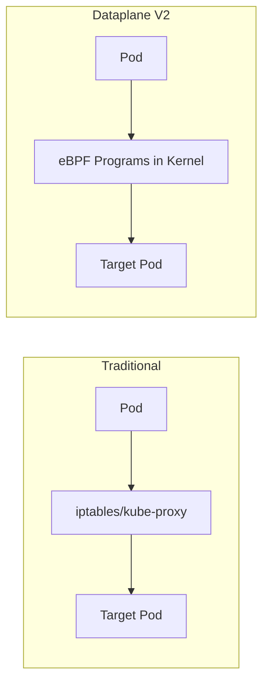

# How to Debug GKE Dataplane V2 eBPF Network Connectivity Issues

Author: [nawazdhandala](https://www.github.com/nawazdhandala)

Tags: GKE, Kubernetes, Dataplane V2, eBPF, Cilium, Networking, Troubleshooting, GCP

Description: Diagnose and resolve network connectivity issues specific to GKE Dataplane V2 (Cilium-based eBPF networking), covering pod connectivity, service routing, and network policy enforcement.

---

GKE Dataplane V2 replaces the traditional iptables-based networking with eBPF programs running in the kernel using Cilium. It is faster and more scalable, but when something goes wrong, the debugging process is different from what you might be used to with kube-proxy, Calico, and iptables. The usual tools and techniques for traditional Kubernetes networking do not always apply.

Let's cover how to debug connectivity issues specific to Dataplane V2.

## What Makes Dataplane V2 Different

In traditional GKE networking, kube-proxy uses iptables rules to implement service routing, and Calico uses iptables rules to implement network policies when GKE network policy enforcement is enabled. Dataplane V2 replaces that dataplane with eBPF programs that run directly in the Linux kernel:


```mermaid
flowchart LR
    subgraph Traditional
        A[Pod] --> B[iptables/kube-proxy]
        B --> C[Target Pod]
    end
    subgraph Dataplane V2
        D[Pod] --> E[eBPF Programs in Kernel]
        E --> F[Target Pod]
    end
```

Key differences:
- No iptables rules for service routing
- Network policies enforced by eBPF, not Calico
- Built-in network policy logging
- GKE runs the `anetd` DaemonSet on each node

## Step 1 - Verify Dataplane V2 Is Active

Confirm your cluster is actually using Dataplane V2:

```bash
# Check if Dataplane V2 is enabled

gcloud container clusters describe your-cluster \
  --location us-central1 \
  --format="value(networkConfig.datapathProvider)"
```

This should return `ADVANCED_DATAPATH`. Also verify the GKE Dataplane V2 controller is running:

```bash
# Check anetd pods. The pods are labeled k8s-app=cilium.
kubectl get pods -n kube-system -l k8s-app=cilium -o wide

# Check embedded Cilium status from one anetd pod
kubectl exec -n kube-system $(kubectl get pods -n kube-system -l k8s-app=cilium -o jsonpath='{.items[0].metadata.name}') -- cilium status --verbose
```

The pod names should start with `anetd-`, and the status output should not show failing components.

## Step 2 - Check anetd Health

If connectivity is broken, start by checking the `anetd` logs on the affected node:

```bash
# Find the anetd pod on the affected node
NODE_NAME="gke-your-cluster-default-pool-abc123"
ANETD_POD=$(kubectl get pods -n kube-system -l k8s-app=cilium \
  --field-selector spec.nodeName=$NODE_NAME \
  -o jsonpath='{.items[0].metadata.name}')

# Check anetd logs
kubectl logs -n kube-system $ANETD_POD --tail=100
```

Common error patterns:
- "BPF program compilation failed" - kernel or BPF issue
- "endpoint not ready" - pod networking setup failed
- "Unable to find a healthy backend" - service has no healthy endpoints

## Step 3 - Debug Pod-to-Pod Connectivity

Test basic pod-to-pod connectivity:

```bash
# Deploy two test pods
kubectl run sender --image=busybox:1.36 --rm -it --restart=Never -- sh

# From the sender pod, try to reach another pod by IP
ping -c 3 TARGET_POD_IP
wget -T 5 -O- http://TARGET_POD_IP:8080/healthz
```

If pod-to-pod fails, check the Cilium endpoint status for both pods:

```bash
# Check endpoint status for all pods on a node
kubectl exec -n kube-system $ANETD_POD -- cilium endpoint list

# Check a specific endpoint by pod name
kubectl exec -n kube-system $ANETD_POD -- cilium endpoint list | grep your-pod-name
```

Endpoints should be in `ready` state. If an endpoint shows a transitional state such as `waiting-to-regenerate`, `regenerating`, or `disconnecting` for an extended period, the pod's datapath may not be fully programmed.

Check the workload pod and the corresponding CiliumEndpoint object:

```bash
# Check Kubernetes events for the affected pod
kubectl describe pod your-pod-name -n your-namespace

# Check the CiliumEndpoint object for the affected pod
kubectl get ciliumendpoint your-pod-name -n your-namespace -o yaml
```

## Step 4 - Debug Service Connectivity

If pod-to-pod works but pod-to-service does not, the issue is in the eBPF service routing. Check the service map:

```bash
# List services known to Cilium
kubectl exec -n kube-system $ANETD_POD -- cilium service list

# Check a specific service
kubectl exec -n kube-system $ANETD_POD -- cilium service list | grep your-service
```

The service list should show backend IPs for each service. If backends are missing:

```bash
# Check if the service has endpoint slices in Kubernetes
kubectl get endpointslice -n your-namespace -l kubernetes.io/service-name=your-service

# Check the service and anetd logs for reconciliation errors
kubectl describe service your-service -n your-namespace
kubectl logs -n kube-system $ANETD_POD --tail=100
```

## Step 5 - Use Cilium Monitor for Real-Time Debugging

Cilium has a built-in packet monitor that is invaluable for debugging:

```bash
# Monitor all traffic in real time on a node
kubectl exec -n kube-system $ANETD_POD -- cilium monitor

# Filter for drops only
kubectl exec -n kube-system $ANETD_POD -- cilium monitor --type=drop

# Filter for a specific source endpoint ID
kubectl exec -n kube-system $ANETD_POD -- cilium monitor --from EP_ID

# Filter for either source or destination endpoint ID
kubectl exec -n kube-system $ANETD_POD -- cilium monitor --related-to EP_ID
```

The `--type=drop` output tells you why packets are being dropped. Common drop reasons include:

- `POLICY_DENIED` - network policy is blocking the traffic
- `CT_MAP_INSERTION_FAILED` - connection tracking table is full
- `NO_TUNNEL_OR_ENCAPSULATION` - encapsulation issue between nodes
- `INVALID_PACKET` - malformed packet

## Step 6 - Debug Network Policy Issues

Dataplane V2 enforces network policies differently than Calico. If you see policy-denied drops, start by checking the policies and labels that select the affected pods:

```bash
# Check the policies in the affected namespace
kubectl describe networkpolicy -n your-namespace

# Check labels on the affected pods
kubectl get pod sender receiver -n your-namespace --show-labels
```

Also list all loaded policies from the affected node if the embedded command is available:

```bash
# List all network policies as seen by Cilium
kubectl exec -n kube-system $ANETD_POD -- cilium policy get
```

Dataplane V2 also supports GKE network policy logging, which logs allow and deny decisions. The policy annotation delegates logging for allowed connections when `NetworkLogging` is configured that way:

```yaml
# Delegate allow logging for a specific policy
apiVersion: networking.k8s.io/v1
kind: NetworkPolicy
metadata:
  name: your-policy
  namespace: your-namespace
  annotations:
    policy.network.gke.io/enable-logging: "true"
```

For delegated deny logging, annotate the namespace that contains the pod where traffic is denied:

```bash
kubectl annotate namespace your-namespace policy.network.gke.io/enable-deny-logging="true"
```

Check the logs in Cloud Logging:

```bash
# Query network policy logs
gcloud logging read 'resource.type="k8s_node"
  resource.labels.location="CLUSTER_LOCATION"
  resource.labels.cluster_name="CLUSTER_NAME"
  logName="projects/PROJECT_NAME/logs/policy-action"' \
  --limit 20 \
  --format json
```

## Step 7 - Fix BPF Map Issues

eBPF programs use maps (key-value stores in the kernel) for connection tracking, service routing, and policy enforcement. If these maps are full or corrupted, connectivity breaks.

Check map status:

```bash
# Check BPF map utilization
kubectl exec -n kube-system $ANETD_POD -- cilium bpf ct list global | wc -l
kubectl exec -n kube-system $ANETD_POD -- cilium bpf nat list | wc -l
```

If the connection tracking table is full, you will see intermittent connection failures. Check the current datapath status:

```bash
# Check current datapath status
kubectl exec -n kube-system $ANETD_POD -- cilium status --verbose | grep -i "ct-"
```

In GKE Dataplane V2, avoid editing existing fields in the `cilium-config` ConfigMap because GKE manages this configuration and unsupported changes can destabilize `anetd`. For most issues, the fix is to scale horizontally (more nodes, fewer connections per node) or contact Google Cloud support rather than changing map sizes manually.

## Step 8 - Restart anetd

If you have isolated the issue to a specific node's `anetd` pod, restarting it can fix transient issues:

```bash
# Restart anetd on a specific node by deleting its pod
kubectl delete pod $ANETD_POD -n kube-system
```

The DaemonSet will recreate the pod. During restart, expect temporary disruption on that node.

For a cluster-wide restart:

```bash
# Rolling restart of all anetd pods
kubectl rollout restart daemonset anetd -n kube-system
```

## Step 9 - Check for Known Issues

Some connectivity patterns have known quirks with Dataplane V2:

**NodePort services**: eBPF handles NodePort differently than iptables. Make sure NodePort traffic is not being source-NATed when it should not be, or vice versa.

**Host networking pods**: Pods with `hostNetwork: true` bypass eBPF processing for some traffic flows. Policy enforcement may not work as expected.

**ExternalTrafficPolicy**: Services with `externalTrafficPolicy: Local` behave differently in Dataplane V2. Check that the BPF programs correctly handle the local-only routing.

```bash
# Check if a service's external traffic policy is causing issues
kubectl get svc your-service -o jsonpath='{.spec.externalTrafficPolicy}'
```

## Diagnostic Checklist

When debugging Dataplane V2 connectivity:

1. Verify `anetd` pods are healthy on all nodes
2. Check endpoint status for affected pods
3. Test pod-to-pod by IP to isolate service routing issues
4. Use `cilium monitor --type=drop` to see dropped packets
5. Use NetworkPolicy descriptions and GKE network policy logging to debug policy decisions
6. Check BPF map utilization for connection tracking overflow
7. Review `anetd` logs for error patterns
8. Consider restarting `anetd` on the affected node

Dataplane V2 gives you better performance and more detailed debugging tools than traditional iptables networking. The embedded Cilium monitor, Kubernetes endpoint objects, and GKE network policy logs are your best tools for pinpointing where and why traffic is being dropped.
