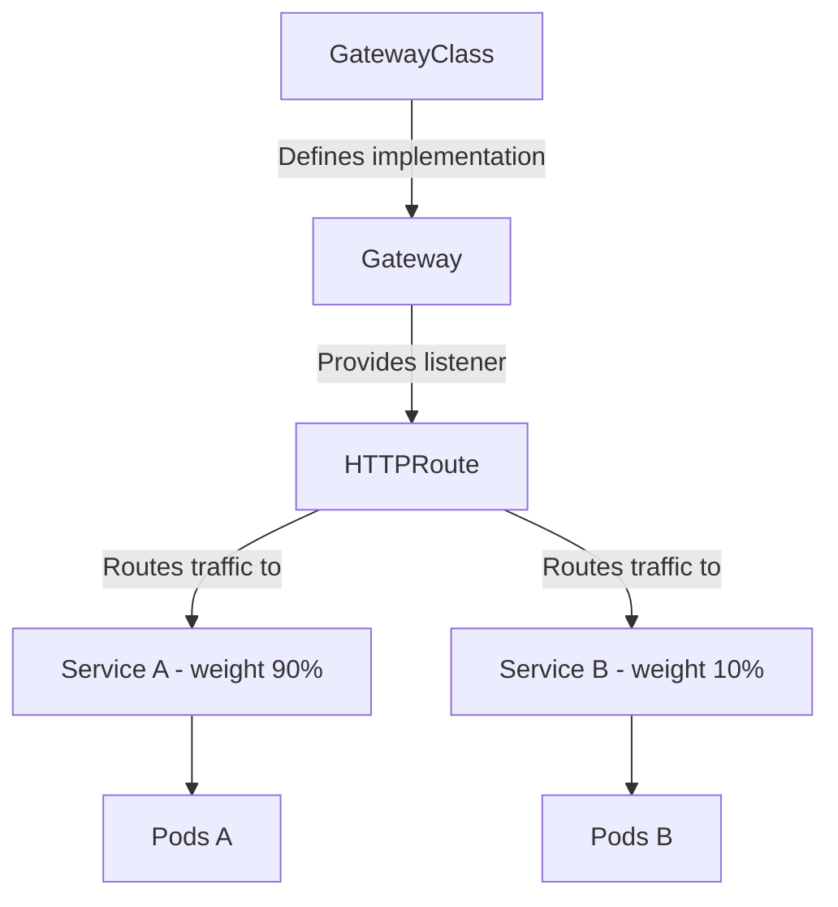

# How to Debug GKE Gateway API Routing Misconfigurations and Traffic Splitting Failures

Author: [nawazdhandala](https://www.github.com/nawazdhandala)

Tags: GKE, Kubernetes, Gateway API, Traffic Splitting, Routing, Load Balancing, Troubleshooting, GCP

Description: Diagnose and fix routing misconfigurations and traffic splitting failures when using the Gateway API in GKE, covering HTTPRoute issues, backend references, and weight-based routing.

---

The Gateway API is the successor to Ingress in Kubernetes, and GKE has built strong support for it. But with more power comes more complexity - routing rules, traffic splitting, header-based matching, and cross-namespace references all introduce new ways for things to break. If your traffic is not reaching the right backends or your canary deployment is getting 100% traffic instead of 10%, something is misconfigured.

Let's debug the most common Gateway API issues in GKE.

## How the Gateway API Works in GKE

The Gateway API separates concerns into distinct resources:



- **GatewayClass** - defines which controller handles the Gateway (GKE provides `gke-l7-global-external-managed`, `gke-l7-regional-external-managed`, etc.)
- **Gateway** - an instance of a load balancer
- **HTTPRoute** - defines routing rules that attach to a Gateway

## Step 1 - Check Gateway Status

Start by verifying the Gateway is ready:

```bash
# Check Gateway status
kubectl get gateway your-gateway -n your-namespace

# Get detailed status including conditions and addresses
kubectl describe gateway your-gateway -n your-namespace
```

Look at the conditions:

```bash
# Check specific conditions
kubectl get gateway your-gateway -n your-namespace -o jsonpath='{.status.conditions[*]}'
```

The Gateway should have:
- `Accepted: True` - the GatewayClass controller accepted the Gateway
- `Programmed: True` - the load balancer is configured and ready

If `Accepted` is False, check the GatewayClass:

```bash
# Verify the GatewayClass exists
kubectl get gatewayclass

# Check if you are using the right class name
kubectl get gateway your-gateway -o jsonpath='{.spec.gatewayClassName}'
```

Available GKE GatewayClasses:
- `gke-l7-global-external-managed` - Global external HTTP(S) load balancer
- `gke-l7-regional-external-managed` - Regional external HTTP(S) load balancer
- `gke-l7-rilb` - Internal HTTP(S) load balancer
- `gke-l7-gxlb` - Classic global external load balancer

## Step 2 - Verify HTTPRoute Attachment

The HTTPRoute must be attached to a Gateway. Check the route status:

```bash
# Check HTTPRoute status
kubectl get httproute your-route -n your-namespace

# Get detailed status including parent references
kubectl describe httproute your-route -n your-namespace
```

The route status should show `Accepted: True` for the parent Gateway. If not:

```yaml
# HTTPRoute correctly attached to a Gateway
apiVersion: gateway.networking.k8s.io/v1
kind: HTTPRoute
metadata:
  name: your-route
  namespace: your-namespace
spec:
  parentRefs:
  - name: your-gateway
    namespace: gateway-namespace  # required if Gateway is in a different namespace
    sectionName: https           # must match a Gateway listener name
  hostnames:
  - "example.com"
  rules:
  - matches:
    - path:
        type: PathPrefix
        value: /api
    backendRefs:
    - name: api-service
      port: 80
```

Common attachment failures:
- **Wrong parentRef name or namespace** - must exactly match the Gateway
- **sectionName mismatch** - must match a listener name on the Gateway
- **Hostname conflict** - the hostname does not match any Gateway listener

## Step 3 - Fix Routing Rule Mismatches

If the Gateway and HTTPRoute are healthy but traffic goes to the wrong backend, the issue is in the routing rules.

Check what rules are configured:

```bash
# Display the full HTTPRoute spec
kubectl get httproute your-route -n your-namespace -o yaml
```

**Path matching issues:**

```yaml
# PathPrefix match - matches /api, /api/users, /api/v2
rules:
- matches:
  - path:
      type: PathPrefix
      value: /api
  backendRefs:
  - name: api-service
    port: 80

# Exact match - only matches exactly /api (not /api/ or /api/users)
- matches:
  - path:
      type: Exact
      value: /api
  backendRefs:
  - name: api-service
    port: 80
```

**Header matching issues:**

```yaml
# Route based on header value
rules:
- matches:
  - headers:
    - type: Exact
      name: x-version
      value: "v2"
  backendRefs:
  - name: api-v2-service
    port: 80
# Default route for requests without the header
- backendRefs:
  - name: api-v1-service
    port: 80
```

Rules are evaluated in order. The first matching rule wins. Make sure your more specific rules come before catch-all rules.

## Step 4 - Fix Traffic Splitting Issues

Traffic splitting in the Gateway API uses weights on backendRefs:

```yaml
# 90/10 traffic split between two services
apiVersion: gateway.networking.k8s.io/v1
kind: HTTPRoute
metadata:
  name: canary-route
spec:
  parentRefs:
  - name: your-gateway
  hostnames:
  - "example.com"
  rules:
  - backendRefs:
    - name: stable-service
      port: 80
      weight: 90
    - name: canary-service
      port: 80
      weight: 10
```

If traffic splitting is not working correctly:

**Both services must have healthy backends:**

```bash
# Check that both services have endpoints
kubectl get endpoints stable-service -n your-namespace
kubectl get endpoints canary-service -n your-namespace
```

If one service has no endpoints, all traffic goes to the other service regardless of weights. The Gateway controller skips backends with no healthy endpoints.

**Weight values must be correct:**

Weights are relative. Weight 90 and 10 gives 90%/10%. Weight 9 and 1 also gives 90%/10%. But weight 0 means that backend gets no traffic at all.

```yaml
# Gradual rollout - start with 5% to canary
backendRefs:
- name: stable-service
  port: 80
  weight: 95
- name: canary-service
  port: 80
  weight: 5
```

**Check the load balancer backend configuration:**

```bash
# Verify the Cloud Load Balancer URL map reflects the traffic split
gcloud compute url-maps list --format="table(name, defaultService)"

# Check backend service weights
gcloud compute url-maps describe URL_MAP_NAME --format json | \
  python3 -c "import json,sys; print(json.dumps(json.load(sys.stdin).get('pathMatchers',[]), indent=2))"
```

## Step 5 - Fix Cross-Namespace References

Gateway API supports cross-namespace references, but they require explicit permission through ReferenceGrant:

```yaml
# HTTPRoute in namespace "routes" referencing a Service in namespace "apps"
apiVersion: gateway.networking.k8s.io/v1
kind: HTTPRoute
metadata:
  name: cross-ns-route
  namespace: routes
spec:
  parentRefs:
  - name: my-gateway
    namespace: gateway-infra
  rules:
  - backendRefs:
    - name: app-service
      namespace: apps      # cross-namespace reference
      port: 80
```

Without a ReferenceGrant, the cross-namespace reference is denied:

```yaml
# ReferenceGrant in the target namespace allowing references from routes namespace
apiVersion: gateway.networking.k8s.io/v1beta1
kind: ReferenceGrant
metadata:
  name: allow-routes-namespace
  namespace: apps          # namespace being referenced
spec:
  from:
  - group: gateway.networking.k8s.io
    kind: HTTPRoute
    namespace: routes      # namespace making the reference
  to:
  - group: ""
    kind: Service
```

Check if ReferenceGrants exist:

```bash
# List ReferenceGrants in the target namespace
kubectl get referencegrant -n apps
```

## Step 6 - Debug with Gateway Controller Logs

Check the GKE Gateway controller logs for configuration errors:

```bash
# Check Gateway controller logs
kubectl logs -n kube-system -l app=gke-gateway-controller --tail=100
```

Also check for events related to your resources:

```bash
# Check events in the namespace
kubectl get events -n your-namespace --sort-by='.lastTimestamp'
```

## Step 7 - Fix TLS Configuration

If HTTPS traffic is not working, check the TLS configuration on the Gateway:

```yaml
# Gateway with TLS listener
apiVersion: gateway.networking.k8s.io/v1
kind: Gateway
metadata:
  name: secure-gateway
spec:
  gatewayClassName: gke-l7-global-external-managed
  listeners:
  - name: https
    protocol: HTTPS
    port: 443
    tls:
      mode: Terminate
      certificateRefs:
      - kind: Secret
        name: tls-cert
        # Or use a Google-managed certificate
    allowedRoutes:
      namespaces:
        from: Same
  - name: http
    protocol: HTTP
    port: 80
    allowedRoutes:
      namespaces:
        from: Same
```

Make sure the TLS secret exists:

```bash
# Verify the TLS secret exists
kubectl get secret tls-cert -n your-namespace

# Check it has the right keys
kubectl get secret tls-cert -n your-namespace -o jsonpath='{.data}' | python3 -c "import json,sys; print(list(json.load(sys.stdin).keys()))"
```

The secret must have `tls.crt` and `tls.key` entries.

## Step 8 - Verify End-to-End

After making fixes, test the full routing path:

```bash
# Get the Gateway's external IP
GATEWAY_IP=$(kubectl get gateway your-gateway -n your-namespace -o jsonpath='{.status.addresses[0].value}')

# Test routing with curl
curl -v -H "Host: example.com" http://$GATEWAY_IP/api/

# Test traffic splitting by making multiple requests
for i in $(seq 1 100); do
  curl -s -H "Host: example.com" http://$GATEWAY_IP/ | grep -o "version=[^ ]*"
done | sort | uniq -c
```

The traffic splitting test should show a distribution roughly matching your weights. With 90/10 weights, you should see approximately 90 responses from the stable service and 10 from the canary.

## Step 9 - Handle Propagation Delays

Gateway API changes take time to propagate to the underlying Cloud Load Balancer. After modifying an HTTPRoute:

- Route additions: 1-3 minutes
- Weight changes: 2-5 minutes
- Backend changes: 5-10 minutes (health checks need to pass)

```bash
# Watch the HTTPRoute status for changes
kubectl get httproute your-route -n your-namespace -w
```

Wait for the `Programmed: True` condition before testing.

## Diagnostic Summary

When Gateway API routing is not working:

1. Verify Gateway is `Accepted` and `Programmed`
2. Check HTTPRoute attachment status to the Gateway
3. Verify parentRef name, namespace, and sectionName match
4. Check routing rule path and header matching
5. For traffic splitting, verify all backends have healthy endpoints
6. For cross-namespace references, create ReferenceGrants
7. Check Gateway controller logs and events
8. Allow time for propagation after changes

The Gateway API has more explicit status reporting than Ingress. Check the `.status.conditions` and `.status.parents` fields on your HTTPRoutes - they usually tell you exactly what is wrong.
