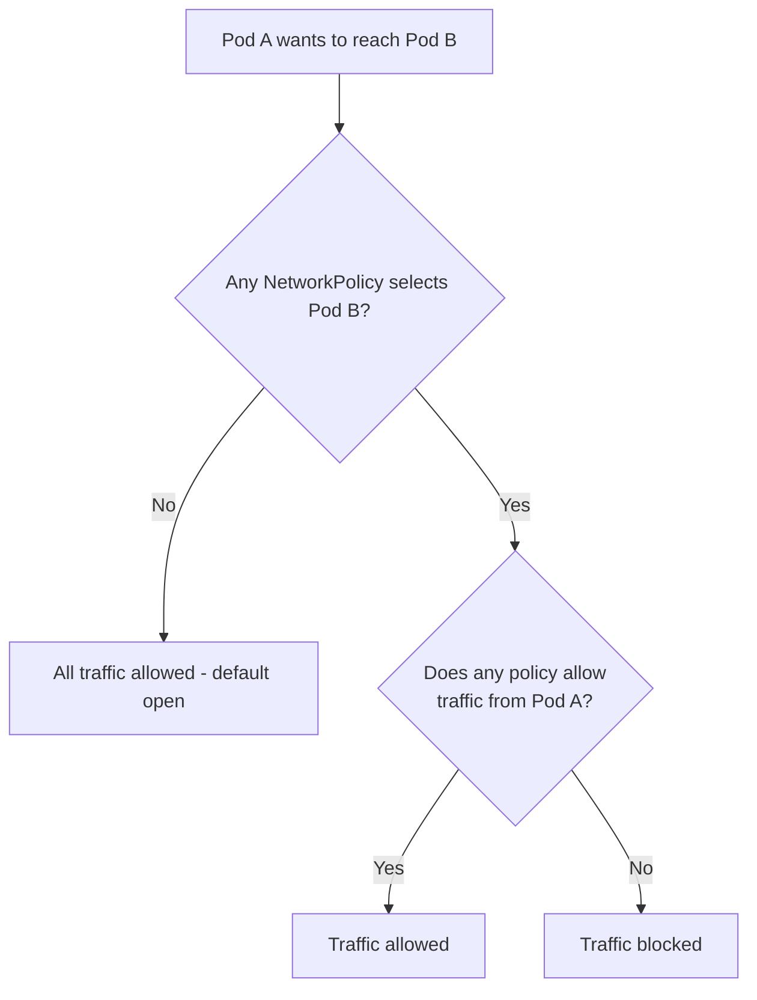

# How to Debug GKE Network Policy Blocking Pod-to-Pod Traffic

Author: [nawazdhandala](https://www.github.com/nawazdhandala)

Tags: GKE, Kubernetes, Network Policy, Networking, Security, Troubleshooting, GCP

Description: Learn how to identify and fix GKE network policies that are unintentionally blocking pod-to-pod communication, with practical debugging steps and policy examples.

---

Everything was working, then someone applied a network policy and now pods cannot talk to each other. Or maybe you intentionally set up network policies for security, but they are blocking more traffic than expected. Either way, you need to figure out which policy is causing the block and how to fix it without opening up the network entirely.

## How Network Policies Work in GKE

Network policies in Kubernetes are allowlist-based. Once any network policy selects a pod, all traffic to that pod is denied by default unless explicitly allowed by a policy rule.



The key insight: if you create a network policy that selects a pod but only allows ingress from certain sources, all other ingress to that pod gets blocked. This is where most accidental blocks come from.

## Prerequisites - Ensure Network Policy Is Enabled

GKE does not enforce network policies by default. Verify it is enabled:

```bash
# Check if network policy is enabled on the cluster
gcloud container clusters describe your-cluster \
  --zone us-central1-a \
  --format="value(networkPolicy.enabled, addonsConfig.networkPolicyConfig.disabled)"
```

If not enabled, network policies are created but have no effect:

```bash
# Enable network policy on an existing cluster
gcloud container clusters update your-cluster \
  --update-addons=NetworkPolicy=ENABLED \
  --zone us-central1-a

# Also enable on the node pool
gcloud container clusters update your-cluster \
  --enable-network-policy \
  --zone us-central1-a
```

Note: If you are using GKE Dataplane V2, network policy enforcement is built in and does not need a separate enable step.

## Step 1 - Reproduce and Confirm the Block

First, confirm that the traffic is actually being blocked by network policies rather than some other issue:

```bash
# Deploy a debug pod in the source namespace
kubectl run debug-client --image=busybox:1.36 --rm -it --restart=Never -n source-namespace -- sh

# From inside the debug pod, try to reach the target pod
wget -T 5 -O- http://target-service.target-namespace.svc.cluster.local:8080/healthz
# Or use nc for a raw TCP test
nc -zv target-pod-ip 8080
```

If the connection times out (not connection refused), it is likely a network policy block. Connection refused means the port is not open, which is a different issue.

## Step 2 - List All Network Policies

Find all network policies in the target pod's namespace:

```bash
# List all network policies in the target namespace
kubectl get networkpolicy -n target-namespace

# Get detailed info on each policy
kubectl describe networkpolicy -n target-namespace
```

Pay attention to:
- **podSelector** - which pods does this policy apply to?
- **policyTypes** - does it restrict Ingress, Egress, or both?
- **ingress rules** - what incoming traffic is allowed?
- **egress rules** - what outgoing traffic is allowed?

## Step 3 - Match the Target Pod to Policies

Figure out which policies select the target pod:

```bash
# Get the target pod's labels
kubectl get pod target-pod -n target-namespace --show-labels

# Check each network policy's podSelector
kubectl get networkpolicy -n target-namespace -o json | \
  python3 -c "
import json, sys
data = json.load(sys.stdin)
for item in data['items']:
    selector = item['spec'].get('podSelector', {}).get('matchLabels', {})
    print(f\"{item['metadata']['name']}: selects {selector}\")
"
```

If a policy has an empty podSelector (`{}`), it selects all pods in the namespace. That is a common source of surprise.

## Step 4 - Analyze the Blocking Policy

Let's say you found a policy like this:

```yaml
# This policy only allows traffic from pods with label role=frontend
apiVersion: networking.k8s.io/v1
kind: NetworkPolicy
metadata:
  name: allow-frontend-only
  namespace: target-namespace
spec:
  podSelector:
    matchLabels:
      app: backend
  policyTypes:
  - Ingress
  ingress:
  - from:
    - podSelector:
        matchLabels:
          role: frontend
    ports:
    - protocol: TCP
      port: 8080
```

This policy says: "For pods labeled `app=backend`, only allow ingress on port 8080 from pods labeled `role=frontend` in the same namespace." If your source pod does not have the `role=frontend` label, its traffic gets blocked.

## Step 5 - Fix the Policy

There are several ways to fix this depending on your intent.

**Allow traffic from another namespace**: Use a namespaceSelector:

```yaml
# Allow ingress from pods in a specific namespace
apiVersion: networking.k8s.io/v1
kind: NetworkPolicy
metadata:
  name: allow-from-monitoring
  namespace: target-namespace
spec:
  podSelector:
    matchLabels:
      app: backend
  policyTypes:
  - Ingress
  ingress:
  - from:
    # Allow from pods with specific labels in any namespace labeled env=production
    - namespaceSelector:
        matchLabels:
          env: production
      podSelector:
        matchLabels:
          role: frontend
    # Also allow from the monitoring namespace
    - namespaceSelector:
        matchLabels:
          name: monitoring
    ports:
    - protocol: TCP
      port: 8080
```

Important: when `namespaceSelector` and `podSelector` are in the same `from` entry (same YAML list item), they are ANDed. When they are in separate entries, they are ORed.

```yaml
# AND logic - must match BOTH namespace AND pod selector
ingress:
- from:
  - namespaceSelector:      # both conditions in same list item
      matchLabels:
        env: production
    podSelector:             # this is AND
      matchLabels:
        role: frontend

# OR logic - match EITHER namespace OR pod selector
ingress:
- from:
  - namespaceSelector:      # separate list items
      matchLabels:
        env: production
  - podSelector:             # this is OR
      matchLabels:
        role: frontend
```

This AND vs OR distinction trips up almost everyone. Double-check your indentation.

## Step 6 - Test With a Permissive Policy

If you need to quickly unblock traffic while you figure out the right policy, create a temporary permissive policy:

```yaml
# Temporary: allow all ingress to the target pod (remove after debugging)
apiVersion: networking.k8s.io/v1
kind: NetworkPolicy
metadata:
  name: temp-allow-all
  namespace: target-namespace
spec:
  podSelector:
    matchLabels:
      app: backend
  policyTypes:
  - Ingress
  ingress:
  - {}  # allow all ingress
```

Network policies are additive. This policy does not override the existing restrictive policy - it adds an additional allow rule. So the pod will accept traffic matching either policy.

## Step 7 - Debug Egress Policies

Do not forget that egress policies on the source pod can also block traffic. If the source namespace has a default-deny egress policy:

```bash
# Check egress policies in the source namespace
kubectl get networkpolicy -n source-namespace -o yaml | grep -A 5 "policyTypes"
```

If there is an egress restriction, you need to allow egress to the target:

```yaml
# Allow egress from source pods to the target namespace
apiVersion: networking.k8s.io/v1
kind: NetworkPolicy
metadata:
  name: allow-egress-to-backend
  namespace: source-namespace
spec:
  podSelector:
    matchLabels:
      app: frontend
  policyTypes:
  - Egress
  egress:
  - to:
    - namespaceSelector:
        matchLabels:
          name: target-namespace
    ports:
    - protocol: TCP
      port: 8080
  # Also allow DNS resolution
  - to:
    - namespaceSelector: {}
      podSelector:
        matchLabels:
          k8s-app: kube-dns
    ports:
    - protocol: UDP
      port: 53
    - protocol: TCP
      port: 53
```

Always remember to include DNS egress when restricting egress. Without it, pods cannot resolve service names and all service communication breaks.

## Step 8 - Label Your Namespaces

Network policies reference namespaces by label, not by name. Make sure your namespaces are labeled:

```bash
# Label namespaces for use in network policies
kubectl label namespace production env=production
kubectl label namespace monitoring name=monitoring
kubectl label namespace kube-system name=kube-system
```

In newer Kubernetes versions (1.22+), the `kubernetes.io/metadata.name` label is automatically applied to all namespaces, which you can use in selectors:

```yaml
# Use the automatic namespace name label
namespaceSelector:
  matchLabels:
    kubernetes.io/metadata.name: monitoring
```

## Debugging Checklist

When pod-to-pod traffic is blocked:

1. Confirm the block is from network policy (timeout, not connection refused)
2. List all policies in the target pod's namespace
3. Identify which policies select the target pod
4. Check ingress rules on the target side
5. Check egress rules on the source side
6. Verify AND vs OR logic in from/to selectors
7. Make sure DNS egress is allowed in egress policies
8. Ensure namespaces have the labels your policies reference

Network policies are powerful but the syntax is subtle. The AND vs OR behavior on selectors is the number one cause of bugs. When in doubt, test with a permissive policy first, then tighten it down.
