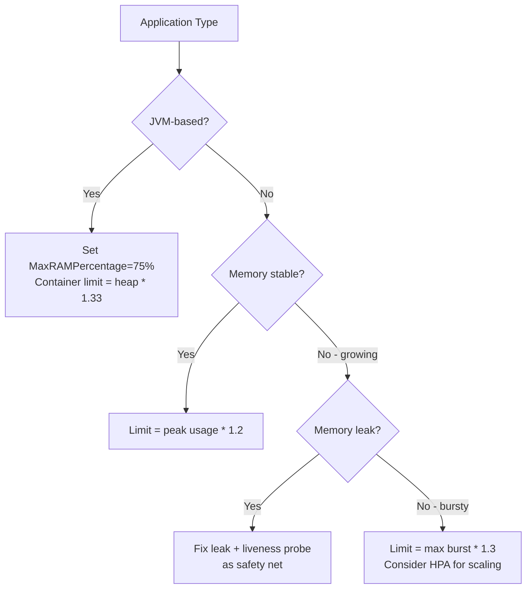

# How to Debug OOMKilled Errors in GKE Containers and Set Correct Memory Limits

Author: [nawazdhandala](https://www.github.com/nawazdhandala)

Tags: GKE, Kubernetes, OOMKilled, Memory Management, Troubleshooting, GCP

Description: Learn how to diagnose OOMKilled errors in GKE containers, understand why they happen, and set memory limits that balance stability with efficient resource usage.

---

You check your pod status and see "OOMKilled" staring back at you. The container ran out of memory and the kernel killed it. This is probably the most common runtime failure in Kubernetes, and it can be frustrating because the container just dies - no graceful shutdown, no helpful error message, just a restart.

Let's go through how to figure out why it happened and how to set memory limits that actually work.

## What OOMKilled Actually Means

There are two scenarios that lead to OOMKilled:

1. **Container exceeds its memory limit** - Kubernetes sets a memory limit on the container's cgroup. When the container tries to allocate memory beyond that limit, the Linux OOM killer steps in and terminates the process.

2. **Node-level OOM** - If the node itself runs out of memory (all pods combined are using more than available), the kubelet evicts pods. This is less common in GKE because the kubelet reserves memory for system components, but it can happen with aggressive overcommitment.

You can tell which one happened by checking the pod status:

```bash
# Check the termination reason for OOMKilled pods
kubectl get pod your-pod-name -n your-namespace -o jsonpath='{.status.containerStatuses[0].lastState.terminated.reason}'
```

If it returns "OOMKilled", the container hit its memory limit.

## Step 1 - Check Current Memory Configuration

Start by looking at what memory limits are set on the container:

```bash
# Display memory requests and limits for pods in a namespace
kubectl get pods -n your-namespace -o custom-columns=\
NAME:.metadata.name,\
MEM_REQ:.spec.containers[0].resources.requests.memory,\
MEM_LIM:.spec.containers[0].resources.limits.memory,\
STATUS:.status.phase
```

If you see a limit like "256Mi" on a Java application, there is your problem. Many applications, especially JVM-based ones, need significantly more memory than you might expect.

## Step 2 - Understand Actual Memory Usage

Check the real memory consumption of your running pods before they get killed:

```bash
# Show actual memory usage of pods in the namespace
kubectl top pods -n your-namespace --sort-by=memory
```

If the pod keeps getting OOMKilled before you can catch it with kubectl top, you need to look at metrics over time. If you have Cloud Monitoring enabled (which is the default in GKE), query the container memory usage metrics:

```bash
# Query memory usage metrics from Cloud Monitoring
gcloud monitoring metrics list \
  --filter='metric.type="kubernetes.io/container/memory/used_bytes"'
```

Or look at it in the GKE Workloads dashboard in the Cloud Console. The memory usage graph will show you the pattern leading up to the OOM event.

## Step 3 - Identify the Memory Leak or Spike

There are a few common patterns:

**Gradual increase until OOM** - This is a memory leak. The application allocates memory over time and never releases it. You will see a steady upward line in the memory graph.

**Sudden spike** - A particular request or operation causes a large allocation. Common with image processing, CSV parsing, or loading large datasets into memory.

**Immediate OOM on startup** - The application needs more memory than the limit just to start. Common with JVM apps that have a large heap, or applications that load large models or caches on startup.

Here is a quick way to check if a pod is repeatedly getting OOMKilled:

```bash
# Check restart count and last termination reason
kubectl get pods -n your-namespace -o custom-columns=\
NAME:.metadata.name,\
RESTARTS:.status.containerStatuses[0].restartCount,\
LAST_STATE:.status.containerStatuses[0].lastState.terminated.reason
```

## Step 4 - Set Correct Memory Limits

The right approach depends on the pattern you found.

For applications with predictable, stable memory usage, set the limit close to the observed peak plus 20% headroom:

```yaml
# Memory limit based on observed peak usage plus headroom
apiVersion: apps/v1
kind: Deployment
metadata:
  name: stable-app
spec:
  template:
    spec:
      containers:
      - name: app
        resources:
          requests:
            memory: "512Mi"   # typical usage
          limits:
            memory: "768Mi"   # peak usage + 20% headroom
```

For JVM applications, you need to account for both heap and non-heap memory. The container limit must be higher than the JVM max heap:

```yaml
# JVM application - container limit must exceed heap + metaspace + threads
apiVersion: apps/v1
kind: Deployment
metadata:
  name: java-app
spec:
  template:
    spec:
      containers:
      - name: app
        image: your-java-app:latest
        # Tell the JVM to respect container memory limits
        env:
        - name: JAVA_OPTS
          value: >-
            -XX:MaxRAMPercentage=75.0
            -XX:+UseContainerSupport
        resources:
          requests:
            memory: "1Gi"
          limits:
            memory: "1536Mi"  # JVM needs ~25-30% overhead beyond heap
```

The `-XX:MaxRAMPercentage=75.0` flag tells the JVM to use at most 75% of available container memory for the heap, leaving the rest for metaspace, thread stacks, native memory, and other overhead.

## Step 5 - Handle Memory Leaks

If your application has a genuine memory leak, increasing the limit only delays the inevitable. You should fix the leak, but in the meantime, you can use a few strategies:

Set up a liveness probe that checks memory usage and restarts the pod proactively:

```yaml
# Liveness probe that restarts the pod before it hits OOM
apiVersion: apps/v1
kind: Deployment
metadata:
  name: leaky-app
spec:
  template:
    spec:
      containers:
      - name: app
        livenessProbe:
          exec:
            command:
            - /bin/sh
            - -c
            # Restart if RSS memory exceeds 900MB (limit is 1Gi)
            - "[ $(cat /sys/fs/cgroup/memory/memory.usage_in_bytes) -lt 943718400 ]"
          initialDelaySeconds: 60
          periodSeconds: 30
        resources:
          limits:
            memory: "1Gi"
```

This gives the pod a graceful restart before the OOM killer steps in, which means it gets to handle SIGTERM properly instead of being killed with SIGKILL.

## Step 6 - Use the Vertical Pod Autoscaler

GKE's Vertical Pod Autoscaler (VPA) can automatically recommend or even set memory limits based on historical usage:

```yaml
# VPA in recommendation mode to get memory limit suggestions
apiVersion: autoscaling.k8s.io/v1
kind: VerticalPodAutoscaler
metadata:
  name: your-app-vpa
  namespace: your-namespace
spec:
  targetRef:
    apiVersion: apps/v1
    kind: Deployment
    name: your-app
  updatePolicy:
    updateMode: "Off"  # just recommendations, no automatic changes
  resourcePolicy:
    containerPolicies:
    - containerName: app
      minAllowed:
        memory: "128Mi"
      maxAllowed:
        memory: "4Gi"
```

After running in "Off" mode for a day or two, check the recommendations:

```bash
# Get VPA recommendations for memory and CPU
kubectl get vpa your-app-vpa -n your-namespace -o yaml | grep -A 20 recommendation
```

The VPA gives you three values - lowerBound, target, and upperBound. Use the target for your request and the upperBound for your limit.

## Step 7 - Monitor with Cloud Monitoring

Set up alerting before pods hit their limits:

```bash
# Create alert for containers approaching memory limit
gcloud alpha monitoring policies create \
  --display-name="Container Memory Usage High" \
  --condition-display-name="Container memory above 85% of limit" \
  --condition-filter='metric.type="kubernetes.io/container/memory/used_bytes" AND resource.type="k8s_container"' \
  --condition-threshold-comparison=COMPARISON_GT \
  --notification-channels="CHANNEL_ID"
```

You can also build a dashboard in Cloud Monitoring that shows memory usage as a percentage of the memory limit for each container. This lets you spot containers that are creeping toward their limits before they get killed.

## Common Pitfalls

A few things that catch people off guard:

- **tmpfs volumes count toward memory limits.** If you use emptyDir with medium: Memory, writes to that volume consume container memory.
- **Go applications can look like they are leaking.** The Go runtime does not always return memory to the OS immediately. Check the Go runtime metrics, not just the process RSS.
- **Init containers share the same memory limit.** If your init container needs 2Gi for a migration but your app needs 512Mi, the limit must accommodate the init container.
- **Sidecar containers share the pod's total resources.** Istio proxies, log collectors, and other sidecars all consume memory within the pod.

## Quick Reference

Here is a summary of recommended memory limit strategies by application type:



OOMKilled errors are frustrating but predictable once you understand the memory characteristics of your application. Measure first, then set limits based on real data rather than guessing.
