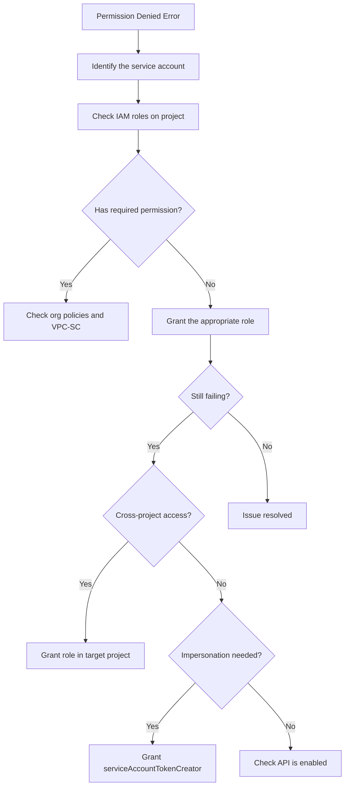

# How to Debug Service Account Permission Issues in Google Cloud IAM

Author: [nawazdhandala](https://www.github.com/nawazdhandala)

Tags: GCP, IAM, Service Accounts, Permissions, Troubleshooting

Description: A practical guide to debugging service account permission issues in Google Cloud IAM, covering role bindings, impersonation, key management, and common pitfalls.

---

Service accounts are the backbone of authentication in GCP. Every application, CI/CD pipeline, and automated process uses them. And when they do not have the right permissions, everything breaks. The tricky part is figuring out exactly which permission is missing and at which level it needs to be granted.

I have spent more hours debugging service account issues than I care to admit. Here is the systematic approach I have developed.

## Understanding the Error

Service account permission errors come in several flavors:

```
ERROR: (gcloud.compute.instances.list) PERMISSION_DENIED:
Required 'compute.instances.list' permission for 'projects/my-project'
```

```
googleapiclient.errors.HttpError: <HttpError 403 when requesting
https://www.googleapis.com/compute/v1/projects/my-project/zones/us-central1-a/instances
returned "Required 'compute.instances.list' permission for 'projects/my-project'">
```

```
Error: caller does not have permission to act as service account 'my-sa@my-project.iam.gserviceaccount.com'
```

Each tells you something different. The first two mean the service account lacks a specific permission. The third means a user or another service account cannot impersonate the target service account.

## Step 1: Identify Which Service Account Is Being Used

The first question is always: which service account is actually making the request? This is not always obvious.

```bash
# Check what credentials are active in your gcloud session
gcloud auth list

# Check if a service account key file is being used
echo $GOOGLE_APPLICATION_CREDENTIALS

# Check the default service account for Compute Engine VMs
gcloud compute instances describe my-vm \
    --zone=us-central1-a \
    --format="value(serviceAccounts.email)"
```

Common places where the service account identity comes from:
- **gcloud CLI**: Uses whatever account you authenticated with
- **Application code**: Uses the `GOOGLE_APPLICATION_CREDENTIALS` environment variable or default credentials
- **Compute Engine VMs**: Uses the VM's attached service account
- **GKE pods**: Uses the node's service account or Workload Identity
- **Cloud Run/Functions**: Uses the service's configured service account

## Step 2: Check the Service Account's IAM Roles

Once you know which service account is involved, check its permissions:

```bash
# List all IAM bindings for a service account on a project
gcloud projects get-iam-policy my-project \
    --flatten="bindings[].members" \
    --filter="bindings.members:serviceAccount:my-sa@my-project.iam.gserviceaccount.com" \
    --format="table(bindings.role)"
```

This shows project-level roles. But remember, permissions in GCP are hierarchical. The service account might have roles at the organization, folder, or individual resource level too.

```bash
# Check roles at the organization level (if you have access)
gcloud organizations get-iam-policy ORG_ID \
    --flatten="bindings[].members" \
    --filter="bindings.members:serviceAccount:my-sa@my-project.iam.gserviceaccount.com" \
    --format="table(bindings.role)"
```

## Step 3: Determine Which Permission Is Needed

The error message usually tells you the specific permission (e.g., `compute.instances.list`). But sometimes it does not. In that case, check the API documentation for the operation you are trying to perform.

You can also use the IAM Policy Troubleshooter:

```bash
# Use the Policy Troubleshooter API to check a specific permission
# This tells you exactly why a permission is allowed or denied
gcloud policy-troubleshoot iam \
    //cloudresourcemanager.googleapis.com/projects/my-project \
    --principal-email=my-sa@my-project.iam.gserviceaccount.com \
    --permission=compute.instances.list
```

The troubleshooter output shows you every IAM policy that affects the decision, including organization-level policies and conditional bindings.

## Step 4: Grant the Required Role

Once you know what is missing, grant the appropriate role:

```bash
# Grant a specific role to the service account
# Use the most restrictive role that includes the needed permission
gcloud projects add-iam-binding my-project \
    --member="serviceAccount:my-sa@my-project.iam.gserviceaccount.com" \
    --role="roles/compute.viewer"
```

Prefer predefined roles over primitive roles (editor/viewer/owner). They follow the principle of least privilege:

```bash
# Good: Specific predefined role
gcloud projects add-iam-binding my-project \
    --member="serviceAccount:my-sa@my-project.iam.gserviceaccount.com" \
    --role="roles/cloudsql.client"

# Bad: Overly broad primitive role
# Avoid this unless absolutely necessary
gcloud projects add-iam-binding my-project \
    --member="serviceAccount:my-sa@my-project.iam.gserviceaccount.com" \
    --role="roles/editor"
```

## Common Service Account Pitfalls

### Default Service Account Confusion

GCP creates default service accounts automatically. Compute Engine creates `PROJECT_NUMBER-compute@developer.gserviceaccount.com` and App Engine creates `PROJECT_ID@appspot.gserviceaccount.com`. These have the Editor role by default, but Google recommends removing that and assigning specific roles.

```bash
# List all service accounts in a project
gcloud iam service-accounts list --project=my-project
```

### Cross-Project Access

If your service account needs to access resources in another project, you need to grant roles in that other project:

```bash
# Grant a service account from project-a access to resources in project-b
gcloud projects add-iam-binding project-b \
    --member="serviceAccount:my-sa@project-a.iam.gserviceaccount.com" \
    --role="roles/storage.objectViewer"
```

### Impersonation Chain

Sometimes service account A needs to act as service account B. This requires the `iam.serviceAccountTokenCreator` role:

```bash
# Allow service account A to impersonate service account B
gcloud iam service-accounts add-iam-policy-binding \
    sa-b@my-project.iam.gserviceaccount.com \
    --member="serviceAccount:sa-a@my-project.iam.gserviceaccount.com" \
    --role="roles/iam.serviceAccountTokenCreator"
```

### Workload Identity in GKE

If you are running on GKE with Workload Identity, the Kubernetes service account needs to be linked to the Google service account:

```bash
# Bind a Kubernetes service account to a Google service account
gcloud iam service-accounts add-iam-policy-binding \
    my-gsa@my-project.iam.gserviceaccount.com \
    --member="serviceAccount:my-project.svc.id.goog[my-namespace/my-ksa]" \
    --role="roles/iam.workloadIdentityUser"
```

## Debugging Flowchart



## Audit Logging

When all else fails, check the audit logs. They show every API call and whether it succeeded or failed, along with the identity that made the request:

```bash
# Query audit logs for permission denied events
# This shows the exact service account and permission that was denied
gcloud logging read \
    'protoPayload.status.code=7 AND protoPayload.@type="type.googleapis.com/google.cloud.audit.AuditLog"' \
    --project=my-project \
    --limit=20 \
    --format="table(timestamp, protoPayload.authenticationInfo.principalEmail, protoPayload.methodName, protoPayload.status.message)"
```

The audit logs are your best friend for debugging service account issues. They tell you exactly what happened, when, and why it failed. Make it your first stop after checking the basic IAM bindings.
