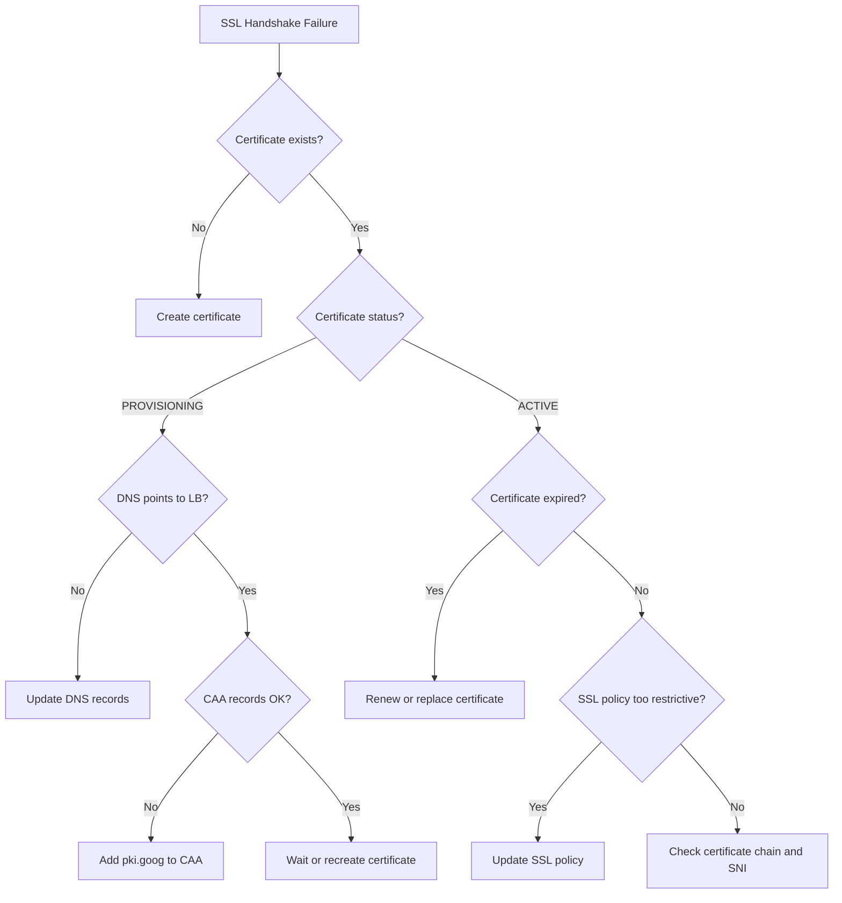

# How to Debug SSL Handshake Failures on Google Cloud Global External Application Load Balancer

Author: [nawazdhandala](https://www.github.com/nawazdhandala)

Tags: GCP, Load Balancer, SSL, TLS, Certificates, HTTPS, Troubleshooting

Description: How to diagnose and fix SSL/TLS handshake failures on the Google Cloud Global External Application Load Balancer, covering certificate issues, protocol mismatches, and configuration errors.

---

SSL handshake failures on your Google Cloud Load Balancer result in clients seeing errors like "ERR_SSL_PROTOCOL_ERROR", "SSL_ERROR_HANDSHAKE_FAILURE_ALERT", or just a connection refused. The request never reaches your backend because the TLS negotiation between the client and the load balancer fails. Here is how to track down and fix these issues.

## How SSL Works on the Load Balancer

The Google Cloud Global External Application Load Balancer terminates SSL/TLS at the edge. This means the TLS handshake happens between the client and Google's frontend servers, not your backend. The load balancer then forwards the request to your backend over HTTP or HTTPS (depending on your configuration).

The key components:
- **SSL certificate** attached to the HTTPS proxy
- **SSL policy** that controls minimum TLS version and cipher suites
- **Target HTTPS proxy** that ties certificates to forwarding rules

## Step 1: Test the SSL Handshake

From your local machine, test the handshake directly:

```bash
# Test SSL connection and show certificate details
openssl s_client -connect your-domain.com:443 -servername your-domain.com

# Get just the certificate information
openssl s_client -connect your-domain.com:443 -servername your-domain.com 2>/dev/null | openssl x509 -noout -text

# Test with a specific TLS version
openssl s_client -connect your-domain.com:443 -servername your-domain.com -tls1_2
openssl s_client -connect your-domain.com:443 -servername your-domain.com -tls1_3
```

Common error messages and what they mean:
- `no peer certificate available` - no certificate is configured for this domain
- `certificate verify failed` - certificate chain is incomplete or untrusted
- `sslv3 alert handshake failure` - no common cipher suites or TLS versions
- `tlsv1 alert internal error` - certificate provisioning issue on GCP side

## Step 2: Check Certificate Status

```bash
# List all SSL certificates
gcloud compute ssl-certificates list \
    --project=my-project \
    --format="table(name, type, managed.status, managed.domainStatus, expireTime)"
```

For Google-managed certificates, check the provisioning status:

```bash
# Get detailed certificate status
gcloud compute ssl-certificates describe my-cert \
    --project=my-project \
    --format=json
```

The `managed.status` field tells you:
- `ACTIVE` - certificate is working
- `PROVISIONING` - certificate is being issued (this can take up to 24 hours for new domains)
- `FAILED_NOT_VISIBLE` - domain DNS is not pointing to the load balancer
- `FAILED_CAA_CHECKING` - CAA records prevent certificate issuance
- `FAILED_CAA_FORBIDDEN` - CAA records explicitly forbid issuance
- `FAILED_RATE_LIMITED` - too many certificate requests

## Step 3: Fix Certificate Provisioning Issues

### Domain Not Pointing to Load Balancer

Google-managed certificates require the domain to point to the load balancer's IP address.

```bash
# Get the load balancer's IP address
gcloud compute forwarding-rules describe my-forwarding-rule \
    --global \
    --format="value(IPAddress)" \
    --project=my-project
```

```bash
# Check what the domain currently resolves to
dig your-domain.com A
dig your-domain.com AAAA

# Compare with the load balancer IP
# If they do not match, update your DNS records
```

### CAA Record Issues

CAA (Certificate Authority Authorization) records can prevent Google from issuing certificates.

```bash
# Check CAA records
dig your-domain.com CAA

# Check parent domain CAA records
dig example.com CAA
```

If CAA records exist, they must include `pki.goog` to allow Google-managed certificates:

```
; Add this CAA record to your DNS
your-domain.com. IN CAA 0 issue "pki.goog"
```

### Certificate Stuck in PROVISIONING

If a certificate has been provisioning for more than a few hours:

```bash
# Delete and recreate the certificate
gcloud compute ssl-certificates delete my-cert --project=my-project

gcloud compute ssl-certificates create my-cert \
    --domains=your-domain.com,www.your-domain.com \
    --global \
    --project=my-project

# Attach it to the target HTTPS proxy
gcloud compute target-https-proxies update my-https-proxy \
    --ssl-certificates=my-cert \
    --global \
    --project=my-project
```

## Step 4: Check SSL Policy Configuration

An overly restrictive SSL policy can prevent clients from connecting.

```bash
# Check the SSL policy attached to the proxy
gcloud compute target-https-proxies describe my-https-proxy \
    --global \
    --format="value(sslPolicy)" \
    --project=my-project

# Get the SSL policy details
gcloud compute ssl-policies describe my-ssl-policy \
    --format="json(profile, minTlsVersion, enabledFeatures, customFeatures)" \
    --project=my-project
```

If your SSL policy requires TLS 1.3 and some clients only support TLS 1.2, those clients will fail to connect.

```bash
# List available SSL policy profiles
gcloud compute ssl-policies list-available-features

# Create a compatible SSL policy
gcloud compute ssl-policies create compatible-policy \
    --profile=COMPATIBLE \
    --min-tls-version=1.0 \
    --project=my-project

# Or create a more secure policy that still supports TLS 1.2
gcloud compute ssl-policies create modern-policy \
    --profile=MODERN \
    --min-tls-version=1.2 \
    --project=my-project

# Attach the policy to the HTTPS proxy
gcloud compute target-https-proxies update my-https-proxy \
    --ssl-policy=modern-policy \
    --global \
    --project=my-project
```

## Step 5: Verify Certificate Chain Completeness

For self-managed (uploaded) certificates, an incomplete certificate chain causes handshake failures.

```bash
# Check the certificate chain
openssl s_client -connect your-domain.com:443 -servername your-domain.com -showcerts 2>/dev/null

# Verify the chain is complete
openssl verify -CAfile /etc/ssl/certs/ca-certificates.crt <(openssl s_client -connect your-domain.com:443 -servername your-domain.com 2>/dev/null | openssl x509)
```

If the chain is incomplete, upload a new certificate with the full chain:

```bash
# Upload certificate with complete chain
gcloud compute ssl-certificates create my-cert-v2 \
    --certificate=fullchain.pem \
    --private-key=private.key \
    --global \
    --project=my-project
```

The `fullchain.pem` should contain your certificate followed by intermediate certificates, in order.

## Step 6: Check for Expired Certificates

```bash
# Check certificate expiration
gcloud compute ssl-certificates list \
    --project=my-project \
    --format="table(name, type, expireTime)"

# Check from the client side
echo | openssl s_client -connect your-domain.com:443 -servername your-domain.com 2>/dev/null | openssl x509 -noout -dates
```

Google-managed certificates auto-renew. Self-managed certificates do not - you need to upload replacements before they expire.

## Step 7: Check for SNI (Server Name Indication) Issues

If you have multiple certificates on the same load balancer, SNI determines which certificate is served.

```bash
# Test with a specific SNI hostname
openssl s_client -connect <lb-ip>:443 -servername your-domain.com

# Test without SNI (some old clients)
openssl s_client -connect <lb-ip>:443
```

If the wrong certificate is being served, check how certificates are attached:

```bash
# See which certificates are on the HTTPS proxy
gcloud compute target-https-proxies describe my-https-proxy \
    --global \
    --format="json(sslCertificates)" \
    --project=my-project
```

The first certificate in the list is the default (served when SNI does not match). Make sure your certificates cover all the domains you serve.

## Step 8: Check Load Balancer Logs

```bash
# Search for SSL handshake errors in logs
gcloud logging read \
    'resource.type="http_load_balancer" AND jsonPayload.statusDetails:"ssl"' \
    --project=my-project \
    --limit=20 \
    --format="json(httpRequest, jsonPayload.statusDetails)"
```

## Debugging Flowchart



SSL handshake failures are almost always a certificate or DNS issue. Google-managed certificates are easier to maintain since they auto-renew, but they require DNS to be correctly configured first. For self-managed certificates, make sure you upload the full chain and track the expiration date.
