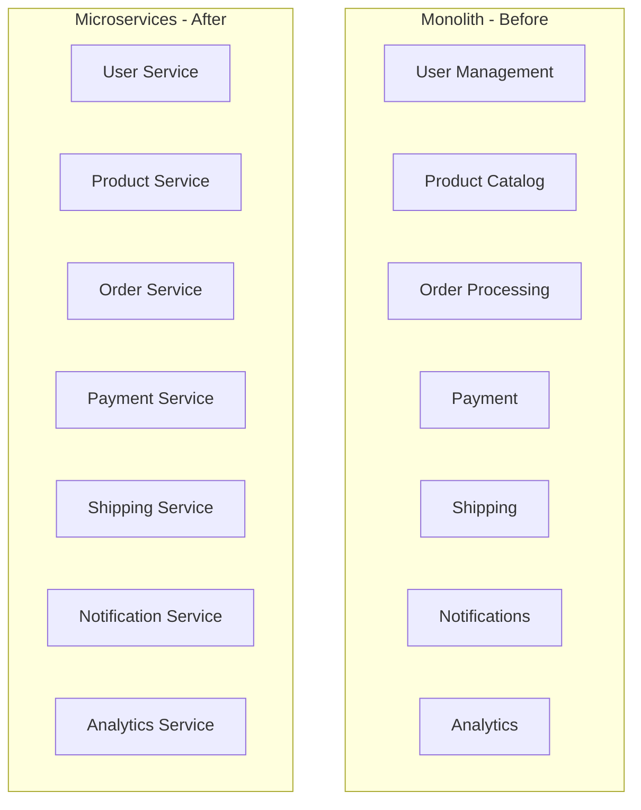
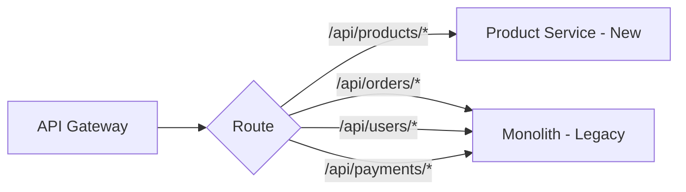
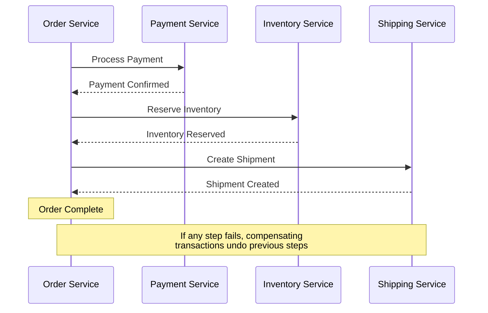

# How to Decompose a Monolithic Application into Microservices on Google Kubernetes Engine

Author: [nawazdhandala](https://www.github.com/nawazdhandala)

Tags: GCP, GKE, Microservices, Kubernetes, Architecture

Description: A practical guide to breaking down a monolithic application into microservices and deploying them on Google Kubernetes Engine.

---

Breaking a monolith into microservices is one of those things that sounds simple in theory but gets complicated fast in practice. The goal is not to have microservices for the sake of it - the goal is to let different parts of your application scale independently, deploy independently, and be owned by different teams. Google Kubernetes Engine provides the platform to run those microservices, but the harder work is figuring out where to draw the boundaries. Here is how I approach this.

## When to Decompose

Not every monolith needs to be broken apart. Decompose when:

- Different parts of the application need to scale at different rates (the payment module handles 10x the traffic of the admin panel)
- Multiple teams are stepping on each other's toes in a single codebase
- You want to deploy features independently without coordinating releases
- Parts of the application use different technology stacks or have different performance requirements

Do not decompose just because microservices are trendy. A well-structured monolith deployed on GKE works perfectly fine for many teams.

## Step 1 - Identify Service Boundaries

The first step is figuring out where to split. Domain-Driven Design (DDD) provides the best framework for this through the concept of bounded contexts.

Look at your monolith and identify distinct business domains:



For each potential service, ask:

1. Can this domain function independently with its own data?
2. Does this domain have a clear API boundary?
3. Would a different team own this service?
4. Does this domain have different scaling requirements?

## Step 2 - Start with the Strangler Fig Pattern

Do not try to decompose everything at once. Extract one service at a time while the monolith continues to run. The strangler fig pattern lets you gradually migrate functionality.



Set up the routing layer on GKE:

```yaml
# Ingress configuration to route traffic between monolith and new services
apiVersion: networking.k8s.io/v1
kind: Ingress
metadata:
  name: app-ingress
  annotations:
    kubernetes.io/ingress.class: "gce"
spec:
  rules:
    - host: api.myapp.com
      http:
        paths:
          # New Product Service handles product routes
          - path: /api/products
            pathType: Prefix
            backend:
              service:
                name: product-service
                port:
                  number: 80
          # Everything else still goes to the monolith
          - path: /
            pathType: Prefix
            backend:
              service:
                name: monolith
                port:
                  number: 80
```

## Step 3 - Extract the First Service

Pick a service that has the fewest dependencies on other parts of the monolith. The Product Catalog is often a good candidate because it is mostly read-heavy with well-defined data.

Create the service with its own database:

```yaml
# product-service deployment on GKE
apiVersion: apps/v1
kind: Deployment
metadata:
  name: product-service
  labels:
    app: product-service
spec:
  replicas: 3
  selector:
    matchLabels:
      app: product-service
  template:
    metadata:
      labels:
        app: product-service
    spec:
      containers:
        - name: product-service
          image: gcr.io/my-project/product-service:v1
          ports:
            - containerPort: 8080
          env:
            # Each microservice gets its own database
            - name: DB_HOST
              valueFrom:
                secretKeyRef:
                  name: product-db-credentials
                  key: host
            - name: DB_NAME
              value: "products"
          resources:
            requests:
              cpu: "250m"
              memory: "512Mi"
            limits:
              cpu: "1000m"
              memory: "1Gi"
          readinessProbe:
            httpGet:
              path: /health
              port: 8080
            initialDelaySeconds: 10
            periodSeconds: 5
---
apiVersion: v1
kind: Service
metadata:
  name: product-service
spec:
  selector:
    app: product-service
  ports:
    - port: 80
      targetPort: 8080
```

Set up the database for the new service:

```bash
# Create a dedicated Cloud SQL instance for the product service
gcloud sql instances create product-db \
  --database-version POSTGRES_15 \
  --tier db-custom-2-8192 \
  --region us-central1 \
  --availability-type REGIONAL

gcloud sql databases create products --instance product-db
```

## Step 4 - Handle Data Separation

The trickiest part of decomposition is separating the data. The monolith likely has a single database with tables that span multiple domains.

### Approach 1 - Database per Service from Day One

Create a separate database for each service and migrate the relevant tables:

```sql
-- Extract product-related tables from the monolith database
-- to the new product service database

-- In the product service database, create the schema
CREATE TABLE products (
    id SERIAL PRIMARY KEY,
    name VARCHAR(255) NOT NULL,
    description TEXT,
    price DECIMAL(10,2) NOT NULL,
    category_id INTEGER,
    created_at TIMESTAMP DEFAULT CURRENT_TIMESTAMP
);

CREATE TABLE categories (
    id SERIAL PRIMARY KEY,
    name VARCHAR(100) NOT NULL,
    parent_id INTEGER REFERENCES categories(id)
);

-- Migrate data from the monolith database
-- Use pg_dump to export specific tables
-- pg_dump -h monolith-db -t products -t categories myapp > products_data.sql
-- psql -h product-db products < products_data.sql
```

### Approach 2 - Shared Database as a Transition

During the transition, both the monolith and the new service can read from the same database, but only the new service writes to the extracted tables:

```python
# In the monolith, replace direct database queries for products
# with HTTP calls to the Product Service

# Before (monolith code):
# products = db.query("SELECT * FROM products WHERE category_id = ?", category_id)

# After (monolith calls the product service via HTTP):
import requests

def get_products_by_category(category_id):
    response = requests.get(
        f"http://product-service/api/products",
        params={"category_id": category_id},
        timeout=5
    )
    response.raise_for_status()
    return response.json()
```

## Step 5 - Inter-Service Communication

Microservices need to communicate. You have two main options on GKE:

### Synchronous (HTTP/gRPC)

```python
# Service-to-service HTTP call within GKE
# Kubernetes DNS resolves service names automatically

import requests

def get_user_details(user_id):
    # "user-service" is the Kubernetes Service name
    response = requests.get(
        f"http://user-service/api/users/{user_id}",
        timeout=3
    )
    return response.json()
```

### Asynchronous (Pub/Sub)

```python
# Event-driven communication using Cloud Pub/Sub
from google.cloud import pubsub_v1
import json

publisher = pubsub_v1.PublisherClient()
topic_path = publisher.topic_path('my-project', 'order-events')

def publish_order_created(order):
    """Publish an event when an order is created.
    Other services subscribe to react to this event."""
    data = json.dumps({
        "event_type": "order.created",
        "order_id": order.id,
        "customer_id": order.customer_id,
        "total": float(order.total),
        "items": [
            {"product_id": item.product_id, "quantity": item.quantity}
            for item in order.items
        ]
    }).encode('utf-8')

    publisher.publish(topic_path, data)
```

For workflows that span multiple services, use the Saga pattern:



## Step 6 - Set Up Observability

With microservices, debugging gets harder because a single request flows through multiple services. Set up distributed tracing and centralized logging:

```yaml
# Deploy OpenTelemetry Collector on GKE for distributed tracing
apiVersion: apps/v1
kind: DaemonSet
metadata:
  name: otel-collector
spec:
  selector:
    matchLabels:
      app: otel-collector
  template:
    metadata:
      labels:
        app: otel-collector
    spec:
      containers:
        - name: collector
          image: otel/opentelemetry-collector-contrib:latest
          env:
            - name: GOOGLE_CLOUD_PROJECT
              value: "my-project"
```

Add tracing to each service:

```python
# Add OpenTelemetry tracing to your service
from opentelemetry import trace
from opentelemetry.exporter.cloud_trace import CloudTraceSpanExporter
from opentelemetry.sdk.trace import TracerProvider
from opentelemetry.sdk.trace.export import BatchSpanProcessor

# Configure the tracer to export to Cloud Trace
provider = TracerProvider()
processor = BatchSpanProcessor(CloudTraceSpanExporter())
provider.add_span_processor(processor)
trace.set_tracer_provider(provider)

tracer = trace.get_tracer("product-service")

# Use the tracer in your service code
@app.route("/api/products/<product_id>")
def get_product(product_id):
    with tracer.start_as_current_span("get_product") as span:
        span.set_attribute("product.id", product_id)
        product = db.get_product(product_id)
        return jsonify(product)
```

## Step 7 - Deploy Incrementally

Use GKE's capabilities for safe rollouts:

```yaml
# Rolling update strategy for each microservice
spec:
  strategy:
    type: RollingUpdate
    rollingUpdate:
      maxSurge: 1        # Add at most 1 extra pod during update
      maxUnavailable: 0   # Never have fewer pods than desired count
```

## Common Decomposition Mistakes

- **Making services too small.** If two services always deploy together and change together, they should probably be one service.
- **Not separating the data.** Microservices that share a database are just a distributed monolith with network calls.
- **Ignoring the testing story.** Integration testing across microservices is harder than testing a monolith. Plan for contract testing.
- **Skipping the API gateway.** Exposing individual microservice endpoints directly creates a maintenance headache. Use an API gateway for external traffic.

Decomposing a monolith is a journey, not a project. Extract services one at a time, validate each extraction in production, and keep the monolith running for everything else. The strangler fig pattern lets you make progress without taking big risks.
