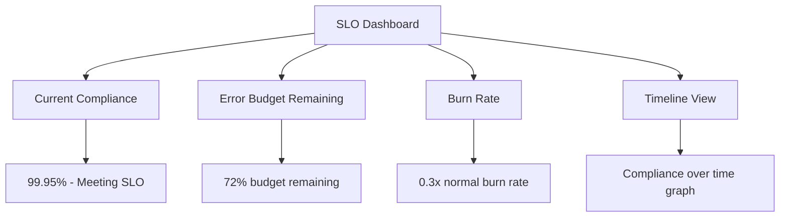

# How to Define and Monitor Service Level Objectives in Google Cloud Monitoring

Author: [nawazdhandala](https://www.github.com/nawazdhandala)

Tags: GCP, SLO, Cloud Monitoring, SRE, Service Level Objectives, Google Cloud

Description: A comprehensive guide to defining and monitoring Service Level Objectives in Google Cloud Monitoring using SLIs, SLOs, and error budgets.

---

Service Level Objectives are the backbone of site reliability engineering. They take the fuzzy concept of "the service should be reliable" and turn it into something measurable and actionable. Google Cloud Monitoring has built-in SLO support that lets you define objectives, track compliance in real time, and alert on error budget consumption. In this post, I will show you how to set up SLOs properly on Google Cloud.

## SLO Concepts in Brief

Before jumping into the configuration, let me clarify the terminology. A Service Level Indicator (SLI) is a measurement of your service's behavior - like the proportion of successful requests or the proportion of requests served within a latency threshold. A Service Level Objective (SLO) is the target you set for your SLI - like "99.9% of requests should succeed." The error budget is the allowed failure - if your SLO is 99.9%, your error budget is 0.1%.

## Prerequisites

- A GCP project with Cloud Monitoring enabled
- An existing service generating metrics (Cloud Run, GKE, App Engine, or custom metrics)
- The Monitoring API enabled

## Step 1: Create a Monitoring Service

Cloud Monitoring organizes SLOs under services. If your service is running on App Engine, Cloud Run, GKE, or Istio, Cloud Monitoring automatically discovers it. For custom services, you create them explicitly.

```bash
# Create a custom service for SLO monitoring
gcloud monitoring services create my-api-service \
    --display-name="My API Service" \
    --project=my-gcp-project
```

For auto-discovered services, list what is already available.

```bash
# List automatically discovered services
gcloud monitoring services list --project=my-gcp-project
```

## Step 2: Define an Availability SLI and SLO

The most common SLI is request-based availability - the percentage of requests that return a successful response.

```bash
# Create an availability SLO: 99.9% of requests should succeed over a rolling 28-day window
gcloud monitoring slos create \
    --service=my-api-service \
    --display-name="Availability SLO - 99.9%" \
    --request-based-sli \
    --good-total-ratio-threshold \
    --good-service-filter='metric.type="loadbalancing.googleapis.com/https/request_count" AND metric.labels.response_code_class="200"' \
    --total-service-filter='metric.type="loadbalancing.googleapis.com/https/request_count"' \
    --goal=0.999 \
    --rolling-period=28d \
    --project=my-gcp-project
```

Let me break down what this creates. The good service filter counts successful requests (2xx responses). The total service filter counts all requests. The goal is 99.9%. And the rolling period is 28 days, meaning the SLO compliance is calculated over a sliding 28-day window.

## Step 3: Define a Latency SLI and SLO

For latency SLOs, you define what "good" means in terms of response time. A request is "good" if it completes within your threshold.

```bash
# Create a latency SLO: 95% of requests should complete within 300ms
gcloud monitoring slos create \
    --service=my-api-service \
    --display-name="Latency SLO - 95% under 300ms" \
    --request-based-sli \
    --distribution-cut \
    --distribution-filter='metric.type="loadbalancing.googleapis.com/https/total_latencies"' \
    --range-min=0 \
    --range-max=300 \
    --goal=0.95 \
    --rolling-period=28d \
    --project=my-gcp-project
```

The distribution cut approach works on distribution metrics (like latency histograms). It counts how many data points fall within the specified range and divides by the total.

## Step 4: Define SLOs Using the API (JSON)

For more complex SLOs, the JSON API gives you full flexibility. Here is an example using the REST API.

```bash
# Create a complex SLO via the API
curl -X POST \
  "https://monitoring.googleapis.com/v3/projects/my-gcp-project/services/my-api-service/serviceLevelObjectives" \
  -H "Authorization: Bearer $(gcloud auth print-access-token)" \
  -H "Content-Type: application/json" \
  -d '{
    "displayName": "Availability SLO - 99.95%",
    "goal": 0.9995,
    "rollingPeriod": "2419200s",
    "serviceLevelIndicator": {
      "requestBased": {
        "goodTotalRatio": {
          "goodServiceFilter": "metric.type=\"appengine.googleapis.com/http/server/response_count\" AND metric.labels.response_code<400",
          "totalServiceFilter": "metric.type=\"appengine.googleapis.com/http/server/response_count\""
        }
      }
    }
  }'
```

## Step 5: Define SLOs Using Terraform

For infrastructure-as-code, use the Terraform Google provider.

```hcl
# Define the service
resource "google_monitoring_custom_service" "api_service" {
  service_id   = "my-api-service"
  display_name = "My API Service"
  project      = var.project_id
}

# Availability SLO
resource "google_monitoring_slo" "availability_slo" {
  service      = google_monitoring_custom_service.api_service.service_id
  slo_id       = "availability-slo"
  display_name = "Availability SLO - 99.9%"
  project      = var.project_id

  # 99.9% target
  goal = 0.999

  # 28-day rolling window
  rolling_period_days = 28

  request_based_sli {
    good_total_ratio {
      # Count successful responses as good
      good_service_filter = "metric.type=\"loadbalancing.googleapis.com/https/request_count\" resource.type=\"https_lb_rule\" metric.labels.response_code_class=\"200\""
      # Count all responses as total
      total_service_filter = "metric.type=\"loadbalancing.googleapis.com/https/request_count\" resource.type=\"https_lb_rule\""
    }
  }
}

# Latency SLO
resource "google_monitoring_slo" "latency_slo" {
  service      = google_monitoring_custom_service.api_service.service_id
  slo_id       = "latency-slo"
  display_name = "Latency SLO - 95% under 300ms"
  project      = var.project_id

  goal = 0.95
  rolling_period_days = 28

  request_based_sli {
    distribution_cut {
      distribution_filter = "metric.type=\"loadbalancing.googleapis.com/https/total_latencies\" resource.type=\"https_lb_rule\""
      range {
        min = 0
        max = 300
      }
    }
  }
}
```

## Understanding the SLO Dashboard

Once your SLOs are created, Cloud Monitoring provides a built-in dashboard that shows several key views.



The compliance percentage shows how your SLI is performing against the SLO target. The error budget remaining tells you how much headroom you have before breaching the SLO. The burn rate shows how fast you are consuming your error budget.

## Step 6: View SLO Status

Check your SLO compliance from the command line.

```bash
# List all SLOs for a service
gcloud monitoring slos list \
    --service=my-api-service \
    --project=my-gcp-project

# Get detailed status of a specific SLO
gcloud monitoring slos describe AVAILABILITY_SLO_ID \
    --service=my-api-service \
    --project=my-gcp-project
```

## Choosing the Right SLO Parameters

**Rolling period vs calendar period.** A rolling period (like 28 days) is continuously calculated and provides a steady view. A calendar period (like a calendar month) resets at the start of each period. Rolling periods are generally preferred because they avoid the "fresh budget" problem at the start of each month.

**Setting the goal.** Do not set your SLO higher than what you actually need. A 99.99% SLO gives you only 4.3 minutes of downtime per month. If your users would tolerate 5 minutes, then 99.9% (8.6 minutes) is more appropriate and gives your team more room to deploy changes and take risks.

**Availability vs latency.** Most services should have both. Availability catches outright failures. Latency catches degradation where the service technically works but is too slow to be useful.

## Common SLI Patterns

Here are practical SLI definitions for common GCP services.

For **Cloud Run** services.

```
# Good: responses with status < 500
# Total: all responses
good_filter: metric.type="run.googleapis.com/request_count" AND metric.labels.response_code_class!="5xx"
total_filter: metric.type="run.googleapis.com/request_count"
```

For **GKE** services with Istio.

```
# Good: requests that succeeded
# Total: all requests
good_filter: metric.type="istio.io/service/server/request_count" AND metric.labels.response_code<500
total_filter: metric.type="istio.io/service/server/request_count"
```

For **custom metrics** from your application.

```
# Good: custom success metric
# Total: custom total metric
good_filter: metric.type="custom.googleapis.com/api/success_count"
total_filter: metric.type="custom.googleapis.com/api/request_count"
```

## Wrapping Up

Defining SLOs in Google Cloud Monitoring gives your team a shared language for talking about reliability. Instead of arguing about whether 3 errors per hour is acceptable, you can look at the SLO dashboard and see whether you are within budget. The setup process - creating a service, defining SLIs, and setting targets - takes minutes but pays off for months. Start with availability and latency SLOs for your most critical user-facing endpoints, and expand from there as your SRE practice matures.
