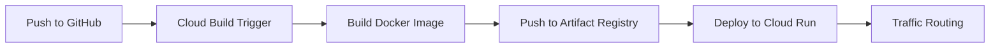

# How to Deploy a Cloud Run Service Automatically Using Cloud Build Triggers

Author: [nawazdhandala](https://www.github.com/nawazdhandala)

Tags: GCP, Cloud Build, Cloud Run, CI/CD, Automatic Deployment, Serverless

Description: Set up a complete CI/CD pipeline that automatically builds, tests, and deploys your application to Cloud Run using Cloud Build triggers.

---

Cloud Run is one of the simplest ways to run containers on Google Cloud, and Cloud Build is the natural CI/CD companion for it. Together, they give you a fully automated pipeline where pushing code to your repository results in a running deployment - no manual steps in between. In this post, I will walk through setting up the entire flow from GitHub push to Cloud Run deployment.

## The Architecture

The automated deployment pipeline looks like this:



Every push to your main branch triggers a build. Cloud Build builds the Docker image, pushes it to Artifact Registry, and then deploys it to Cloud Run. Cloud Run handles the traffic routing, scaling, and HTTPS termination.

## Prerequisites

Before starting, make sure you have:

- A GitHub repository connected to Cloud Build
- A Dockerfile in your repository
- An Artifact Registry repository for Docker images
- The Cloud Run API enabled

```bash
# Enable required APIs
gcloud services enable cloudbuild.googleapis.com
gcloud services enable run.googleapis.com
gcloud services enable artifactregistry.googleapis.com
```

## Setting Up IAM Permissions

The Cloud Build service account needs permission to deploy to Cloud Run. Grant the required roles:

```bash
# Get the Cloud Build service account
PROJECT_NUMBER=$(gcloud projects describe $PROJECT_ID --format='value(projectNumber)')
CB_SA="${PROJECT_NUMBER}@cloudbuild.gserviceaccount.com"

# Grant Cloud Run Admin role for deploying services
gcloud projects add-iam-policy-binding $PROJECT_ID \
  --member="serviceAccount:${CB_SA}" \
  --role="roles/run.admin"

# Grant Service Account User role (needed to act as the Cloud Run runtime service account)
gcloud iam service-accounts add-iam-policy-binding \
  "${PROJECT_NUMBER}-compute@developer.gserviceaccount.com" \
  --member="serviceAccount:${CB_SA}" \
  --role="roles/iam.serviceAccountUser"
```

The second permission is commonly missed. Cloud Build needs to act as the Cloud Run runtime service account when deploying, and the `iam.serviceAccountUser` role grants this ability.

## Writing the cloudbuild.yaml

Here is a complete cloudbuild.yaml that builds, pushes, and deploys to Cloud Run:

```yaml
# Full CI/CD pipeline: build, test, push, and deploy to Cloud Run
steps:
  # Step 1: Build the Docker image
  - name: 'gcr.io/cloud-builders/docker'
    id: 'build'
    args:
      - 'build'
      - '-t'
      - 'us-central1-docker.pkg.dev/$PROJECT_ID/my-repo/my-app:$SHORT_SHA'
      - '.'

  # Step 2: Run tests using the built image
  - name: 'us-central1-docker.pkg.dev/$PROJECT_ID/my-repo/my-app:$SHORT_SHA'
    id: 'test'
    entrypoint: 'npm'
    args: ['test']

  # Step 3: Push the image to Artifact Registry
  - name: 'gcr.io/cloud-builders/docker'
    id: 'push'
    args:
      - 'push'
      - 'us-central1-docker.pkg.dev/$PROJECT_ID/my-repo/my-app:$SHORT_SHA'

  # Step 4: Deploy to Cloud Run
  - name: 'gcr.io/google.com/cloudsdktool/cloud-sdk'
    id: 'deploy'
    args:
      - 'gcloud'
      - 'run'
      - 'deploy'
      - 'my-app'
      - '--image'
      - 'us-central1-docker.pkg.dev/$PROJECT_ID/my-repo/my-app:$SHORT_SHA'
      - '--region'
      - 'us-central1'
      - '--platform'
      - 'managed'

timeout: 1200s
options:
  machineType: 'E2_HIGHCPU_8'
```

## Configuring the Cloud Run Deployment

The gcloud run deploy command accepts many configuration options. Here are the most commonly needed ones:

```yaml
# Deploy with full configuration options
  - name: 'gcr.io/google.com/cloudsdktool/cloud-sdk'
    id: 'deploy'
    args:
      - 'gcloud'
      - 'run'
      - 'deploy'
      - 'my-app'
      - '--image'
      - 'us-central1-docker.pkg.dev/$PROJECT_ID/my-repo/my-app:$SHORT_SHA'
      - '--region'
      - 'us-central1'
      - '--platform'
      - 'managed'
      # Resource limits
      - '--memory'
      - '512Mi'
      - '--cpu'
      - '1'
      # Scaling configuration
      - '--min-instances'
      - '1'
      - '--max-instances'
      - '10'
      # Port configuration
      - '--port'
      - '8080'
      # Environment variables
      - '--set-env-vars'
      - 'NODE_ENV=production,LOG_LEVEL=info'
      # Allow unauthenticated access (public API)
      - '--allow-unauthenticated'
      # Concurrency settings
      - '--concurrency'
      - '80'
      # Timeout for each request
      - '--timeout'
      - '300'
```

### Setting Environment Variables from Secrets

For environment variables that contain sensitive values, reference Secret Manager:

```yaml
  - name: 'gcr.io/google.com/cloudsdktool/cloud-sdk'
    id: 'deploy'
    args:
      - 'gcloud'
      - 'run'
      - 'deploy'
      - 'my-app'
      - '--image'
      - 'us-central1-docker.pkg.dev/$PROJECT_ID/my-repo/my-app:$SHORT_SHA'
      - '--region'
      - 'us-central1'
      # Set regular environment variables
      - '--set-env-vars'
      - 'NODE_ENV=production'
      # Set secret environment variables from Secret Manager
      - '--set-secrets'
      - 'DB_PASSWORD=db-password:latest,API_KEY=api-key:latest'
```

## Creating the Build Trigger

With the cloudbuild.yaml in your repository, create the trigger:

```bash
# Create a trigger that deploys on push to main
gcloud builds triggers create github \
  --name="deploy-my-app" \
  --repo-name="my-app" \
  --repo-owner="my-org" \
  --branch-pattern="^main$" \
  --build-config="cloudbuild.yaml" \
  --description="Build and deploy to Cloud Run on push to main"
```

## Multi-Environment Deployment

A production setup typically deploys to multiple environments. Use substitution variables to make this work with a single cloudbuild.yaml:

```yaml
# Single cloudbuild.yaml for all environments
steps:
  - name: 'gcr.io/cloud-builders/docker'
    args:
      - 'build'
      - '-t'
      - 'us-central1-docker.pkg.dev/$PROJECT_ID/my-repo/my-app:$SHORT_SHA'
      - '.'

  - name: 'gcr.io/cloud-builders/docker'
    args:
      - 'push'
      - 'us-central1-docker.pkg.dev/$PROJECT_ID/my-repo/my-app:$SHORT_SHA'

  - name: 'gcr.io/google.com/cloudsdktool/cloud-sdk'
    args:
      - 'gcloud'
      - 'run'
      - 'deploy'
      - 'my-app-$_ENV'
      - '--image'
      - 'us-central1-docker.pkg.dev/$PROJECT_ID/my-repo/my-app:$SHORT_SHA'
      - '--region'
      - '$_REGION'
      - '--min-instances'
      - '$_MIN_INSTANCES'
      - '--max-instances'
      - '$_MAX_INSTANCES'

substitutions:
  _ENV: 'dev'
  _REGION: 'us-central1'
  _MIN_INSTANCES: '0'
  _MAX_INSTANCES: '5'
```

Create separate triggers for each environment:

```bash
# Staging - auto-deploys on develop branch
gcloud builds triggers create github \
  --name="deploy-staging" \
  --repo-name="my-app" \
  --repo-owner="my-org" \
  --branch-pattern="^develop$" \
  --build-config="cloudbuild.yaml" \
  --substitutions="_ENV=staging,_MIN_INSTANCES=0,_MAX_INSTANCES=3"

# Production - auto-deploys on main branch (add --require-approval for safety)
gcloud builds triggers create github \
  --name="deploy-production" \
  --repo-name="my-app" \
  --repo-owner="my-org" \
  --branch-pattern="^main$" \
  --build-config="cloudbuild.yaml" \
  --substitutions="_ENV=production,_MIN_INSTANCES=2,_MAX_INSTANCES=100" \
  --require-approval
```

## Canary Deployments with Traffic Splitting

Cloud Run supports traffic splitting, which enables canary deployments. Deploy the new revision without routing traffic to it, then gradually shift traffic:

```yaml
# Deploy with no traffic, then gradually shift
steps:
  - name: 'gcr.io/cloud-builders/docker'
    args: ['build', '-t', 'us-central1-docker.pkg.dev/$PROJECT_ID/my-repo/my-app:$SHORT_SHA', '.']

  - name: 'gcr.io/cloud-builders/docker'
    args: ['push', 'us-central1-docker.pkg.dev/$PROJECT_ID/my-repo/my-app:$SHORT_SHA']

  # Deploy the new revision with a tag but no traffic
  - name: 'gcr.io/google.com/cloudsdktool/cloud-sdk'
    id: 'deploy-canary'
    args:
      - 'gcloud'
      - 'run'
      - 'deploy'
      - 'my-app'
      - '--image'
      - 'us-central1-docker.pkg.dev/$PROJECT_ID/my-repo/my-app:$SHORT_SHA'
      - '--region'
      - 'us-central1'
      - '--no-traffic'
      - '--tag'
      - 'canary'

  # Route 10% of traffic to the canary
  - name: 'gcr.io/google.com/cloudsdktool/cloud-sdk'
    id: 'route-canary-traffic'
    args:
      - 'gcloud'
      - 'run'
      - 'services'
      - 'update-traffic'
      - 'my-app'
      - '--region'
      - 'us-central1'
      - '--to-tags'
      - 'canary=10'
```

After monitoring the canary, you can shift 100% traffic in a separate step or manually.

## Rollback Strategy

If a deployment goes wrong, you can quickly roll back by deploying the previous image:

```bash
# Roll back to a specific revision
gcloud run services update-traffic my-app \
  --region=us-central1 \
  --to-revisions=my-app-REVISION_ID=100
```

Include a rollback step in your deployment documentation and make sure the previous image is always available in Artifact Registry.

## Monitoring Deployments

After the deployment step, add a health check:

```yaml
  # Verify the deployment is healthy
  - name: 'gcr.io/google.com/cloudsdktool/cloud-sdk'
    id: 'health-check'
    entrypoint: 'bash'
    args:
      - '-c'
      - |
        # Get the Cloud Run service URL
        URL=$(gcloud run services describe my-app --region=us-central1 --format='value(status.url)')
        echo "Service URL: $$URL"
        # Wait for the service to respond
        for i in {1..10}; do
          STATUS=$(curl -s -o /dev/null -w "%{http_code}" "$$URL/health")
          if [ "$$STATUS" = "200" ]; then
            echo "Health check passed"
            exit 0
          fi
          echo "Attempt $$i: Got status $$STATUS, retrying..."
          sleep 5
        done
        echo "Health check failed after 10 attempts"
        exit 1
```

## Wrapping Up

Automating Cloud Run deployments with Cloud Build triggers gives you a repeatable, auditable deployment process that eliminates manual steps and reduces the chance of human error. The core setup is straightforward - a cloudbuild.yaml with build, push, and deploy steps, connected to a GitHub trigger. Layer on environment-specific configurations with substitution variables, add approval gates for production, and implement canary deployments as your confidence grows. The entire setup takes about 30 minutes and pays for itself with the very first automated deployment.
