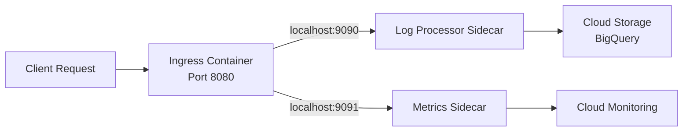

# How to Deploy a Multi-Container Cloud Run Service Using Sidecars for Log Processing

Author: [nawazdhandala](https://www.github.com/nawazdhandala)

Tags: GCP, Cloud Run, Sidecars, Containers, Log Processing

Description: Learn how to deploy a multi-container Cloud Run service with sidecar containers for log processing, metrics collection, and other auxiliary tasks alongside your main application.

---

Cloud Run used to be strictly one container per service. That changed with the introduction of sidecar containers. Now you can run multiple containers in a single Cloud Run service, where one container is the primary (ingress) container that handles HTTP traffic, and additional sidecar containers handle supporting tasks like log processing, metrics forwarding, or authentication proxies.

This pattern is familiar if you have worked with Kubernetes pods, and it opens up a lot of possibilities on Cloud Run.

## How Multi-Container Cloud Run Works

In a multi-container Cloud Run service:

- One container is designated as the **ingress container** - it receives HTTP requests
- One or more **sidecar containers** run alongside it in the same execution environment
- All containers share the same network namespace (they can communicate via localhost)
- Sidecars can depend on the startup of other containers
- Sidecars share the CPU and memory allocated to the service



## Step 1: Prepare the Application Container

Here is a simple Node.js application that sends structured logs to a sidecar via localhost:

```javascript
// app.js - Main application that sends logs to the sidecar
const express = require('express');
const http = require('http');
const app = express();

// Function to send log entries to the sidecar log processor
function sendToLogProcessor(logEntry) {
  const data = JSON.stringify(logEntry);
  const options = {
    hostname: 'localhost',
    port: 9090,
    path: '/logs',
    method: 'POST',
    headers: {
      'Content-Type': 'application/json',
      'Content-Length': data.length
    }
  };

  const req = http.request(options, (res) => {
    // Log processor acknowledged
  });
  req.on('error', (err) => {
    console.error('Failed to send to log processor:', err.message);
  });
  req.write(data);
  req.end();
}

app.get('/', (req, res) => {
  // Send a structured log to the sidecar
  sendToLogProcessor({
    timestamp: new Date().toISOString(),
    method: req.method,
    path: req.path,
    userAgent: req.headers['user-agent'],
    responseTime: Date.now()
  });

  res.json({ status: 'ok', message: 'Hello from the main container' });
});

const PORT = process.env.PORT || 8080;
app.listen(PORT, () => {
  console.log(`Main app listening on port ${PORT}`);
});
```

The Dockerfile for the main app:

```dockerfile
# Dockerfile for the main application
FROM node:20-slim
WORKDIR /app
COPY package*.json ./
RUN npm ci --production
COPY . .
EXPOSE 8080
CMD ["node", "app.js"]
```

## Step 2: Build the Log Processor Sidecar

The sidecar receives log entries from the main application and processes them - batching, enriching, and forwarding to a storage backend:

```python
# log_processor.py - Sidecar that receives and processes application logs
from flask import Flask, request, jsonify
from google.cloud import storage, bigquery
import json
import threading
import time
import os

app = Flask(__name__)

# Buffer for batching log entries
log_buffer = []
buffer_lock = threading.Lock()

# Configuration from environment variables
GCS_BUCKET = os.environ.get('LOG_BUCKET', 'my-app-logs')
BQ_DATASET = os.environ.get('BQ_DATASET', 'app_logs')
BQ_TABLE = os.environ.get('BQ_TABLE', 'request_logs')
FLUSH_INTERVAL = int(os.environ.get('FLUSH_INTERVAL', '30'))
BATCH_SIZE = int(os.environ.get('BATCH_SIZE', '100'))

def flush_logs():
    """Flush buffered logs to Cloud Storage and BigQuery."""
    global log_buffer
    with buffer_lock:
        if not log_buffer:
            return
        batch = log_buffer.copy()
        log_buffer = []

    # Write to Cloud Storage as a JSON lines file
    try:
        client = storage.Client()
        bucket = client.bucket(GCS_BUCKET)
        timestamp = time.strftime('%Y/%m/%d/%H%M%S')
        blob = bucket.blob(f'logs/{timestamp}.jsonl')
        content = '\n'.join(json.dumps(entry) for entry in batch)
        blob.upload_from_string(content)
        print(f'Flushed {len(batch)} logs to GCS')
    except Exception as e:
        print(f'Error writing to GCS: {e}')

def periodic_flush():
    """Run on a timer to flush logs at regular intervals."""
    while True:
        time.sleep(FLUSH_INTERVAL)
        flush_logs()

# Start the background flush thread
flush_thread = threading.Thread(target=periodic_flush, daemon=True)
flush_thread.start()

@app.route('/logs', methods=['POST'])
def receive_log():
    """Receive a log entry from the main application."""
    log_entry = request.get_json()

    # Enrich the log entry with additional context
    log_entry['service'] = os.environ.get('K_SERVICE', 'unknown')
    log_entry['revision'] = os.environ.get('K_REVISION', 'unknown')
    log_entry['processed_at'] = time.time()

    with buffer_lock:
        log_buffer.append(log_entry)

        # Flush if the buffer is full
        if len(log_buffer) >= BATCH_SIZE:
            flush_logs()

    return jsonify({'status': 'accepted'}), 202

@app.route('/health', methods=['GET'])
def health():
    """Health check endpoint."""
    return jsonify({'status': 'healthy', 'buffer_size': len(log_buffer)})

if __name__ == '__main__':
    app.run(host='0.0.0.0', port=9090)
```

Dockerfile for the sidecar:

```dockerfile
# Dockerfile for the log processor sidecar
FROM python:3.12-slim
WORKDIR /app
COPY requirements.txt .
RUN pip install --no-cache-dir -r requirements.txt
COPY log_processor.py .
EXPOSE 9090
CMD ["python", "log_processor.py"]
```

## Step 3: Build and Push the Container Images

Build both images and push them to Artifact Registry:

```bash
# Create an Artifact Registry repository if you do not have one
gcloud artifacts repositories create my-app-repo \
  --repository-format=docker \
  --location=us-central1

# Build and push the main application container
gcloud builds submit ./app \
  --tag=us-central1-docker.pkg.dev/my-project/my-app-repo/main-app:v1

# Build and push the log processor sidecar container
gcloud builds submit ./log-processor \
  --tag=us-central1-docker.pkg.dev/my-project/my-app-repo/log-processor:v1
```

## Step 4: Deploy with a YAML Configuration

Multi-container Cloud Run services require a YAML configuration file. The gcloud command-line flags do not support specifying multiple containers:

```yaml
# service.yaml - Cloud Run service with sidecar container
apiVersion: serving.knative.dev/v1
kind: Service
metadata:
  name: my-app-with-sidecar
  annotations:
    run.googleapis.com/launch-stage: BETA
spec:
  template:
    metadata:
      annotations:
        # Allow the sidecar to use up to 512Mi memory
        run.googleapis.com/container-dependencies: '{"main-app":["log-processor"]}'
    spec:
      containerConcurrency: 80
      containers:
        # Main application container - handles incoming requests
        - name: main-app
          image: us-central1-docker.pkg.dev/my-project/my-app-repo/main-app:v1
          ports:
            - containerPort: 8080
          resources:
            limits:
              cpu: "1"
              memory: "512Mi"
          env:
            - name: NODE_ENV
              value: production

        # Log processor sidecar - runs alongside the main app
        - name: log-processor
          image: us-central1-docker.pkg.dev/my-project/my-app-repo/log-processor:v1
          resources:
            limits:
              cpu: "0.5"
              memory: "256Mi"
          env:
            - name: LOG_BUCKET
              value: my-app-logs
            - name: FLUSH_INTERVAL
              value: "30"
            - name: BATCH_SIZE
              value: "100"
          startupProbe:
            httpGet:
              path: /health
              port: 9090
            initialDelaySeconds: 2
            periodSeconds: 5
```

Deploy the service:

```bash
# Deploy the multi-container service using the YAML configuration
gcloud run services replace service.yaml \
  --region=us-central1
```

## Step 5: Configure Container Dependencies

The `container-dependencies` annotation in the YAML controls startup order. In the example above, `main-app` depends on `log-processor`, meaning the log processor sidecar starts first and must pass its health check before the main app starts.

This is important because the main app tries to send logs to the sidecar on startup. If the sidecar is not ready, those initial log entries would be lost.

## Step 6: Verify the Deployment

Check that the service is running with both containers:

```bash
# Describe the service to see container details
gcloud run services describe my-app-with-sidecar \
  --region=us-central1 \
  --format="yaml(spec.template.spec.containers)"

# Check the service URL
gcloud run services describe my-app-with-sidecar \
  --region=us-central1 \
  --format="value(status.url)"
```

Test the service:

```bash
# Send a request and verify both containers are working
SERVICE_URL=$(gcloud run services describe my-app-with-sidecar \
  --region=us-central1 \
  --format="value(status.url)")

curl "${SERVICE_URL}"
```

Check the logs from both containers:

```bash
# View logs from the main app container
gcloud run services logs read my-app-with-sidecar \
  --region=us-central1 \
  --limit=20

# Filter logs by container name
gcloud logging read 'resource.type="cloud_run_revision" AND resource.labels.service_name="my-app-with-sidecar" AND labels.container_name="log-processor"' \
  --limit=20
```

## Resource Allocation

Both containers share the total CPU and memory allocated to the service. Plan your resource limits accordingly:

- The sum of all container CPU limits should not exceed the service's CPU allocation
- The sum of all container memory limits should not exceed the service's memory allocation
- Sidecars that do minimal work (like log forwarding) typically need 0.25-0.5 CPU and 128-256 Mi memory

## Common Sidecar Patterns

Beyond log processing, here are other useful sidecar patterns on Cloud Run:

- **Authentication proxy** - Run an OAuth2 proxy sidecar that handles auth before forwarding to the main app
- **Metrics exporter** - Collect application metrics and push to Cloud Monitoring
- **Cache layer** - Run a small Redis or Memcached instance as a sidecar for local caching
- **Service mesh proxy** - Run an Envoy sidecar for service-to-service communication

Multi-container Cloud Run brings patterns from the Kubernetes world to a serverless environment. The sidecar model keeps your main application focused on business logic while offloading cross-cutting concerns to specialized containers.
