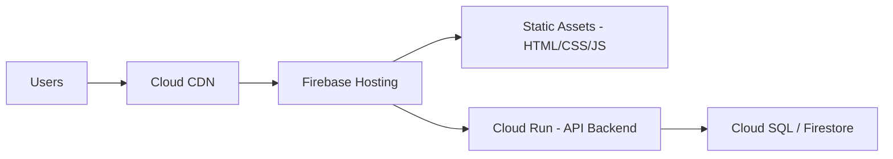

# How to Deploy a Serverless Web Application Using Cloud Run Firebase Hosting and Cloud CDN

Author: [nawazdhandala](https://www.github.com/nawazdhandala)

Tags: GCP, Cloud Run, Firebase Hosting, Cloud CDN, Serverless, Web Application

Description: Learn how to deploy a serverless web application on GCP using Cloud Run for the backend, Firebase Hosting for static assets, and Cloud CDN for global caching.

---

Building a web application on GCP used to mean provisioning VMs, setting up load balancers, configuring autoscaling groups, and managing SSL certificates. With Cloud Run, Firebase Hosting, and Cloud CDN, you can deploy a production-ready web application without managing any servers. Your backend runs on Cloud Run, your static frontend is served through Firebase Hosting, and Cloud CDN caches everything at the edge for fast global delivery.

This post walks through the complete setup, from deploying your backend API to connecting the frontend and configuring CDN caching.

## Architecture Overview



Firebase Hosting serves your static frontend assets (HTML, CSS, JavaScript) and proxies API requests to your Cloud Run backend. Cloud CDN sits in front of everything, caching static assets at edge locations worldwide. This means your users get fast page loads regardless of their location, and your backend only handles actual API requests.

## Step 1: Build and Deploy the Backend on Cloud Run

Start with your backend API. Here is a simple Node.js API:

```javascript
// server.js - Express API backend
const express = require("express");
const app = express();
const port = process.env.PORT || 8080;

// Parse JSON request bodies
app.use(express.json());

// Health check endpoint
app.get("/api/health", (req, res) => {
  res.json({ status: "healthy", timestamp: new Date().toISOString() });
});

// API endpoint for fetching products
app.get("/api/products", (req, res) => {
  // In production, this would query a database
  const products = [
    { id: 1, name: "Widget A", price: 29.99, category: "electronics" },
    { id: 2, name: "Widget B", price: 49.99, category: "electronics" },
    { id: 3, name: "Gadget C", price: 19.99, category: "accessories" },
  ];

  // Set cache control headers for CDN
  res.set("Cache-Control", "public, max-age=60, s-maxage=300");
  res.json(products);
});

// API endpoint for creating orders (no caching)
app.post("/api/orders", (req, res) => {
  const order = req.body;

  // Validate the order
  if (!order.productId || !order.quantity) {
    return res.status(400).json({ error: "Missing productId or quantity" });
  }

  // Process the order (in production, save to database)
  const result = {
    orderId: `ORD-${Date.now()}`,
    productId: order.productId,
    quantity: order.quantity,
    status: "confirmed",
    createdAt: new Date().toISOString(),
  };

  // No caching for write operations
  res.set("Cache-Control", "no-store");
  res.status(201).json(result);
});

app.listen(port, () => {
  console.log(`API server running on port ${port}`);
});
```

Create a Dockerfile:

```dockerfile
# Dockerfile for the API backend
FROM node:20-slim

WORKDIR /app

# Copy package files and install dependencies
COPY package*.json ./
RUN npm ci --only=production

# Copy application code
COPY . .

# Cloud Run sets PORT environment variable
EXPOSE 8080

CMD ["node", "server.js"]
```

Build and deploy to Cloud Run:

```bash
# Build the container image
gcloud builds submit --tag gcr.io/my-project/web-api:latest

# Deploy to Cloud Run
gcloud run deploy web-api \
  --image=gcr.io/my-project/web-api:latest \
  --region=us-central1 \
  --allow-unauthenticated \
  --min-instances=1 \
  --max-instances=10 \
  --memory=512Mi \
  --cpu=1 \
  --project=my-project
```

Note the service URL from the output - you will need it for the Firebase Hosting configuration.

## Step 2: Set Up Firebase Hosting

Initialize Firebase in your project directory:

```bash
# Install the Firebase CLI
npm install -g firebase-tools

# Login to Firebase
firebase login

# Initialize Firebase Hosting
firebase init hosting
```

During initialization, select your GCP project and set the public directory to `public` (or wherever your built static files are).

Create a simple frontend in the `public` directory:

```html
<!-- public/index.html -->
<!DOCTYPE html>
<html lang="en">
<head>
    <meta charset="UTF-8">
    <meta name="viewport" content="width=device-width, initial-scale=1.0">
    <title>My App</title>
    <link rel="stylesheet" href="/styles.css">
</head>
<body>
    <div id="app">
        <h1>Products</h1>
        <div id="products"></div>
    </div>
    <script src="/app.js"></script>
</body>
</html>
```

```javascript
// public/app.js - Frontend JavaScript
async function loadProducts() {
  try {
    // This request goes through Firebase Hosting rewrite to Cloud Run
    const response = await fetch("/api/products");
    const products = await response.json();

    const container = document.getElementById("products");
    container.innerHTML = products
      .map(
        (p) => `
        <div class="product">
          <h3>${p.name}</h3>
          <p>$${p.price.toFixed(2)}</p>
          <p>Category: ${p.category}</p>
        </div>
      `
      )
      .join("");
  } catch (error) {
    console.error("Failed to load products:", error);
  }
}

// Load products when the page loads
document.addEventListener("DOMContentLoaded", loadProducts);
```

## Step 3: Configure Firebase Hosting Rewrites

The key configuration is the Firebase rewrites that proxy API requests to Cloud Run. Edit `firebase.json`:

```json
{
  "hosting": {
    "public": "public",
    "ignore": ["firebase.json", "**/.*", "**/node_modules/**"],
    "rewrites": [
      {
        "source": "/api/**",
        "run": {
          "serviceId": "web-api",
          "region": "us-central1"
        }
      },
      {
        "source": "**",
        "destination": "/index.html"
      }
    ],
    "headers": [
      {
        "source": "**/*.@(jpg|jpeg|gif|png|svg|webp)",
        "headers": [
          {
            "key": "Cache-Control",
            "value": "public, max-age=31536000, immutable"
          }
        ]
      },
      {
        "source": "**/*.@(js|css)",
        "headers": [
          {
            "key": "Cache-Control",
            "value": "public, max-age=31536000, immutable"
          }
        ]
      },
      {
        "source": "**/*.html",
        "headers": [
          {
            "key": "Cache-Control",
            "value": "public, max-age=300"
          }
        ]
      }
    ]
  }
}
```

The `rewrites` section routes all `/api/**` requests to your Cloud Run service. All other requests serve the static `index.html` (for single-page application routing).

The `headers` section sets aggressive caching for static assets. Images, JavaScript, and CSS files are cached for one year (use content hashing in your build process to bust the cache on updates). HTML files are cached for 5 minutes.

## Step 4: Deploy Firebase Hosting

```bash
# Deploy the static frontend to Firebase Hosting
firebase deploy --only hosting

# The output shows your hosting URL:
# Hosting URL: https://my-project.web.app
```

## Step 5: Configure Cloud CDN

Firebase Hosting uses Cloud CDN by default for static assets. But if you want more control over CDN behavior, or if you are using a custom domain with a load balancer, set up Cloud CDN explicitly:

```bash
# Create a serverless NEG for Cloud Run
gcloud compute network-endpoint-groups create web-api-neg \
  --region=us-central1 \
  --network-endpoint-type=serverless \
  --cloud-run-service=web-api \
  --project=my-project

# Create a backend service with CDN enabled
gcloud compute backend-services create web-api-backend \
  --global \
  --load-balancing-scheme=EXTERNAL \
  --project=my-project

gcloud compute backend-services add-backend web-api-backend \
  --global \
  --network-endpoint-group=web-api-neg \
  --network-endpoint-group-region=us-central1 \
  --project=my-project

# Enable Cloud CDN on the backend service
gcloud compute backend-services update web-api-backend \
  --global \
  --enable-cdn \
  --cache-mode=USE_ORIGIN_HEADERS \
  --project=my-project
```

The `USE_ORIGIN_HEADERS` cache mode means Cloud CDN respects the Cache-Control headers set by your Cloud Run service. This gives you fine-grained control over what gets cached and for how long.

## Step 6: Set Up a Custom Domain

Connect a custom domain to Firebase Hosting:

```bash
# Add a custom domain
firebase hosting:channel:deploy production
firebase hosting:sites:list
```

In the Firebase Console, go to Hosting, then Custom domains, and add your domain. Firebase will provide DNS records that you need to add to your domain registrar. SSL certificates are provisioned automatically.

## Step 7: Monitor the Application

Set up monitoring for the full stack:

```bash
# Create an uptime check for the frontend
gcloud monitoring uptime create \
  --display-name="Web App Frontend" \
  --monitored-resource-type="uptime-url" \
  --hostname="my-project.web.app" \
  --path="/" \
  --port=443 \
  --protocol=HTTPS \
  --project=my-project

# Monitor Cloud Run backend metrics via the console
gcloud run services describe web-api \
  --region=us-central1 \
  --format="yaml(status)" \
  --project=my-project
```

## Summary

The combination of Cloud Run, Firebase Hosting, and Cloud CDN gives you a serverless web application architecture that scales automatically, serves content fast globally, and costs nothing when idle. Firebase Hosting handles static assets and proxies API requests to Cloud Run. Cloud CDN caches responses at the edge. You get SSL, custom domains, and automatic scaling without managing a single server. Deploy your frontend to Firebase, your backend to Cloud Run, and let the platform handle the rest.
