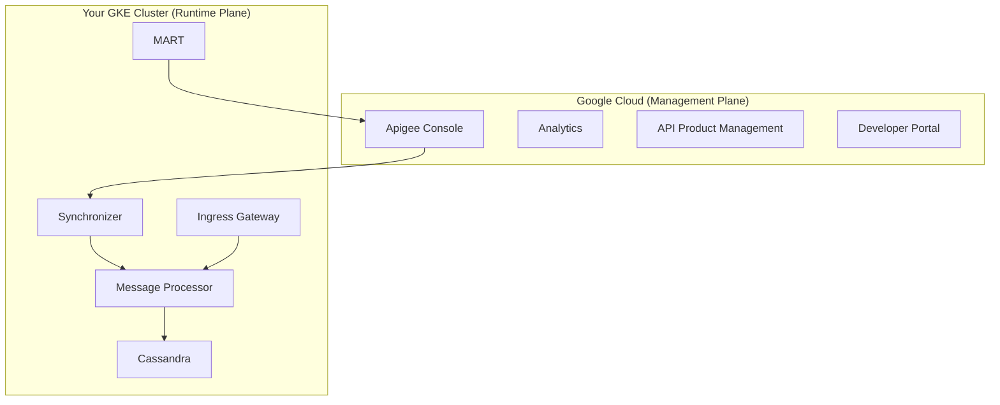

# How to Deploy Apigee Hybrid on a GKE Cluster Step by Step

Author: [nawazdhandala](https://www.github.com/nawazdhandala)

Tags: Apigee, GCP, GKE, Kubernetes, Hybrid Deployment

Description: A complete step-by-step guide to deploying Apigee Hybrid on a GKE cluster for organizations that need API management with data residency or on-premises requirements.

---

Apigee Hybrid gives you the management plane in Google Cloud while running the runtime plane on your own Kubernetes cluster. This is ideal when you need API management capabilities but have requirements around data residency, compliance, or network isolation that prevent a fully cloud-hosted solution. The runtime components run on GKE (or any conformant Kubernetes cluster), processing API traffic locally, while the management plane in Google Cloud handles configuration, analytics, and portal features.

## Architecture Overview

Apigee Hybrid splits into two planes:



- **Message Processor** - handles API proxy execution
- **Cassandra** - stores runtime data (KVMs, OAuth tokens, quotas)
- **Synchronizer** - pulls proxy configurations from the management plane
- **MART** - Management API for Runtime (handles admin operations)
- **Ingress Gateway** - Istio-based gateway that receives API traffic

## Prerequisites

Before starting, make sure you have:

- A GCP project with Apigee organization provisioned
- gcloud CLI installed and authenticated
- kubectl configured
- Helm v3 installed
- A GKE cluster (or the ability to create one)
- A domain name for your API endpoints
- TLS certificates for the domain

## Step 1 - Create the GKE Cluster

The GKE cluster needs enough resources to run Apigee components. The minimum recommended configuration:

```bash
# Create a GKE cluster for Apigee Hybrid
gcloud container clusters create apigee-hybrid \
  --project YOUR_PROJECT_ID \
  --region us-central1 \
  --machine-type e2-standard-4 \
  --num-nodes 3 \
  --enable-autoscaling \
  --min-nodes 3 \
  --max-nodes 6 \
  --enable-ip-alias \
  --workload-pool=YOUR_PROJECT_ID.svc.id.goog \
  --enable-stackdriver-kubernetes

# Get credentials for kubectl
gcloud container clusters get-credentials apigee-hybrid \
  --region us-central1 \
  --project YOUR_PROJECT_ID
```

Key requirements:
- At least 3 nodes with 4 CPUs and 16GB RAM each
- Workload Identity enabled (for secure GCP service access)
- IP aliases enabled (for pod networking)

## Step 2 - Enable Required APIs

```bash
# Enable APIs needed for Apigee Hybrid
gcloud services enable \
  apigee.googleapis.com \
  apigeeconnect.googleapis.com \
  cloudresourcemanager.googleapis.com \
  compute.googleapis.com \
  container.googleapis.com \
  --project YOUR_PROJECT_ID
```

## Step 3 - Create Service Accounts

Apigee Hybrid components need GCP service accounts for authentication.

```bash
PROJECT_ID="YOUR_PROJECT_ID"

# Create service accounts for each Apigee component
declare -A SA_ROLES=(
  ["apigee-synchronizer"]="roles/apigee.synchronizerManager"
  ["apigee-mart"]="roles/apigee.martAdmin"
  ["apigee-udca"]="roles/apigee.analyticsAgent"
  ["apigee-cassandra"]="roles/storage.objectAdmin"
  ["apigee-connect"]="roles/apigeeconnect.Agent"
  ["apigee-logger"]="roles/logging.logWriter"
  ["apigee-metrics"]="roles/monitoring.metricWriter"
)

for SA_NAME in "${!SA_ROLES[@]}"; do
  # Create the service account
  gcloud iam service-accounts create $SA_NAME \
    --display-name="$SA_NAME" \
    --project $PROJECT_ID

  # Grant the required role
  gcloud projects add-iam-binding $PROJECT_ID \
    --member="serviceAccount:${SA_NAME}@${PROJECT_ID}.iam.gserviceaccount.com" \
    --role="${SA_ROLES[$SA_NAME]}"

  # Download the key (store securely)
  gcloud iam service-accounts keys create "${SA_NAME}-key.json" \
    --iam-account="${SA_NAME}@${PROJECT_ID}.iam.gserviceaccount.com"

  echo "Created $SA_NAME with role ${SA_ROLES[$SA_NAME]}"
done
```

## Step 4 - Install cert-manager

Apigee Hybrid uses cert-manager for TLS certificate management within the cluster:

```bash
# Install cert-manager
kubectl apply -f https://github.com/cert-manager/cert-manager/releases/download/v1.13.0/cert-manager.yaml

# Wait for cert-manager to be ready
kubectl wait --for=condition=available --timeout=300s deployment/cert-manager -n cert-manager
kubectl wait --for=condition=available --timeout=300s deployment/cert-manager-webhook -n cert-manager
```

## Step 5 - Download and Configure Apigee Hybrid

Download the Apigee Hybrid setup tools:

```bash
# Download the apigeectl tool
export VERSION=1.12.0
curl -LO "https://storage.googleapis.com/apigee-release/hybrid/apigee-hybrid-setup/${VERSION}/apigeectl_linux_64.tar.gz"

tar -xzf apigeectl_linux_64.tar.gz
mv apigeectl /usr/local/bin/

# Verify installation
apigeectl version
```

## Step 6 - Create the Overrides Configuration

The overrides file is the central configuration for your Apigee Hybrid deployment. It specifies your organization, environment, and component settings.

Create the overrides YAML:

```yaml
# overrides.yaml
gcp:
  projectID: YOUR_PROJECT_ID
  region: us-central1

org: YOUR_ORG_NAME

k8sCluster:
  name: apigee-hybrid
  region: us-central1

instanceID: "hybrid-instance-1"

# Cassandra configuration
cassandra:
  hostNetwork: false
  replicaCount: 3
  storage:
    capacity: 100Gi
    storageClass: standard-rwo
  auth:
    default:
      password: "CHANGE_ME_CASSANDRA_PASSWORD"
    admin:
      password: "CHANGE_ME_ADMIN_PASSWORD"
  backup:
    enabled: true
    serviceAccountPath: ./apigee-cassandra-key.json
    dbStorageBucket: gs://YOUR_PROJECT_ID-apigee-backup

# Ingress gateway configuration
ingressGateways:
  - name: apigee-ingress
    replicaCountMin: 2
    replicaCountMax: 4
    svcAnnotations:
      cloud.google.com/load-balancer-type: "External"

# Environments to deploy
envs:
  - name: prod
    serviceAccountPaths:
      synchronizer: ./apigee-synchronizer-key.json
      udca: ./apigee-udca-key.json
      runtime: ./apigee-synchronizer-key.json

# Virtual hosts - map domains to environments
virtualhosts:
  - name: prod-vhost
    hostAliases:
      - "api.yourdomain.com"
    sslCertPath: ./certs/tls.crt
    sslKeyPath: ./certs/tls.key
    envs:
      - prod

# Synchronizer configuration
synchronizer:
  serviceAccountPath: ./apigee-synchronizer-key.json

# MART configuration
mart:
  serviceAccountPath: ./apigee-mart-key.json

# Connect Agent (management plane communication)
connectAgent:
  serviceAccountPath: ./apigee-connect-key.json

# Telemetry configuration
logger:
  serviceAccountPath: ./apigee-logger-key.json
  enabled: true

metrics:
  serviceAccountPath: ./apigee-metrics-key.json
  enabled: true
```

## Step 7 - Initialize and Deploy

Run the initialization and deployment:

```bash
# Create Kubernetes namespaces and RBAC
apigeectl init -f overrides.yaml

# Wait for init to complete
apigeectl check-ready -f overrides.yaml --wait=300

# Deploy the runtime components
apigeectl apply -f overrides.yaml

# Check deployment status
apigeectl check-ready -f overrides.yaml --wait=600
```

This process takes 10 to 20 minutes. It deploys Cassandra, the message processors, synchronizer, MART, and the ingress gateway.

## Step 8 - Verify the Deployment

Check that all components are running:

```bash
# Check pod status in the Apigee namespaces
kubectl get pods -n apigee
kubectl get pods -n apigee-system

# Check the ingress gateway service
kubectl get svc -n apigee -l app=apigee-ingressgateway

# Verify synchronizer is connected to the management plane
kubectl logs -n apigee -l app=apigee-synchronizer --tail=20
```

## Step 9 - Configure DNS

Get the external IP of the ingress gateway and point your domain to it:

```bash
# Get the external IP
EXTERNAL_IP=$(kubectl get svc apigee-ingress -n apigee -o jsonpath='{.status.loadBalancer.ingress[0].ip}')
echo "Configure DNS: api.yourdomain.com -> $EXTERNAL_IP"
```

Create a DNS A record pointing `api.yourdomain.com` to the external IP address.

## Step 10 - Deploy and Test an API Proxy

Deploy an API proxy through the management plane (Apigee Console or API) and test it through your hybrid runtime:

```bash
# Test the proxy through the hybrid runtime
curl "https://api.yourdomain.com/your-proxy-basepath" \
  -H "x-api-key: YOUR_API_KEY"

# Check the response headers for Apigee-specific info
curl -v "https://api.yourdomain.com/your-proxy-basepath" 2>&1 | grep -i "x-apigee"
```

## Monitoring the Hybrid Deployment

Set up monitoring for the runtime components:

```bash
# View Cassandra health
kubectl exec -it apigee-cassandra-default-0 -n apigee -- nodetool status

# Check message processor logs
kubectl logs -n apigee -l app=apigee-runtime --tail=50

# View synchronizer sync status
kubectl logs -n apigee -l app=apigee-synchronizer --tail=20 | grep "sync"
```

## Upgrading Apigee Hybrid

When a new version is available, upgrade by updating the apigeectl tool and reapplying:

```bash
# Download new version
curl -LO "https://storage.googleapis.com/apigee-release/hybrid/apigee-hybrid-setup/NEW_VERSION/apigeectl_linux_64.tar.gz"

# Apply the upgrade
apigeectl apply -f overrides.yaml
```

Always test upgrades in a non-production environment first.

## Summary

Deploying Apigee Hybrid on GKE gives you enterprise API management with the flexibility of running the runtime on your own infrastructure. The setup involves creating a GKE cluster, configuring service accounts, installing cert-manager, and deploying the Apigee components through apigeectl. Once running, you manage APIs through the Apigee Console just like the fully hosted version, but traffic processing happens on your cluster. The trade-off is operational complexity - you are responsible for the Kubernetes cluster, Cassandra backups, scaling, and upgrades - but for organizations with data residency or network isolation requirements, it is the right approach.
