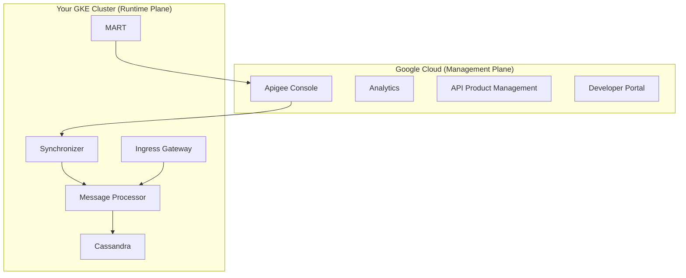

# How to Deploy Apigee Hybrid on a GKE Cluster Step by Step

Author: [nawazdhandala](https://www.github.com/nawazdhandala)

Tags: Apigee, GCP, GKE, Kubernetes, Hybrid Deployment

Description: A complete step-by-step guide to deploying Apigee Hybrid on a GKE cluster for organizations that need API management with data residency or on-premises requirements.

---

Apigee Hybrid gives you the management plane in Google Cloud while running the runtime plane on your own Kubernetes cluster. This is ideal when you need API management capabilities but have requirements around data residency, compliance, or network isolation that prevent a fully cloud-hosted solution. The runtime components run on GKE or another supported Kubernetes platform, processing API traffic locally, while the management plane in Google Cloud handles configuration, analytics, and portal features.

## Architecture Overview

Apigee Hybrid splits into two planes:


```mermaid
graph TB
    subgraph "Google Cloud (Management Plane)"
        A[Apigee Console]
        B[Analytics]
        C[API Product Management]
        D[Developer Portal]
    end

    subgraph "Your GKE Cluster (Runtime Plane)"
        E[Message Processor]
        F[Cassandra]
        G[Synchronizer]
        H[MART]
        I[Ingress Gateway]
    end

    A --> G
    G --> E
    E --> F
    H --> A
    I --> E
```

- **Message Processor** - handles API proxy execution
- **Cassandra** - stores runtime data (KVMs, OAuth tokens, quotas)
- **Synchronizer** - pulls proxy configurations from the management plane
- **MART** - Management API for Runtime (handles admin operations)
- **Ingress Gateway** - Cloud Service Mesh-based gateway that receives API traffic

## Prerequisites

Before starting, make sure you have:

- A GCP project with Apigee organization provisioned
- gcloud CLI installed and authenticated
- kubectl configured
- Helm v3.17.0 or later installed
- A GKE cluster (or the ability to create one)
- A domain name for your API endpoints
- TLS certificates for the domain

## Step 1 - Create the GKE Cluster

The GKE cluster needs enough resources to run Apigee components. Apigee Hybrid should be installed on a standard GKE cluster, not an Autopilot cluster. For a production installation, create separate node pools for stateful Cassandra pods and stateless runtime pods:

```bash
# Create a standard regional GKE cluster for Apigee Hybrid
PROJECT_ID="YOUR_PROJECT_ID"
REGION="us-central1"

gcloud container clusters create apigee-hybrid \
  --project $PROJECT_ID \
  --region $REGION \
  --num-nodes 1 \
  --enable-ip-alias \
  --workload-pool=$PROJECT_ID.svc.id.goog \
  --logging=SYSTEM,WORKLOAD \
  --monitoring=SYSTEM

# Create the stateful node pool for Cassandra
gcloud container node-pools create apigee-data \
  --cluster apigee-hybrid \
  --project $PROJECT_ID \
  --region $REGION \
  --machine-type e2-standard-8 \
  --num-nodes 3 \
  --enable-autoscaling \
  --min-nodes 3 \
  --max-nodes 6

# Create the stateless node pool for runtime components
gcloud container node-pools create apigee-runtime \
  --cluster apigee-hybrid \
  --project $PROJECT_ID \
  --region $REGION \
  --machine-type e2-standard-8 \
  --num-nodes 3 \
  --enable-autoscaling \
  --min-nodes 3 \
  --max-nodes 6

# Get credentials for kubectl
gcloud container clusters get-credentials apigee-hybrid \
  --region $REGION \
  --project $PROJECT_ID
```

Key requirements:
- For production, at least 3 nodes in each node pool with 8 CPUs and 32GB RAM each
- Workload Identity enabled (for secure GCP service access)
- IP aliases enabled (for pod networking)
- GKE Autopilot disabled, because Apigee Hybrid requires custom node pools

## Step 2 - Enable Required APIs

```bash
# Enable APIs needed for Apigee Hybrid
gcloud services enable \
  apigee.googleapis.com \
  apigeeconnect.googleapis.com \
  cloudresourcemanager.googleapis.com \
  compute.googleapis.com \
  container.googleapis.com \
  pubsub.googleapis.com \
  --project YOUR_PROJECT_ID
```

## Step 3 - Create Service Accounts

Apigee Hybrid components need GCP service accounts for authentication. The commands below assume you have downloaded the Apigee Helm charts as shown in Step 5. Use the included `create-service-account` tool so that the service accounts, IAM roles, and key filenames match the version you are installing:

```bash
PROJECT_ID="YOUR_PROJECT_ID"
export APIGEE_HELM_CHARTS_HOME="$PWD/apigee-hybrid-helm-charts"

# Create production service accounts with JSON files in the chart directories
$APIGEE_HELM_CHARTS_HOME/apigee-operator/etc/tools/create-service-account \
  --profile apigee-cassandra --env prod --dir $APIGEE_HELM_CHARTS_HOME/apigee-datastore

$APIGEE_HELM_CHARTS_HOME/apigee-operator/etc/tools/create-service-account \
  --profile apigee-guardrails --env prod --dir $APIGEE_HELM_CHARTS_HOME/apigee-operator

$APIGEE_HELM_CHARTS_HOME/apigee-operator/etc/tools/create-service-account \
  --profile apigee-logger --env prod --dir $APIGEE_HELM_CHARTS_HOME/apigee-telemetry

$APIGEE_HELM_CHARTS_HOME/apigee-operator/etc/tools/create-service-account \
  --profile apigee-mart --env prod --dir $APIGEE_HELM_CHARTS_HOME/apigee-org

$APIGEE_HELM_CHARTS_HOME/apigee-operator/etc/tools/create-service-account \
  --profile apigee-metrics --env prod --dir $APIGEE_HELM_CHARTS_HOME/apigee-telemetry

$APIGEE_HELM_CHARTS_HOME/apigee-operator/etc/tools/create-service-account \
  --profile apigee-runtime --env prod --dir $APIGEE_HELM_CHARTS_HOME/apigee-env

$APIGEE_HELM_CHARTS_HOME/apigee-operator/etc/tools/create-service-account \
  --profile apigee-synchronizer --env prod --dir $APIGEE_HELM_CHARTS_HOME/apigee-env

$APIGEE_HELM_CHARTS_HOME/apigee-operator/etc/tools/create-service-account \
  --profile apigee-watcher --env prod --dir $APIGEE_HELM_CHARTS_HOME/apigee-org
```

For production installations, this creates separate service accounts such as `apigee-cassandra`, `apigee-guardrails`, `apigee-mart`, `apigee-runtime`, `apigee-synchronizer`, `apigee-watcher`, `apigee-logger`, and `apigee-metrics`. For non-production environments, you can use `./tools/create-service-account --env non-prod` to create a single service account with the required roles.

## Step 4 - Install cert-manager

Apigee Hybrid uses cert-manager for TLS certificate management within the cluster. For Apigee Hybrid 1.16, use a supported cert-manager release such as v1.17.2:

```bash
# Install cert-manager
kubectl apply -f https://github.com/cert-manager/cert-manager/releases/download/v1.17.2/cert-manager.yaml

# Wait for cert-manager to be ready
kubectl wait --for=condition=available --timeout=300s deployment/cert-manager -n cert-manager
kubectl wait --for=condition=available --timeout=300s deployment/cert-manager-webhook -n cert-manager
```

## Step 5 - Download and Configure Apigee Hybrid

Download the Apigee Hybrid Helm charts. The older `apigeectl` tool is not supported for Apigee Hybrid 1.12 and later, so new installations should use Helm:

```bash
export CHART_REPO=oci://us-docker.pkg.dev/apigee-release/apigee-hybrid-helm-charts
export CHART_VERSION=1.16.4
export APIGEE_HELM_CHARTS_HOME="$PWD/apigee-hybrid-helm-charts"

mkdir -p "$APIGEE_HELM_CHARTS_HOME"
cd "$APIGEE_HELM_CHARTS_HOME"

helm pull $CHART_REPO/apigee-operator --version $CHART_VERSION --untar
helm pull $CHART_REPO/apigee-datastore --version $CHART_VERSION --untar
helm pull $CHART_REPO/apigee-env --version $CHART_VERSION --untar
helm pull $CHART_REPO/apigee-ingress-manager --version $CHART_VERSION --untar
helm pull $CHART_REPO/apigee-org --version $CHART_VERSION --untar
helm pull $CHART_REPO/apigee-redis --version $CHART_VERSION --untar
helm pull $CHART_REPO/apigee-telemetry --version $CHART_VERSION --untar
helm pull $CHART_REPO/apigee-virtualhost --version $CHART_VERSION --untar
```

## Step 6 - Create the Overrides Configuration

The overrides file is the central configuration for your Apigee Hybrid deployment. It specifies your organization, environment, and component settings.

Create the overrides YAML:

```yaml
# overrides.yaml
gcp:
  projectID: YOUR_PROJECT_ID
  region: us-central1

org: YOUR_ORG_NAME
namespace: apigee

k8sCluster:
  name: apigee-hybrid
  region: us-central1

instanceID: "hybrid-instance-1"
enhanceProxyLimits: true

# Cassandra configuration
cassandra:
  hostNetwork: false
  replicaCount: 3
  storage:
    storageSize: 500Gi
  resources:
    requests:
      cpu: 7
      memory: 15Gi
  maxHeapSize: 8192M
  heapNewSize: 1200M

# Ingress gateway configuration
ingressGateways:
  - name: apigee-ingress
    replicaCountMin: 2
    replicaCountMax: 10
    svcAnnotations:
      cloud.google.com/load-balancer-type: "External"

# Environments to deploy
envs:
  - name: prod
    serviceAccountPaths:
      synchronizer: YOUR_PROJECT_ID-apigee-synchronizer.json
      runtime: YOUR_PROJECT_ID-apigee-runtime.json

# Virtual hosts - map domains to environments
virtualhosts:
  - name: prod-env-group
    selector:
      app: apigee-ingressgateway
      ingress_name: apigee-ingress
    sslCertPath: certs/tls.crt
    sslKeyPath: certs/tls.key

# Guardrails configuration
guardrails:
  serviceAccountPath: YOUR_PROJECT_ID-apigee-guardrails.json

# MART configuration
mart:
  serviceAccountPath: YOUR_PROJECT_ID-apigee-mart.json

# Connect Agent (management plane communication)
connectAgent:
  serviceAccountPath: YOUR_PROJECT_ID-apigee-mart.json

# Telemetry configuration
logger:
  serviceAccountPath: YOUR_PROJECT_ID-apigee-logger.json
  enabled: true

metrics:
  serviceAccountPath: YOUR_PROJECT_ID-apigee-metrics.json
  enabled: true

watcher:
  serviceAccountPath: YOUR_PROJECT_ID-apigee-watcher.json
```

## Step 7 - Initialize and Deploy

Install the Apigee CRDs and Helm charts:

```bash
APIGEE_NAMESPACE="apigee"
ORG_NAME="YOUR_ORG_NAME"
ENV_NAME="prod"
ENV_GROUP="prod-env-group"

# Create Kubernetes namespaces
kubectl create namespace apigee

# Install Apigee CRDs
kubectl apply -k apigee-operator/etc/crds/default/ \
  --server-side \
  --force-conflicts \
  --validate=false

# Install runtime components in the supported order
helm upgrade operator apigee-operator/ --install \
  --namespace $APIGEE_NAMESPACE --atomic -f overrides.yaml

helm upgrade datastore apigee-datastore/ --install \
  --namespace $APIGEE_NAMESPACE --atomic -f overrides.yaml

helm upgrade telemetry apigee-telemetry/ --install \
  --namespace $APIGEE_NAMESPACE --atomic -f overrides.yaml

helm upgrade redis apigee-redis/ --install \
  --namespace $APIGEE_NAMESPACE --atomic -f overrides.yaml

helm upgrade ingress-manager apigee-ingress-manager/ --install \
  --namespace $APIGEE_NAMESPACE --atomic -f overrides.yaml

helm upgrade $ORG_NAME apigee-org/ --install \
  --namespace $APIGEE_NAMESPACE --atomic -f overrides.yaml

helm upgrade $ENV_NAME apigee-env/ --install \
  --namespace $APIGEE_NAMESPACE --atomic --set env=$ENV_NAME -f overrides.yaml

helm upgrade $ENV_GROUP apigee-virtualhost/ --install \
  --namespace $APIGEE_NAMESPACE --atomic --set envgroup=$ENV_GROUP -f overrides.yaml
```

This process takes 10 to 20 minutes. It deploys Cassandra, Redis, telemetry, the message processors, synchronizer, MART, the Apigee Connect agent, watcher, and the ingress gateway.

## Step 8 - Verify the Deployment

Check that all components are running:

```bash
# Check pod status in the Apigee namespaces
kubectl get pods -n apigee

# Check the ingress gateway service
kubectl get svc -n apigee -l app=apigee-ingressgateway,ingress_name=apigee-ingress

# Verify synchronizer is connected to the management plane
kubectl logs -n apigee -l app=apigee-synchronizer --tail=20
```

## Step 9 - Configure DNS

Get the external IP of the ingress gateway and point your domain to it:

```bash
# Get the external IP
EXTERNAL_IP=$(kubectl get svc -n apigee -l app=apigee-ingressgateway,ingress_name=apigee-ingress -o jsonpath='{.items[0].status.loadBalancer.ingress[0].ip}')
echo "Configure DNS: api.yourdomain.com -> $EXTERNAL_IP"
```

Create a DNS A record pointing `api.yourdomain.com` to the external IP address.

## Step 10 - Deploy and Test an API Proxy

Deploy an API proxy through the management plane (Apigee Console or API) and test it through your hybrid runtime:

```bash
# Test the proxy through the hybrid runtime
curl "https://api.yourdomain.com/your-proxy-basepath" \
  -H "x-api-key: YOUR_API_KEY"

# Check the response headers for Apigee-specific info
curl -v "https://api.yourdomain.com/your-proxy-basepath" 2>&1 | grep -i "x-apigee"
```

## Monitoring the Hybrid Deployment

Set up monitoring for the runtime components:

```bash
# View Cassandra health
kubectl exec -it apigee-cassandra-default-0 -n apigee -- nodetool status

# Check message processor logs
kubectl logs -n apigee -l app=apigee-runtime --tail=50

# View synchronizer sync status
kubectl logs -n apigee -l app=apigee-synchronizer --tail=20 | grep "sync"
```

## Upgrading Apigee Hybrid

When a new version is available, upgrade by pulling the new Helm charts and applying the chart upgrades:

```bash
# Pull the new chart version
export CHART_VERSION=NEW_VERSION
helm pull $CHART_REPO/apigee-operator --version $CHART_VERSION --untar

# Upgrade each installed chart
helm upgrade operator apigee-operator/ \
  --namespace apigee \
  --atomic \
  -f overrides.yaml
```

Always test upgrades in a non-production environment first.

## Summary

Deploying Apigee Hybrid on GKE gives you enterprise API management with the flexibility of running the runtime on your own infrastructure. The setup involves creating a GKE cluster, configuring service accounts, installing cert-manager, and deploying the Apigee components through Helm charts. Once running, you manage APIs through the Apigee Console just like the fully hosted version, but traffic processing happens on your cluster. The trade-off is operational complexity - you are responsible for the Kubernetes cluster, Cassandra backups, scaling, and upgrades - but for organizations with data residency or network isolation requirements, it is the right approach.
