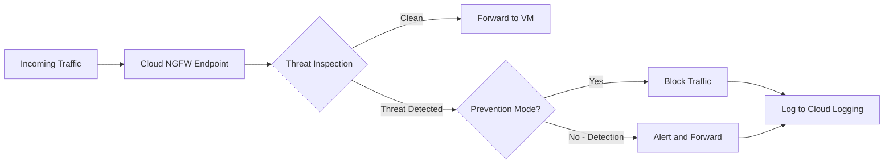

# How to Deploy Cloud Next Generation Firewall with Intrusion Detection on Google Cloud

Author: [nawazdhandala](https://www.github.com/nawazdhandala)

Tags: GCP, Cloud NGFW, Intrusion Detection, Network Security, Firewall

Description: Learn how to deploy Google Cloud Next Generation Firewall with intrusion detection and prevention capabilities to protect your workloads from network threats.

---

Traditional VPC firewall rules on GCP are stateful packet filters - they look at IP addresses, ports, and protocols to decide whether to allow or block traffic. But they cannot inspect the contents of packets for malicious payloads, detect exploit attempts, or identify command-and-control traffic. Cloud Next Generation Firewall (Cloud NGFW) adds deep packet inspection with intrusion detection and prevention (IDS/IPS) capabilities, powered by Palo Alto Networks threat intelligence.

In this post, I will walk through deploying Cloud NGFW with intrusion detection enabled, configuring threat prevention profiles, and integrating it with your existing VPC architecture.

## What Cloud NGFW Adds

Cloud NGFW operates at three tiers:

- **Cloud NGFW Essentials**: Standard VPC firewall rules with IAM-governed tags (free)
- **Cloud NGFW Standard**: Adds FQDN filtering and geolocation filtering
- **Cloud NGFW Enterprise**: Adds TLS inspection and intrusion detection/prevention

The intrusion detection capability inspects traffic for known exploits, malware, and suspicious patterns using Palo Alto Networks' threat signatures. It can run in detection mode (alert only) or prevention mode (block threats).



## Prerequisites

Cloud NGFW Enterprise requires several things to be in place:

```bash
# Enable required APIs
gcloud services enable networksecurity.googleapis.com
gcloud services enable compute.googleapis.com

# You need:
# 1. A VPC network
# 2. Firewall endpoint (regional, managed by Google)
# 3. Firewall endpoint association (connects endpoint to your VPC)
# 4. Security profile and security profile group
# 5. Firewall policy rules that reference the security profile group
```

## Step 1 - Create a Firewall Endpoint

The firewall endpoint is the inspection point for your traffic. It is a regional resource managed by Google.

```bash
# Create a firewall endpoint in your desired zone
gcloud network-security firewall-endpoints create ngfw-endpoint-us \
    --zone=us-central1-a \
    --organization=123456789 \
    --billing-project=my-project

# This operation can take 15-20 minutes
# Check the status
gcloud network-security firewall-endpoints describe ngfw-endpoint-us \
    --zone=us-central1-a \
    --organization=123456789
```

## Step 2 - Associate the Endpoint with Your VPC

The association connects the firewall endpoint to your VPC network so traffic can be routed through it.

```bash
# Associate the endpoint with your VPC
gcloud network-security firewall-endpoint-associations create ngfw-assoc-us \
    --zone=us-central1-a \
    --endpoint=organizations/123456789/locations/us-central1-a/firewallEndpoints/ngfw-endpoint-us \
    --network=projects/my-project/global/networks/my-vpc \
    --tls-inspection-policy="" \
    --project=my-project

# Verify the association
gcloud network-security firewall-endpoint-associations describe ngfw-assoc-us \
    --zone=us-central1-a \
    --project=my-project
```

## Step 3 - Create a Security Profile

Security profiles define how threats should be handled. You can override the default action for specific threat categories or severity levels.

```bash
# Create a security profile for threat prevention
gcloud network-security security-profiles threat-prevention create ids-profile \
    --organization=123456789 \
    --location=global \
    --description="IDS/IPS security profile"

# Configure severity-based overrides
# By default, all threats follow the default action. You can override per severity.
gcloud network-security security-profiles threat-prevention update ids-profile \
    --organization=123456789 \
    --location=global \
    --severity-overrides=\
severity=CRITICAL,action=DENY,\
severity=HIGH,action=DENY,\
severity=MEDIUM,action=ALERT,\
severity=LOW,action=ALERT,\
severity=INFORMATIONAL,action=ALLOW
```

This configuration blocks critical and high severity threats while alerting on medium and low severity threats. Informational events are allowed without alerts.

## Step 4 - Create a Security Profile Group

Security profile groups bundle security profiles together and are referenced by firewall policy rules.

```bash
# Create a security profile group
gcloud network-security security-profile-groups create ngfw-profile-group \
    --organization=123456789 \
    --location=global \
    --threat-prevention-profile=organizations/123456789/locations/global/securityProfiles/ids-profile \
    --description="NGFW profile group for production"
```

## Step 5 - Create Firewall Policy Rules with Inspection

Now create firewall policy rules that route traffic through the NGFW for inspection.

```bash
# Create a hierarchical firewall policy (or use network firewall policy)
gcloud compute network-firewall-policies create ngfw-policy \
    --global \
    --project=my-project \
    --description="Network firewall policy with NGFW inspection"

# Add a rule that inspects all inbound traffic
gcloud compute network-firewall-policies rules create 100 \
    --firewall-policy=ngfw-policy \
    --global-firewall-policy \
    --direction=INGRESS \
    --action=apply_security_profile_group \
    --security-profile-group=//networksecurity.googleapis.com/organizations/123456789/locations/global/securityProfileGroups/ngfw-profile-group \
    --src-ip-ranges=0.0.0.0/0 \
    --layer4-configs=tcp:80,tcp:443,tcp:8080 \
    --description="Inspect inbound web traffic for threats"

# Inspect east-west traffic between subnets
gcloud compute network-firewall-policies rules create 200 \
    --firewall-policy=ngfw-policy \
    --global-firewall-policy \
    --direction=INGRESS \
    --action=apply_security_profile_group \
    --security-profile-group=//networksecurity.googleapis.com/organizations/123456789/locations/global/securityProfileGroups/ngfw-profile-group \
    --src-ip-ranges=10.0.0.0/8 \
    --layer4-configs=all \
    --description="Inspect east-west traffic for lateral movement"

# Inspect outbound traffic for C2 communication
gcloud compute network-firewall-policies rules create 300 \
    --firewall-policy=ngfw-policy \
    --global-firewall-policy \
    --direction=EGRESS \
    --action=apply_security_profile_group \
    --security-profile-group=//networksecurity.googleapis.com/organizations/123456789/locations/global/securityProfileGroups/ngfw-profile-group \
    --dest-ip-ranges=0.0.0.0/0 \
    --layer4-configs=tcp \
    --description="Inspect outbound traffic for C2 and data exfiltration"

# Associate the policy with your VPC
gcloud compute network-firewall-policies associations create ngfw-policy-assoc \
    --firewall-policy=ngfw-policy \
    --global-firewall-policy \
    --network=my-vpc \
    --name=ngfw-vpc-association \
    --project=my-project
```

## Step 6 - Monitor Threat Detection

Cloud NGFW logs threat detections to Cloud Logging. Set up queries and alerts.

```bash
# Query for detected threats
gcloud logging read \
    'resource.type="gce_subnetwork" AND jsonPayload.rule_details.action="APPLY_SECURITY_PROFILE_GROUP" AND jsonPayload.threat_details' \
    --format=json \
    --limit=20

# Query specifically for blocked threats
gcloud logging read \
    'jsonPayload.threat_details.action="DENY"' \
    --format="table(timestamp, jsonPayload.connection.src_ip, jsonPayload.connection.dest_ip, jsonPayload.threat_details.threat_name, jsonPayload.threat_details.severity)" \
    --limit=50
```

Create an alert for critical threat detections:

```python
from google.cloud import monitoring_v3

client = monitoring_v3.AlertPolicyServiceClient()

alert = monitoring_v3.AlertPolicy(
    display_name="Cloud NGFW - Critical Threat Detected",
    conditions=[
        monitoring_v3.AlertPolicy.Condition(
            display_name="Critical or High severity threat",
            condition_matched_log=monitoring_v3.AlertPolicy.Condition.LogMatch(
                filter=(
                    'resource.type="gce_subnetwork" '
                    'AND jsonPayload.threat_details.severity=("CRITICAL" OR "HIGH")'
                ),
            ),
        )
    ],
    notification_channels=["projects/my-project/notificationChannels/12345"],
    alert_strategy=monitoring_v3.AlertPolicy.AlertStrategy(
        notification_rate_limit=monitoring_v3.AlertPolicy.AlertStrategy.NotificationRateLimit(
            period={"seconds": 60}
        )
    ),
)

result = client.create_alert_policy(
    name="projects/my-project",
    alert_policy=alert,
)
print(f"Created alert: {result.name}")
```

## Step 7 - Export Threats to BigQuery for Analysis

For long-term threat analysis, export the logs to BigQuery.

```bash
# Create a log sink for NGFW threat data
gcloud logging sinks create ngfw-threats-to-bq \
    bigquery.googleapis.com/projects/my-project/datasets/ngfw_threats \
    --log-filter='resource.type="gce_subnetwork" AND jsonPayload.threat_details:*'

# After data accumulates, query for threat patterns
```

```sql
-- Find the most common threats detected in the last 30 days
SELECT
    jsonPayload.threat_details.threat_name AS threat,
    jsonPayload.threat_details.severity AS severity,
    jsonPayload.threat_details.action AS action_taken,
    COUNT(*) AS detection_count,
    COUNT(DISTINCT jsonPayload.connection.src_ip) AS unique_sources
FROM
    `my_project.ngfw_threats.compute_googleapis_com_firewall`
WHERE
    _TABLE_SUFFIX >= FORMAT_DATE('%Y%m%d', DATE_SUB(CURRENT_DATE(), INTERVAL 30 DAY))
    AND jsonPayload.threat_details IS NOT NULL
GROUP BY
    threat, severity, action_taken
ORDER BY
    detection_count DESC
LIMIT 20;
```

## Tuning Threat Detection

After running in detection mode for a while, review the findings and tune your security profile.

```bash
# Add threat ID overrides for specific threats
# Useful for suppressing false positives
gcloud network-security security-profiles threat-prevention update ids-profile \
    --organization=123456789 \
    --location=global \
    --threat-overrides=\
threat-id=41234,action=ALLOW,\
threat-id=41235,action=ALLOW
```

The workflow is:

1. Start in detection mode (ALERT for all severities)
2. Review alerts for a few weeks
3. Identify false positives and add threat-id overrides
4. Gradually switch to prevention mode (DENY for critical and high)
5. Continue monitoring and tuning

## Cost Considerations

Cloud NGFW Enterprise pricing includes:

- Per-endpoint hourly cost (the firewall endpoint running in your zone)
- Per-GB inspection cost (traffic that passes through the endpoint)

For high-traffic environments, the per-GB cost can add up. Reduce costs by being selective about which traffic you inspect - focus on inbound traffic from the internet and outbound traffic to the internet, rather than inspecting all internal traffic.

## Wrapping Up

Cloud NGFW with intrusion detection adds a critical security layer that standard VPC firewall rules cannot provide. It inspects traffic for known exploits, malware, and suspicious behavior using threat intelligence from Palo Alto Networks. The setup involves creating a firewall endpoint, associating it with your VPC, configuring security profiles for threat handling, and creating firewall policy rules that route traffic through the endpoint. Start in detection mode, tune for false positives, then switch to prevention mode for critical threats. Combined with VPC firewall rules for access control and Cloud Armor for DDoS protection, Cloud NGFW gives you defense in depth for your GCP network.
