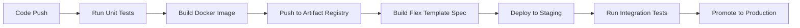

# How to Deploy Dataflow Flex Templates from a CI/CD Pipeline

Author: [nawazdhandala](https://www.github.com/nawazdhandala)

Tags: GCP, Dataflow, Flex Templates, CI/CD, DevOps, Cloud Build

Description: Learn how to automate the build, test, and deployment of Dataflow Flex Templates using CI/CD pipelines with Cloud Build and GitHub Actions.

---

Building Dataflow Flex Templates manually is fine for development, but production deployments need automation. You want every code change to go through tests, build a new container image, create a new template spec, and optionally deploy it to a staging environment - all without manual intervention. Integrating Flex Template deployment into your CI/CD pipeline ensures consistency, traceability, and faster release cycles.

In this post, I will show you how to set up automated Flex Template deployment using both Google Cloud Build and GitHub Actions, including testing, versioning, and promotion between environments.

## The Deployment Pipeline

A typical CI/CD pipeline for Flex Templates follows these stages.



Each stage builds on the previous one, and the pipeline stops if any stage fails.

## Project Structure for CI/CD

Organize your project to support automated builds.

```
my-dataflow-pipeline/
  src/
    __init__.py
    pipeline.py
    transforms.py
  tests/
    test_transforms.py
    test_pipeline.py
    integration/
      test_end_to_end.py
  Dockerfile
  setup.py
  requirements.txt
  requirements-dev.txt    # Testing dependencies
  metadata.json
  cloudbuild.yaml         # Cloud Build configuration
  .github/
    workflows/
      deploy.yml          # GitHub Actions workflow
```

## Cloud Build Configuration

Google Cloud Build is the native CI/CD tool on GCP. Here is a cloudbuild.yaml that handles the full deployment pipeline.

```yaml
# cloudbuild.yaml
steps:
  # Step 1: Run unit tests
  - name: 'python:3.11-slim'
    id: 'unit-tests'
    entrypoint: 'bash'
    args:
      - '-c'
      - |
        pip install -r requirements.txt -r requirements-dev.txt
        python -m pytest tests/ -v --junitxml=test-results.xml
    waitFor: ['-']  # Run immediately, no dependencies

  # Step 2: Build the Docker image
  - name: 'gcr.io/cloud-builders/docker'
    id: 'build-image'
    args:
      - 'build'
      - '-t'
      - 'us-central1-docker.pkg.dev/$PROJECT_ID/dataflow-templates/${_TEMPLATE_NAME}:${SHORT_SHA}'
      - '-t'
      - 'us-central1-docker.pkg.dev/$PROJECT_ID/dataflow-templates/${_TEMPLATE_NAME}:latest'
      - '.'
    waitFor: ['unit-tests']

  # Step 3: Push the Docker image to Artifact Registry
  - name: 'gcr.io/cloud-builders/docker'
    id: 'push-image'
    args:
      - 'push'
      - '--all-tags'
      - 'us-central1-docker.pkg.dev/$PROJECT_ID/dataflow-templates/${_TEMPLATE_NAME}'
    waitFor: ['build-image']

  # Step 4: Build the Flex Template spec
  - name: 'gcr.io/google.com/cloudsdktool/cloud-sdk'
    id: 'build-template'
    entrypoint: 'gcloud'
    args:
      - 'dataflow'
      - 'flex-template'
      - 'build'
      - 'gs://${_TEMPLATE_BUCKET}/templates/${_TEMPLATE_NAME}/${SHORT_SHA}/template.json'
      - '--image=us-central1-docker.pkg.dev/$PROJECT_ID/dataflow-templates/${_TEMPLATE_NAME}:${SHORT_SHA}'
      - '--sdk-language=PYTHON'
      - '--metadata-file=metadata.json'
    waitFor: ['push-image']

  # Step 5: Deploy to staging by running a test job
  - name: 'gcr.io/google.com/cloudsdktool/cloud-sdk'
    id: 'staging-test'
    entrypoint: 'bash'
    args:
      - '-c'
      - |
        # Launch a test job in staging
        gcloud dataflow flex-template run \
          "staging-test-${SHORT_SHA}" \
          --template-file-gcs-location=gs://${_TEMPLATE_BUCKET}/templates/${_TEMPLATE_NAME}/${SHORT_SHA}/template.json \
          --region=us-central1 \
          --parameters="input_path=gs://${_TEMPLATE_BUCKET}/test-data/sample.json,output_table=$PROJECT_ID:staging.test_output" \
          --max-workers=2 \
          --worker-machine-type=n1-standard-2

        # Wait for the job to complete and check status
        echo "Staging test job submitted. Check Dataflow console for status."
    waitFor: ['build-template']

  # Step 6: Copy template to the production location
  - name: 'gcr.io/google.com/cloudsdktool/cloud-sdk'
    id: 'promote-to-prod'
    entrypoint: 'bash'
    args:
      - '-c'
      - |
        # Copy the template spec to the production location
        gsutil cp \
          gs://${_TEMPLATE_BUCKET}/templates/${_TEMPLATE_NAME}/${SHORT_SHA}/template.json \
          gs://${_TEMPLATE_BUCKET}/templates/${_TEMPLATE_NAME}/latest/template.json

        echo "Template promoted to production: gs://${_TEMPLATE_BUCKET}/templates/${_TEMPLATE_NAME}/latest/template.json"
    waitFor: ['staging-test']

# Substitution variables with defaults
substitutions:
  _TEMPLATE_NAME: 'data-processor'
  _TEMPLATE_BUCKET: 'my-project-dataflow-templates'

# Build options
options:
  logging: CLOUD_LOGGING_ONLY
  machineType: 'E2_HIGHCPU_8'

# Store test results
artifacts:
  objects:
    location: 'gs://${_TEMPLATE_BUCKET}/build-artifacts/${BUILD_ID}/'
    paths: ['test-results.xml']
```

To trigger this build automatically on code push, set up a Cloud Build trigger.

```bash
# Create a Cloud Build trigger for the main branch
gcloud builds triggers create github \
  --name="dataflow-template-deploy" \
  --repo-name="my-dataflow-pipeline" \
  --repo-owner="my-org" \
  --branch-pattern="^main$" \
  --build-config="cloudbuild.yaml" \
  --substitutions="_TEMPLATE_NAME=data-processor,_TEMPLATE_BUCKET=my-project-dataflow-templates"
```

## GitHub Actions Workflow

If you prefer GitHub Actions over Cloud Build, here is an equivalent workflow.

```yaml
# .github/workflows/deploy.yml
name: Deploy Dataflow Flex Template

on:
  push:
    branches: [main]
  pull_request:
    branches: [main]

env:
  PROJECT_ID: my-project
  REGION: us-central1
  TEMPLATE_NAME: data-processor
  TEMPLATE_BUCKET: my-project-dataflow-templates
  AR_REPO: us-central1-docker.pkg.dev/my-project/dataflow-templates

jobs:
  test:
    runs-on: ubuntu-latest
    steps:
      - uses: actions/checkout@v4

      - name: Set up Python
        uses: actions/setup-python@v5
        with:
          python-version: '3.11'

      - name: Install dependencies
        run: |
          pip install -r requirements.txt -r requirements-dev.txt

      - name: Run unit tests
        run: |
          python -m pytest tests/ -v --junitxml=test-results.xml

      - name: Upload test results
        uses: actions/upload-artifact@v4
        if: always()
        with:
          name: test-results
          path: test-results.xml

  build-and-deploy:
    needs: test
    runs-on: ubuntu-latest
    if: github.ref == 'refs/heads/main'
    permissions:
      contents: read
      id-token: write

    steps:
      - uses: actions/checkout@v4

      - name: Authenticate to Google Cloud
        uses: google-github-actions/auth@v2
        with:
          workload_identity_provider: ${{ secrets.WIF_PROVIDER }}
          service_account: ${{ secrets.SA_EMAIL }}

      - name: Set up Cloud SDK
        uses: google-github-actions/setup-gcloud@v2

      - name: Configure Docker for Artifact Registry
        run: |
          gcloud auth configure-docker us-central1-docker.pkg.dev

      - name: Get short SHA
        id: sha
        run: echo "short=$(git rev-parse --short HEAD)" >> $GITHUB_OUTPUT

      - name: Build Docker image
        run: |
          docker build \
            -t ${{ env.AR_REPO }}/${{ env.TEMPLATE_NAME }}:${{ steps.sha.outputs.short }} \
            -t ${{ env.AR_REPO }}/${{ env.TEMPLATE_NAME }}:latest \
            .

      - name: Push Docker image
        run: |
          docker push --all-tags ${{ env.AR_REPO }}/${{ env.TEMPLATE_NAME }}

      - name: Build Flex Template
        run: |
          gcloud dataflow flex-template build \
            gs://${{ env.TEMPLATE_BUCKET }}/templates/${{ env.TEMPLATE_NAME }}/${{ steps.sha.outputs.short }}/template.json \
            --image=${{ env.AR_REPO }}/${{ env.TEMPLATE_NAME }}:${{ steps.sha.outputs.short }} \
            --sdk-language=PYTHON \
            --metadata-file=metadata.json

      - name: Promote to latest
        run: |
          gsutil cp \
            gs://${{ env.TEMPLATE_BUCKET }}/templates/${{ env.TEMPLATE_NAME }}/${{ steps.sha.outputs.short }}/template.json \
            gs://${{ env.TEMPLATE_BUCKET }}/templates/${{ env.TEMPLATE_NAME }}/latest/template.json

      - name: Output template location
        run: |
          echo "Template deployed to: gs://${{ env.TEMPLATE_BUCKET }}/templates/${{ env.TEMPLATE_NAME }}/latest/template.json"
          echo "Version: ${{ steps.sha.outputs.short }}"
```

## Environment Promotion Strategy

A robust deployment strategy uses separate template locations for different environments.

```bash
# Template locations by environment
# Development: gs://templates-bucket/templates/data-processor/dev/template.json
# Staging:     gs://templates-bucket/templates/data-processor/staging/template.json
# Production:  gs://templates-bucket/templates/data-processor/prod/template.json
```

Promotion between environments is a simple copy operation.

```bash
# Promote from staging to production
promote_template() {
    local template_name=$1
    local version=$2

    # Copy the template spec
    gsutil cp \
      "gs://templates-bucket/templates/${template_name}/${version}/template.json" \
      "gs://templates-bucket/templates/${template_name}/prod/template.json"

    # Tag the container image as production
    gcloud artifacts docker tags add \
      "us-central1-docker.pkg.dev/my-project/dataflow-templates/${template_name}:${version}" \
      "us-central1-docker.pkg.dev/my-project/dataflow-templates/${template_name}:prod"

    echo "Promoted ${template_name}:${version} to production"
}

# Usage
promote_template "data-processor" "abc1234"
```

## Integration Testing in CI/CD

For thorough testing, run an actual Dataflow job as part of your pipeline and verify the results.

```python
# tests/integration/test_end_to_end.py
"""
Integration test that launches a Flex Template job and verifies output.
Run this after the template is built but before production promotion.
"""
import time
from google.cloud import bigquery
from google.cloud import dataflow_v1beta3

def test_template_end_to_end():
    """Launch a template job with test data and verify BigQuery output."""
    project = "my-project"
    region = "us-central1"
    template_path = "gs://templates-bucket/templates/data-processor/staging/template.json"

    # Launch the template
    client = dataflow_v1beta3.FlexTemplatesServiceClient()
    response = client.launch_flex_template(
        project_id=project,
        location=region,
        launch_parameter={
            "job_name": f"integration-test-{int(time.time())}",
            "container_spec_gcs_path": template_path,
            "parameters": {
                "input_path": "gs://templates-bucket/test-data/integration/*.json",
                "output_table": f"{project}:testing.integration_output",
            },
            "environment": {
                "max_workers": 2,
            }
        }
    )

    job_id = response.job.id
    print(f"Launched job: {job_id}")

    # Wait for the job to complete (with timeout)
    # In practice, poll the job status
    time.sleep(300)  # Wait 5 minutes

    # Verify the output in BigQuery
    bq_client = bigquery.Client()
    query = f"""
    SELECT COUNT(*) as row_count
    FROM `{project}.testing.integration_output`
    WHERE _PARTITIONTIME >= TIMESTAMP_SUB(CURRENT_TIMESTAMP(), INTERVAL 1 HOUR)
    """
    result = list(bq_client.query(query).result())
    row_count = result[0].row_count

    assert row_count > 0, f"Expected rows in output, got {row_count}"
    print(f"Integration test passed: {row_count} rows written")
```

## Rollback Strategy

When a deployment goes wrong, you need to be able to quickly revert to a previous version.

```bash
# Rollback to a specific version
rollback_template() {
    local template_name=$1
    local previous_version=$2

    # Point production to the previous version
    gsutil cp \
      "gs://templates-bucket/templates/${template_name}/${previous_version}/template.json" \
      "gs://templates-bucket/templates/${template_name}/prod/template.json"

    echo "Rolled back ${template_name} to version ${previous_version}"
}

# Rollback to version abc1234
rollback_template "data-processor" "abc1234"
```

Since each version has its own template spec in GCS, rollback is just pointing the production path to an older version. The corresponding container image is still in Artifact Registry, so the old version runs exactly as it did before.

## Wrapping Up

Automating Flex Template deployment through CI/CD eliminates the manual steps that lead to inconsistencies and errors. Whether you use Cloud Build or GitHub Actions, the pattern is the same - test, build, push, create template spec, and promote through environments. The key practices are versioning every build with the git commit SHA, keeping template specs for every version in GCS for easy rollback, and running integration tests before promoting to production. This approach gives you the confidence to deploy frequently and the safety net to roll back quickly when things go wrong.
