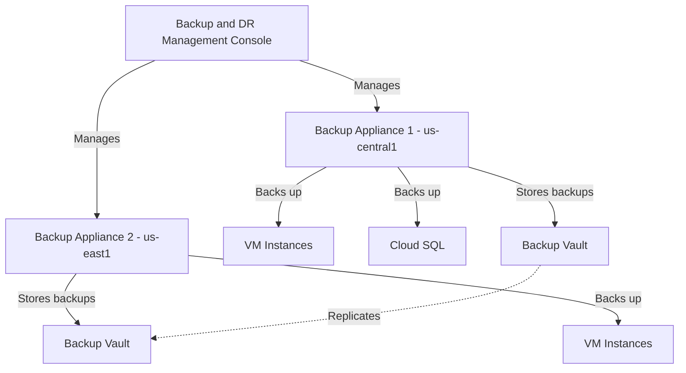

# How to Deploy Google Cloud Backup and DR Service Management Console and Backup Appliance

Author: [nawazdhandala](https://www.github.com/nawazdhandala)

Tags: GCP, Google Cloud, Backup and DR, Disaster Recovery, Backup Appliance, Data Protection

Description: A complete guide to deploying the Google Cloud Backup and DR Service management console and backup appliance for enterprise data protection.

---

Data loss is the kind of problem that nobody thinks about until it happens, and by then it is too late. Google Cloud Backup and DR Service provides a centralized way to back up your Compute Engine VMs, databases, and file systems with a management console that gives you visibility across your entire backup estate. The service consists of two main components - the management console (which runs as a managed service) and backup appliances (which run in your VPC and handle the actual data movement). Let me walk through deploying both.

## Understanding the Architecture

Before deploying anything, it helps to understand how the pieces fit together.



The management console is Google-managed - you do not run any infrastructure for it. Backup appliances are VMs that run in your project and handle snapshot creation, data deduplication, compression, and transfer to backup vaults. You need at least one backup appliance in each region where you have resources to protect.

## Step 1: Enable the Backup and DR API

Start by enabling the required APIs:

```bash
# Enable the Backup and DR API and its dependencies
gcloud services enable backupdr.googleapis.com \
    --project=my-project

# Also enable the Compute Engine API if not already enabled
gcloud services enable compute.googleapis.com \
    --project=my-project
```

## Step 2: Set Up IAM Permissions

The Backup and DR service uses a service agent that needs specific permissions. Set these up before deploying:

```bash
# Get your project number
PROJECT_NUMBER=$(gcloud projects describe my-project --format="value(projectNumber)")

# The Backup and DR service agent
SERVICE_AGENT="service-${PROJECT_NUMBER}@gcp-sa-backupdr.iam.gserviceaccount.com"

# Grant the service agent the required roles
# It needs access to compute resources and storage
gcloud projects add-iam-policy-binding my-project \
    --member="serviceAccount:${SERVICE_AGENT}" \
    --role="roles/backupdr.serviceAgent"

# Grant compute admin for snapshot operations
gcloud projects add-iam-policy-binding my-project \
    --member="serviceAccount:${SERVICE_AGENT}" \
    --role="roles/compute.storageAdmin"
```

For the human administrators who will manage the backup service:

```bash
# Grant backup admin role to your infrastructure team
gcloud projects add-iam-policy-binding my-project \
    --member="user:admin@example.com" \
    --role="roles/backupdr.admin"

# Grant a read-only role for monitoring teams
gcloud projects add-iam-policy-binding my-project \
    --member="group:monitoring@example.com" \
    --role="roles/backupdr.viewer"
```

## Step 3: Deploy the Management Console

The management console is deployed as a managed service. You provision it through the API or the Cloud Console:

```bash
# Create the Backup and DR management server
# This is the centralized management console
gcloud backup-dr management-servers create my-backup-console \
    --project=my-project \
    --location=us-central1 \
    --network=projects/my-project/global/networks/default \
    --type=BACKUP_RESTORE
```

This operation takes several minutes to complete. The management console gets deployed as a managed instance within Google's infrastructure and connects to your VPC through Private Service Connect.

```bash
# Check the deployment status
gcloud backup-dr management-servers describe my-backup-console \
    --project=my-project \
    --location=us-central1
```

Once the state shows READY, note the management console URL from the output. This is the web interface you will use to manage backups.

## Step 4: Access the Management Console

The management console is accessible through a web URL. Open it in your browser and authenticate with your Google Cloud credentials.

```bash
# Get the management console URL
gcloud backup-dr management-servers describe my-backup-console \
    --project=my-project \
    --location=us-central1 \
    --format="value(managementUri.web)"
```

The first time you access the console, it walks you through initial setup including accepting the terms of service and configuring basic settings.

## Step 5: Deploy a Backup Appliance

The backup appliance is the workhorse that actually performs backups. Deploy one in each region where you have resources to protect.

From the management console web interface:

1. Navigate to "Manage" and then "Appliances"
2. Click "Add Appliance"
3. Select the project and region
4. Choose the network and subnet
5. Select the machine type (e2-standard-4 is recommended for small environments, n2-standard-8 for larger ones)
6. Configure the disk size for the staging area

Alternatively, you can deploy appliances through the API:

```bash
# Deploy a backup appliance in us-central1
gcloud backup-dr backup-appliances create appliance-central \
    --project=my-project \
    --location=us-central1 \
    --network=projects/my-project/global/networks/default \
    --subnetwork=projects/my-project/regions/us-central1/subnetworks/default \
    --machine-type=n2-standard-8
```

The appliance takes 10-15 minutes to deploy and register with the management console.

## Step 6: Configure Network Connectivity

The backup appliance needs network access to the resources it protects and to the backup storage backend. Make sure your firewall rules allow the necessary traffic:

```bash
# Allow the backup appliance to communicate with Compute Engine instances
# The appliance needs access on specific ports for agent-based backups
gcloud compute firewall-rules create allow-backup-appliance \
    --project=my-project \
    --network=default \
    --allow=tcp:5106,tcp:5107,tcp:443 \
    --source-tags=backup-appliance \
    --target-tags=backup-target \
    --description="Allow backup appliance to communicate with backup targets"

# Allow the management console to communicate with the appliance
gcloud compute firewall-rules create allow-mgmt-to-appliance \
    --project=my-project \
    --network=default \
    --allow=tcp:443 \
    --source-ranges="10.0.0.0/8" \
    --target-tags=backup-appliance \
    --description="Allow management console to reach backup appliance"
```

## Step 7: Create a Backup Vault

Backup vaults are where your backup data is stored. They are separate from the appliance and provide an immutable, tamper-proof storage layer.

```bash
# Create a backup vault for storing backup data
gcloud backup-dr backup-vaults create vault-central \
    --project=my-project \
    --location=us-central1 \
    --backup-minimum-enforce-retention-duration="604800s" \
    --description="Primary backup vault for production workloads"
```

The minimum enforce retention duration (7 days in this example) prevents anyone from deleting backups before that period expires, even with admin access. This is critical for ransomware protection.

## Step 8: Verify the Deployment

Run through a quick verification checklist:

```bash
# Verify the management console is running
gcloud backup-dr management-servers list \
    --project=my-project \
    --location=us-central1

# Verify backup appliances are connected
gcloud backup-dr backup-appliances list \
    --project=my-project \
    --location=us-central1

# Verify backup vaults
gcloud backup-dr backup-vaults list \
    --project=my-project \
    --location=us-central1
```

All components should show as ACTIVE or READY.

## Ongoing Operations

Once everything is deployed, there are a few operational tasks to set up:

**Monitoring**: Configure alerts in Cloud Monitoring for backup failures, appliance health issues, and storage capacity warnings. The Backup and DR service emits metrics and logs that you can build dashboards around.

**Updates**: Backup appliances receive automatic updates from Google, but you should schedule maintenance windows to minimize disruption to backup jobs.

**Capacity planning**: Monitor your backup vault usage and the appliance staging disk. As your environment grows, you may need to add more appliances or increase disk sizes.

## Summary

Deploying Google Cloud Backup and DR Service involves setting up the managed console, deploying backup appliances in your regions, configuring networking, and creating backup vaults. The management console gives you a single place to manage backup policies across your entire environment. The appliances handle the heavy lifting of data movement and deduplication. And the backup vaults provide immutable storage that protects against both accidental deletion and ransomware. With everything deployed, you are ready to create backup plans and start protecting your workloads.
