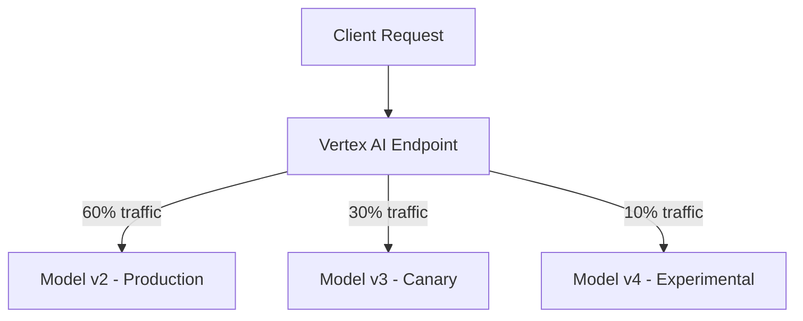

# How to Deploy Multi-Model Endpoints on Vertex AI for Cost-Efficient Serving

Author: [nawazdhandala](https://www.github.com/nawazdhandala)

Tags: GCP, Vertex AI, Model Serving, Multi-Model, Cost Optimization

Description: Learn how to deploy multiple models on a single Vertex AI endpoint to reduce infrastructure costs while maintaining low-latency predictions.

---

Running a separate endpoint for every model gets expensive fast. If you have ten models, each on its own n1-standard-4 machine, you are paying for ten machines running around the clock - even if most of them are barely used. Multi-model endpoints solve this problem by letting you deploy several models on the same infrastructure, sharing the compute resources.

Vertex AI supports deploying multiple models to a single endpoint with traffic splitting, which lets you run A/B tests, canary deployments, and cost-efficient multi-model serving all from the same endpoint.

## When Multi-Model Endpoints Make Sense

There are three common scenarios where putting multiple models on one endpoint is the right call.

First, A/B testing. You want to send a percentage of traffic to a new model version while the rest continues going to the current production model. If the new model performs well, you gradually shift more traffic to it.

Second, model ensembles. You have several models that each handle a different segment of your data, and a routing layer decides which model to call based on the input.

Third, cost optimization. You have low-traffic models that do not justify their own dedicated endpoints. Sharing infrastructure keeps costs manageable.



## Deploying Multiple Models to One Endpoint

Start by uploading your models to the Vertex AI Model Registry, then deploy them to the same endpoint with different traffic splits.

This code uploads two model versions and deploys them to a shared endpoint:

```python
from google.cloud import aiplatform

aiplatform.init(project="your-project-id", location="us-central1")

# Upload model version 1
model_v1 = aiplatform.Model.upload(
    display_name="fraud-detector-v1",
    artifact_uri="gs://your-bucket/models/fraud-v1/",
    serving_container_image_uri="us-docker.pkg.dev/vertex-ai/prediction/sklearn-cpu.1-3:latest"
)

# Upload model version 2
model_v2 = aiplatform.Model.upload(
    display_name="fraud-detector-v2",
    artifact_uri="gs://your-bucket/models/fraud-v2/",
    serving_container_image_uri="us-docker.pkg.dev/vertex-ai/prediction/sklearn-cpu.1-3:latest"
)

# Create a single endpoint
endpoint = aiplatform.Endpoint.create(
    display_name="fraud-detection-endpoint"
)

print(f"Endpoint created: {endpoint.resource_name}")
```

Now deploy both models to the same endpoint with traffic allocation:

```python
# Deploy model v1 with 80% of traffic
model_v1.deploy(
    endpoint=endpoint,
    deployed_model_display_name="fraud-v1-production",
    machine_type="n1-standard-4",
    min_replica_count=1,
    max_replica_count=3,
    traffic_percentage=80
)

# Deploy model v2 with 20% of traffic (canary)
model_v2.deploy(
    endpoint=endpoint,
    deployed_model_display_name="fraud-v2-canary",
    machine_type="n1-standard-4",
    min_replica_count=1,
    max_replica_count=2,
    traffic_percentage=20
)

print("Both models deployed successfully")
```

## Adjusting Traffic Splits

As you gain confidence in the canary model, you can shift more traffic to it without redeploying.

This code updates the traffic split:

```python
# Get the deployed model IDs
deployed_models = endpoint.list_models()

# Build the traffic split dictionary
# Keys are deployed model IDs, values are traffic percentages
traffic_split = {}
for dm in deployed_models:
    if dm.display_name == "fraud-v1-production":
        traffic_split[dm.id] = 40  # Reduce production to 40%
    elif dm.display_name == "fraud-v2-canary":
        traffic_split[dm.id] = 60  # Increase canary to 60%

# Apply the new traffic split
endpoint.update(traffic_split=traffic_split)

print(f"Updated traffic split: {traffic_split}")
```

## Deploying Models with Different Resource Requirements

Not all models need the same resources. You can configure different machine types for each deployed model on the same endpoint.

This code shows deploying a lightweight model alongside a GPU-powered model:

```python
# A lightweight model for simple cases - small machine, no GPU
lightweight_model = aiplatform.Model.upload(
    display_name="simple-classifier",
    artifact_uri="gs://your-bucket/models/simple/",
    serving_container_image_uri="us-docker.pkg.dev/vertex-ai/prediction/sklearn-cpu.1-3:latest"
)

# A heavy model for complex cases - bigger machine with GPU
heavy_model = aiplatform.Model.upload(
    display_name="deep-classifier",
    artifact_uri="gs://your-bucket/models/deep/",
    serving_container_image_uri="us-docker.pkg.dev/vertex-ai/prediction/tf2-gpu.2-13:latest"
)

# Create the shared endpoint
endpoint = aiplatform.Endpoint.create(
    display_name="classification-endpoint"
)

# Deploy lightweight model on cheaper hardware
lightweight_model.deploy(
    endpoint=endpoint,
    deployed_model_display_name="simple-cpu",
    machine_type="n1-standard-2",  # Smaller machine
    min_replica_count=1,
    max_replica_count=5,
    traffic_percentage=70  # Most traffic goes here
)

# Deploy heavy model on GPU hardware
heavy_model.deploy(
    endpoint=endpoint,
    deployed_model_display_name="deep-gpu",
    machine_type="n1-standard-4",
    accelerator_type="NVIDIA_TESLA_T4",
    accelerator_count=1,
    min_replica_count=1,
    max_replica_count=3,
    traffic_percentage=30  # Complex cases go here
)
```

## Monitoring Multi-Model Performance

When running multiple models on one endpoint, you need to track each model's performance individually. Vertex AI provides per-model metrics you can query.

This code retrieves prediction metrics per deployed model:

```python
from google.cloud import monitoring_v3
import datetime

client = monitoring_v3.MetricServiceClient()
project_name = f"projects/your-project-id"

# Query prediction latency by deployed model
now = datetime.datetime.now(datetime.timezone.utc)
interval = monitoring_v3.TimeInterval({
    "start_time": {"seconds": int((now - datetime.timedelta(hours=24)).timestamp())},
    "end_time": {"seconds": int(now.timestamp())}
})

# Get prediction count per deployed model
results = client.list_time_series(
    request={
        "name": project_name,
        "filter": (
            'resource.type="aiplatform.googleapis.com/Endpoint" '
            'AND metric.type="aiplatform.googleapis.com/prediction/online/prediction_count"'
        ),
        "interval": interval,
        "aggregation": monitoring_v3.Aggregation(
            alignment_period={"seconds": 3600},
            per_series_aligner=monitoring_v3.Aggregation.Aligner.ALIGN_SUM,
            group_by_fields=["metric.labels.deployed_model_id"]
        )
    }
)

for series in results:
    model_id = series.metric.labels.get("deployed_model_id", "unknown")
    for point in series.points:
        print(f"Model {model_id}: {point.value.int64_value} predictions")
```

## Gradual Rollout Strategy

A safe rollout strategy for new models follows a gradual traffic increase pattern.

This function automates a staged rollout:

```python
import time
from google.cloud import aiplatform

def gradual_rollout(endpoint_id, new_model_id, old_model_id, stages=None):
    """Gradually shift traffic from old model to new model.

    Args:
        endpoint_id: The endpoint resource name
        new_model_id: Deployed model ID for the new model
        old_model_id: Deployed model ID for the current model
        stages: List of (new_percentage, wait_minutes) tuples
    """
    if stages is None:
        stages = [
            (10, 30),   # 10% for 30 minutes
            (25, 60),   # 25% for 1 hour
            (50, 120),  # 50% for 2 hours
            (75, 60),   # 75% for 1 hour
            (100, 0)    # 100% - done
        ]

    endpoint = aiplatform.Endpoint(endpoint_id)

    for new_pct, wait_min in stages:
        old_pct = 100 - new_pct

        traffic_split = {
            new_model_id: new_pct,
            old_model_id: old_pct
        }

        # Only include models with non-zero traffic
        traffic_split = {k: v for k, v in traffic_split.items() if v > 0}

        endpoint.update(traffic_split=traffic_split)
        print(f"Traffic split updated: new={new_pct}%, old={old_pct}%")

        if wait_min > 0:
            print(f"Waiting {wait_min} minutes before next stage...")
            time.sleep(wait_min * 60)

            # Here you could add a check for error rates
            # If errors are too high, roll back
            # check_error_rate(endpoint_id, new_model_id)

    print("Rollout complete - new model serving 100% of traffic")

# Run the rollout
gradual_rollout(
    endpoint_id="projects/your-project-id/locations/us-central1/endpoints/ENDPOINT_ID",
    new_model_id="deployed-model-id-new",
    old_model_id="deployed-model-id-old"
)
```

## Removing Old Models

After a successful rollout, clean up old deployed models to free resources.

This code undeploies and removes the old model:

```python
# Get the endpoint
endpoint = aiplatform.Endpoint(
    "projects/your-project-id/locations/us-central1/endpoints/ENDPOINT_ID"
)

# List deployed models
for dm in endpoint.list_models():
    print(f"ID: {dm.id}, Name: {dm.display_name}")

# Undeploy the old model (traffic must already be 0%)
endpoint.undeploy(
    deployed_model_id="old-model-deployed-id"
)

print("Old model undeployed successfully")
```

## Cost Comparison

The cost difference between single-model and multi-model endpoints adds up quickly. If you have five low-traffic models, each on an n1-standard-4 ($0.19/hr), that is $0.95/hr or about $685/month. With a multi-model endpoint, you might serve all five on two n1-standard-8 machines ($0.38/hr each), costing $0.76/hr or about $547/month - a 20% savings. The savings grow as you add more models.

Multi-model endpoints are one of the simplest ways to reduce your Vertex AI serving costs. They also make A/B testing and gradual rollouts straightforward, which means you can ship model updates with more confidence and less risk.
