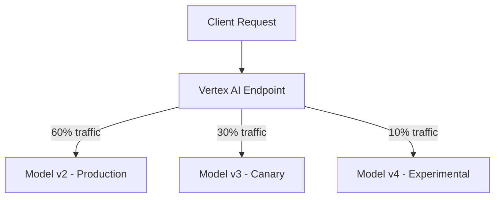

# How to Deploy Multi-Model Endpoints on Vertex AI for Cost-Efficient Serving

Author: [nawazdhandala](https://www.github.com/nawazdhandala)

Tags: GCP, Vertex AI, Model Serving, Multi-Model, Cost Optimization

Description: Learn how to deploy multiple models on a single Vertex AI endpoint to reduce infrastructure costs while maintaining low-latency predictions.

---

Running a separate serving deployment for every model gets expensive fast. If you have ten models, each on its own n1-standard-4 machine, you are paying for ten machines running around the clock - even if most of them are barely used. Vertex AI can deploy several models to one endpoint, and cost sharing is available when those deployments use the same DeploymentResourcePool.

Vertex AI supports deploying multiple models to a single endpoint with traffic splitting, which lets you run A/B tests and canary deployments from the same endpoint. When supported models are cohosted in a DeploymentResourcePool, those deployed models can share the same VM resources.

## When Multi-Model Endpoints Make Sense

There are three common scenarios where putting multiple models on one endpoint is the right call.

First, A/B testing. You want to send a percentage of traffic to a new model version while the rest continues going to the current production model. If the new model performs well, you gradually shift more traffic to it.

Second, model ensembles. You have several models that each handle a different segment of your data, and a routing layer decides which deployed model to call based on the input.

Third, cost optimization. You have low-traffic TensorFlow or PyTorch models that do not justify their own dedicated serving VMs. Cohosting them in a DeploymentResourcePool keeps costs manageable.


```mermaid
graph TD
    A[Client Request] --> B[Vertex AI Endpoint]
    B -->|60% traffic| C[Model v2 - Production]
    B -->|30% traffic| D[Model v3 - Canary]
    B -->|10% traffic| E[Model v4 - Experimental]
```

## Deploying Multiple Models to One Endpoint

Start by uploading your models to the Vertex AI Model Registry. If you want the models to share VM resources, create a DeploymentResourcePool and deploy compatible models to the same endpoint and resource pool.

This code creates shared serving resources, uploads two model versions, and creates an endpoint:

```python
from google.cloud import aiplatform

aiplatform.init(project="your-project-id", location="us-central1")

# Create shared serving resources for compatible TensorFlow models
deployment_resource_pool = aiplatform.DeploymentResourcePool.create(
    deployment_resource_pool_id="fraud-detection-pool",
    machine_type="n1-standard-4",
    min_replica_count=1,
    max_replica_count=3
)

# Upload model version 1

model_v1 = aiplatform.Model.upload(
    display_name="fraud-detector-v1",
    artifact_uri="gs://your-bucket/models/fraud-v1/",
    serving_container_image_uri="us-docker.pkg.dev/vertex-ai/prediction/tf2-cpu.2-15:latest"
)

# Upload model version 2
model_v2 = aiplatform.Model.upload(
    display_name="fraud-detector-v2",
    artifact_uri="gs://your-bucket/models/fraud-v2/",
    serving_container_image_uri="us-docker.pkg.dev/vertex-ai/prediction/tf2-cpu.2-15:latest"
)

# Create a single endpoint
endpoint = aiplatform.Endpoint.create(
    display_name="fraud-detection-endpoint"
)

print(f"Endpoint created: {endpoint.resource_name}")
```

Now deploy both models to the same endpoint and DeploymentResourcePool with traffic allocation:

```python
# Deploy model v1 first with 100% of traffic
model_v1.deploy(
    endpoint=endpoint,
    deployed_model_display_name="fraud-v1-production",
    deployment_resource_pool=deployment_resource_pool,
    traffic_percentage=100
)

# Deploy model v2 with 20% of traffic (canary).
# Vertex AI scales down the existing model's traffic to accommodate it.
model_v2.deploy(
    endpoint=endpoint,
    deployed_model_display_name="fraud-v2-canary",
    deployment_resource_pool=deployment_resource_pool,
    traffic_percentage=20
)

print("Both models deployed successfully")
```

## Adjusting Traffic Splits

As you gain confidence in the canary model, you can shift more traffic to it without redeploying.

This code updates the traffic split:

```python
# Get the deployed model IDs
deployed_models = endpoint.list_models()

# Build the traffic split dictionary
# Keys are deployed model IDs, values are traffic percentages
traffic_split = {}
for dm in deployed_models:
    if dm.display_name == "fraud-v1-production":
        traffic_split[dm.id] = 40  # Reduce production to 40%
    elif dm.display_name == "fraud-v2-canary":
        traffic_split[dm.id] = 60  # Increase canary to 60%

# Apply the new traffic split
endpoint.update(traffic_split=traffic_split)

print(f"Updated traffic split: {traffic_split}")
```

## Deploying Models with Different Resource Requirements

Not all models need the same resources. You can configure different machine types for each deployed model on the same endpoint, but those deployments do not share the same VM pool.

This code shows deploying a lightweight model alongside a GPU-powered model as separate deployments on the same endpoint:

```python
# A lightweight model for simple cases - small machine, no GPU
lightweight_model = aiplatform.Model.upload(
    display_name="simple-classifier",
    artifact_uri="gs://your-bucket/models/simple/",
    serving_container_image_uri="us-docker.pkg.dev/vertex-ai/prediction/tf2-cpu.2-15:latest"
)

# A heavy model for complex cases - bigger machine with GPU
heavy_model = aiplatform.Model.upload(
    display_name="deep-classifier",
    artifact_uri="gs://your-bucket/models/deep/",
    serving_container_image_uri="us-docker.pkg.dev/vertex-ai/prediction/tf2-gpu.2-15:latest"
)

# Create the endpoint
endpoint = aiplatform.Endpoint.create(
    display_name="classification-endpoint"
)

# Deploy lightweight model on cheaper hardware.
# This deployment uses its own resources, separate from the GPU deployment.
lightweight_model.deploy(
    endpoint=endpoint,
    deployed_model_display_name="simple-cpu",
    machine_type="n1-standard-2",  # Smaller machine
    min_replica_count=1,
    max_replica_count=5,
    traffic_percentage=100
)

# Deploy heavy model on GPU hardware.
# Different machine types cannot be part of the same DeploymentResourcePool.
heavy_model.deploy(
    endpoint=endpoint,
    deployed_model_display_name="deep-gpu",
    machine_type="n1-standard-4",
    accelerator_type="NVIDIA_TESLA_T4",
    accelerator_count=1,
    min_replica_count=1,
    max_replica_count=3,
    traffic_percentage=30  # Complex cases go here
)
```

## Monitoring Multi-Model Performance

When running multiple models on one endpoint, you need to track each model's performance individually. Vertex AI provides per-model metrics you can query.

This code retrieves prediction metrics per deployed model:

```python
from google.cloud import monitoring_v3
import datetime

client = monitoring_v3.MetricServiceClient()
project_name = f"projects/your-project-id"

# Query prediction count by deployed model
now = datetime.datetime.now(datetime.timezone.utc)
interval = monitoring_v3.TimeInterval({
    "start_time": {"seconds": int((now - datetime.timedelta(hours=24)).timestamp())},
    "end_time": {"seconds": int(now.timestamp())}
})

# Get prediction count per deployed model
results = client.list_time_series(
    request={
        "name": project_name,
        "filter": (
            'resource.type="aiplatform.googleapis.com/Endpoint" '
            'AND metric.type="aiplatform.googleapis.com/prediction/online/prediction_count"'
        ),
        "interval": interval,
        "aggregation": monitoring_v3.Aggregation(
            alignment_period={"seconds": 3600},
            per_series_aligner=monitoring_v3.Aggregation.Aligner.ALIGN_SUM,
            group_by_fields=["metric.labels.deployed_model_id"]
        )
    }
)

for series in results:
    model_id = series.metric.labels.get("deployed_model_id", "unknown")
    for point in series.points:
        print(f"Model {model_id}: {point.value.int64_value} predictions")
```

## Gradual Rollout Strategy

A safe rollout strategy for new models follows a gradual traffic increase pattern.

This function automates a staged rollout:

```python
import time
from google.cloud import aiplatform

def gradual_rollout(endpoint_id, new_model_id, old_model_id, stages=None):
    """Gradually shift traffic from old model to new model.

    Args:
        endpoint_id: The endpoint resource name
        new_model_id: Deployed model ID for the new model
        old_model_id: Deployed model ID for the current model
        stages: List of (new_percentage, wait_minutes) tuples
    """
    if stages is None:
        stages = [
            (10, 30),   # 10% for 30 minutes
            (25, 60),   # 25% for 1 hour
            (50, 120),  # 50% for 2 hours
            (75, 60),   # 75% for 1 hour
            (100, 0)    # 100% - done
        ]

    endpoint = aiplatform.Endpoint(endpoint_id)

    for new_pct, wait_min in stages:
        old_pct = 100 - new_pct

        traffic_split = {
            new_model_id: new_pct,
            old_model_id: old_pct
        }

        # Only include models with non-zero traffic
        traffic_split = {k: v for k, v in traffic_split.items() if v > 0}

        endpoint.update(traffic_split=traffic_split)
        print(f"Traffic split updated: new={new_pct}%, old={old_pct}%")

        if wait_min > 0:
            print(f"Waiting {wait_min} minutes before next stage...")
            time.sleep(wait_min * 60)

            # Here you could add a check for error rates
            # If errors are too high, roll back
            # check_error_rate(endpoint_id, new_model_id)

    print("Rollout complete - new model serving 100% of traffic")

# Run the rollout
gradual_rollout(
    endpoint_id="projects/your-project-id/locations/us-central1/endpoints/ENDPOINT_ID",
    new_model_id="deployed-model-id-new",
    old_model_id="deployed-model-id-old"
)
```

## Removing Old Models

After a successful rollout, clean up old deployed models to free resources.

This code undeploys and removes the old model:

```python
# Get the endpoint
endpoint = aiplatform.Endpoint(
    "projects/your-project-id/locations/us-central1/endpoints/ENDPOINT_ID"
)

# List deployed models
for dm in endpoint.list_models():
    print(f"ID: {dm.id}, Name: {dm.display_name}")

# Undeploy the old model (traffic must already be 0%)
endpoint.undeploy(
    deployed_model_id="old-model-deployed-id"
)

print("Old model undeployed successfully")
```

## Cost Comparison

The cost difference from cohosting models in a DeploymentResourcePool adds up quickly. If you have five low-traffic models, each on its own n1-standard-4, you pay for five separate minimum replica sets. With a DeploymentResourcePool, you might serve compatible low-traffic models from a smaller shared pool instead. The exact savings depend on the machine type, replica counts, model memory footprint, and traffic pattern.

Multi-model endpoints make A/B testing and gradual rollouts straightforward. When you also use DeploymentResourcePools for supported models, they can reduce Vertex AI serving costs by improving utilization of the underlying VMs.
