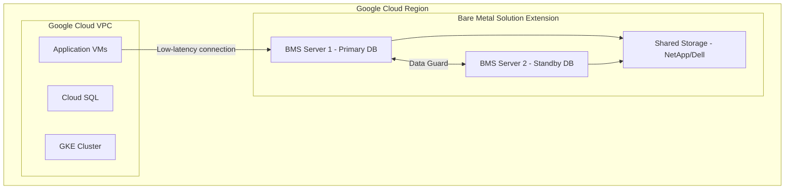

# How to Deploy Oracle Database on Google Cloud Bare Metal Solution Following Best Practices

Author: [nawazdhandala](https://www.github.com/nawazdhandala)

Tags: GCP, Google Cloud, Bare Metal Solution, Oracle Database, Database Deployment, Enterprise

Description: Learn how to deploy Oracle Database on Google Cloud Bare Metal Solution following best practices for performance, licensing, and high availability.

---

Running Oracle Database in the cloud has always been complicated. Licensing restrictions, performance requirements, and the need for bare-metal hardware make it a poor fit for virtual machines. Google Cloud Bare Metal Solution (BMS) was built for exactly this scenario - it gives you dedicated physical servers in a Google Cloud region, connected to your GCP environment through a low-latency network extension. You get the hardware Oracle needs to run properly, with the network connectivity and management benefits of being in Google Cloud.

This guide walks through deploying Oracle Database on BMS from initial server provisioning through database creation and high availability configuration.

## Understanding Bare Metal Solution for Oracle

Bare Metal Solution provides certified hardware for Oracle Database workloads. The servers come in several configurations, from 16-core machines for smaller databases to massive 224-core systems for enterprise OLTP and data warehouse workloads.



The BMS servers are connected to your GCP VPC through a Partner Interconnect, giving your applications in GCP low-latency access to the Oracle database.

## Prerequisites

- A Google Cloud project with Bare Metal Solution enabled
- A BMS server provisioned and accessible via SSH
- Oracle Database software licenses (BYOL - Bring Your Own License)
- Oracle installation media downloaded from Oracle's site
- Network connectivity configured between BMS and your GCP VPC

## Step 1: Provision the Bare Metal Server

BMS servers are provisioned through the GCP Console or API. Choose a server configuration based on your database sizing requirements:

```bash
# List available BMS server configurations in your region
gcloud bms instances list \
    --project=my-project \
    --location=us-central1

# The server is provisioned through a support request or the BMS API
# Typical configurations for Oracle:
# - o2-standard-16-metal: 16 cores, 384 GB RAM (small databases)
# - o2-standard-32-metal: 32 cores, 768 GB RAM (medium databases)
# - o2-standard-112-metal: 112 cores, 3 TB RAM (large OLTP/DW)
```

Once provisioned, get the server details:

```bash
# Get the server IP and connection details
gcloud bms instances describe my-oracle-server \
    --project=my-project \
    --location=us-central1
```

## Step 2: Prepare the Operating System

SSH into the BMS server and prepare the OS for Oracle installation. BMS servers come with either Oracle Linux or RHEL pre-installed.

```bash
# SSH into the BMS server
ssh customeradmin@10.200.0.10

# Verify the OS version - Oracle Linux 8 is recommended
cat /etc/oracle-release

# Install required Oracle prerequisites package
# This sets all kernel parameters and creates required groups
sudo dnf install -y oracle-database-preinstall-19c

# Verify kernel parameters are set correctly
sudo sysctl -a | grep -E "shm|sem|file-max|ip_local_port"
```

Configure storage for Oracle. BMS typically uses shared storage (NetApp or Dell) presented as block devices:

```bash
# List available block devices
lsblk

# Create an ASM disk group for Oracle data
# First, configure the disks for ASM
sudo /usr/sbin/oracleasm createdisk DATA1 /dev/sdb1
sudo /usr/sbin/oracleasm createdisk DATA2 /dev/sdc1
sudo /usr/sbin/oracleasm createdisk FRA1 /dev/sdd1

# Verify ASM disks are visible
sudo /usr/sbin/oracleasm listdisks
```

## Step 3: Install Oracle Grid Infrastructure

Grid Infrastructure provides ASM (Automatic Storage Management) and Clusterware for high availability:

```bash
# Switch to the oracle user
sudo su - oracle

# Set Oracle environment variables
export ORACLE_BASE=/u01/app/oracle
export GRID_HOME=/u01/app/19c/grid
export ORACLE_HOME=/u01/app/oracle/product/19c/dbhome_1

# Unzip the Grid Infrastructure software
mkdir -p ${GRID_HOME}
cd ${GRID_HOME}
unzip /tmp/LINUX.X64_193000_grid_home.zip

# Run the Grid Infrastructure installer in silent mode
./gridSetup.sh -silent \
    -responseFile /tmp/grid_install.rsp \
    INVENTORY_LOCATION=/u01/app/oraInventory \
    ORACLE_BASE=${ORACLE_BASE} \
    oracle.install.option=HA_CONFIG \
    oracle.install.asm.OSDBA=asmdba \
    oracle.install.asm.OSOPER=asmoper \
    oracle.install.asm.OSASM=asmadmin \
    oracle.install.asm.storageOption=ASM \
    oracle.install.asm.SYSASMPassword=YourSecurePassword \
    oracle.install.asm.diskGroup.name=DATA \
    oracle.install.asm.diskGroup.redundancy=EXTERNAL \
    oracle.install.asm.diskGroup.disks=/dev/oracleasm/disks/DATA1,/dev/oracleasm/disks/DATA2 \
    oracle.install.asm.diskGroup.diskDiscoveryString=/dev/oracleasm/disks/*
```

After installation, run the root scripts as prompted:

```bash
# Run as root
sudo /u01/app/oraInventory/orainstRoot.sh
sudo /u01/app/19c/grid/root.sh
```

## Step 4: Create ASM Disk Groups

Create the disk groups for your database data and fast recovery area:

```bash
# Connect to ASM as sysasm
sqlplus / as sysasm

-- Create the FRA (Fast Recovery Area) disk group
CREATE DISKGROUP FRA
  EXTERNAL REDUNDANCY
  DISK '/dev/oracleasm/disks/FRA1'
  ATTRIBUTE 'compatible.asm'='19.0';

-- Verify disk groups
SELECT name, total_mb, free_mb, state FROM v$asm_diskgroup;
```

## Step 5: Install Oracle Database Software

```bash
# Switch to the oracle user and set environment
sudo su - oracle
export ORACLE_HOME=/u01/app/oracle/product/19c/dbhome_1

# Unzip the database software
mkdir -p ${ORACLE_HOME}
cd ${ORACLE_HOME}
unzip /tmp/LINUX.X64_193000_db_home.zip

# Run the database software installer in silent mode
./runInstaller -silent \
    -responseFile /tmp/db_install.rsp \
    oracle.install.option=INSTALL_DB_SWONLY \
    ORACLE_BASE=/u01/app/oracle \
    ORACLE_HOME=${ORACLE_HOME} \
    oracle.install.db.InstallEdition=EE \
    oracle.install.db.OSDBA_GROUP=dba \
    oracle.install.db.OSOPER_GROUP=oper \
    oracle.install.db.OSBACKUPDBA_GROUP=backupdba \
    oracle.install.db.OSDGDBA_GROUP=dgdba \
    oracle.install.db.OSKMDBA_GROUP=kmdba \
    oracle.install.db.OSRACDBA_GROUP=racdba
```

Run the root script when prompted:

```bash
sudo /u01/app/oracle/product/19c/dbhome_1/root.sh
```

## Step 6: Create the Database

Use DBCA (Database Configuration Assistant) to create the database:

```bash
# Create a database using DBCA in silent mode
dbca -silent -createDatabase \
    -templateName General_Purpose.dbc \
    -gdbName PRODDB \
    -sid PRODDB \
    -sysPassword YourSecureSysPassword \
    -systemPassword YourSecureSystemPassword \
    -createAsContainerDatabase true \
    -numberOfPDBs 1 \
    -pdbName PDB1 \
    -pdbAdminPassword YourSecurePdbPassword \
    -storageType ASM \
    -diskGroupName DATA \
    -recoveryGroupName FRA \
    -characterSet AL32UTF8 \
    -nationalCharacterSet AL16UTF16 \
    -memoryPercentage 70 \
    -emConfiguration NONE \
    -datafileDestination '+DATA' \
    -recoveryAreaDestination '+FRA' \
    -recoveryAreaSize 50000
```

## Step 7: Configure Oracle Net Listener

Set up the listener so applications can connect to the database:

```bash
# Configure the listener
# The listener.ora file is located in $ORACLE_HOME/network/admin/
cat > $ORACLE_HOME/network/admin/listener.ora << 'EOF'
LISTENER =
  (DESCRIPTION_LIST =
    (DESCRIPTION =
      (ADDRESS = (PROTOCOL = TCP)(HOST = 0.0.0.0)(PORT = 1521))
    )
  )

SID_LIST_LISTENER =
  (SID_LIST =
    (SID_DESC =
      (GLOBAL_DBNAME = PRODDB)
      (SID_NAME = PRODDB)
      (ORACLE_HOME = /u01/app/oracle/product/19c/dbhome_1)
    )
  )
EOF

# Start the listener
lsnrctl start

# Verify the listener is running and the database is registered
lsnrctl status
```

## Step 8: Configure Connectivity from GCP

Applications in your GCP VPC connect to the Oracle database through the partner interconnect. Verify connectivity:

```bash
# From a GCE VM in your VPC, test connectivity to the BMS server
# The BMS server IP is on the interconnect subnet
sqlplus system/YourSecureSystemPassword@10.200.0.10:1521/PDB1

# If using TNS names, configure tnsnames.ora on your application servers
# PRODDB =
#   (DESCRIPTION =
#     (ADDRESS = (PROTOCOL = TCP)(HOST = 10.200.0.10)(PORT = 1521))
#     (CONNECT_DATA =
#       (SERVICE_NAME = PDB1)
#     )
#   )
```

## Best Practices for Oracle on BMS

**Licensing**: BMS servers are certified for Oracle licensing. Count physical cores for licensing, not logical processors. Use the `lscpu` output to verify core counts.

**Memory**: Set the SGA and PGA appropriately. A common starting point is 70% of total RAM for SGA and 10% for PGA, but tune based on your workload.

**Storage**: Use ASM with External redundancy when your shared storage (NetApp/Dell) already provides redundancy. Avoid double-redundancy which wastes space.

**Patching**: Apply Oracle quarterly security patches (CPU/PSU) following Oracle's recommended patching procedures. BMS OS patches are managed separately.

**Monitoring**: Integrate with Cloud Monitoring using the Oracle Database exporter or connect OEM (Oracle Enterprise Manager) to the database for Oracle-specific metrics.

## Summary

Deploying Oracle Database on Google Cloud Bare Metal Solution gives you the best of both worlds - certified bare-metal hardware that Oracle runs well on, with the network connectivity and operational benefits of Google Cloud. The deployment follows standard Oracle installation practices with BMS-specific considerations around storage configuration and network connectivity. Once running, your applications in GCP can access the Oracle database with low latency through the partner interconnect, and you maintain full control over Oracle licensing, patching, and configuration.
