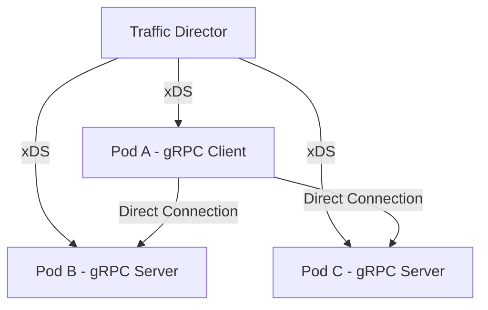

# How to Deploy Proxyless gRPC with Traffic Director on Google Cloud

Author: [nawazdhandala](https://www.github.com/nawazdhandala)

Tags: GCP, Traffic Director, gRPC, Proxyless, Service Mesh

Description: A practical guide to deploying proxyless gRPC applications with Traffic Director on Google Cloud for lower latency and reduced resource overhead compared to sidecar proxies.

---

If you have been running gRPC services behind Envoy sidecars in a service mesh, you have probably noticed the added latency and resource consumption that comes with proxying every request through a sidecar. Proxyless gRPC is a newer approach where the gRPC library itself participates in the mesh by talking directly to the control plane. On Google Cloud, this means your gRPC applications connect to Traffic Director, receive routing and load balancing configuration, and handle everything in-process - no sidecar needed.

This post is a practical deployment guide. I will cover the end-to-end setup on GKE, since that is where most teams run their gRPC services in production.

## The Proxyless Architecture on GKE

In a standard GKE service mesh setup with Traffic Director, you have Envoy sidecars injected into every pod. With proxyless gRPC, you remove the sidecar entirely. The gRPC runtime in your application connects to Traffic Director's xDS API and uses the received configuration for routing, load balancing, and health checking.



The benefit is clear: one fewer network hop per request, less CPU and memory overhead per pod, and simpler debugging since there is no sidecar to troubleshoot.

## Step 1 - Set Up the GKE Cluster

You need a GKE cluster with workload identity enabled, since the gRPC bootstrap needs GCP credentials to authenticate with Traffic Director.

```bash
# Create a GKE cluster with workload identity
gcloud container clusters create proxyless-grpc-cluster \
    --zone=us-central1-a \
    --num-nodes=3 \
    --machine-type=e2-standard-4 \
    --workload-pool=my-project.svc.id.goog \
    --enable-ip-alias

# Get credentials for kubectl
gcloud container clusters get-credentials proxyless-grpc-cluster \
    --zone=us-central1-a
```

## Step 2 - Create Traffic Director Resources

Set up the GCP networking resources that Traffic Director needs.

```bash
# Create a health check for the gRPC service
gcloud compute health-checks create grpc grpc-hc \
    --port=50051

# Create a backend service
gcloud compute backend-services create grpc-backend \
    --global \
    --protocol=GRPC \
    --health-checks=grpc-hc \
    --load-balancing-scheme=INTERNAL_SELF_MANAGED

# Create a URL map
gcloud compute url-maps create grpc-url-map \
    --default-service=grpc-backend

# Create a target gRPC proxy with proxyless validation
gcloud compute target-grpc-proxies create grpc-proxy \
    --url-map=grpc-url-map \
    --validate-for-proxyless

# Create the forwarding rule
gcloud compute forwarding-rules create grpc-forwarding-rule \
    --global \
    --load-balancing-scheme=INTERNAL_SELF_MANAGED \
    --network=default \
    --target-grpc-proxy=grpc-proxy \
    --address=0.0.0.0 \
    --ports=50051
```

## Step 3 - Register the GKE NEG as a Backend

For GKE, you use Network Endpoint Groups (NEGs) instead of instance groups. This gives you pod-level load balancing.

```bash
# First, create a Kubernetes service with NEG annotation
# We will apply this with kubectl next
```

Create the Kubernetes service with the NEG annotation:

```yaml
# k8s/service.yaml - Kubernetes service with NEG annotation for Traffic Director
apiVersion: v1
kind: Service
metadata:
  name: grpc-server
  annotations:
    # This annotation creates a standalone NEG for Traffic Director
    cloud.google.com/neg: '{"exposed_ports":{"50051":{"name":"grpc-server-neg"}}}'
spec:
  ports:
    - port: 50051
      targetPort: 50051
      protocol: TCP
      name: grpc
  selector:
    app: grpc-server
  # ClusterIP type - we do not need an external IP
  type: ClusterIP
```

Apply it and then add the NEG to the backend service:

```bash
# Apply the service
kubectl apply -f k8s/service.yaml

# Wait for the NEG to be created, then add it to the backend service
gcloud compute backend-services add-backend grpc-backend \
    --global \
    --network-endpoint-group=grpc-server-neg \
    --network-endpoint-group-zone=us-central1-a \
    --balancing-mode=RATE \
    --max-rate-per-endpoint=100
```

## Step 4 - Configure Workload Identity

The gRPC bootstrap needs credentials to talk to Traffic Director. Set up Workload Identity for this.

```bash
# Create a GCP service account
gcloud iam service-accounts create td-client \
    --display-name="Traffic Director Client"

# Grant the Traffic Director client role
gcloud projects add-iam-policy-binding my-project \
    --member="serviceAccount:td-client@my-project.iam.gserviceaccount.com" \
    --role="roles/trafficdirector.client"

# Create the Kubernetes service account
kubectl create serviceaccount grpc-ksa

# Bind the Kubernetes SA to the GCP SA
gcloud iam service-accounts add-iam-policy-binding \
    td-client@my-project.iam.gserviceaccount.com \
    --role="roles/iam.workloadIdentityUser" \
    --member="serviceAccount:my-project.svc.id.goog[default/grpc-ksa]"

# Annotate the Kubernetes SA
kubectl annotate serviceaccount grpc-ksa \
    iam.gke.io/gcp-service-account=td-client@my-project.iam.gserviceaccount.com
```

## Step 5 - Deploy the gRPC Server

Here is a deployment manifest for the gRPC server with the xDS bootstrap configuration.

```yaml
# k8s/server-deployment.yaml
apiVersion: apps/v1
kind: Deployment
metadata:
  name: grpc-server
spec:
  replicas: 3
  selector:
    matchLabels:
      app: grpc-server
  template:
    metadata:
      labels:
        app: grpc-server
    spec:
      serviceAccountName: grpc-ksa
      # Init container generates the xDS bootstrap file
      initContainers:
        - name: td-bootstrap
          image: gcr.io/trafficdirector-prod/td-grpc-bootstrap:0.16.0
          args:
            - "--output=/bootstrap/td-grpc-bootstrap.json"
            - "--gcp-project-number=123456789"
            - "--vpc-network-name=default"
          volumeMounts:
            - name: bootstrap
              mountPath: /bootstrap
      containers:
        - name: grpc-server
          image: gcr.io/my-project/grpc-server:latest
          ports:
            - containerPort: 50051
          env:
            # Tell gRPC where to find the bootstrap config
            - name: GRPC_XDS_BOOTSTRAP
              value: "/bootstrap/td-grpc-bootstrap.json"
          volumeMounts:
            - name: bootstrap
              mountPath: /bootstrap
              readOnly: true
          resources:
            requests:
              cpu: 250m
              memory: 256Mi
            limits:
              cpu: 500m
              memory: 512Mi
      volumes:
        - name: bootstrap
          emptyDir: {}
```

```bash
# Deploy the server
kubectl apply -f k8s/server-deployment.yaml
```

## Step 6 - Deploy the gRPC Client

The client deployment is similar, but it uses the `xds:///` URI scheme to resolve the server.

```yaml
# k8s/client-deployment.yaml
apiVersion: apps/v1
kind: Deployment
metadata:
  name: grpc-client
spec:
  replicas: 1
  selector:
    matchLabels:
      app: grpc-client
  template:
    metadata:
      labels:
        app: grpc-client
    spec:
      serviceAccountName: grpc-ksa
      initContainers:
        - name: td-bootstrap
          image: gcr.io/trafficdirector-prod/td-grpc-bootstrap:0.16.0
          args:
            - "--output=/bootstrap/td-grpc-bootstrap.json"
            - "--gcp-project-number=123456789"
            - "--vpc-network-name=default"
          volumeMounts:
            - name: bootstrap
              mountPath: /bootstrap
      containers:
        - name: grpc-client
          image: gcr.io/my-project/grpc-client:latest
          env:
            - name: GRPC_XDS_BOOTSTRAP
              value: "/bootstrap/td-grpc-bootstrap.json"
            # Target using xDS resolution
            - name: GRPC_SERVER_TARGET
              value: "xds:///grpc-backend"
          volumeMounts:
            - name: bootstrap
              mountPath: /bootstrap
              readOnly: true
      volumes:
        - name: bootstrap
          emptyDir: {}
```

## Step 7 - Implement the Server in Go

Here is a Go implementation that demonstrates the server-side xDS integration.

```go
// server/main.go - gRPC server with xDS and health checking
package main

import (
    "context"
    "log"
    "net"

    "google.golang.org/grpc"
    "google.golang.org/grpc/health"
    healthpb "google.golang.org/grpc/health/grpc_health_v1"
    "google.golang.org/grpc/xds"

    pb "myproject/echo"
)

type echoServer struct {
    pb.UnimplementedEchoServiceServer
}

func (s *echoServer) Echo(ctx context.Context, req *pb.EchoRequest) (*pb.EchoResponse, error) {
    return &pb.EchoResponse{Message: "Echo: " + req.Message}, nil
}

func main() {
    lis, err := net.Listen("tcp", ":50051")
    if err != nil {
        log.Fatalf("Failed to listen: %v", err)
    }

    // Use xds.NewGRPCServer instead of grpc.NewServer
    // This enables the server to receive xDS configuration
    server, err := xds.NewGRPCServer()
    if err != nil {
        log.Fatalf("Failed to create xDS server: %v", err)
    }

    // Register the echo service
    pb.RegisterEchoServiceServer(server, &echoServer{})

    // Register health checking
    healthServer := health.NewServer()
    healthpb.RegisterHealthServer(server, healthServer)
    healthServer.SetServingStatus("echo.EchoService", healthpb.HealthCheckResponse_SERVING)

    log.Println("Starting gRPC xDS server on :50051")
    if err := server.Serve(lis); err != nil {
        log.Fatalf("Failed to serve: %v", err)
    }
}
```

## Step 8 - Implement the Client in Go

```go
// client/main.go - Proxyless gRPC client using xDS
package main

import (
    "context"
    "log"
    "os"
    "time"

    "google.golang.org/grpc"
    "google.golang.org/grpc/credentials/insecure"
    // Import xds resolver - this registers the xds:/// scheme
    _ "google.golang.org/grpc/xds"

    pb "myproject/echo"
)

func main() {
    target := os.Getenv("GRPC_SERVER_TARGET")
    if target == "" {
        target = "xds:///grpc-backend"
    }

    // Create the connection using xDS resolution
    conn, err := grpc.Dial(
        target,
        grpc.WithTransportCredentials(insecure.NewCredentials()),
    )
    if err != nil {
        log.Fatalf("Failed to dial: %v", err)
    }
    defer conn.Close()

    client := pb.NewEchoServiceClient(conn)

    // Make periodic calls to demonstrate load balancing
    for {
        ctx, cancel := context.WithTimeout(context.Background(), 5*time.Second)
        resp, err := client.Echo(ctx, &pb.EchoRequest{Message: "Hello"})
        if err != nil {
            log.Printf("RPC failed: %v", err)
        } else {
            log.Printf("Response: %s", resp.Message)
        }
        cancel()
        time.Sleep(time.Second)
    }
}
```

## Verifying the Deployment

After deploying, check that everything is working.

```bash
# Check that pods are running
kubectl get pods -l app=grpc-server
kubectl get pods -l app=grpc-client

# Check the client logs to see successful RPCs
kubectl logs -l app=grpc-client --tail=20

# Verify the NEG has endpoints
gcloud compute network-endpoint-groups list-network-endpoints grpc-server-neg \
    --zone=us-central1-a

# Check Traffic Director backend health
gcloud compute backend-services get-health grpc-backend --global
```

## Troubleshooting Common Issues

If things are not working, check these areas:

- **Bootstrap file missing**: Make sure the `GRPC_XDS_BOOTSTRAP` environment variable points to a valid bootstrap JSON file
- **Workload Identity not working**: Check the pod logs for authentication errors and verify the SA bindings
- **NEG not populated**: Make sure the Kubernetes service has the correct NEG annotation and the pod selector matches

## Wrapping Up

Proxyless gRPC with Traffic Director on GKE gives you service mesh features without sidecar overhead. The setup is more involved than a basic Kubernetes service, but the latency and resource savings are real. The init container pattern for bootstrap generation keeps things clean, and Workload Identity handles authentication. Once deployed, you get Traffic Director's full traffic management capabilities - routing, load balancing, fault injection - all handled natively by the gRPC library in your application.
