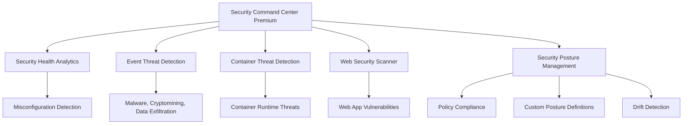

# How to Deploy Security Command Center Premium Posture Management Across an Organization

Author: [nawazdhandala](https://www.github.com/nawazdhandala)

Tags: GCP, Google Cloud, Security Command Center, SCC, Posture Management, Security, Compliance

Description: Learn how to deploy Google Cloud Security Command Center Premium with posture management across your organization for comprehensive security monitoring and compliance.

---

Security Command Center (SCC) is Google Cloud's built-in security and risk management platform. The Premium tier adds critical capabilities like threat detection, vulnerability scanning, compliance monitoring, and security posture management. Deploying it across your organization gives you a single pane of glass for security findings from every project, letting you spot misconfigurations, vulnerabilities, and active threats before they become incidents.

Posture management, specifically, lets you define what "good" looks like for your organization's security configuration and continuously monitors for drift. When a resource is created or modified in a way that violates your security posture, SCC flags it immediately.

## What SCC Premium Includes



## Prerequisites

- Organization Administrator role
- Billing account linked to the organization
- The Security Command Center API
- A good understanding of your organization's folder/project structure

## Step 1: Enable Security Command Center Premium

SCC Premium is enabled at the organization level and covers all projects within the organization:

```bash
# Enable the Security Command Center API at the organization level
gcloud services enable securitycenter.googleapis.com \
    --project=security-project

# Activate SCC Premium for the organization
# This is typically done through the Cloud Console under Security > Security Command Center
# Or through the API:
gcloud scc settings update \
    --organization=ORG_ID \
    --tier=PREMIUM
```

The activation process takes a few minutes. Once complete, SCC begins scanning all resources across your organization.

## Step 2: Configure Organization-Level Settings

Set up the basic configuration for SCC across your organization:

```bash
# Enable all built-in security services
gcloud scc settings services enable security-health-analytics \
    --organization=ORG_ID

gcloud scc settings services enable event-threat-detection \
    --organization=ORG_ID

gcloud scc settings services enable container-threat-detection \
    --organization=ORG_ID

gcloud scc settings services enable web-security-scanner \
    --organization=ORG_ID
```

Configure notification settings so the security team gets alerted on critical findings:

```bash
# Create a Pub/Sub topic for SCC notifications
gcloud pubsub topics create scc-findings \
    --project=security-project

# Create a notification config for high-severity findings
gcloud scc notifications create critical-findings \
    --organization=ORG_ID \
    --pubsub-topic="projects/security-project/topics/scc-findings" \
    --filter='severity="CRITICAL" OR severity="HIGH"' \
    --description="Notifications for critical and high severity findings"
```

## Step 3: Set Up IAM for SCC

Grant appropriate roles to your security team:

```bash
# Grant the Security Center Admin role to the security team lead
gcloud organizations add-iam-policy-binding ORG_ID \
    --member="group:security-team@example.com" \
    --role="roles/securitycenter.admin"

# Grant read-only access for SOC analysts
gcloud organizations add-iam-policy-binding ORG_ID \
    --member="group:soc-analysts@example.com" \
    --role="roles/securitycenter.findingsViewer"

# Grant finding editor role for the team that triages findings
gcloud organizations add-iam-policy-binding ORG_ID \
    --member="group:security-ops@example.com" \
    --role="roles/securitycenter.findingsEditor"
```

## Step 4: Create a Security Posture

Security postures define the security policies that your organization should comply with. You can use built-in postures or create custom ones:

```bash
# List available predefined posture templates
gcloud scc postures list-revisions \
    --organization=ORG_ID \
    --location=global
```

Create a custom posture based on your organization's requirements:

```yaml
# security-posture.yaml
# Custom security posture for the organization
name: organizations/ORG_ID/locations/global/postures/prod-security-posture
state: ACTIVE
description: "Production security posture for all projects"
policySets:
  - policySetId: "compute-security"
    description: "Compute Engine security policies"
    policies:
      - policyId: "no-public-ips"
        constraint:
          orgPolicyConstraint:
            cannedConstraintId: "compute.vmExternalIpAccess"
            policyRules:
              - enforce: true
      - policyId: "require-os-login"
        constraint:
          orgPolicyConstraint:
            cannedConstraintId: "compute.requireOsLogin"
            policyRules:
              - enforce: true
  - policySetId: "iam-security"
    description: "IAM security policies"
    policies:
      - policyId: "no-sa-keys"
        constraint:
          orgPolicyConstraint:
            cannedConstraintId: "iam.disableServiceAccountKeyCreation"
            policyRules:
              - enforce: true
      - policyId: "no-default-sa"
        constraint:
          orgPolicyConstraint:
            cannedConstraintId: "iam.automaticIamGrantsForDefaultServiceAccounts"
            policyRules:
              - enforce: true
  - policySetId: "storage-security"
    description: "Cloud Storage security policies"
    policies:
      - policyId: "uniform-access"
        constraint:
          orgPolicyConstraint:
            cannedConstraintId: "storage.uniformBucketLevelAccess"
            policyRules:
              - enforce: true
  - policySetId: "sha-detectors"
    description: "Security Health Analytics custom detectors"
    policies:
      - policyId: "detect-public-buckets"
        constraint:
          securityHealthAnalyticsCustomModule:
            displayName: "Detect Public GCS Buckets"
            config:
              predicate:
                expression: "resource.iamPolicy.bindings.exists(binding, binding.members.exists(member, member == 'allUsers' || member == 'allAuthenticatedUsers'))"
              resourceSelector:
                resourceTypes:
                  - "storage.googleapis.com/Bucket"
              description: "Detects GCS buckets with public access"
              recommendation: "Remove allUsers and allAuthenticatedUsers from the bucket IAM policy"
              severity: CRITICAL
```

Deploy the posture:

```bash
# Create the security posture
gcloud scc postures create prod-security-posture \
    --organization=ORG_ID \
    --location=global \
    --posture-from-file=security-posture.yaml
```

## Step 5: Deploy Posture to Specific Scopes

Apply the posture to folders or projects:

```bash
# Deploy the posture to the production folder
gcloud scc posture-deployments create prod-deployment \
    --organization=ORG_ID \
    --location=global \
    --posture-name="organizations/ORG_ID/locations/global/postures/prod-security-posture" \
    --posture-revision-id="revision-1" \
    --target-resource="organizations/ORG_ID/folders/PROD_FOLDER_ID"
```

Once deployed, SCC continuously monitors all resources within the scope for compliance with the posture policies.

## Step 6: Configure Security Health Analytics Detectors

Security Health Analytics (SHA) scans for common misconfigurations. Enable the detectors that matter to your organization:

```bash
# List all available SHA detectors
gcloud scc custom-modules sha list \
    --organization=ORG_ID

# Enable specific detectors
gcloud scc settings services modules enable \
    FIREWALL_SCANNER \
    --organization=ORG_ID \
    --service=security-health-analytics

gcloud scc settings services modules enable \
    PUBLIC_BUCKET_ACL \
    --organization=ORG_ID \
    --service=security-health-analytics

gcloud scc settings services modules enable \
    SQL_PUBLIC_IP \
    --organization=ORG_ID \
    --service=security-health-analytics
```

Create custom SHA modules for organization-specific checks:

```bash
# Create a custom detector for resources missing required labels
gcloud scc custom-modules sha create \
    --organization=ORG_ID \
    --display-name="Missing Required Labels" \
    --enablement-state=ENABLED \
    --custom-config-from-file=custom-detector.yaml
```

The custom detector config:

```yaml
# custom-detector.yaml
predicate:
  expression: "!has(resource.labels.owner) || !has(resource.labels.team)"
resourceSelector:
  resourceTypes:
    - "compute.googleapis.com/Instance"
    - "storage.googleapis.com/Bucket"
    - "sqladmin.googleapis.com/Instance"
description: "Resources must have 'owner' and 'team' labels"
recommendation: "Add the required 'owner' and 'team' labels to this resource"
severity: MEDIUM
```

## Step 7: Set Up Event Threat Detection

Event Threat Detection monitors audit logs for suspicious activity patterns:

```bash
# Event Threat Detection is enabled by default with SCC Premium
# Verify it is running
gcloud scc settings services describe event-threat-detection \
    --organization=ORG_ID

# List recent threat findings
gcloud scc findings list \
    --organization=ORG_ID \
    --source="organizations/ORG_ID/sources/EVENT_THREAT_DETECTION_SOURCE_ID" \
    --filter="state=ACTIVE AND severity=CRITICAL" \
    --format="table(finding.name,finding.category,finding.severity,finding.eventTime)"
```

Event Threat Detection catches threats like:

- Cryptomining activities
- Data exfiltration to external IPs
- Brute-force SSH attacks
- Malware activity
- Anomalous IAM grants
- Unusual API usage patterns

## Step 8: Export Findings to SIEM

If your organization uses an external SIEM (like Splunk, Chronicle, or Sentinel), export SCC findings:

```bash
# Create a continuous export to BigQuery for SIEM ingestion
gcloud scc bqexports create scc-export \
    --organization=ORG_ID \
    --dataset="projects/security-project/datasets/scc_findings" \
    --filter='severity="CRITICAL" OR severity="HIGH" OR severity="MEDIUM"' \
    --description="Export SCC findings to BigQuery for SIEM ingestion"
```

For direct Pub/Sub integration with a SIEM:

```bash
# The notification config created earlier can feed into your SIEM
# Create a subscription that your SIEM pulls from
gcloud pubsub subscriptions create siem-scc-subscription \
    --project=security-project \
    --topic=scc-findings \
    --ack-deadline=60 \
    --message-retention-duration=7d
```

## Step 9: Establish Finding Remediation Workflows

Set up automation to handle common findings:

```bash
# Create a Cloud Function that auto-remediates specific findings
# Example: automatically disable public access on GCS buckets

gcloud functions deploy auto-remediate-public-bucket \
    --project=security-project \
    --runtime=python311 \
    --trigger-topic=scc-findings \
    --entry-point=remediate \
    --service-account=scc-remediation@security-project.iam.gserviceaccount.com
```

```python
# main.py
# Auto-remediation function for public bucket findings

import json
import base64
from google.cloud import storage

def remediate(event, context):
    """Auto-remediate specific SCC findings."""
    message = json.loads(base64.b64decode(event["data"]).decode("utf-8"))

    finding = message.get("finding", {})
    category = finding.get("category", "")

    if category == "PUBLIC_BUCKET_ACL":
        bucket_name = finding.get("resourceName", "").split("/")[-1]
        remove_public_access(bucket_name)

def remove_public_access(bucket_name):
    """Remove public access from a GCS bucket."""
    client = storage.Client()
    bucket = client.get_bucket(bucket_name)

    policy = bucket.get_iam_policy(requested_policy_version=3)

    # Remove allUsers and allAuthenticatedUsers from all bindings
    new_bindings = []
    for binding in policy.bindings:
        new_members = [
            m for m in binding["members"]
            if m not in ("allUsers", "allAuthenticatedUsers")
        ]
        if new_members:
            binding["members"] = new_members
            new_bindings.append(binding)

    policy.bindings = new_bindings
    bucket.set_iam_policy(policy)
    print(f"Removed public access from bucket: {bucket_name}")
```

## Summary

Deploying Security Command Center Premium with posture management gives your organization comprehensive security visibility across all Google Cloud projects. The deployment involves enabling SCC at the organization level, creating security postures that define your compliance requirements, configuring threat detection services, and setting up notification and remediation workflows. With posture management continuously monitoring for configuration drift and threat detection watching for active attacks, your security team gets early warning of issues before they become incidents. The key to success is not just deploying the tool but establishing the operational workflows - triage, remediation, and continuous posture improvement - that turn SCC findings into actual security improvements.
