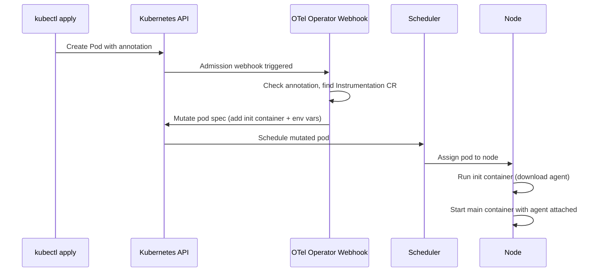

# How to Deploy the OpenTelemetry Operator on GKE for Automatic Instrumentation

Author: [nawazdhandala](https://www.github.com/nawazdhandala)

Tags: GCP, GKE, OpenTelemetry, Kubernetes Operator, Auto-Instrumentation, Google Cloud

Description: A practical guide to deploying the OpenTelemetry Operator on Google Kubernetes Engine for automatic instrumentation of workloads without code changes.

---

Manually adding OpenTelemetry instrumentation to every service in your Kubernetes cluster gets old fast. The OpenTelemetry Operator for Kubernetes changes the game by automatically injecting instrumentation into your pods. You annotate a deployment, and the operator handles the rest - downloading the agent, configuring the exporter, and injecting it as an init container. On GKE, this means you can get tracing and metrics across your entire cluster with almost zero per-service effort. Let me show you how to set it up.

## What the OpenTelemetry Operator Does

The operator manages two key custom resources. First, the OpenTelemetryCollector resource, which lets you deploy and manage collector instances. Second, the Instrumentation resource, which defines how auto-instrumentation should be applied to workloads. When a pod with the right annotation is created, the operator's webhook mutates the pod spec to inject the appropriate language agent.

## Prerequisites

- A GKE cluster running Kubernetes 1.24 or later
- kubectl configured to talk to your cluster
- Helm 3 installed
- cert-manager installed (the operator needs it for webhook certificates)

## Step 1: Install cert-manager

The operator relies on cert-manager for TLS certificates on its admission webhooks.

```bash
# Install cert-manager if not already present
kubectl apply -f https://github.com/cert-manager/cert-manager/releases/download/v1.14.4/cert-manager.yaml

# Wait for cert-manager pods to be ready
kubectl wait --for=condition=ready pod -l app=cert-manager -n cert-manager --timeout=120s
```

## Step 2: Install the OpenTelemetry Operator

Use Helm to install the operator.

```bash
# Add the OpenTelemetry Helm repository
helm repo add open-telemetry https://open-telemetry.github.io/opentelemetry-helm-charts
helm repo update

# Install the operator in the opentelemetry-operator-system namespace
helm install opentelemetry-operator open-telemetry/opentelemetry-operator \
    --namespace opentelemetry-operator-system \
    --create-namespace \
    --set "manager.collectorImage.repository=otel/opentelemetry-collector-contrib" \
    --set admissionWebhooks.certManager.enabled=true
```

Verify the operator is running.

```bash
# Check that the operator pod is running
kubectl get pods -n opentelemetry-operator-system
```

## Step 3: Deploy an OpenTelemetry Collector

Before setting up auto-instrumentation, deploy a collector that will receive the telemetry and forward it to Google Cloud.

```yaml
# collector.yaml - Deploy a collector managed by the operator
apiVersion: opentelemetry.io/v1beta1
kind: OpenTelemetryCollector
metadata:
  name: otel-gateway
  namespace: observability
spec:
  mode: deployment
  replicas: 2
  config:
    receivers:
      otlp:
        protocols:
          grpc:
            endpoint: 0.0.0.0:4317
          http:
            endpoint: 0.0.0.0:4318

    processors:
      batch:
        send_batch_size: 512
        timeout: 5s
      memory_limiter:
        check_interval: 1s
        limit_mib: 512
      resourcedetection:
        detectors: [gcp]

    exporters:
      googlecloud:
        project: my-gcp-project
      googlemanagedprometheus:
        project: my-gcp-project

    service:
      pipelines:
        traces:
          receivers: [otlp]
          processors: [memory_limiter, resourcedetection, batch]
          exporters: [googlecloud]
        metrics:
          receivers: [otlp]
          processors: [memory_limiter, resourcedetection, batch]
          exporters: [googlemanagedprometheus]
```

Apply it.

```bash
# Create the observability namespace and deploy the collector
kubectl create namespace observability
kubectl apply -f collector.yaml
```

## Step 4: Create the Instrumentation Resource

This is the key piece. The Instrumentation resource tells the operator how to instrument pods for each language.

```yaml
# instrumentation.yaml - Define auto-instrumentation configuration
apiVersion: opentelemetry.io/v1alpha1
kind: Instrumentation
metadata:
  name: gcp-instrumentation
  namespace: observability
spec:
  # Point instrumented services at the collector
  exporter:
    endpoint: http://otel-gateway-collector.observability.svc.cluster.local:4317

  # Propagate W3C trace context and baggage headers
  propagators:
    - tracecontext
    - baggage

  # Sample 100% during development, reduce in production
  sampler:
    type: parentbased_traceidratio
    argument: "0.1"

  # Java auto-instrumentation configuration
  java:
    image: ghcr.io/open-telemetry/opentelemetry-operator/autoinstrumentation-java:latest
    env:
      # Capture HTTP request headers as span attributes
      - name: OTEL_INSTRUMENTATION_HTTP_CAPTURE_HEADERS_SERVER_REQUEST
        value: "X-Request-ID"

  # Python auto-instrumentation configuration
  python:
    image: ghcr.io/open-telemetry/opentelemetry-operator/autoinstrumentation-python:latest

  # Node.js auto-instrumentation configuration
  nodejs:
    image: ghcr.io/open-telemetry/opentelemetry-operator/autoinstrumentation-nodejs:latest

  # .NET auto-instrumentation configuration
  dotnet:
    image: ghcr.io/open-telemetry/opentelemetry-operator/autoinstrumentation-dotnet:latest

  # Go auto-instrumentation configuration
  go:
    image: ghcr.io/open-telemetry/opentelemetry-operator/autoinstrumentation-go:latest
```

```bash
# Apply the instrumentation configuration
kubectl apply -f instrumentation.yaml
```

## Step 5: Annotate Your Workloads

Now the fun part. To instrument a deployment, add an annotation to the pod template. The annotation tells the operator which language agent to inject.

```yaml
# example-deployment.yaml - A Java service with auto-instrumentation
apiVersion: apps/v1
kind: Deployment
metadata:
  name: order-service
  namespace: default
spec:
  replicas: 2
  selector:
    matchLabels:
      app: order-service
  template:
    metadata:
      labels:
        app: order-service
      annotations:
        # This annotation triggers Java auto-instrumentation
        instrumentation.opentelemetry.io/inject-java: "observability/gcp-instrumentation"
    spec:
      containers:
        - name: order-service
          image: gcr.io/my-project/order-service:latest
          ports:
            - containerPort: 8080
          env:
            - name: OTEL_SERVICE_NAME
              value: order-service
```

For different languages, use the corresponding annotation.

```yaml
# Python service
annotations:
  instrumentation.opentelemetry.io/inject-python: "observability/gcp-instrumentation"

# Node.js service
annotations:
  instrumentation.opentelemetry.io/inject-nodejs: "observability/gcp-instrumentation"

# .NET service
annotations:
  instrumentation.opentelemetry.io/inject-dotnet: "observability/gcp-instrumentation"

# Go service
annotations:
  instrumentation.opentelemetry.io/inject-go: "observability/gcp-instrumentation"
```

## Step 6: Verify the Injection

After applying the annotated deployment, check that the operator injected the init container.

```bash
# Describe the pod to see the injected init container and environment variables
kubectl describe pod -l app=order-service

# Look for the init container named opentelemetry-auto-instrumentation
kubectl get pod -l app=order-service -o jsonpath='{.items[0].spec.initContainers[*].name}'
```

You should see an init container that downloads the agent and environment variables like `JAVA_TOOL_OPTIONS` (for Java) that attach the agent to the JVM.

## How the Injection Works

Here is what happens when a pod with the instrumentation annotation is created.



## Setting Up Workload Identity for the Collector

The collector needs permissions to write to Google Cloud services. Set up Workload Identity.

```bash
# Create a GCP service account
gcloud iam service-accounts create otel-collector-sa \
    --display-name="OTel Collector SA"

# Grant required roles
gcloud projects add-iam-policy-binding my-gcp-project \
    --member="serviceAccount:otel-collector-sa@my-gcp-project.iam.gserviceaccount.com" \
    --role="roles/cloudtrace.agent"

gcloud projects add-iam-policy-binding my-gcp-project \
    --member="serviceAccount:otel-collector-sa@my-gcp-project.iam.gserviceaccount.com" \
    --role="roles/monitoring.metricWriter"

# Bind to the Kubernetes service account used by the collector
gcloud iam service-accounts add-iam-policy-binding \
    otel-collector-sa@my-gcp-project.iam.gserviceaccount.com \
    --role="roles/iam.workloadIdentityUser" \
    --member="serviceAccount:my-gcp-project.svc.id.goog[observability/otel-gateway-collector]"
```

## Namespace-Wide Instrumentation

If you want every new deployment in a namespace to be automatically instrumented, you can set the annotation at the namespace level.

```bash
# Instrument all Java pods in the default namespace
kubectl annotate namespace default \
    instrumentation.opentelemetry.io/inject-java="observability/gcp-instrumentation"
```

This is powerful but be careful - it affects all new pods in that namespace. Use it in development environments, but in production, prefer explicit per-deployment annotations.

## Troubleshooting

If instrumentation is not being injected, check these things. First, make sure the operator webhook is running and certificates are valid. Second, verify the Instrumentation CR exists in the referenced namespace. Third, check the operator logs for errors.

```bash
# Check operator logs for injection issues
kubectl logs -n opentelemetry-operator-system -l app.kubernetes.io/name=opentelemetry-operator
```

## Wrapping Up

The OpenTelemetry Operator on GKE eliminates the need to manually add instrumentation to every service. Define your instrumentation configuration once, add an annotation to your deployments, and the operator handles the rest. Combined with a collector that exports to Google Cloud, you get traces and metrics flowing from all your services with minimal effort per team. This is especially valuable in organizations with many teams deploying different services - the platform team sets up the operator and collector, and individual teams just add the annotation.
