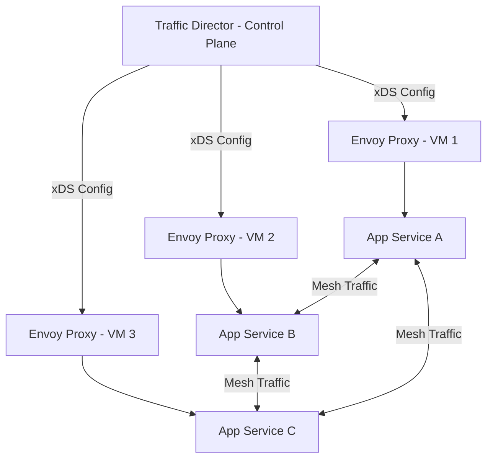

# How to Deploy Traffic Director as a Managed Control Plane for Envoy Proxies on GCP

Author: [nawazdhandala](https://www.github.com/nawazdhandala)

Tags: GCP, Traffic Director, Envoy, Service Mesh, Networking

Description: Learn how to deploy Traffic Director on GCP as a managed control plane for Envoy sidecar proxies with traffic management, load balancing, and health checking.

---

Running a service mesh at scale means you need a control plane that configures your data plane proxies - telling them where to route traffic, how to balance load, and when to retry failed requests. Traffic Director is Google Cloud's managed control plane that works with Envoy proxies. Instead of running and maintaining your own control plane (like Istio's istiod), you let Google manage it, and your Envoy sidecars connect to Traffic Director to get their configuration.

This guide walks through deploying Traffic Director with Envoy proxies on Compute Engine VMs. The same concepts apply to GKE, but the VM-based approach makes it easier to see exactly what is happening.

## Architecture Overview

Traffic Director acts as an xDS server. Envoy proxies connect to it and receive configuration about services, routes, and health check policies. When you create GCP resources like backend services, URL maps, and health checks, Traffic Director translates them into xDS configuration and pushes it to connected Envoy instances.



## Prerequisites

Before you start, enable the necessary APIs.

```bash
# Enable Traffic Director and related APIs
gcloud services enable trafficdirector.googleapis.com
gcloud services enable compute.googleapis.com
gcloud services enable networkservices.googleapis.com

# Verify your project has the right permissions
gcloud projects describe my-project --format="value(projectNumber)"
```

You also need a VPC network and firewall rules that allow health check traffic from Google's health check IP ranges.

```bash
# Allow health check traffic from Google's ranges
gcloud compute firewall-rules create allow-health-checks \
    --network=my-vpc \
    --action=ALLOW \
    --rules=tcp \
    --source-ranges=35.191.0.0/16,130.211.0.0/22 \
    --direction=INGRESS

# Allow internal mesh traffic between VMs
gcloud compute firewall-rules create allow-mesh-traffic \
    --network=my-vpc \
    --action=ALLOW \
    --rules=tcp \
    --source-ranges=10.0.0.0/8 \
    --direction=INGRESS
```

## Step 1 - Create the Backend Service

Backend services in Traffic Director represent your application services. Each backend service maps to a set of VMs (via instance groups) that run the actual application.

```bash
# Create a health check that Traffic Director will use
gcloud compute health-checks create http td-health-check \
    --port=8080 \
    --request-path=/healthz

# Create the backend service
gcloud compute backend-services create my-app-service \
    --global \
    --protocol=HTTP2 \
    --health-checks=td-health-check \
    --load-balancing-scheme=INTERNAL_SELF_MANAGED
```

The `--load-balancing-scheme=INTERNAL_SELF_MANAGED` flag is what makes this a Traffic Director backend service rather than a regular load balancer backend.

## Step 2 - Create the URL Map and Target Proxy

The URL map defines routing rules, and the target proxy connects them to Traffic Director.

```bash
# Create a URL map with a default routing rule
gcloud compute url-maps create td-url-map \
    --default-service=my-app-service

# Create a target HTTP proxy
gcloud compute target-http-proxies create td-http-proxy \
    --url-map=td-url-map

# Create a global forwarding rule that ties everything together
# The IP 0.0.0.0 means this applies to all traffic matching the port
gcloud compute forwarding-rules create td-forwarding-rule \
    --global \
    --load-balancing-scheme=INTERNAL_SELF_MANAGED \
    --network=my-vpc \
    --target-http-proxy=td-http-proxy \
    --address=0.0.0.0 \
    --ports=8080
```

## Step 3 - Set Up VMs with Envoy Sidecar

Now you need VMs that run both your application and an Envoy sidecar. Google provides a managed Envoy setup through VM metadata.

```bash
# Create an instance template with Envoy sidecar auto-injection
gcloud compute instance-templates create td-vm-template \
    --machine-type=e2-medium \
    --network=my-vpc \
    --subnet=my-subnet \
    --scopes=cloud-platform \
    --image-family=debian-11 \
    --image-project=debian-cloud \
    --metadata=enable-osconfig=TRUE \
    --service-proxy=enabled,serving-ports="8080"
```

The `--service-proxy=enabled` flag tells GCP to automatically install and configure Envoy on the VM. The `serving-ports` parameter tells Envoy which ports your application listens on.

If you prefer to install Envoy manually, you can use the Traffic Director bootstrap configuration.

```bash
# Download the Traffic Director bootstrap generator
wget https://storage.googleapis.com/traffic-director/td-grpc-bootstrap-0.16.0.tar.gz
tar xzf td-grpc-bootstrap-0.16.0.tar.gz

# Generate the bootstrap configuration
./td-grpc-bootstrap \
    --config-mesh-experimental \
    --output bootstrap.json
```

Then configure Envoy to use this bootstrap:

```yaml
# envoy-config.yaml - Basic Envoy configuration pointing to Traffic Director
node:
  id: "envoy-node-1"
  cluster: "my-app-cluster"
  metadata:
    # These labels help Traffic Director match this proxy to backend services
    app: "my-app"

dynamic_resources:
  # ADS (Aggregated Discovery Service) configuration
  ads_config:
    api_type: GRPC
    transport_api_version: V3
    grpc_services:
      - google_grpc:
          target_uri: "trafficdirector.googleapis.com:443"
          stat_prefix: "trafficdirector"
          channel_credentials:
            ssl_credentials:
              root_certs:
                filename: /etc/ssl/certs/ca-certificates.crt
          call_credentials:
            google_compute_engine: {}
```

## Step 4 - Create the Managed Instance Group

Create an instance group and add it as a backend to your backend service.

```bash
# Create a managed instance group from the template
gcloud compute instance-groups managed create td-app-mig \
    --template=td-vm-template \
    --size=3 \
    --zone=us-central1-a

# Set the named port that matches your service
gcloud compute instance-groups managed set-named-ports td-app-mig \
    --named-ports=http:8080 \
    --zone=us-central1-a

# Add the instance group as a backend
gcloud compute backend-services add-backend my-app-service \
    --global \
    --instance-group=td-app-mig \
    --instance-group-zone=us-central1-a \
    --balancing-mode=UTILIZATION \
    --max-utilization=0.8
```

## Step 5 - Verify Traffic Director Configuration

Check that Traffic Director is properly configured and Envoy proxies are connected.

```bash
# Check the status of Traffic Director
gcloud network-services endpoint-policies list

# Check if Envoy proxies are connected and receiving configuration
gcloud compute backend-services get-health my-app-service \
    --global
```

You can also check from a VM by looking at the Envoy admin interface:

```bash
# SSH into one of the VMs and check Envoy's admin interface
curl http://localhost:15000/clusters
curl http://localhost:15000/config_dump
```

The clusters endpoint shows you all the upstream clusters Envoy knows about, and config_dump shows the full configuration it received from Traffic Director.

## Adding Advanced Traffic Management

Once the basic setup works, you can add sophisticated traffic management through URL map route rules.

```bash
# Update the URL map with canary routing rules
gcloud compute url-maps import td-url-map --source=- <<EOF
name: td-url-map
defaultService: projects/my-project/global/backendServices/my-app-service
hostRules:
  - hosts:
      - "my-app.internal"
    pathMatcher: my-app-routes
pathMatchers:
  - name: my-app-routes
    defaultService: projects/my-project/global/backendServices/my-app-service
    routeRules:
      - priority: 1
        matchRules:
          - headerMatches:
              - headerName: "x-canary"
                exactMatch: "true"
        routeAction:
          weightedBackendServices:
            - backendService: projects/my-project/global/backendServices/my-app-canary
              weight: 100
EOF
```

This routes requests with the header `x-canary: true` to a canary backend service while sending all other traffic to the main backend.

## Retry and Timeout Configuration

You can configure retries and timeouts at the route level.

```bash
# Add retry policy to a route
gcloud compute url-maps import td-url-map --source=- <<EOF
name: td-url-map
defaultService: projects/my-project/global/backendServices/my-app-service
defaultRouteAction:
  retryPolicy:
    retryConditions:
      - "5xx"
      - "gateway-error"
    numRetries: 3
    perTryTimeout:
      seconds: 2
  timeout:
    seconds: 30
EOF
```

## Monitoring Traffic Director

Use Cloud Monitoring to track Traffic Director metrics.

```bash
# View connected proxy count
gcloud monitoring dashboards create --config-from-file=- <<EOF
{
  "displayName": "Traffic Director Dashboard",
  "gridLayout": {
    "widgets": [
      {
        "title": "Connected Proxies",
        "scorecard": {
          "timeSeriesQuery": {
            "timeSeriesFilter": {
              "filter": "metric.type=\"trafficdirector.googleapis.com/xds/server/connected_clients\""
            }
          }
        }
      }
    ]
  }
}
EOF
```

## Wrapping Up

Traffic Director gives you a managed xDS control plane that removes the operational burden of running something like istiod yourself. Your Envoy proxies connect to it, receive configuration, and you manage everything through standard GCP resources like backend services and URL maps. The key advantage is that it scales automatically - you do not need to worry about control plane availability or performance. Start with the basic setup, verify that proxies are connecting and receiving configuration, and then layer on advanced traffic management features like canary routing, retries, and circuit breaking as you need them.
