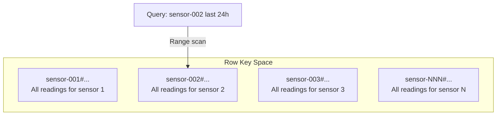

# How to Design a Cloud Bigtable Schema for Time Series Data

Author: [nawazdhandala](https://www.github.com/nawazdhandala)

Tags: GCP, Cloud Bigtable, Time Series, Schema Design, IoT

Description: A comprehensive guide to designing Cloud Bigtable schemas for time series data, covering row key design, column families, and query optimization strategies.

---

Cloud Bigtable was built for time-series data. Google originally created the underlying technology for internal workloads like monitoring metrics from millions of servers. If you need to store billions of timestamped data points and query them efficiently, Bigtable is one of the best choices available.

But designing a good schema for time-series data in Bigtable requires understanding how the database distributes and reads data. A poorly designed schema can turn a system capable of handling petabytes into something that struggles with basic queries. Let me walk through how to design a schema that takes full advantage of Bigtable's architecture.

## Understanding the Time-Series Challenge

Time-series data has specific characteristics that influence schema design. Data arrives in chronological order (all new writes have recent timestamps). Queries typically target a specific entity over a time range ("give me temperature readings for sensor X from the last 24 hours"). The data volume can be enormous - thousands of sensors each writing every second generates billions of rows per month.

The naive approach of using a timestamp as the row key creates a massive hotspot because all writes go to the end of the sorted key space. We need to be smarter.

## Basic Schema Design

The fundamental pattern for time-series data in Bigtable is a compound row key with the entity identifier first and the timestamp second.

```
// Row key structure for time-series data
// entity_id#timestamp
//
// Examples:
// sensor-001#2026-02-17T10:30:00.000
// sensor-001#2026-02-17T10:30:01.000
// sensor-001#2026-02-17T10:30:02.000
// sensor-002#2026-02-17T10:30:00.000
// sensor-002#2026-02-17T10:30:01.000
```

This design ensures writes from different sensors go to different parts of the key space (good distribution), and you can efficiently scan all readings for a specific sensor within a time range (good read performance).



## Choosing Column Families

For time-series data, organize column families based on how the data is accessed.

```bash
# Create the table and column families using cbt
cbt createtable sensor-data

# Raw readings - accessed frequently for recent data
cbt createfamily sensor-data raw

# Computed statistics - accessed for dashboards and reports
cbt createfamily sensor-data stats

# Device metadata - accessed occasionally
cbt createfamily sensor-data meta

# Set garbage collection policies
# Keep raw data for 90 days
cbt setgcpolicy sensor-data raw maxage=2160h

# Keep only the latest version of stats
cbt setgcpolicy sensor-data stats maxversions=1

# Keep metadata indefinitely (no GC policy)
```

The key insight is that Bigtable reads data at the column family level. If you read the `raw` family, it does not touch the `stats` or `meta` data. Keeping hot data in its own family improves read performance.

## Detailed Schema Example

Here is a complete schema for an IoT monitoring system:

```python
# Row key design for IoT sensor monitoring
# Format: {sensor_id}#{reverse_timestamp}
# Reverse timestamp puts newest data first for efficient recent-data queries

import time
import struct

MAX_TS = 9999999999  # Far-future Unix timestamp

def create_row_key(sensor_id, timestamp):
    """Create a row key with reverse timestamp for newest-first ordering."""
    reverse_ts = MAX_TS - int(timestamp)
    # Pad the reverse timestamp to ensure consistent sorting
    return f"{sensor_id}#{reverse_ts:010d}"

# Writing a reading
def write_sensor_reading(table, sensor_id, timestamp, readings):
    """Write a sensor reading to Bigtable."""
    row_key = create_row_key(sensor_id, timestamp)
    row = table.direct_row(row_key)

    # Raw reading values in the 'raw' column family
    for metric_name, value in readings.items():
        row.set_cell(
            'raw',
            metric_name.encode(),          # Column qualifier
            str(value).encode(),           # Cell value
            timestamp=int(timestamp * 1e6) # Microsecond timestamp
        )

    # Commit the row
    row.commit()

# Example usage
write_sensor_reading(table, 'sensor-001', time.time(), {
    'temperature': 23.5,
    'humidity': 65.2,
    'pressure': 1013.25,
    'battery': 87.3
})
```

## Query Patterns

The schema above supports several common time-series query patterns efficiently.

**Get the latest reading for a sensor**:

```python
# Read the most recent reading for a sensor
# Since we use reverse timestamps, the first row for a sensor prefix is the newest
def get_latest_reading(table, sensor_id):
    prefix = sensor_id + '#'
    row = None

    # Read just one row with the sensor prefix - this is the newest reading
    for r in table.read_rows(row_set=RowRange(start_key=prefix.encode()),
                              limit=1):
        row = r

    if row:
        readings = {}
        for column, cells in row.cells['raw'].items():
            readings[column.decode()] = cells[0].value.decode()
        return readings

    return None
```

**Get readings for a time range**:

```python
# Read all readings for a sensor within a time range
# Reverse timestamps mean we flip start and end
def get_readings_in_range(table, sensor_id, start_time, end_time):
    # Since timestamps are reversed, the "end" time creates the start key
    start_key = create_row_key(sensor_id, end_time)
    end_key = create_row_key(sensor_id, start_time)

    readings = []
    for row in table.read_rows(
        row_set=RowRange(start_key=start_key.encode(),
                         end_key=end_key.encode())
    ):
        timestamp = MAX_TS - int(row.row_key.decode().split('#')[1])
        reading = {'timestamp': timestamp}

        for column, cells in row.cells['raw'].items():
            reading[column.decode()] = float(cells[0].value.decode())

        readings.append(reading)

    return readings
```

## Handling High-Frequency Data

If sensors write more than once per second, you need sub-second precision in your row keys.

```python
# High-frequency data: include microseconds in the key
# This handles sensors that report multiple times per second
def create_high_freq_row_key(sensor_id, timestamp_us):
    """Create a row key for microsecond-precision timestamps."""
    reverse_ts = 9999999999999999 - timestamp_us
    return f"{sensor_id}#{reverse_ts:016d}"

# For a sensor reporting at 100Hz (100 readings per second)
import time
timestamp_us = int(time.time() * 1e6)  # Microsecond precision
key = create_high_freq_row_key('vibration-sensor-42', timestamp_us)
```

## Pre-Aggregation Strategy

For dashboards that show hourly or daily summaries, pre-aggregate the data into separate rows rather than scanning millions of raw readings.

```python
# Pre-aggregate data into hourly summaries
# Write these as separate rows with a different key pattern
def write_hourly_summary(table, sensor_id, hour_bucket, stats):
    """Write a pre-aggregated hourly summary."""
    # Use a different prefix to distinguish from raw data
    row_key = f"agg#hourly#{sensor_id}#{hour_bucket}"
    row = table.direct_row(row_key)

    # Write stats to the 'stats' column family
    row.set_cell('stats', b'min_temp', str(stats['min_temp']).encode())
    row.set_cell('stats', b'max_temp', str(stats['max_temp']).encode())
    row.set_cell('stats', b'avg_temp', str(stats['avg_temp']).encode())
    row.set_cell('stats', b'reading_count', str(stats['count']).encode())

    row.commit()

# Query aggregated data for a date range - much faster than scanning raw data
def get_daily_summaries(table, sensor_id, date_start, date_end):
    prefix = f"agg#hourly#{sensor_id}#"
    start_key = f"{prefix}{date_start}"
    end_key = f"{prefix}{date_end}"

    summaries = []
    for row in table.read_rows(
        row_set=RowRange(start_key=start_key.encode(),
                         end_key=end_key.encode())
    ):
        summary = {}
        for column, cells in row.cells['stats'].items():
            summary[column.decode()] = float(cells[0].value.decode())
        summaries.append(summary)

    return summaries
```

## Wide vs Tall Schema

In Bigtable, you have two options for storing multiple metrics per timestamp:

**Tall schema**: One row per metric per timestamp. More rows, but simpler queries for individual metrics.

```
// Tall: Each metric gets its own row
sensor-001#temperature#9999997674
sensor-001#humidity#9999997674
sensor-001#pressure#9999997674
```

**Wide schema**: One row per timestamp with multiple column qualifiers. Fewer rows, all metrics for a timestamp in one read.

```
// Wide: All metrics in one row with different column qualifiers
sensor-001#9999997674
  raw:temperature = 23.5
  raw:humidity = 65.2
  raw:pressure = 1013.25
```

For most time-series use cases, the wide schema is better. You usually want all metrics for a given time range, not just one. The wide schema gives you that in a single scan.

## Garbage Collection for Time-Series

Time-series data often has a retention policy. Configure garbage collection to automatically clean up old data.

```bash
# Keep raw data for 90 days
cbt setgcpolicy sensor-data raw maxage=2160h

# Keep hourly aggregates for 2 years
cbt setgcpolicy sensor-data stats maxage=17520h

# For versioned data, keep only the latest version
cbt setgcpolicy sensor-data meta maxversions=1
```

## Wrapping Up

Designing a Bigtable schema for time-series data comes down to a few key decisions: put the entity ID before the timestamp in your row key to avoid hotspots, use reverse timestamps if you query recent data more often than old data, separate raw readings from aggregated statistics into different column families, and set appropriate garbage collection policies for each data tier. With these patterns in place, Bigtable can handle billions of data points while delivering consistent low-latency reads for your dashboards and analysis queries.
