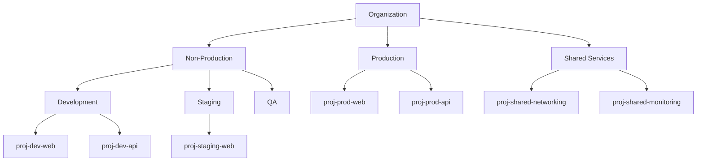
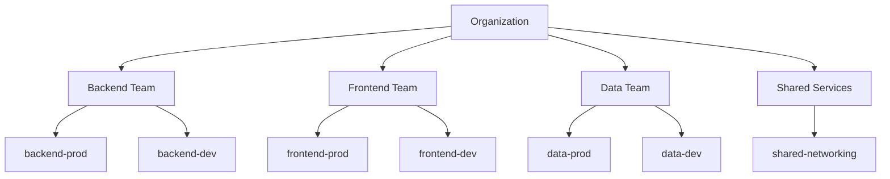
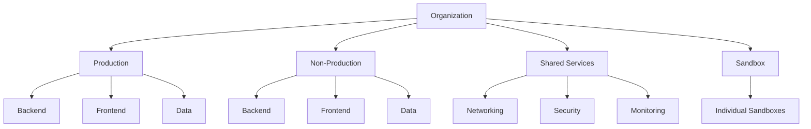
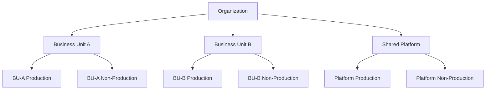

# How to Design a Folder Hierarchy for Multi-Team GCP Environments

Author: [nawazdhandala](https://www.github.com/nawazdhandala)

Tags: GCP, Resource Hierarchy, Folders, Organization, Google Cloud

Description: Learn how to design an effective folder hierarchy in Google Cloud that scales across multiple teams while maintaining clear IAM boundaries and cost tracking.

---

When you have three projects, organization does not matter much. When you have 30, it starts to matter. When you have 300, a well-designed folder hierarchy is the difference between manageable cloud governance and absolute chaos. Folders in GCP are the structural backbone of your resource hierarchy - they determine how IAM policies cascade, how organization policies apply, and how costs get allocated.

This guide walks through folder hierarchy design principles, common patterns, and the practical steps to implement a structure that scales.

## Why Folders Matter

Folders are not just organizational eye candy. They have concrete operational impacts:

- **IAM inheritance**: Permissions granted at a folder level automatically apply to all projects within that folder and its sub-folders
- **Organization policy inheritance**: Constraints set on a folder apply to everything beneath it
- **Cost aggregation**: You can view billing data aggregated at the folder level
- **Access boundaries**: Teams can be given admin access to their folder without seeing other teams' resources

Without folders, you end up granting permissions on a per-project basis, which does not scale and is prone to errors.

## Folder Hierarchy Limits

Before designing your hierarchy, know the constraints:

- Maximum folder depth: 10 levels (Organization counts as level 0)
- Maximum folders per parent: No hard limit, but keep it manageable
- A project can only belong to one parent (folder or organization)
- Folders can be nested within folders or directly under the organization

## Common Hierarchy Patterns

### Pattern 1: Environment-First

The most common pattern for small to medium organizations:



**Pros**: Easy to apply different security policies per environment. Production gets strict policies, development gets relaxed ones.

**Cons**: Hard to see all resources owned by a single team.

### Pattern 2: Team-First

Better for organizations where teams need autonomy:



**Pros**: Teams own their entire folder and can manage their own IAM. Easy cost attribution by team.

**Cons**: Harder to enforce consistent policies across environments since production lives under different folders per team.

### Pattern 3: Hybrid (Environment then Team)

This is what I recommend for most organizations:



**Pros**: Environment-level policies apply uniformly. Teams still have their own folders within each environment. Cost tracking works at both the team and environment level.

**Cons**: Slightly more complex to set up.

### Pattern 4: Business Unit First (Large Enterprises)

For large organizations with distinct business units:



This adds a business unit layer at the top, which is useful when business units have separate budgets, compliance requirements, or operational teams.

## Implementing the Hybrid Pattern

Let me walk through implementing the recommended hybrid pattern step by step.

### Create Top-Level Folders

```bash
# Create the four top-level folders
gcloud resource-manager folders create \
  --display-name="Production" \
  --organization=ORGANIZATION_ID

gcloud resource-manager folders create \
  --display-name="Non-Production" \
  --organization=ORGANIZATION_ID

gcloud resource-manager folders create \
  --display-name="Shared Services" \
  --organization=ORGANIZATION_ID

gcloud resource-manager folders create \
  --display-name="Sandbox" \
  --organization=ORGANIZATION_ID
```

### Create Team Folders Under Each Environment

```bash
# Get the Production folder ID
PROD_FOLDER=$(gcloud resource-manager folders list \
  --organization=ORGANIZATION_ID \
  --filter="displayName:Production" \
  --format="value(name)" | head -1)

# Create team folders under Production
for TEAM in backend frontend data platform; do
  gcloud resource-manager folders create \
    --display-name="$TEAM" \
    --folder=$PROD_FOLDER
done

# Get the Non-Production folder ID
NON_PROD_FOLDER=$(gcloud resource-manager folders list \
  --organization=ORGANIZATION_ID \
  --filter="displayName:Non-Production" \
  --format="value(name)" | head -1)

# Create team folders under Non-Production
for TEAM in backend frontend data platform; do
  gcloud resource-manager folders create \
    --display-name="$TEAM" \
    --folder=$NON_PROD_FOLDER
done
```

### Create Shared Services Sub-Folders

```bash
SHARED_FOLDER=$(gcloud resource-manager folders list \
  --organization=ORGANIZATION_ID \
  --filter="displayName:Shared Services" \
  --format="value(name)" | head -1)

for SERVICE in networking security monitoring logging; do
  gcloud resource-manager folders create \
    --display-name="$SERVICE" \
    --folder=$SHARED_FOLDER
done
```

## Setting IAM at the Right Level

The power of folders is IAM inheritance. Set permissions at the highest appropriate level:

### Organization Level

```bash
# Security team gets org-wide viewer access
gcloud organizations add-iam-policy-binding ORGANIZATION_ID \
  --member="group:security-team@example.com" \
  --role="roles/viewer"

# Billing admins
gcloud organizations add-iam-policy-binding ORGANIZATION_ID \
  --member="group:billing-admins@example.com" \
  --role="roles/billing.admin"
```

### Environment Level

```bash
# Production folder gets strict access
gcloud resource-manager folders add-iam-policy-binding $PROD_FOLDER \
  --member="group:sre-team@example.com" \
  --role="roles/editor"

# Non-production is more relaxed
gcloud resource-manager folders add-iam-policy-binding $NON_PROD_FOLDER \
  --member="group:all-engineers@example.com" \
  --role="roles/editor"
```

### Team Level

```bash
# Backend team gets admin on their folders
BACKEND_PROD_FOLDER=$(gcloud resource-manager folders list \
  --folder=$PROD_FOLDER \
  --filter="displayName:backend" \
  --format="value(name)" | head -1)

gcloud resource-manager folders add-iam-policy-binding $BACKEND_PROD_FOLDER \
  --member="group:backend-team@example.com" \
  --role="roles/editor"
```

## Applying Organization Policies Per Folder

Different environments need different policies:

### Restrict Production to Specific Regions

```yaml
# production-region-policy.yaml
# Only allow resources in US regions for production
constraint: constraints/gcp.resourceLocations
listPolicy:
  allowedValues:
    - in:us-locations
```

```bash
# Apply the policy to the Production folder
gcloud resource-manager org-policies set-policy \
  production-region-policy.yaml \
  --folder=$PROD_FOLDER
```

### Allow More Regions for Non-Production

```yaml
# non-prod-region-policy.yaml
# Allow US and EU regions for non-production
constraint: constraints/gcp.resourceLocations
listPolicy:
  allowedValues:
    - in:us-locations
    - in:eu-locations
```

### Disable External IPs in Production

```bash
# Prevent VMs with external IPs in production
gcloud resource-manager org-policies enable-enforce \
  compute.vmExternalIpAccess \
  --folder=$PROD_FOLDER
```

## Using Terraform for Folder Management

For infrastructure as code, define your folder hierarchy in Terraform:

```hcl
# Organization data source
data "google_organization" "org" {
  domain = "example.com"
}

# Top-level folders
resource "google_folder" "production" {
  display_name = "Production"
  parent       = data.google_organization.org.name
}

resource "google_folder" "non_production" {
  display_name = "Non-Production"
  parent       = data.google_organization.org.name
}

resource "google_folder" "shared_services" {
  display_name = "Shared Services"
  parent       = data.google_organization.org.name
}

# Team folders under Production
variable "teams" {
  default = ["backend", "frontend", "data", "platform"]
}

resource "google_folder" "prod_teams" {
  for_each     = toset(var.teams)
  display_name = each.value
  parent       = google_folder.production.name
}

resource "google_folder" "non_prod_teams" {
  for_each     = toset(var.teams)
  display_name = each.value
  parent       = google_folder.non_production.name
}

# IAM bindings
resource "google_folder_iam_binding" "prod_sre" {
  folder  = google_folder.production.name
  role    = "roles/editor"
  members = ["group:sre-team@example.com"]
}
```

## Naming Conventions

Consistent naming makes your hierarchy navigable:

- **Folders**: Use clear, descriptive names (Production, Non-Production, Shared Services)
- **Projects**: Include the environment and team in the project ID (e.g., `prod-backend-api`, `dev-data-pipeline`)
- **Avoid abbreviations** that only some people understand

## Common Mistakes

1. **Too many levels** - More than 4 levels deep becomes hard to navigate and manage. Keep it flat when possible.

2. **Inconsistent structure** - If Production has team sub-folders, Non-Production should too. Symmetry makes policies predictable.

3. **Not using groups** - Bind IAM to Google Groups, not individual users. This makes onboarding and offboarding trivial.

4. **Skipping Shared Services** - Networking, monitoring, and security projects often need to be accessible from multiple environments. A separate Shared Services folder prevents awkward cross-folder IAM grants.

5. **Changing the hierarchy often** - Moving projects between folders can break IAM inheritance and confuse people. Design carefully upfront and avoid frequent restructuring.

## Wrapping Up

A well-designed folder hierarchy is the foundation of scalable cloud governance. It determines how permissions flow, where policies apply, and how costs get attributed. Invest time in getting it right from the start. The hybrid pattern - environment at the top, teams underneath - works for most organizations and balances security, team autonomy, and cost visibility. Use Terraform to define it as code, and you will have a structure that grows with your organization.
