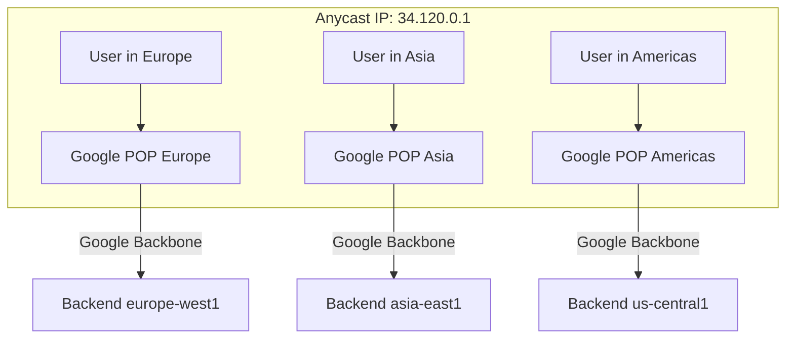

# How to Design a Global Anycast Network Architecture Using GCP Premium Tier Networking

Author: [nawazdhandala](https://www.github.com/nawazdhandala)

Tags: GCP, Networking, Premium Tier, Anycast, Global Load Balancing

Description: Learn how to design a global anycast network architecture on GCP using Premium Tier networking to deliver low-latency experiences to users across the world.

---

When a user in Tokyo hits your application and the nearest server is in Tokyo, but the traffic first routes to a point of presence in San Francisco before bouncing back to Tokyo, you have a latency problem. This is what happens with standard internet routing. GCP Premium Tier networking solves this with anycast - your application gets a single global IP address, and Google's network routes users to the nearest healthy backend automatically, using Google's private backbone instead of the public internet.

In this post, I will walk through designing and deploying a global anycast architecture on GCP that provides low-latency access for users worldwide.

## What Is Anycast and Why It Matters

With unicast, one IP maps to one specific server. If users are far from that server, they get high latency. With anycast, the same IP address is advertised from multiple locations. The network routes each user to the closest instance. GCP's Premium Tier network advertises your external IP from over 100 points of presence worldwide.



The user's traffic enters Google's network at the nearest POP and then travels over Google's private fiber backbone to your backend. This is significantly faster and more reliable than traversing multiple ISP hops over the public internet.

## Architecture Components

A global anycast architecture on GCP uses these building blocks:

1. **Global External Application Load Balancer** - provides the anycast IP and global routing
2. **Backend services in multiple regions** - your application running close to users
3. **Health checks** - ensure traffic only goes to healthy backends
4. **Cloud CDN** (optional) - caches static content at the edge
5. **Cloud Armor** (optional) - WAF and DDoS protection at the edge

## Step 1 - Deploy Backends in Multiple Regions

Start by deploying your application in regions close to your users.

```bash
# Create instance templates in each region
for REGION in us-central1 europe-west1 asia-east1; do
    gcloud compute instance-templates create app-template-${REGION} \
        --machine-type=e2-standard-2 \
        --network=my-vpc \
        --subnet=subnet-${REGION} \
        --region=${REGION} \
        --image-family=debian-11 \
        --image-project=debian-cloud \
        --metadata=startup-script='#!/bin/bash
apt-get update && apt-get install -y nginx
ZONE=$(curl -s http://metadata.google.internal/computeMetadata/v1/instance/zone -H "Metadata-Flavor: Google")
echo "Served from: ${ZONE}" > /var/www/html/index.html
systemctl start nginx'
done
```

Now create managed instance groups in each region:

```bash
# Create MIGs in three regions
gcloud compute instance-groups managed create app-mig-us \
    --template=app-template-us-central1 \
    --size=2 \
    --zone=us-central1-a

gcloud compute instance-groups managed create app-mig-eu \
    --template=app-template-europe-west1 \
    --size=2 \
    --zone=europe-west1-b

gcloud compute instance-groups managed create app-mig-asia \
    --template=app-template-asia-east1 \
    --size=2 \
    --zone=asia-east1-a

# Set named ports on all MIGs
for MIG in app-mig-us app-mig-eu app-mig-asia; do
    ZONE=$(gcloud compute instance-groups managed list \
        --filter="name=${MIG}" --format="value(zone)")
    gcloud compute instance-groups managed set-named-ports ${MIG} \
        --named-ports=http:80 \
        --zone=${ZONE}
done
```

## Step 2 - Create the Global Load Balancer

The global external application load balancer is what gives you the anycast IP.

```bash
# Create a global health check
gcloud compute health-checks create http global-http-hc \
    --port=80 \
    --request-path=/healthz \
    --check-interval=10s \
    --healthy-threshold=2 \
    --unhealthy-threshold=3

# Create the backend service
gcloud compute backend-services create global-app-backend \
    --global \
    --protocol=HTTP \
    --health-checks=global-http-hc \
    --port-name=http \
    --enable-cdn \
    --connection-draining-timeout=300

# Add all regional MIGs as backends
gcloud compute backend-services add-backend global-app-backend \
    --global \
    --instance-group=app-mig-us \
    --instance-group-zone=us-central1-a \
    --balancing-mode=UTILIZATION \
    --max-utilization=0.8 \
    --capacity-scaler=1.0

gcloud compute backend-services add-backend global-app-backend \
    --global \
    --instance-group=app-mig-eu \
    --instance-group-zone=europe-west1-b \
    --balancing-mode=UTILIZATION \
    --max-utilization=0.8 \
    --capacity-scaler=1.0

gcloud compute backend-services add-backend global-app-backend \
    --global \
    --instance-group=app-mig-asia \
    --instance-group-zone=asia-east1-a \
    --balancing-mode=UTILIZATION \
    --max-utilization=0.8 \
    --capacity-scaler=1.0
```

## Step 3 - Create the Frontend

```bash
# Create a URL map
gcloud compute url-maps create global-app-url-map \
    --default-service=global-app-backend

# Create an HTTPS target proxy with SSL certificate
gcloud compute ssl-certificates create global-app-cert \
    --domains=app.example.com \
    --global

gcloud compute target-https-proxies create global-app-https-proxy \
    --url-map=global-app-url-map \
    --ssl-certificates=global-app-cert

# Reserve a global static IP - this is your anycast IP
gcloud compute addresses create global-app-ip \
    --global \
    --ip-version=IPV4

# Create the forwarding rule
gcloud compute forwarding-rules create global-app-https-rule \
    --global \
    --address=global-app-ip \
    --target-https-proxy=global-app-https-proxy \
    --ports=443

# Get the anycast IP address
gcloud compute addresses describe global-app-ip \
    --global --format="value(address)"
```

The IP address you get back is an anycast address. When a user anywhere in the world connects to this IP, Google's network routes them to the nearest healthy backend.

## Step 4 - Configure Autoscaling per Region

Each region should autoscale independently based on the traffic it receives.

```bash
# Set up autoscaling for each MIG
for MIG_INFO in "app-mig-us:us-central1-a" "app-mig-eu:europe-west1-b" "app-mig-asia:asia-east1-a"; do
    MIG=$(echo ${MIG_INFO} | cut -d: -f1)
    ZONE=$(echo ${MIG_INFO} | cut -d: -f2)

    gcloud compute instance-groups managed set-autoscaling ${MIG} \
        --zone=${ZONE} \
        --min-num-replicas=2 \
        --max-num-replicas=20 \
        --target-cpu-utilization=0.6 \
        --cool-down-period=120
done
```

## Step 5 - Enable Cloud Armor for DDoS Protection

With a global anycast IP, you are exposed to the entire internet. Cloud Armor provides DDoS protection and WAF capabilities right at the edge.

```bash
# Create a Cloud Armor security policy
gcloud compute security-policies create global-app-policy \
    --description="Security policy for global app"

# Add adaptive protection (ML-based DDoS detection)
gcloud compute security-policies update global-app-policy \
    --enable-layer7-ddos-defense

# Block traffic from specific countries if needed
gcloud compute security-policies rules create 1000 \
    --security-policy=global-app-policy \
    --expression="origin.region_code == 'XX'" \
    --action=deny-403 \
    --description="Block traffic from country XX"

# Rate limiting rule
gcloud compute security-policies rules create 2000 \
    --security-policy=global-app-policy \
    --expression="true" \
    --action=rate-based-ban \
    --rate-limit-threshold-count=1000 \
    --rate-limit-threshold-interval-sec=60 \
    --ban-duration-sec=300 \
    --conform-action=allow \
    --exceed-action=deny-429 \
    --enforce-on-key=IP

# Attach the policy to the backend service
gcloud compute backend-services update global-app-backend \
    --global \
    --security-policy=global-app-policy
```

## Monitoring Global Traffic

Set up monitoring to understand how traffic is distributed across regions and detect issues.

```bash
# Create a monitoring dashboard for global traffic distribution
gcloud monitoring dashboards create --config-from-file=- <<'EOF'
{
  "displayName": "Global Anycast Traffic",
  "gridLayout": {
    "widgets": [
      {
        "title": "Request Count by Backend Region",
        "xyChart": {
          "dataSets": [{
            "timeSeriesQuery": {
              "timeSeriesFilter": {
                "filter": "resource.type=\"https_lb_rule\" AND metric.type=\"loadbalancing.googleapis.com/https/request_count\""
              }
            }
          }]
        }
      }
    ]
  }
}
EOF
```

## Premium Tier vs Standard Tier

The anycast behavior only works with Premium Tier networking, which is the default. If you switch to Standard Tier, your external IP becomes a regional unicast address and traffic routes over the public internet. Here is the difference:

- **Premium Tier**: Traffic enters Google's network at the nearest POP, travels over Google's backbone, reaches the closest backend. Anycast IP works globally.
- **Standard Tier**: Traffic routes over the public internet to the region where the IP is assigned. Regional IP only, no global anycast.

For a global application, Premium Tier is the clear choice. The additional cost (about $0.01 more per GB) is well worth the latency improvement.

## Failover Behavior

One of the best features of this architecture is automatic failover. If all backends in a region become unhealthy, the global load balancer automatically routes traffic to the next closest healthy region. Users experience a slightly higher latency, but they do not experience downtime.

To test this, you can manually drain backends in one region:

```bash
# Simulate a regional failure by setting capacity to zero
gcloud compute backend-services update-backend global-app-backend \
    --global \
    --instance-group=app-mig-asia \
    --instance-group-zone=asia-east1-a \
    --capacity-scaler=0.0
```

Traffic that was going to Asia will automatically shift to the next closest region.

## Wrapping Up

A global anycast architecture on GCP gives you a single IP that routes users to the nearest healthy backend, all over Google's private backbone. The setup combines global external load balancing, multi-region backends, autoscaling, and edge security through Cloud Armor. This is the architecture that Google uses for its own services, and it is available to any GCP customer using Premium Tier networking. The investment in deploying to multiple regions pays off with lower latency, better availability, and built-in DDoS protection at the network edge.
