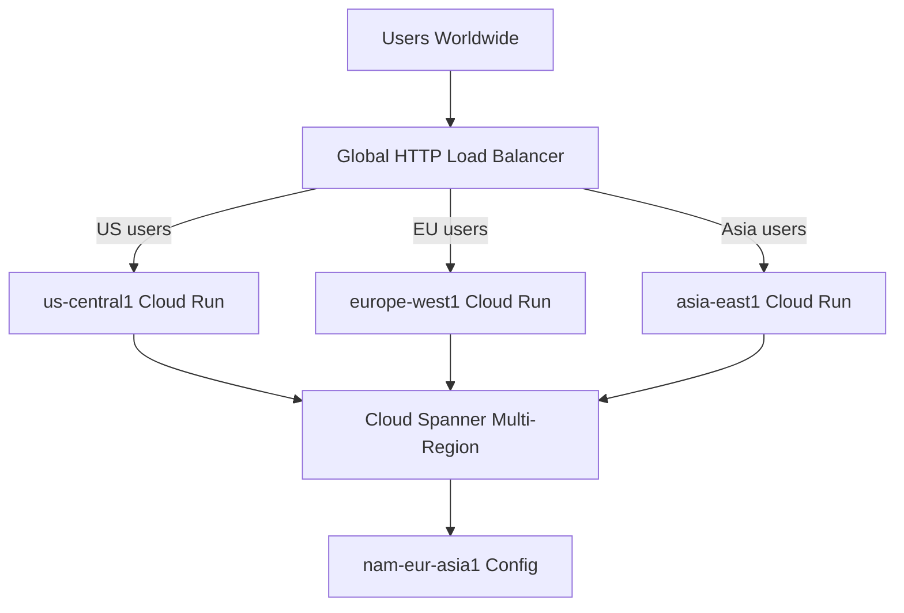

# How to Design a Multi-Region Active-Active Architecture on GCP Using Global Load Balancing and Spanner

Author: [nawazdhandala](https://www.github.com/nawazdhandala)

Tags: GCP, Multi-Region, Active-Active, Cloud Spanner, Global Load Balancing, High Availability

Description: Design and implement a multi-region active-active architecture on Google Cloud using Global HTTP Load Balancing for traffic distribution and Cloud Spanner for globally consistent data.

---

Running your application in a single region is a single point of failure. If that region has an outage, your entire application goes down. A multi-region active-active architecture runs your application in multiple regions simultaneously, serving users from the nearest region for low latency while maintaining the ability to handle traffic from any region at any time. If one region fails, the others absorb the traffic automatically.

Google Cloud has two services that make multi-region active-active architectures practical: Global HTTP(S) Load Balancing for intelligent traffic routing, and Cloud Spanner for globally consistent data storage. In this post, I will walk through designing and deploying this architecture.

## Architecture Overview

The architecture distributes traffic across three regions. Each region runs a complete stack of Cloud Run services. All regions share a single Cloud Spanner instance that provides strongly consistent reads and writes globally.



## Setting Up Cloud Spanner

Cloud Spanner is the only globally distributed database that provides external consistency (the strongest form of consistency) without sacrificing availability. This means all regions always see the same data, and there is no conflict resolution needed.

```bash
# Create a multi-region Spanner instance
gcloud spanner instances create global-app-db \
  --config=nam-eur-asia1 \
  --description="Global active-active database" \
  --nodes=3

# Create the database
gcloud spanner databases create app_db \
  --instance=global-app-db
```

Define the schema. Spanner uses interleaved tables and specific primary key strategies for performance.

```sql
-- Spanner DDL for the application schema
-- Use UUIDs as primary keys to avoid hotspots
CREATE TABLE Users (
  UserId STRING(36) NOT NULL,
  Email STRING(255) NOT NULL,
  Name STRING(255) NOT NULL,
  Region STRING(50),
  CreatedAt TIMESTAMP NOT NULL OPTIONS (allow_commit_timestamp=true),
  UpdatedAt TIMESTAMP NOT NULL OPTIONS (allow_commit_timestamp=true),
) PRIMARY KEY (UserId);

-- Unique index for email lookups
CREATE UNIQUE INDEX UsersByEmail ON Users(Email);

-- Orders table interleaved with Users for co-located storage
CREATE TABLE Orders (
  UserId STRING(36) NOT NULL,
  OrderId STRING(36) NOT NULL,
  TotalAmount FLOAT64 NOT NULL,
  Status STRING(50) NOT NULL,
  CreatedAt TIMESTAMP NOT NULL OPTIONS (allow_commit_timestamp=true),
) PRIMARY KEY (UserId, OrderId),
  INTERLEAVE IN PARENT Users ON DELETE CASCADE;

-- Index for querying orders by status across all users
CREATE INDEX OrdersByStatus ON Orders(Status, CreatedAt DESC);
```

## Deploying the Application to Multiple Regions

Deploy the same application to each target region.

```bash
# Build the container image once
gcloud builds submit --tag gcr.io/my-project/app:latest .

# Deploy to US region
gcloud run deploy app \
  --image=gcr.io/my-project/app:latest \
  --region=us-central1 \
  --set-env-vars="SPANNER_INSTANCE=global-app-db,SPANNER_DATABASE=app_db,REGION=us-central1" \
  --min-instances=2 \
  --max-instances=100 \
  --no-allow-unauthenticated

# Deploy to Europe region
gcloud run deploy app \
  --image=gcr.io/my-project/app:latest \
  --region=europe-west1 \
  --set-env-vars="SPANNER_INSTANCE=global-app-db,SPANNER_DATABASE=app_db,REGION=europe-west1" \
  --min-instances=2 \
  --max-instances=100 \
  --no-allow-unauthenticated

# Deploy to Asia region
gcloud run deploy app \
  --image=gcr.io/my-project/app:latest \
  --region=asia-east1 \
  --set-env-vars="SPANNER_INSTANCE=global-app-db,SPANNER_DATABASE=app_db,REGION=asia-east1" \
  --min-instances=2 \
  --max-instances=100 \
  --no-allow-unauthenticated
```

## Application Code with Spanner

Here is the application code that works with Cloud Spanner for reads and writes.

```python
# main.py
import os
import uuid
from flask import Flask, request, jsonify
from google.cloud import spanner

app = Flask(__name__)

# Initialize the Spanner client
spanner_client = spanner.Client()
instance = spanner_client.instance(os.environ['SPANNER_INSTANCE'])
database = instance.database(os.environ['SPANNER_DATABASE'])
current_region = os.environ.get('REGION', 'unknown')

@app.route('/api/users', methods=['POST'])
def create_user():
    """Create a new user - writes are globally consistent."""
    data = request.get_json()
    user_id = str(uuid.uuid4())

    def insert_user(transaction):
        transaction.insert(
            table='Users',
            columns=['UserId', 'Email', 'Name', 'Region', 'CreatedAt', 'UpdatedAt'],
            values=[(
                user_id,
                data['email'],
                data['name'],
                current_region,
                spanner.COMMIT_TIMESTAMP,
                spanner.COMMIT_TIMESTAMP,
            )]
        )

    database.run_in_transaction(insert_user)

    return jsonify({
        'user_id': user_id,
        'served_from': current_region,
    }), 201

@app.route('/api/users/<user_id>', methods=['GET'])
def get_user(user_id):
    """Read a user - uses strong reads for consistency."""
    with database.snapshot() as snapshot:
        results = snapshot.execute_sql(
            'SELECT UserId, Email, Name, Region, CreatedAt FROM Users WHERE UserId = @user_id',
            params={'user_id': user_id},
            param_types={'user_id': spanner.param_types.STRING},
        )

        for row in results:
            return jsonify({
                'user_id': row[0],
                'email': row[1],
                'name': row[2],
                'created_region': row[3],
                'served_from': current_region,
            }), 200

    return jsonify({'error': 'User not found'}), 404

@app.route('/api/users/<user_id>/orders', methods=['POST'])
def create_order(user_id):
    """Create an order - transaction spans user and order tables."""
    data = request.get_json()
    order_id = str(uuid.uuid4())

    def insert_order(transaction):
        # Verify the user exists first (part of the same transaction)
        user_result = transaction.execute_sql(
            'SELECT UserId FROM Users WHERE UserId = @user_id',
            params={'user_id': user_id},
            param_types={'user_id': spanner.param_types.STRING},
        )
        if not list(user_result):
            raise ValueError('User not found')

        # Insert the order (interleaved with the user for co-location)
        transaction.insert(
            table='Orders',
            columns=['UserId', 'OrderId', 'TotalAmount', 'Status', 'CreatedAt'],
            values=[(
                user_id,
                order_id,
                data['total_amount'],
                'pending',
                spanner.COMMIT_TIMESTAMP,
            )]
        )

    database.run_in_transaction(insert_order)

    return jsonify({
        'order_id': order_id,
        'served_from': current_region,
    }), 201

@app.route('/health', methods=['GET'])
def health():
    """Health check that verifies database connectivity."""
    try:
        with database.snapshot() as snapshot:
            snapshot.execute_sql('SELECT 1')
        return jsonify({'status': 'healthy', 'region': current_region}), 200
    except Exception as e:
        return jsonify({'status': 'unhealthy', 'error': str(e)}), 500

if __name__ == '__main__':
    app.run(host='0.0.0.0', port=int(os.environ.get('PORT', 8080)))
```

## Setting Up Global Load Balancing

Configure the Global HTTP(S) Load Balancer to route users to the nearest healthy region.

```bash
# Create serverless NEGs for each region
gcloud compute network-endpoint-groups create app-neg-us \
  --region=us-central1 \
  --network-endpoint-type=serverless \
  --cloud-run-service=app

gcloud compute network-endpoint-groups create app-neg-eu \
  --region=europe-west1 \
  --network-endpoint-type=serverless \
  --cloud-run-service=app

gcloud compute network-endpoint-groups create app-neg-asia \
  --region=asia-east1 \
  --network-endpoint-type=serverless \
  --cloud-run-service=app

# Create a backend service with all regions
gcloud compute backend-services create app-backend \
  --global \
  --load-balancing-scheme=EXTERNAL_MANAGED

# Add each region as a backend
gcloud compute backend-services add-backend app-backend \
  --global \
  --network-endpoint-group=app-neg-us \
  --network-endpoint-group-region=us-central1

gcloud compute backend-services add-backend app-backend \
  --global \
  --network-endpoint-group=app-neg-eu \
  --network-endpoint-group-region=europe-west1

gcloud compute backend-services add-backend app-backend \
  --global \
  --network-endpoint-group=app-neg-asia \
  --network-endpoint-group-region=asia-east1

# Create a URL map
gcloud compute url-maps create app-url-map \
  --default-service=app-backend

# Create an SSL certificate for HTTPS
gcloud compute ssl-certificates create app-cert \
  --domains=app.example.com \
  --global

# Create the HTTPS proxy
gcloud compute target-https-proxies create app-https-proxy \
  --ssl-certificates=app-cert \
  --url-map=app-url-map

# Create the forwarding rule (this creates the external IP)
gcloud compute forwarding-rules create app-forwarding-rule \
  --global \
  --target-https-proxy=app-https-proxy \
  --ports=443

# Get the external IP for DNS configuration
gcloud compute forwarding-rules describe app-forwarding-rule --global \
  --format='value(IPAddress)'
```

## Health Checks and Failover

The load balancer automatically monitors the health of each backend and routes traffic away from unhealthy regions.

```bash
# Configure health checks
gcloud compute health-checks create http app-health-check \
  --port=8080 \
  --request-path=/health \
  --check-interval=10s \
  --timeout=5s \
  --healthy-threshold=2 \
  --unhealthy-threshold=3

# Attach the health check to the backend service
gcloud compute backend-services update app-backend \
  --global \
  --health-checks=app-health-check
```

## Stale Read Optimization

For read-heavy workloads where slight staleness is acceptable, use stale reads to avoid cross-region latency.

```python
import datetime

@app.route('/api/users', methods=['GET'])
def list_users():
    """List users with stale reads for better performance."""
    # Read data up to 15 seconds old - this avoids cross-region round trips
    staleness = datetime.timedelta(seconds=15)

    with database.snapshot(exact_staleness=staleness) as snapshot:
        results = snapshot.execute_sql(
            'SELECT UserId, Email, Name FROM Users ORDER BY CreatedAt DESC LIMIT 100'
        )
        users = [{'user_id': r[0], 'email': r[1], 'name': r[2]} for r in results]

    return jsonify({'users': users, 'served_from': current_region}), 200
```

## Wrapping Up

A multi-region active-active architecture on GCP is achievable thanks to the combination of Global Load Balancing and Cloud Spanner. The load balancer handles geographic routing and automatic failover. Spanner provides the globally consistent data layer that makes active-active possible without conflict resolution. The cost is higher than a single-region setup, but for applications that need high availability and low global latency, it is worth the investment.

Monitor all regions with OneUptime to get a unified view of your global application health. Track latency from different geographic locations, set up region-specific health checks, and get alerted when any region shows degraded performance. With an active-active architecture, you want to know about regional issues before they require failover.
