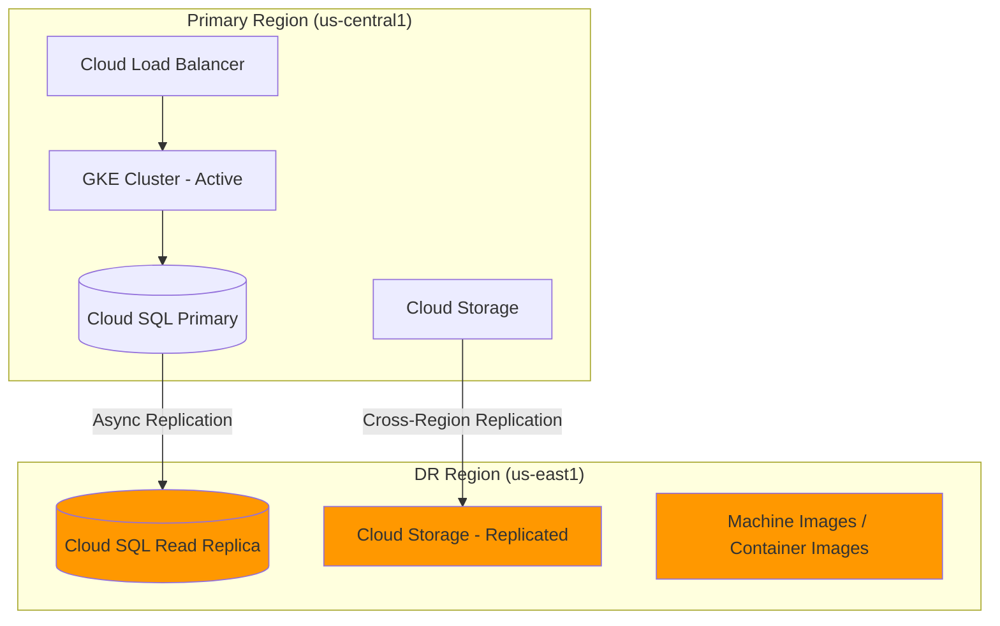

# How to Design a Pilot Light Disaster Recovery Architecture on Google Cloud Platform

Author: [nawazdhandala](https://www.github.com/nawazdhandala)

Tags: GCP, Disaster Recovery, Pilot Light, High Availability, Cloud Architecture

Description: Learn how to design and implement a pilot light disaster recovery architecture on Google Cloud Platform to minimize downtime and data loss during regional failures.

---

When your production systems go down, every second counts. A pilot light disaster recovery (DR) strategy gives you a cost-effective way to keep a minimal version of your environment running in a secondary region, ready to scale up when disaster strikes. Think of it like the pilot light on a gas furnace - a small flame that can ignite the full system quickly when needed.

In this post, I will walk through designing a pilot light DR architecture on Google Cloud Platform, covering the key components, trade-offs, and practical implementation steps.

## What Is a Pilot Light DR Strategy?

A pilot light approach sits between a simple backup-and-restore strategy and a fully active-active setup. You maintain the absolute minimum of your infrastructure in a secondary region - typically just your database replicas and essential configuration. When a disaster occurs, you spin up the rest of your compute and networking resources around that pilot light.

The key characteristics are:

- **Low ongoing cost** - you only run the bare essentials in the DR region
- **Faster recovery than backup-restore** - your data is already replicated
- **Recovery Time Objective (RTO)** - typically minutes to hours, depending on how much you need to spin up
- **Recovery Point Objective (RPO)** - near zero, since data replication is continuous

## Architecture Overview

Here is a high-level view of what the pilot light architecture looks like on GCP:



The orange components represent your pilot light - always running, always synchronized.

## Step 1: Set Up Cross-Region Database Replication

The foundation of any pilot light strategy is keeping your data synchronized. With Cloud SQL, you can create a cross-region read replica that continuously replicates from your primary instance.

Create a Cloud SQL instance in your primary region and then add a cross-region replica:

```bash
# Create the primary Cloud SQL instance in us-central1
gcloud sql instances create prod-primary \
  --database-version=POSTGRES_15 \
  --tier=db-custom-4-16384 \
  --region=us-central1 \
  --availability-type=REGIONAL \
  --backup-start-time=02:00 \
  --enable-point-in-time-recovery

# Create a cross-region read replica in us-east1
gcloud sql instances create prod-dr-replica \
  --master-instance-name=prod-primary \
  --region=us-east1 \
  --tier=db-custom-2-8192 \
  --availability-type=ZONAL
```

Notice that the replica uses a smaller machine type. Since it is only serving as a pilot light and not handling production traffic, you can save costs by using fewer resources. You will scale it up during failover.

## Step 2: Configure Cloud Storage Replication

For object storage, use dual-region or multi-region buckets, or set up cross-region replication with Cloud Storage:

```bash
# Create a dual-region bucket spanning both regions
gsutil mb -l US -c STANDARD \
  --placement us-central1,us-east1 \
  gs://my-app-data-dr

# Alternatively, set up a transfer job for existing buckets
gcloud transfer jobs create \
  gs://my-app-data-primary \
  gs://my-app-data-dr-replica \
  --schedule-repeats-every=1h \
  --source-agent-pool=default
```

Dual-region buckets give you automatic replication with turbo replication available for sub-15-second RPO. For existing single-region buckets, scheduled transfer jobs work well.

## Step 3: Store Compute Artifacts in the DR Region

Your pilot light does not include running compute instances, but you need to make sure you can spin them up quickly. Push your container images to Artifact Registry in both regions:

```bash
# Configure Artifact Registry in the DR region
gcloud artifacts repositories create app-images \
  --repository-format=docker \
  --location=us-east1 \
  --description="DR region container images"

# Set up a replication policy in your CI/CD pipeline
# After building and pushing to primary, also push to DR
docker tag my-app:latest us-east1-docker.pkg.dev/my-project/app-images/my-app:latest
docker push us-east1-docker.pkg.dev/my-project/app-images/my-app:latest
```

## Step 4: Prepare Network Infrastructure

Some networking components need to exist in advance. You do not want to be creating VPCs and firewall rules during an incident:

```yaml
# terraform/dr-network.tf - Keep this applied in the DR region
resource "google_compute_network" "dr_vpc" {
  name                    = "dr-vpc"
  auto_create_subnetworks = false
}

resource "google_compute_subnetwork" "dr_subnet" {
  name          = "dr-subnet"
  ip_cidr_range = "10.2.0.0/16"
  region        = "us-east1"
  network       = google_compute_network.dr_vpc.id
}

# Pre-create firewall rules matching production
resource "google_compute_firewall" "dr_allow_internal" {
  name    = "dr-allow-internal"
  network = google_compute_network.dr_vpc.name

  allow {
    protocol = "tcp"
    ports    = ["0-65535"]
  }

  source_ranges = ["10.2.0.0/16"]
}
```

## Step 5: Build the Failover Automation

This is the critical piece. When disaster hits, you need a reliable, tested runbook. Here is a Cloud Build configuration that automates the failover process:

```yaml
# cloudbuild-failover.yaml
steps:
  # Step 1: Promote the Cloud SQL replica to primary
  - name: 'gcr.io/cloud-builders/gcloud'
    args:
      - 'sql'
      - 'instances'
      - 'promote-replica'
      - 'prod-dr-replica'
    id: 'promote-db'

  # Step 2: Scale up the promoted instance
  - name: 'gcr.io/cloud-builders/gcloud'
    args:
      - 'sql'
      - 'instances'
      - 'patch'
      - 'prod-dr-replica'
      - '--tier=db-custom-4-16384'
      - '--availability-type=REGIONAL'
    id: 'scale-db'
    waitFor: ['promote-db']

  # Step 3: Deploy the application to DR region GKE
  - name: 'gcr.io/cloud-builders/gke-deploy'
    args:
      - 'run'
      - '--filename=k8s/'
      - '--location=us-east1'
      - '--cluster=dr-cluster'
    id: 'deploy-app'
    waitFor: ['promote-db']

  # Step 4: Update DNS to point to DR region
  - name: 'gcr.io/cloud-builders/gcloud'
    args:
      - 'dns'
      - 'record-sets'
      - 'update'
      - 'app.example.com.'
      - '--zone=example-zone'
      - '--type=A'
      - '--rrdatas=${_DR_LB_IP}'
      - '--ttl=60'
    id: 'update-dns'
    waitFor: ['deploy-app']
```

## Step 6: Set Up Monitoring and Health Checks

You need to know when the primary region is failing before you can trigger a failover. Set up uptime checks in Cloud Monitoring:

```bash
# Create an uptime check for the primary region
gcloud monitoring uptime create \
  --display-name="Primary Region Health" \
  --uri="https://app.example.com/health" \
  --http-method=GET \
  --period=60 \
  --timeout=10 \
  --regions=USA,EUROPE,ASIA_PACIFIC

# Create an alerting policy that triggers on consecutive failures
gcloud alpha monitoring policies create \
  --display-name="Primary Region Down" \
  --condition-display-name="Uptime check failing" \
  --condition-filter='resource.type="uptime_url" AND metric.type="monitoring.googleapis.com/uptime_check/check_passed"' \
  --condition-threshold-value=1 \
  --condition-threshold-comparison=COMPARISON_LT \
  --notification-channels=projects/my-project/notificationChannels/12345
```

## Cost Considerations

One of the biggest advantages of pilot light over warm standby is cost. Here is a rough comparison:

| Component | Pilot Light Monthly Cost | Warm Standby Monthly Cost |
|-----------|------------------------|--------------------------|
| Cloud SQL Replica | $150 (small tier) | $400 (production tier) |
| GKE Cluster | $0 (not running) | $300 (minimal nodes) |
| Cloud Storage | $5 (replication) | $5 (replication) |
| Network | $10 (reserved IPs) | $50 (active LB + IPs) |
| **Total** | **$165/mo** | **$755/mo** |

You trade recovery time for cost savings. A pilot light approach might take 15-30 minutes to fully activate, while a warm standby can be ready in under 5 minutes.

## Testing Your DR Plan

A disaster recovery plan that has never been tested is not a plan - it is a wish. Schedule regular DR drills:

1. **Quarterly full failover tests** - actually trigger the failover and run traffic through the DR region
2. **Monthly replication verification** - confirm that data in the DR region matches production
3. **Weekly runbook reviews** - make sure automation scripts are up to date with any infrastructure changes

Document the results of every test, including how long each step took and any issues you encountered. This data helps you accurately report your RTO to stakeholders.

## Common Pitfalls

A few things I have seen go wrong with pilot light implementations:

- **Forgetting about secrets and config** - your DR region needs access to the same secrets, API keys, and configuration. Use Secret Manager with cross-region replication.
- **Stale container images** - if your CI/CD pipeline only pushes to the primary region, your DR images could be weeks behind. Always push to both regions.
- **DNS TTL too high** - if your DNS records have a TTL of 3600 seconds, it could take an hour for traffic to shift even after you update the records. Keep DR-related DNS TTLs low.
- **Not testing the promotion path** - Cloud SQL replica promotion is a one-way operation. Make sure you understand the implications and have a plan for re-establishing replication after failback.

## Wrapping Up

A pilot light DR architecture on GCP gives you a practical balance between cost and recovery speed. By keeping your data replicated and your deployment artifacts ready in a secondary region, you can recover from regional failures in minutes rather than hours. The key is automation and regular testing - your failover process should be a single command, not a frantic scramble through documentation at 3 AM.

Start small, test often, and gradually reduce your RTO as your confidence in the process grows.
